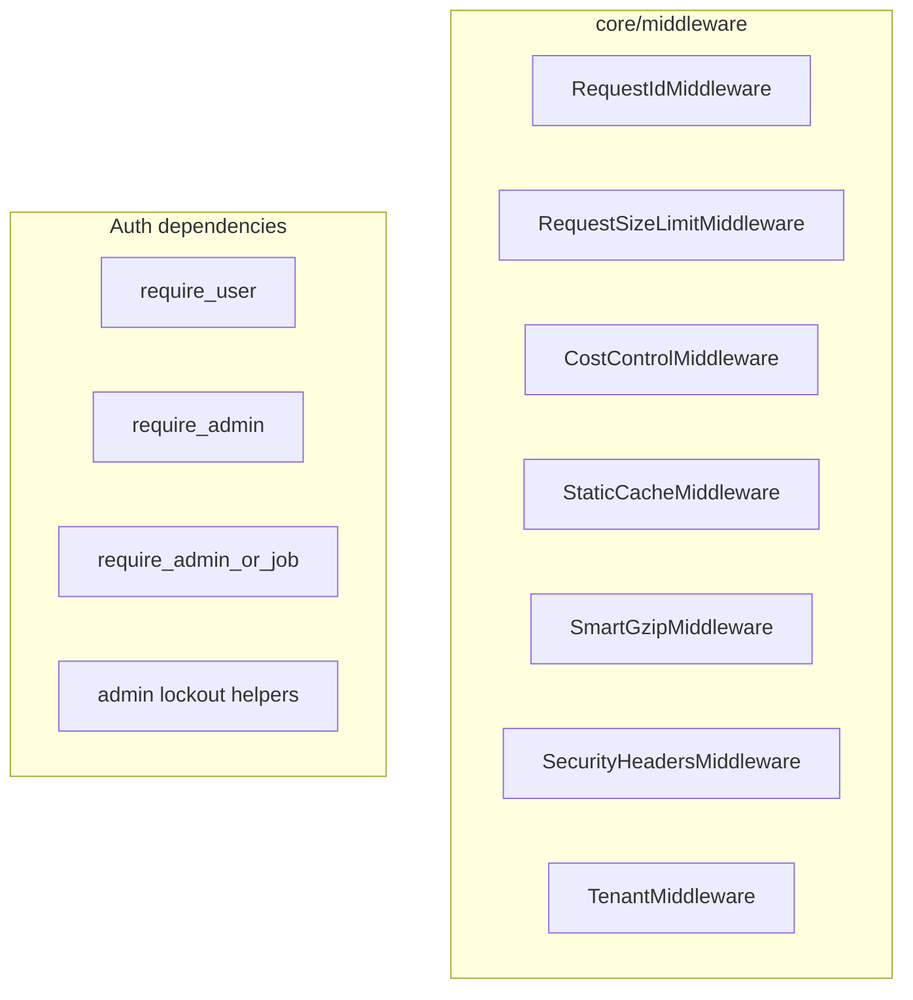

The `core/middleware` module provides the HTTP middleware stack and the
authentication/authorization dependencies used by the FastAPI surface. Every
middleware is written as **pure ASGI** (`async def __call__(scope, receive,
send)`) — never `BaseHTTPMiddleware`, which would wrap each request in an extra
anyio task and break streaming and cancellation.

## Overview



### Module structure

```text
core/middleware/
├── __init__.py        # Public exports
├── observability.py   # RequestIdMiddleware
├── security.py            # RateLimiter, SecurityManager, auth dependencies
│                          #   (re-exports the two ASGI middlewares below)
├── security_headers.py    # RequestSizeLimitMiddleware, SecurityHeadersMiddleware
├── _security_metrics.py   # SECURITY_EVENTS Prometheus counter (shared)
├── cost_control.py    # CostControlMiddleware, CostController, cost_controller
├── optimization.py    # StaticCacheMiddleware, SmartGzipMiddleware
└── tenant.py          # TenantMiddleware
```

---

## Public API

```python
from core.middleware import (
    # Cost control
    CostController, CostControlMiddleware, CostStats,
    BudgetExceededError, cost_controller,
    # Security
    SecurityHeadersMiddleware, RequestSizeLimitMiddleware,
    RateLimiter, rate_limiter,
    require_user, require_admin, require_admin_or_job,
    verify_admin_password, check_admin_lockout,
    record_admin_failure, clear_admin_failures,
    # Tenant
    TenantMiddleware,
)
```

`RequestIdMiddleware` is imported from `core.middleware.observability`;
`StaticCacheMiddleware` and `SmartGzipMiddleware` from
`core.middleware.optimization`.

---

## Middleware stack & wiring

The stack is assembled in `core/api/factory.py`. Starlette executes middleware
**last-added-first**, so the registration order below is roughly the reverse of
execution. The factory adds, in order:

| Added in factory | Class | Purpose |
| ---------------- | ----- | ------- |
| `RequestIdMiddleware` | `observability.py` | Propagate / generate `X-Request-ID`, bind to logging context |
| `RequestSizeLimitMiddleware` | `security_headers.py` | Reject oversized bodies (DoS protection) |
| `CostControlMiddleware` | `cost_control.py` | Per-request token/query budget tracking |
| `StaticCacheMiddleware` | `optimization.py` | `Cache-Control` for `/static` and `/console` |
| `SmartGzipMiddleware` | `optimization.py` | Gzip compression, skipping `/chat/stream` |
| `SecurityHeadersMiddleware` | `security_headers.py` | Inject baseline security headers / CSP |
| `TrustedHostMiddleware` | Starlette | Host header validation (when `TRUSTED_HOSTS` set) |
| CSRF origin check | factory closure | Validate `Origin` on state-changing requests |
| Plugin activation | factory closure | Lazily activate plugins on first matching request |
| `CORSMiddleware` | FastAPI | CORS (credentials disabled for wildcard origins) |
| `TenantMiddleware` | `tenant.py` | Derive tenant context from the auth user |

---

## RequestIdMiddleware

`core/middleware/observability.py`. Reads an incoming `X-Request-ID` header (or
generates a UUID), sets the `request_id` contextvar, binds it to the structured
logging context, and echoes it back on the response.

---

## RequestSizeLimitMiddleware

`core/middleware/security_headers.py` (re-exported from `core.middleware.security`).
Enforces a maximum request body size in two
stages: a cheap `Content-Length` reject, then a streaming byte counter on the
receive channel (defends against chunked-encoding bypass and missing
`Content-Length`). Oversized requests get `413 Request Entity Too Large`.

- Configured via `SecurityConfig.max_request_size_bytes` (factory default
  10 MiB); `0` disables it.
- WebSocket and lifespan scopes pass through unchanged.

---

## SecurityHeadersMiddleware

`core/middleware/security_headers.py` (re-exported from `core.middleware.security`).
Injects baseline headers in the `send` wrapper so
streaming responses are unaffected. Always sets `X-Content-Type-Options`,
`X-Frame-Options`, `Referrer-Policy`, and `X-XSS-Protection`. When
`security_headers_enabled` is on it adds a strict default Content-Security-Policy
(overridable via config), an optional `Permissions-Policy`, and HSTS when
`enable_hsts` is set. The header list is pre-encoded once per process.

The strict default CSP is `script-src 'self'`, which blocks the FastAPI
interactive docs (Swagger UI / ReDoc) — they load their bundles from the
jsDelivr CDN and bootstrap with an inline `<script>`. The middleware therefore
emits a **path-scoped relaxed CSP** for the `/docs` and `/redoc` routes only
(whitelisting `https://cdn.jsdelivr.net` and `'unsafe-inline'`); every other
route keeps the strict policy. An explicit operator `content_security_policy`
always wins and is applied verbatim to all routes, docs included. Both the
strict and docs header lists are cached independently after first use.

---

## CostControlMiddleware

`core/middleware/cost_control.py`. Initializes a per-request `CostStats`
(contextvar-isolated) so application code can call the shared `cost_controller`
to track token usage and graph queries.

```python
from core.middleware import cost_controller

cost_controller.track_tokens(120, model="claude-sonnet-4-6")
cost_controller.track_query("MATCH (n) RETURN n LIMIT 10")
stats = cost_controller.get_stats()
```

`CostController` raises `BudgetExceededError` when a budget is exceeded
(`agent_max_tokens`, `graph_query_limit`, `graph_max_hops`). The middleware
catches it and, if the response has not started, returns `429` with a
`Quota exceeded` body. Limits are sourced from app/storage config; the global
`cost_controller` instance is constructed at import time.

---

## StaticCacheMiddleware & SmartGzipMiddleware

`core/middleware/optimization.py`.

- **`StaticCacheMiddleware`** adds `Cache-Control: public, max-age=<n>` to
  `/static` and `/console` responses, but forces `no-store` for `application/json`
  console responses so the SPA shell stays fresh.
- **`SmartGzipMiddleware`** subclasses Starlette's `GZipMiddleware` but skips
  compression entirely for configured `excluded_paths` (the factory excludes
  `/chat/stream`) to preserve the streaming "typewriter" effect.

---

## TenantMiddleware

`core/middleware/tenant.py`. Reads the authenticated `AuthUser` from
`scope["state"].user` (or `scope["user"]`), derives the `tenant_id` (defaulting
to `"default"`), binds it to the tenant contextvar and to structlog, and resets
it on exit. WebSocket and lifespan scopes are skipped.

---

## Authentication & authorization

`core/middleware/security.py` also houses the auth layer. `SecurityManager`
(singleton via `get_security_manager()`) performs authentication, role checks,
and rate limiting; the FastAPI route dependencies are thin wrappers over it.

### Dependencies

```python
from core.middleware import require_user, require_admin, require_admin_or_job
from fastapi import Depends

@router.post("/chat", dependencies=[Depends(require_user)])
async def chat(...): ...
```

| Dependency | Allowed roles | Used by |
| ---------- | ------------- | ------- |
| `require_user` | `user`, `admin`, `job` | Chat, feedback ingestion |
| `require_admin` | `admin` | Status, feedback listing, plugin management |
| `require_admin_or_job` | `admin`, `job` | Indexing, Backstage exporters |

Each enforces authentication (via `X-API-Key` or `Authorization: Bearer`),
intersects the caller's roles with the allowed set (raising `401`/`403`), and
applies a per-role rate limit before returning the resolved role string. The
authenticated `AuthUser` is attached to `request.state.user` and the tenant
context is set to the user's tenant.

### RateLimiter

A distributed fixed-window limiter keyed by `role:credential`/IP, backed by
Redis with an in-memory fallback when Redis is unavailable. It uses an atomic
`SET NX EX` + `INCR` to avoid a TTL race, emits the `security_events_total`
Prometheus counter, and raises `429` over the limit. The module exposes a lazy
`rate_limiter` proxy that resolves the shared instance on access.

### Admin Basic-Auth helpers & lockout

For the HTTP Basic Auth admin surface, the module exposes module-level helpers
backed by `SecurityManager`:

- `verify_admin_password(candidate)` — compares against `ADMIN_PASS` or, when
  set, a PBKDF2-SHA256 `ADMIN_PASS_HASHED` digest (constant-time compare).
- `check_admin_lockout(username)` — raises `429` while an account is locked.
- `record_admin_failure(username)` — increments the failure counter.
- `clear_admin_failures(username)` — clears it after a successful login.

Lockout policy: **5 failures** within a 60s window locks the account for
**15 minutes**, tracked in Redis with an in-memory fallback. The admin router
(`plugins/api_routers/admin.py`) wires these into its `verify_credentials`
dependency.
