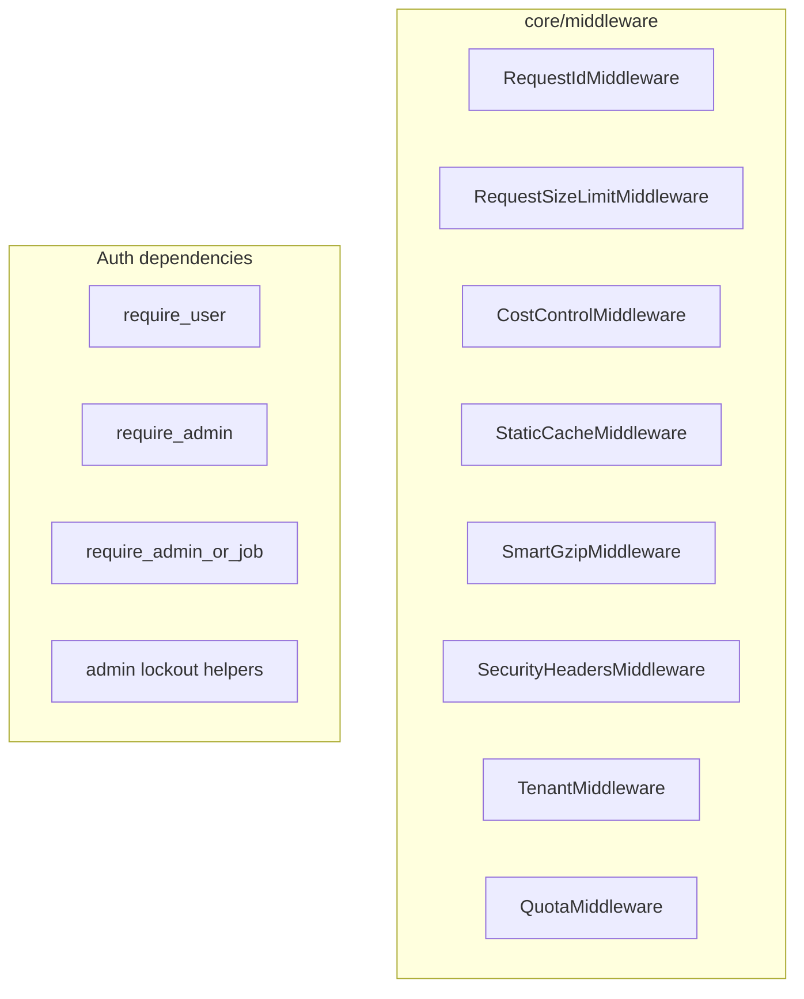

The `core/middleware` module provides the HTTP middleware stack and the
authentication/authorization dependencies used by the FastAPI surface. Every
middleware is written as **pure ASGI** (`async def __call__(scope, receive,
send)`) — never `BaseHTTPMiddleware`, which would wrap each request in an extra
anyio task and break streaming and cancellation.

## Overview


```mermaid
graph TB
    subgraph MW["core/middleware"]
        ReqId[RequestIdMiddleware]
        Size[RequestSizeLimitMiddleware]
        Cost[CostControlMiddleware]
        StaticCache[StaticCacheMiddleware]
        Gzip[SmartGzipMiddleware]
        SecHdr[SecurityHeadersMiddleware]
        Tenant[TenantMiddleware]
        Quota[QuotaMiddleware]
    end

    subgraph Deps["Auth dependencies"]
        ReqUser[require_user]
        ReqAdmin[require_admin]
        ReqJob[require_admin_or_job]
        Lockout[admin lockout helpers]
    end
```

### Module structure

```text
core/middleware/
├── __init__.py        # Public exports
├── observability.py   # RequestIdMiddleware
├── security.py            # SecurityManager, auth dependencies
│                          #   (re-exports RateLimiter + the two ASGI middlewares)
├── rate_limiter.py         # RateLimiter (Redis Lua fixed-window + fallback)
├── _admin_lockout.py       # AdminLockoutMixin (admin Basic-auth lockout state)
├── security_headers.py    # RequestSizeLimitMiddleware, SecurityHeadersMiddleware
├── _security_metrics.py   # SECURITY_EVENTS Prometheus counter (shared)
├── cost_control.py    # CostControlMiddleware, CostController, cost_controller
├── optimization.py    # StaticCacheMiddleware, SmartGzipMiddleware
├── csrf.py            # CSRFOriginMiddleware (pure ASGI, HTTP CSRF + WebSocket CSWSH)
├── plugin_activation.py  # PluginActivationMiddleware (pure ASGI)
├── plugin_context.py  # PluginContextMiddleware (pure ASGI)
├── tenant.py          # TenantMiddleware
└── quota.py           # QuotaMiddleware
```

---

## Public API

```python
from core.middleware import (
    # Cost control
    CostController, CostControlMiddleware, CostStats,
    BudgetExceededError, cost_controller,
    # Security
    SecurityHeadersMiddleware, RequestSizeLimitMiddleware,
    RateLimiter, rate_limiter,
    require_user, require_admin, require_admin_or_job,
    verify_admin_password, verify_admin_password_async, check_admin_lockout,
    record_admin_failure, clear_admin_failures,
    # Tenant
    TenantMiddleware,
    # Quotas
    QuotaMiddleware,
)
```

`RequestIdMiddleware` is imported from `core.middleware.observability`;
`StaticCacheMiddleware` and `SmartGzipMiddleware` from
`core.middleware.optimization`.

---

## Middleware stack & wiring

The stack is assembled in `core/api/factory.py`. Starlette executes middleware
**last-added-first**, so the registration order below is roughly the reverse of
execution. The whole stack is now **pure ASGI** — the previous CSRF and
plugin-activation `BaseHTTPMiddleware` closures were replaced by dedicated ASGI
middlewares (`CSRFOriginMiddleware`, `PluginActivationMiddleware`). The factory
adds, in order:

| Added in factory | Class | Purpose |
| ---------------- | ----- | ------- |
| `CostControlMiddleware` | `cost_control.py` | Per-request token/query budget tracking |
| `StaticCacheMiddleware` | `optimization.py` | `Cache-Control` for `/static` and `/console` |
| `SmartGzipMiddleware` | `optimization.py` | Gzip compression, skipping `/chat/stream` and `/v1/chat/stream` |
| `IdempotencyMiddleware` | `idempotency.py` | Replay the stored response for a repeated `Idempotency-Key` on a mutating request |
| `TrustedHostMiddleware` | Starlette | Host header validation — mounted **only** when `TRUSTED_HOSTS` is non-empty (default `[]`); see the note below |
| `CSRFOriginMiddleware` | `csrf.py` | Validate `Origin` on state-changing requests **and on every WebSocket handshake** |
| `PluginActivationMiddleware` | `plugin_activation.py` | Lazily activate plugins on first matching request |
| `CORSMiddleware` | FastAPI | CORS (credentials disabled for wildcard origins) |
| `TenantMiddleware` | `tenant.py` | Derive tenant context from the auth user |
| `PluginContextMiddleware` | `plugin_context.py` | Attribute each request to its owning plugin (LLM policy seam) |
| `QuotaMiddleware` | `quota.py` | Enforce per-identity + per-tenant usage quotas (`429` when exhausted) |
| `RequestSizeLimitMiddleware` | `security_headers.py` | Reject oversized bodies before other middleware runs (just inside SecurityHeaders) |
| `SecurityHeadersMiddleware` | `security_headers.py` | Inject baseline security headers / CSP — registered near-outermost so they land on **every** response, including short-circuits from the inner guards |
| `RequestIdMiddleware` | `observability.py` | Registered **last** → **outermost**: propagate / generate `X-Request-ID` so every response (incl. short-circuited errors) carries it |

!!! note "Outermost ordering"
    `RequestIdMiddleware` is registered **last**, making it the **outermost**
    layer: every response — including error responses short-circuited by inner
    middleware — carries an `X-Request-ID`. `SecurityHeadersMiddleware` sits
    just inside it, so CSP/HSTS/nosniff also land on responses emitted by the
    inner guards (TrustedHost `400`s, CSRF `403`s, `413`s, CORS preflights),
    and `RequestSizeLimitMiddleware` just inside that, so oversized bodies are
    rejected before any other middleware does work.

!!! warning "`TRUSTED_HOSTS` is empty by default"
    Because the factory only calls `app.add_middleware(TrustedHostMiddleware, ...)`
    when `TRUSTED_HOSTS` is non-empty, the default stack validates **no** `Host`
    header: a spoofed `Host` / `X-Forwarded-Host` poisons absolute URLs built
    from the request and host-keyed caches. `core.api.startup_checks` logs an
    ERROR at boot when this happens in production — advisory only, since the
    right hostnames are deployment knowledge the framework cannot infer. See
    [Host header validation](../advanced/security.md#host-header-validation).

---

## RequestIdMiddleware

`core/middleware/observability.py`. Reads an incoming `X-Request-ID` header (or
generates a UUID), sets the `request_id` contextvar, binds it to the structured
logging context, and echoes it back on the response.

---

## RequestSizeLimitMiddleware

`core/middleware/security_headers.py` (re-exported from `core.middleware.security`).
Enforces a maximum request body size in two
stages: a cheap `Content-Length` reject, then a streaming byte counter on the
receive channel (defends against chunked-encoding bypass and missing
`Content-Length`). Oversized requests get `413 Request Entity Too Large`.

- Configured via `SecurityConfig.max_request_size_bytes` (factory default
  10 MiB); `0` disables it.
- WebSocket and lifespan scopes pass through unchanged (a handshake has no
  `http.request` body to meter; its cross-origin guard is
  [`CSRFOriginMiddleware`](#csrforiginmiddleware)).

---

## SecurityHeadersMiddleware

`core/middleware/security_headers.py` (re-exported from `core.middleware.security`).
Injects baseline headers in the `send` wrapper so
streaming responses are unaffected. Always sets `X-Content-Type-Options`,
`X-Frame-Options`, `Referrer-Policy`, and `X-XSS-Protection`. When
`security_headers_enabled` is on it adds a strict default Content-Security-Policy
(overridable via config), an optional `Permissions-Policy`, and HSTS when
`enable_hsts` is set. The header list is pre-encoded once per process.

The strict default CSP is `script-src 'self'` with
`img-src 'self' data: blob: https:` — `blob:` so a bundled SPA can render an
image it fetched over the API through `URL.createObjectURL` — plus
`base-uri 'self'`, `form-action 'self'` and `object-src 'none'`: all three
default to permissive when omitted, so the policy states them to close the
`<base>`-rebasing, form-hijacking and legacy plugin-embedding vectors.
`script-src 'self'`
blocks the FastAPI
interactive docs (Swagger UI / ReDoc) — they load their bundles from the
jsDelivr CDN and bootstrap with an inline `<script>`. The middleware therefore
emits a **path-scoped relaxed CSP** for the `/docs` and `/redoc` routes only
(whitelisting `https://cdn.jsdelivr.net` and `'unsafe-inline'`); every other
route keeps the strict policy. An explicit operator `content_security_policy`
always wins and is applied verbatim to all routes, docs included. Both the
strict and docs header lists are cached independently after first use.

---

## CSRFOriginMiddleware

`core/middleware/csrf.py`. One allowlist (`ALLOW_ORIGINS`) and one decision
function guard two different attacks.

**HTTP (CSRF).** Only `POST`/`PUT`/`PATCH`/`DELETE` are checked. An `Origin`
that is present and not allowlisted ⇒ `403`
(`{"detail": "CSRF check failed: origin not allowed."}`). The `*` wildcard
accepts any explicit `Origin`.

**WebSocket (CSWSH).** The Same-Origin Policy does not apply to WebSockets, so a
handshake from any page on the internet would otherwise come up authenticated
with the victim's ambient cookies / Basic-Auth. **Every** handshake is checked —
a socket is bidirectional from the first frame, so there is no "safe method"
exemption. The middleware runs on `websocket` scopes and applies the same
decision function before the handshake reaches the route.

**`Sec-Fetch-Site` fallback (both transports).** A request with no `Origin` but
`Sec-Fetch-Site: cross-site` is rejected **even in wildcard mode**: the header is
UA-set and unforgeable from script, so it is positive proof a browser initiated
the request from another site. Requests with *neither* header keep passing —
that combination is impossible for a browser and identifies `curl`, server-to-
server SDKs and native WebSocket clients. `same-origin`, `same-site` and `none`
also pass.

**How a WebSocket denial is emitted.** A bare `return` would leave the peer
hanging until timeout, so the middleware consumes the initial
`websocket.connect` and then answers:

| Server capability | Denial | Client sees |
| --- | --- | --- |
| `websocket.http.response` in `scope["extensions"]` (uvicorn `websockets`/`wsproto`, Starlette `TestClient`) | `websocket.http.response.start` + `.body` | Real `HTTP 403` + JSON body |
| Extension absent | `websocket.close` before `websocket.accept`, code `1008` | Failed handshake (uvicorn answers `403`) |

Rejections increment `security_events_total` with
`reason="csrf_origin_rejected"` / `reason="cswsh_handshake_rejected"`, and both
log the offending origin plus the configured allowlist — the fix for the classic
reverse-proxy 403 is then obvious (add the public origin to `ALLOW_ORIGINS`).

!!! warning "Same-origin browser UIs must be allowlisted"
    Browsers send `Origin` on same-origin WebSocket handshakes too, so a UI
    served by the deployment itself (e.g. the `baselithbot` dashboard opening
    `/ws/pair`) needs its own origin in `ALLOW_ORIGINS` — exactly as it already
    does for state-changing HTTP requests.

See [WebSocket Origin validation](../advanced/security.md#websocket-origin-validation-cswsh).

---

## CostControlMiddleware

`core/middleware/cost_control.py`. Initializes a per-request `CostStats`
(contextvar-isolated) so application code can call the shared `cost_controller`
to track token usage and graph queries.

```python
from core.middleware import cost_controller

cost_controller.track_tokens(120, model="claude-sonnet-4-6")
cost_controller.track_query("MATCH (n) RETURN n LIMIT 10")
stats = cost_controller.get_stats()
```

`CostController` raises `BudgetExceededError` when a budget is exceeded
(`agent_max_tokens`, `graph_query_limit`, `graph_max_hops`). The middleware
catches it and, if the response has not started, returns `429` with a
`Quota exceeded` body. Limits are sourced from app/storage config; the global
`cost_controller` instance is constructed at import time.

---

## StaticCacheMiddleware & SmartGzipMiddleware

`core/middleware/optimization.py`.

- **`StaticCacheMiddleware`** adds `Cache-Control: public, max-age=<n>` to
  `/static` and `/console` responses, but forces `no-store` for `application/json`
  console responses so the SPA shell stays fresh.
- **`SmartGzipMiddleware`** subclasses Starlette's `GZipMiddleware` but skips
  compression entirely for configured `excluded_paths` (the factory excludes
  both `/chat/stream` and `/v1/chat/stream`) to preserve the streaming
  "typewriter" effect.

---

## IdempotencyMiddleware

`core/middleware/idempotency.py`. Pure ASGI, **enabled by default** (the factory
always mounts it; `BASELITH_IDEMPOTENCY_ENABLED=false` turns it off). A mutating
request (`POST`/`PUT`/`PATCH`/`DELETE`) carrying an `Idempotency-Key` header has
its response captured in Redis; a later request with the same key replays it
with an `Idempotency-Replayed: true` header instead of re-executing the side
effect. Streaming (`text/event-stream`) and oversized responses pass through
uncached, `5xx` and retryable `4xx` (`401`/`403`/`408`/`425`/`429`) are never
stored, a duplicate still in flight gets `409`, and the whole thing is
fail-open if Redis is down.

**Who a stored response belongs to.** Replay happens *before* route
authentication, so the storage key is `{tenant}:{identity}:{method}:{path}:
{sha256(key)}` where `identity` is a hash of the raw
`Authorization`/`X-API-Key` header. A caller presenting **no** credential is
given no idempotency at all — the request runs, nothing is stored, nothing is
replayed — because all such callers would otherwise share one bucket, leaving
the (non-secret) `Idempotency-Key` as the only thing between one anonymous
caller and another's cached response. Set
`BASELITH_IDEMPOTENCY_ALLOW_ANONYMOUS=true` to opt back in with per-peer-address
bucketing (weak: NAT and reverse proxies collapse callers onto one address).

Knobs and the full rationale: [Idempotency-Key replay](../advanced/runtime-tuning.md#idempotency-key-replay).

---

## TenantMiddleware

`core/middleware/tenant.py`. Reads the authenticated `AuthUser` from
`scope["state"].user` (or `scope["user"]`), derives the `tenant_id` (defaulting
to `"default"`), binds it to the tenant contextvar and to structlog, and resets
it on exit. It also binds the authenticated `user_id` (when present) via
`set_user_context`, so plugins declaring `tenancy: personal` can resolve a
per-user tenant — see [Per-plugin tenancy](../advanced/multi-tenancy.md#per-plugin-tenancy-personal-vs-shared).
WebSocket and lifespan scopes are skipped.

---

## PluginContextMiddleware

Pure-ASGI middleware that resolves each HTTP request's path to the plugin that
owns it (router prefix via the plugin registry, then mounted sub-app prefix)
and binds that identity to `core.context.set_plugin_context` for the request's
duration. Downstream framework seams — notably the central per-plugin LLM
policy consulted by `get_llm_service()` — read it back via
`core.context.get_current_plugin()`. Attribution is path-derived, never a
client header, and strictly best-effort: an unresolvable path passes through
unattributed. See [Services — Central Per-Plugin LLM
Policy](services.md#central-per-plugin-llm-policy).

## QuotaMiddleware

`core/middleware/quota.py`. Self-authenticates from the caller's credentials,
then consumes one unit from both the caller's **identity** budget and their
**tenant** aggregate budget via `QuotaManager`. If either calendar window (daily /
monthly) is exhausted it short-circuits with `429` + `Retry-After: 60` before the
route runs. A complete no-op unless `QUOTAS_ENABLED`; unauthenticated requests are
not quota-scoped and pass through. See [Usage Quotas](quotas.md) for the budget
model and configuration.

!!! note "API-key callers are quota-scoped too"
    Credentials are read from `Authorization` first; when it is absent but an
    `X-API-Key` header is present, the middleware synthesizes `ApiKey <key>`
    (mirroring what the route auth dependency does) and authenticates that. A
    caller authenticating purely by API key is therefore metered like any bearer
    caller — without this, API-key traffic would slip past `QUOTAS_ENABLED`
    entirely. The verified user is memoized on `scope["state"]` so the route's
    own auth dependency does not re-verify the same token.

---

## Authentication & authorization

`core/middleware/security.py` also houses the auth layer. `SecurityManager`
(singleton via `get_security_manager()`) performs authentication, role checks,
and rate limiting; the FastAPI route dependencies are thin wrappers over it.

### Dependencies

```python
from core.middleware import require_user, require_admin, require_admin_or_job
from fastapi import Depends

@router.post("/chat", dependencies=[Depends(require_user)])
async def chat(...): ...
```

| Dependency | Allowed roles | Used by |
| ---------- | ------------- | ------- |
| `require_user` | `user`, `admin`, `job` | Chat, feedback ingestion |
| `require_admin` | `admin` | Status, feedback listing, plugin management |
| `require_admin_or_job` | `admin`, `job` | Indexing, Backstage exporters |

Each enforces authentication (via `X-API-Key` or `Authorization: Bearer`),
intersects the caller's roles with the allowed set (raising `401`/`403`), and
applies a per-role rate limit before returning the resolved role string. The
authenticated `AuthUser` is attached to `request.state.user`; the tenant context
is set to the user's tenant and the user context to the user's id (both
identity-derived, never from a request header).

Every `401` carries the same fixed detail (`"Authentication required."`) — the
rejection reason is written to the audit log (sanitized) and never to the
response, so the status cannot be used to enumerate which part of a credential
was wrong. See
[Error disclosure](auth.md#error-disclosure-the-401-body-says-nothing).

### Failed-auth throttle

The per-role limiter above only meters **already-authenticated** traffic: a
request whose credentials are rejected never reaches it. Without a second control
an attacker could stream unmetered `401`s at any `require_*` route and
brute-force credentials. `enforce_auth` therefore counts **failed** authentication
attempts per source IP on a dedicated key (`authfail:{ip}`) through the same
`RateLimiter`, using `SecurityConfig.auth_failure_limit_per_minute`
(`AUTH_FAILURE_LIMIT_PER_MINUTE`, default **20**) over the shared
`rate_limit_window_seconds` window. Once an IP exhausts the budget it receives
`429` (with `Retry-After`) instead of another `401`. Successful authentication
never touches the counter, so a mistyped token or a NAT'd client is not penalised;
set the value to `None` to disable the throttle (not recommended — it leaves
authenticated routes brute-forceable).

### RateLimiter

A distributed fixed-window limiter keyed by `role:credential`/IP, backed by
Redis with an in-memory fallback when Redis is unavailable. It lives in
`core/middleware/rate_limiter.py` (re-exported from `security` for backward
compatibility) and runs a single atomic Lua script per check (`INCR` +
first-hit `EXPIRE` — one round trip, no TTL race), emits the
`security_events_total` Prometheus counter, and raises `429` over the limit.
The module exposes a lazy `rate_limiter` proxy that resolves the shared
instance on access.

### Admin Basic-Auth helpers & lockout

For the HTTP Basic Auth admin surface, the module exposes module-level helpers
backed by `SecurityManager`:

- `verify_admin_password(candidate)` — compares against `ADMIN_PASS` or, when
  set, a PBKDF2-SHA256 `ADMIN_PASS_HASHED` digest (constant-time compare).
- `verify_admin_password_async(candidate)` — same check, but offloads the
  PBKDF2 derivation to a worker thread so a slow hash never blocks the event
  loop. The admin Basic-auth dependency uses this variant.
- `check_admin_lockout(username)` — raises `429` while an account is locked.
- `record_admin_failure(username)` — increments the failure counter.
- `clear_admin_failures(username)` — clears it after a successful login.

Lockout policy: **5 failures** within a 60s window locks the account for
**15 minutes**, tracked in Redis with an in-memory fallback. The admin router
(`plugins/api_routers/admin.py`) wires these into its `verify_credentials`
dependency. The lockout state and checks live in `AdminLockoutMixin`
(`core/middleware/_admin_lockout.py`), mixed into `SecurityManager` — the
public helpers above are unchanged.
