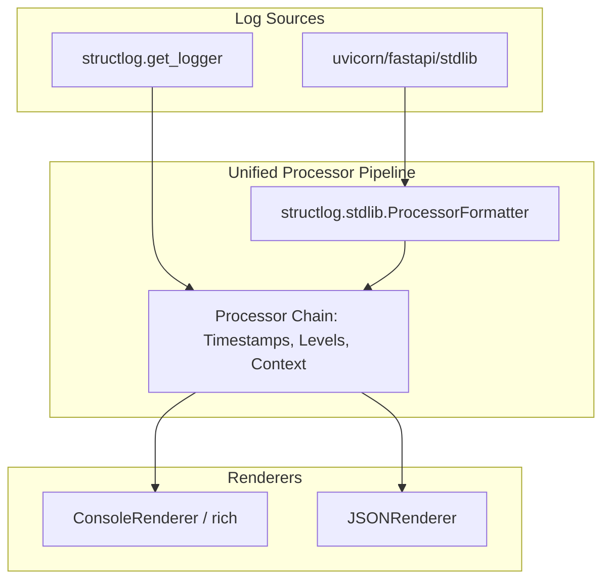

# Observability

The `core/observability/` module provides structured logging, OpenTelemetry-compatible distributed tracing, Prometheus metrics, audit logging, and a thread-safe telemetry collector — all wired together with zero external dependencies required (graceful degradation when optional packages are absent).

## Module Structure

```txt
core/observability/
├── logging.py    # Structured logging (structlog / stdlib fallback) + trace↔log correlation
├── tracing.py    # Tracer API (homegrown spans bridged into the OTel SDK)
├── otel.py       # OpenTelemetry backbone — providers, sampling, OTLP, shutdown
├── telemetry.py  # Thread-safe event counters + Prometheus export
├── metrics.py    # Prometheus metrics definitions
├── audit.py      # AuditLogger — typed audit events to pluggable sinks
├── cache.py      # Observability cache helpers
├── health.py     # CachedHealthCheck — TTL-cached health aggregation
├── sentry.py     # Sentry integration
└── setup.py      # Logging/observability bootstrap
```

---

## Structured Logging

BaselithCore uses `structlog` as its primary logging engine, providing clean, searchable JSON output in production and high-quality, colorized text output in development.

### Unified Logging Pipeline

The framework implements a **Unified Logging Pipeline** that bridges standard Python `logging` (used by libraries like Uvicorn and FastAPI) with the `structlog` processor chain. This ensures consistent formatting, timestamps, and context injection across the entire stack.



### Usage

Always use the framework-provided `get_logger` to ensure logs are correctly processed:

```python
from core.observability.logging import get_logger, bind_context

# Get a module-level logger
log = get_logger(__name__)

# Structured key-value logging
log.info("Request received", user_id="u-123", action="check_balance")

# Bind context for request-scoped metadata
with bind_context(request_id="req-456"):
    log.info("Processing")   # Automatically includes request_id
```

### Technical Implementation

- **ProcessorFormatter**: We use a `UnifiedFormatter` (a specialized `ProcessorFormatter`) that handles both structured dictionaries and plain strings safely.
- **Uvicorn Hijacking**: During startup, Uvicorn loggers are reconfigured to propagate to the root logger, clearing their default handlers to prevent duplicated or mismatched logs.
- **Rich Integration**: In development mode, `rich` is used for high-fidelity tracebacks and colorized output.

---

## Distributed Tracing (OpenTelemetry)

Tracing is built on the **OpenTelemetry SDK**. `core/observability/otel.py` is
the single source of truth for provider configuration; the `Tracer` API in
`tracing.py` is an ergonomic wrapper whose spans are **bridged into the OTel
SDK** so they reach the collector alongside auto-instrumentation spans.

```python
from core.observability.tracing import get_tracer

tracer = get_tracer("my-service")

# Context manager creates a span — mirrored to a real OTel span when telemetry
# is enabled, so it shows up in Jaeger/Tempo nested under the request span.
with tracer.start_span("retrieve-documents") as span:
    span.set_attribute("query", user_query)
    span.set_attribute("top_k", 40)

    docs = await vectorstore.search(user_query)

    span.set_attribute("docs_found", len(docs))
    # Span closes automatically — status set to OK (ERROR on exception)
```

### The OTel backbone (`otel.py`)

`setup_telemetry()` (called from the FastAPI lifespan when
`TELEMETRY_ENABLED=true`) installs, **idempotently**:

- A rich **`Resource`**: `service.name`, `service.version`,
  `service.namespace`, `service.instance.id` (`host:pid`) and
  `deployment.environment`.
- A **`TracerProvider`** with a `ParentBased(TraceIdRatioBased)` sampler driven
  by `TELEMETRY_TRACES_SAMPLE_RATE`, exporting via **OTLP/gRPC**
  (`BatchSpanProcessor`).
- An optional **`MeterProvider`** (`TELEMETRY_METRICS_ENABLED=true`) pushing
  OTel-native metrics over OTLP — independent of the Prometheus `/metrics`
  scrape, which is always available.
- **Auto-instrumentation** for FastAPI, HTTPX, Redis and (opportunistically)
  psycopg.
- The **W3C TraceContext + Baggage** composite propagator for cross-service
  context propagation.

`shutdown_telemetry()` (called on lifespan shutdown, plus an `atexit` safety
net) flushes the batch processors so no spans/metrics are lost on exit.

### Trace ↔ log correlation

The `add_otel_context` structlog processor injects the active span's
`trace_id`/`span_id` (W3C hex) into **every log entry**, so logs in
Loki/Elastic link straight to the trace in Tempo/Jaeger. It is a no-op when no
span is active or the SDK is absent.

```json
{"event": "retrieving documents", "trace_id": "4bf92f3577b34da6a3ce929d0e0e4736", "span_id": "00f067aa0ba902b7", "level": "info"}
```

### SpanStatus

| Status  | When                  |
| ------- | --------------------- |
| `OK`    | Successful completion |
| `ERROR` | Exception raised      |
| `UNSET` | Not yet completed     |

---

## Telemetry Collector

Thread-safe event counters with optional **Prometheus** export.

```python
from core.observability.telemetry import TelemetryCollector

telemetry = TelemetryCollector()

# Increment counters (value is keyword-only)
telemetry.increment("chat_request")
telemetry.increment("tokens_used", value=1024)
telemetry.increment("cache_hit")

# Snapshot for dashboards / health endpoints
stats = telemetry.snapshot()
# {
#   "created_at": "2026-02-21T09:00:00",   # ISO timestamp of collector start
#   "counters": {                          # raw count values
#     "chat_request": 142,
#     "tokens_used": 98432,
#     "cache_hit": 97,
#   },
#   "last_updated": {                      # ISO timestamp of last increment per counter
#     "chat_request": "2026-02-21T10:15:03",
#     ...
#   },
# }
```

When `prometheus-client` is installed, all counters are automatically exported to `/metrics`.

---

## Prometheus Metrics

Pre-defined metrics exposed at `/metrics` (Prometheus scrape endpoint). All
metrics use the `mas_` prefix (defined in `core/observability/metrics.py`):

| Metric                            | Type      | Description                       |
| --------------------------------- | --------- | -------------------------------- |
| `mas_chat_requests_total`         | Counter   | Chat requests received           |
| `mas_chat_request_latency_seconds`| Histogram | Chat request latency             |
| `mas_llm_requests_total`          | Counter   | LLM calls issued                 |
| `mas_llm_tokens_total`            | Counter   | LLM tokens consumed              |
| `mas_llm_latency_seconds`         | Histogram | LLM call latency                 |
| `mas_retrieval_latency_seconds`   | Histogram | Vector retrieval latency         |
| `mas_rerank_latency_seconds`      | Histogram | Reranker latency                 |
| `mas_indexed_documents_current`   | Gauge     | Documents currently indexed      |
| `mas_agent_steps_total`           | Counter   | Agent loop steps                 |
| `mas_auth_requests_total`         | Counter   | Auth requests                    |

This is a representative subset — see `metrics.py` for the full set
(rerank cache hits/misses, indexing runs, plugin load/call, agent tool
calls, feedback, etc.).

---

## Audit Log

Immutable, append-only log for security-relevant events:

`AuditLogger` writes typed `AuditEventType` events to one or more sinks. The
`log` method is async and keyword-only past the event type:

```python
from core.observability.audit import AuditLogger, AuditEventType

audit = AuditLogger()  # or use get_audit_logger() for the shared instance

await audit.log(
    AuditEventType.AUTH_LOGIN,
    user_id="user-123",
    resource="auth",
    action="login",
    success=True,
    ip_address="1.2.3.4",
    details={"method": "jwt"},
)
```

Convenience helpers `log_auth`, `log_api_request`, and `log_chat` wrap the
common event types.

---

## Health Checks

`CachedHealthCheck` wraps a user-supplied async check function and caches the
result for `cache_ttl` seconds (default `30`). Use `get_health_checker()` to
obtain the shared instance:

```python
from core.observability.health import get_health_checker

checker = get_health_checker(cache_ttl=30)

# check_fn returns Dict[str, bool] of per-service health
async def check_fn():
    return {"redis": True, "qdrant": True, "postgres": False}

status = await checker.get_status(check_fn)
# HealthStatus(status="degraded", services={...}, latency_ms=..., cached=False)

checker.invalidate()  # force a fresh check on the next get_status()
```

`HealthStatus` carries `status` (`"healthy"` / `"degraded"` / `"unhealthy"`),
`services` (`Dict[str, bool]`), `latency_ms`, and `cached`. The `/health` and
`/health/ready` endpoints use this aggregator.

---

## Configuration

```bash
# Logging
LOG_LEVEL_CONSOLE=INFO          # Console log level: DEBUG, INFO, WARNING, ERROR
LOG_LEVEL_FILE=INFO             # File log level
LOG_JSON=true                   # Emit JSON (production) or human-readable (dev)
LOG_MASKING_ENABLED=true        # Redact PII/credentials from log messages

# OpenTelemetry
TELEMETRY_ENABLED=false         # Master switch for OTel traces/metrics
TELEMETRY_OTEL_ENDPOINT=http://localhost:4317   # OTLP/gRPC collector
TELEMETRY_TRACES_SAMPLE_RATE=1.0                 # ParentBased(TraceIdRatio), 0.0–1.0
TELEMETRY_METRICS_ENABLED=false                  # Push OTel-native metrics via OTLP
TELEMETRY_CONSOLE_EXPORT=false                   # Also export spans/metrics to stdout
DEPLOYMENT_ENVIRONMENT=development               # deployment.environment resource attr
SERVICE_VERSION=                                 # service.version (defaults to package version)
```

!!! info "Telemetry is opt-in; Prometheus is always on"
    OTel traces/metrics activate only when `TELEMETRY_ENABLED=true` *and* the
    `opentelemetry` SDK is installed; otherwise the `Tracer` API stays an
    in-process no-op exporter. The Prometheus `/metrics` scrape endpoint is
    independent and available whenever `prometheus_client` is installed. All
    paths degrade gracefully — a missing optional package never raises.

!!! tip "Advanced Configuration"
    For fine-grained control over the logging engine and Uvicorn handlers via YAML, see [Advanced Observability](../advanced/observability.md#custom-configuration-via-yaml).

!!! tip "Zero-Dependency Fallback"
    If `structlog`, `prometheus_client`, or `opentelemetry` are not installed, all observability features degrade gracefully to stdlib equivalents. No exceptions are raised.
