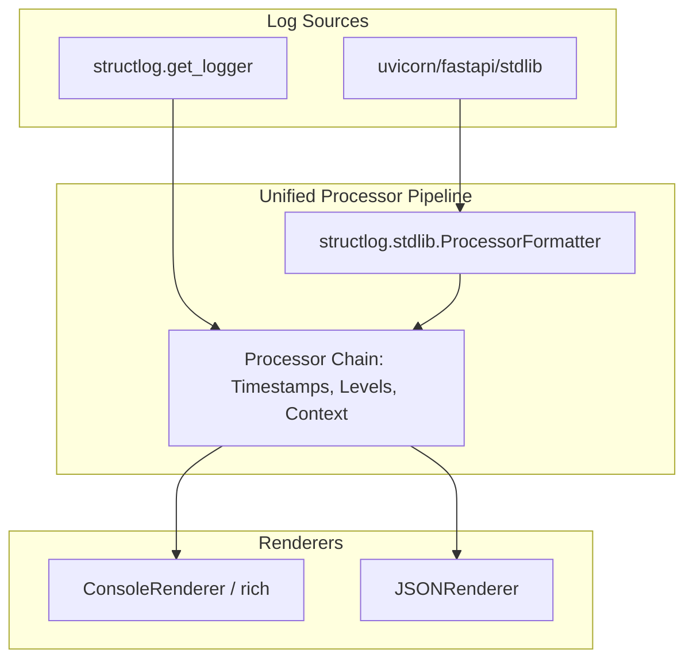

# Observability

The `core/observability/` module provides structured logging, OpenTelemetry-compatible distributed tracing, Prometheus metrics, audit logging, and a thread-safe telemetry collector — all wired together with zero external dependencies required (graceful degradation when optional packages are absent).

## Module Structure

```txt
core/observability/
├── logging.py    # Structured logging (structlog / stdlib fallback)
├── tracing.py    # Distributed tracing — W3C TraceContext
├── telemetry.py  # Thread-safe event counters + Prometheus export
├── metrics.py    # Prometheus metrics definitions
├── audit.py      # Immutable audit log for security events
├── cache.py      # Redis-backed observability cache
└── health.py     # Health check aggregator
```

---

## Structured Logging

BaselithCore uses `structlog` as its primary logging engine, providing clean, searchable JSON output in production and high-quality, colorized text output in development.

### Unified Logging Pipeline

The framework implements a **Unified Logging Pipeline** that bridges standard Python `logging` (used by libraries like Uvicorn and FastAPI) with the `structlog` processor chain. This ensures consistent formatting, timestamps, and context injection across the entire stack.



### Usage

Always use the framework-provided `get_logger` to ensure logs are correctly processed:

```python
from core.observability.logging import get_logger, bind_context

# Get a module-level logger
log = get_logger(__name__)

# Structured key-value logging
log.info("Request received", user_id="u-123", action="check_balance")

# Bind context for request-scoped metadata
with bind_context(request_id="req-456"):
    log.info("Processing")   # Automatically includes request_id
```

### Technical Implementation

- **ProcessorFormatter**: We use a `UnifiedFormatter` (a specialized `ProcessorFormatter`) that handles both structured dictionaries and plain strings safely.
- **Uvicorn Hijacking**: During startup, Uvicorn loggers are reconfigured to propagate to the root logger, clearing their default handlers to prevent duplicated or mismatched logs.
- **Rich Integration**: In development mode, `rich` is used for high-fidelity tracebacks and colorized output.

---

## Distributed Tracing

OpenTelemetry-compatible tracing with **W3C TraceContext** header propagation.

```python
from core.observability.tracing import get_tracer, Tracer

tracer = get_tracer("my-service")

# Context manager creates a span
with tracer.start_span("retrieve-documents") as span:
    span.set_attribute("query", user_query)
    span.set_attribute("top_k", 40)

    docs = await vectorstore.search(user_query)

    span.set_attribute("docs_found", len(docs))
    # Span closes automatically — status set to OK

# Trace propagation across services
headers = span.context.to_headers()  # {"traceparent": "00-<trace_id>-<span_id>-01"}
```

### SpanStatus

| Status  | When                  |
| ------- | --------------------- |
| `OK`    | Successful completion |
| `ERROR` | Exception raised      |
| `UNSET` | Not yet completed     |

---

## Telemetry Collector

Thread-safe event counters with optional **Prometheus** export.

```python
from core.observability.telemetry import TelemetryCollector

telemetry = TelemetryCollector()

# Increment counters
telemetry.increment("chat_request")
telemetry.increment("tokens_used", value=1024)
telemetry.increment("cache_hit")

# Snapshot for dashboards / health endpoints
stats = telemetry.snapshot()
# {
#   "chat_request": 142,
#   "tokens_used": 98432,
#   "cache_hit": 97,
#   "uptime_seconds": 3600,
#   "created_at": "2026-02-21T..."
# }
```

When `prometheus-client` is installed, all counters are automatically exported to `/metrics`.

---

## Prometheus Metrics

Pre-defined metrics exposed at `/metrics` (Prometheus scrape endpoint):

| Metric                                | Type      | Description                        |
| ------------------------------------- | --------- | ---------------------------------- |
| `chatbot_events_total`                | Counter   | All telemetry events by name       |
| `http_requests_total`                 | Counter   | HTTP requests by method and status |
| `llm_request_duration_seconds`        | Histogram | LLM call latency                   |
| `vectorstore_search_duration_seconds` | Histogram | Vector search latency              |

---

## Audit Log

Immutable, append-only log for security-relevant events:

```python
from core.observability.audit import AuditLog

audit = AuditLog()

await audit.log(
    event="login_success",
    actor="user-123",
    resource="auth",
    details={"ip": "1.2.3.4", "method": "jwt"},
)
```

---

## Health Checks

```python
from core.observability.health import HealthChecker

checker = HealthChecker()
checker.register("redis", redis_health_check)
checker.register("qdrant", qdrant_health_check)
checker.register("postgres", postgres_health_check)

status = await checker.check_all()
# {"redis": "ok", "qdrant": "ok", "postgres": "degraded"}
```

The `/health` and `/health/ready` endpoints use this aggregator.

---

## Configuration

```bash
LOG_LEVEL=INFO                   # Log level: DEBUG, INFO, WARNING, ERROR
LOG_JSON=true                    # Emit JSON (production) or human-readable (dev)
TRACING_ENABLED=true             # Enable distributed tracing
PROMETHEUS_ENABLED=true          # Expose /metrics endpoint
```

!!! tip "Advanced Configuration"
    For fine-grained control over the logging engine and Uvicorn handlers via YAML, see [Advanced Observability](../advanced/observability.md#custom-configuration-via-yaml).

!!! tip "Zero-Dependency Fallback"
    If `structlog`, `prometheus_client`, or `opentelemetry` are not installed, all observability features degrade gracefully to stdlib equivalents. No exceptions are raised.
