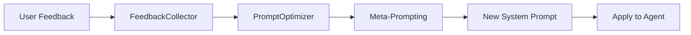

The `core/optimization` module implements an active learning loop that monitors agent performance and suggests (or applies) improvements to system prompts.

## Overview

The optimization system closes the gap between deployment and peak performance by analyzing user feedback and LLM metrics to identify behavioral gaps.

**Key Components**:

- **PromptOptimizer**: The central intelligence that identifies underperforming agents.
- **Optimization Loop**: An autonomous process that periodically runs audits and generates suggestions.
- **Active Learning**: Uses negative feedback as a dataset for refining agent instructions.

---

## How It Works



---

## Prompt Optimizer

The `PromptOptimizer` uses a "Meta-Prompting" strategy to generate better instructions based on specific criticisms.

### Triggering Optimization

```python
from core.optimization.optimizer import PromptOptimizer
from core.learning.feedback import FeedbackCollector

optimizer = PromptOptimizer(FeedbackCollector())

# Analyze performance and get suggestions
suggestions = await optimizer.analyze_performance(threshold=0.5)

for item in suggestions:
    print(f"Agent: {item.agent_id}")
    print(f"Issue: {item.issue_type}")
    print(f"Suggestion: {item.suggestion}")
```

### Automated Tuning

The system can automatically generate and apply a new prompt if an `apply_fn` is provided.

```python
async def update_agent_config(agent_id, new_prompt):
    # Logic to persist the new prompt
    return True

result = await optimizer.auto_tune(
    agent_id="researcher",
    apply_fn=update_agent_config,
    dry_run=False
)

if result.applied:
    print(f"Optimized prompt applied to {agent_id}")
```

---

## Configuration

| Variable                       | Default | Description                                |
| ------------------------------ | ------- | ------------------------------------------ |
| `OPTIMIZATION_THRESHOLD`       | `0.6`   | Feedback score below which tuning triggers |
| `OPTIMIZATION_MIN_SAMPLES`     | `5`     | Minimum feedback items required to tune    |
| `OPTIMIZATION_AUTO_APPLY`      | `false` | Whether to apply changes without approval  |
| `OPTIMIZATION_HISTORY_ENABLED` | `true`  | Track previous tuning attempts             |

---

## Best Practices

!!! tip "Human-in-the-Loop"
    It is highly recommended to run optimization in `dry_run=True` mode first, reviewing suggestions before allowing the system to modify prompts automatically.

!!! note "Feedback Quality"
    The quality of optimization depends directly on the quality of feedback comments. Encouraging users to provide specific reasons for low scores significantly improves the automated tuning results.
