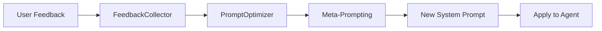

The `core/optimization` module implements an active learning loop that monitors agent performance and suggests (or applies) improvements to system prompts.

## Overview

The optimization system closes the gap between deployment and peak performance by analyzing user feedback and LLM metrics to identify behavioral gaps.

**Key Components**:

- **PromptOptimizer**: The central intelligence that identifies underperforming agents.
- **Optimization Loop**: An autonomous process that periodically runs audits and generates suggestions.
- **Active Learning**: Uses negative feedback as a dataset for refining agent instructions.

---

## How It Works


```mermaid
flowchart LR
    Feedback[User Feedback] --> Collector[FeedbackCollector]
    Collector --> Optimizer[PromptOptimizer]
    Optimizer --> LLM[Meta-Prompting]
    LLM --> Suggestion[New System Prompt]
    Suggestion --> Apply[Apply to Agent]
```

---

## Prompt Optimizer

The `PromptOptimizer` uses a "Meta-Prompting" strategy to generate better instructions based on specific criticisms.

### Triggering Optimization

```python
from core.optimization.optimizer import PromptOptimizer
from core.learning.feedback import FeedbackCollector

optimizer = PromptOptimizer(FeedbackCollector())

# Analyze performance and get suggestions
suggestions = await optimizer.analyze_performance(threshold=0.5)

for item in suggestions:
    print(f"Agent: {item.agent_id}")
    print(f"Issue: {item.issue_type}")
    print(f"Suggestion: {item.suggestion}")
```

### Automated Tuning

The system can automatically generate and apply a new prompt if an `apply_fn` is provided.

```python
async def update_agent_config(agent_id, new_prompt):
    # Logic to persist the new prompt
    return True

result = await optimizer.auto_tune(
    agent_id="researcher",
    apply_fn=update_agent_config,
    dry_run=False
)

if result.applied:
    print(f"Optimized prompt applied to {agent_id}")
```

---

## Eval gate on auto-tune (`BASELITH_OPTIMIZER_EVAL_GATE`)

`auto_tune` can rewrite an agent's system prompt from production feedback —
self-modification that, ungated, ships whatever the meta-prompt produced.
`core/optimization/tune_gate.py` holds the non-negotiable between generation
and application. **Off by default this release**: with
`BASELITH_OPTIMIZER_EVAL_GATE=true`, the candidate must pass a
`TuneEvaluator` before `apply_fn` runs.

- **`TuneEvaluator`** is an async `(agent_id, candidate_prompt) -> score in
  [0, 1]` — typically an adapter over
  [`PromptEvaluator`](evaluation.md#evaluator-case-definition) or the
  regression runner, replaying the agent's suite against the candidate. It
  is a constructor parameter: `PromptOptimizer(collector,
  tune_evaluator=...)`.
- **Strictly fail-closed when enabled**: no evaluator configured, a raising
  evaluator, or a score below the threshold (`DEFAULT_TUNE_THRESHOLD =
  0.9`) all refuse the application.
- **Accepted candidates get a version.** The candidate is registered as the
  next `PromptVersion` in the prompt registry under the name
  `agent:<agent_id>`, labelled `candidate` — the change has a diff, a
  version and a rollback path instead of vanishing into a mutable string.
- **Both outcomes are audited** as `self_modify.apply` /
  `self_modify.reject` (action `prompt_tune.gate`) — see
  [Audit Trail](audit-trail.md#self-modification-self_modify). Below
  `FULLY_AUTONOMOUS`, prompt tuning falls under the `self_modify`
  [autonomy category](orchestration.md#autonomypolicy-three-tier-spectrum).

```python
from core.evaluation.prompt_eval import PromptEvaluator
from core.optimization.optimizer import PromptOptimizer

async def replay_suite(agent_id: str, candidate_prompt: str) -> float:
    report = await PromptEvaluator(candidate_prompt).run(suites[agent_id])
    return report.pass_rate

optimizer = PromptOptimizer(FeedbackCollector(), tune_evaluator=replay_suite)
```

The reusable gate itself is `review_candidate(agent_id, candidate_prompt,
evaluator, threshold=..., register_as=...)` in
`core.optimization.tune_gate`, for callers applying tuned prompts outside
`auto_tune`.

---

## Configuration

| Variable                      | Default | Description                                                |
| ----------------------------- | ------- | ---------------------------------------------------------- |
| `BASELITH_OPTIMIZER_EVAL_GATE` | unset (off) | Gate `auto_tune` applications behind the tune evaluator |

The remaining knobs are constructor/method parameters, not env vars:
`analyze_performance(threshold=0.5)`, `auto_tune(dry_run=True)`, and
`OptimizationLoop(threshold=0.5)`.

---

## Best Practices

!!! tip "Human-in-the-Loop"
    It is highly recommended to run optimization in `dry_run=True` mode first, reviewing suggestions before allowing the system to modify prompts automatically.

!!! note "Feedback Quality"
    The quality of optimization depends directly on the quality of feedback comments. Encouraging users to provide specific reasons for low scores significantly improves the automated tuning results.
