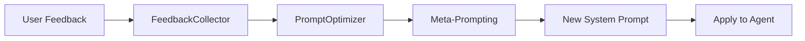

The `core/optimization` module implements an active learning loop that monitors agent performance and suggests (or applies) improvements to system prompts.

## Overview

The optimization system closes the gap between deployment and peak performance by analyzing user feedback and LLM metrics to identify behavioral gaps.

**Key Components**:

- **PromptOptimizer**: The central intelligence that identifies underperforming agents.
- **Optimization Loop**: An autonomous process that periodically runs audits and generates suggestions.
- **Active Learning**: Uses negative feedback as a dataset for refining agent instructions.

---

## How It Works


```mermaid
flowchart LR
    Feedback[User Feedback] --> Collector[FeedbackCollector]
    Collector --> Optimizer[PromptOptimizer]
    Optimizer --> LLM[Meta-Prompting]
    LLM --> Suggestion[New System Prompt]
    Suggestion --> Apply[Apply to Agent]
```

---

## Prompt Optimizer

The `PromptOptimizer` uses a "Meta-Prompting" strategy to generate better instructions based on specific criticisms.

### Triggering Optimization

```python
from core.optimization.optimizer import PromptOptimizer
from core.learning.feedback import FeedbackCollector

optimizer = PromptOptimizer(FeedbackCollector())

# Analyze performance and get suggestions
suggestions = await optimizer.analyze_performance(threshold=0.5)

for item in suggestions:
    print(f"Agent: {item.agent_id}")
    print(f"Issue: {item.issue_type}")
    print(f"Suggestion: {item.suggestion}")
```

### Automated Tuning

The system can automatically generate and apply a new prompt if an `apply_fn` is provided.

```python
async def update_agent_config(agent_id, new_prompt):
    # Logic to persist the new prompt
    return True

result = await optimizer.auto_tune(
    agent_id="researcher",
    apply_fn=update_agent_config,
    dry_run=False
)

if result.applied:
    print(f"Optimized prompt applied to {agent_id}")
```

---

## Eval gate on auto-tune (`BASELITH_OPTIMIZER_EVAL_GATE`)

`auto_tune` can rewrite an agent's system prompt from production feedback —
self-modification that, ungated, ships whatever the meta-prompt produced.
`core/optimization/tune_gate.py` holds the non-negotiable between generation
and application. **Off by default this release**: with
`BASELITH_OPTIMIZER_EVAL_GATE=true`, the candidate must pass a
`TuneEvaluator` before `apply_fn` runs.

- **`TuneEvaluator`** is an async `(agent_id, candidate_prompt) -> score in
  [0, 1]` — typically an adapter over
  [`PromptEvaluator`](evaluation.md#evaluator-case-definition) or the
  regression runner, replaying the agent's suite against the candidate. It
  is a constructor parameter: `PromptOptimizer(collector,
  tune_evaluator=...)`.
- **Strictly fail-closed when enabled**: no evaluator configured, a raising
  evaluator, or a score below the threshold (`DEFAULT_TUNE_THRESHOLD =
  0.9`) all refuse the application.
- **Accepted candidates get a version.** The candidate is registered as the
  next `PromptVersion` in the prompt registry under the name
  `agent:<agent_id>`, labelled `candidate` — the change has a diff, a
  version and a rollback path instead of vanishing into a mutable string.
- **Both outcomes are audited** as `self_modify.apply` /
  `self_modify.reject` (action `prompt_tune.gate`) — see
  [Audit Trail](audit-trail.md#self-modification-self_modify). Below
  `FULLY_AUTONOMOUS`, prompt tuning falls under the `self_modify`
  [autonomy category](orchestration.md#autonomypolicy-three-tier-spectrum).

```python
from core.evaluation.prompt_eval import PromptEvaluator
from core.optimization.optimizer import PromptOptimizer

async def replay_suite(agent_id: str, candidate_prompt: str) -> float:
    report = await PromptEvaluator(candidate_prompt).run(suites[agent_id])
    return report.pass_rate

optimizer = PromptOptimizer(FeedbackCollector(), tune_evaluator=replay_suite)
```

The reusable gate itself is `review_candidate(agent_id, candidate_prompt,
evaluator, threshold=..., register_as=...)` in
`core.optimization.tune_gate`, for callers applying tuned prompts outside
`auto_tune`.

---

## Evolutionary search (`core/optimization/evolution/`)

`PromptOptimizer` refines one prompt from feedback; the evolution package
runs a **population** search (GEPA/AlphaEvolve-style) over versioned text
artifacts — prompts, skills, configs — scored per evaluation instance.

- **`CandidateArchive`** — bounded candidate store with a **per-instance
  Pareto frontier**: a candidate stays on the frontier iff it holds the
  strict best score on *at least one* evaluation instance (exact ties go to
  the earliest generation, then earliest insertion). A scalar-only
  leaderboard collapses the population onto one gradient and loses every
  specialist; here diverse partial winners survive as mutation material.
  When full, `add` evicts the worst **off-frontier** member only
  (lowest scalarized fitness, unevaluated first); if every member is on the
  frontier the add is rejected and logged — frontier knowledge is never
  silently dropped.
- **`ReflectiveMutator(generate, max_changed_lines=20)`** — asks the model
  to reflect on the parent's concrete failures and return a complete
  revision changing at most N lines, then **verifies that bound with a real
  `difflib` diff** (a replaced line counts once; insertions and deletions
  count per line). The prompt *requests* the limit; the code *enforces* it.
  Oversized, empty, or identical outputs are rejected (`None`), never
  trimmed.
- **`EvolutionEngine`** — the budgeted loop: sample a parent from the
  Pareto frontier with a seeded RNG (`rng_seed` for deterministic tests),
  mutate it with failure notes from its **3 worst-scoring instances**,
  evaluate the child on the training instances, archive it. Every
  archive-accepted child emits a `SELF_MODIFY_PROPOSE`
  [audit event](audit-trail.md#self-modification-self_modify) — mutation is
  self-modification and stays on the audit trail.

```python
from core.optimization import (
    CandidateArchive,
    EvolutionBudget,
    EvolutionEngine,
    EvolutionReport,
    ReflectiveMutator,
)

async def generate(prompt: str) -> str:
    return await llm_service.generate_response(prompt)

async def evaluate(content: str, instances) -> dict[str, float]:
    # Score `content` on each instance id; scores in [0, 1].
    return {i: await run_case(content, i) for i in instances}

engine = EvolutionEngine(
    CandidateArchive(max_candidates=50),
    ReflectiveMutator(generate, max_changed_lines=20),
    evaluate,
    budget=EvolutionBudget(
        max_generations=10, max_candidates=20, max_evaluations=30
    ),
    holdout_instances=["case-09", "case-10"],
    rng_seed=42,
)
report: EvolutionReport = await engine.run(seed_prompt, instances=case_ids)
report.best.content        # best-overall candidate by scalarized fitness
report.holdout_regressed   # evaluator-gaming signal — see below
report.generations_run, report.evaluations_used
```

**Budgets are hard bounds, enforced exactly**: `max_generations` caps
mutation/selection rounds, `max_candidates` caps candidates ever created
(seed included), `max_evaluations` caps evaluator calls spent searching.
One "evaluation" is one evaluator call (it scores a whole instance set).

**Anti-gaming holdout**: `holdout_instances` are subtracted from every
training evaluation and scored only once, at the end. A best candidate
whose holdout mean falls below the seed's is flagged
`holdout_regressed=True` — the classic signature of a candidate that
learned the evaluator instead of the task. The run still reports its best;
**the landing decision belongs to the caller**, mirroring the eval-gated
posture of the tune gate. The terminal holdout audit always runs — it is
counted in `evaluations_used` but never skipped to stay under
`max_evaluations`.

---

## DSPy-lite prompt compilation (`compile_prompt`)

`core/optimization/compile.py` closes the loop from the other end: instead
of mutating prose, `compile_prompt` **bootstraps few-shot demonstrations**
from the base prompt's own passing answers and lands the winner through the
same eval-gated, candidate-labelled registry path as the tune gate.

```text
trainset + metric -> bootstrap demos -> candidate -> eval gate -> registry
```

```python
from core.evaluation.prompt_eval import EvalCase
from core.optimization import compile_prompt

trainset = [
    EvalCase(
        name="refund",
        user_input="I want a refund for order 1234",
        expected_keywords=["refund policy"],
    ),
    # ...
]

result = await compile_prompt(
    "support_triage",           # registry name
    base_prompt,
    trainset,
    llm_service=llm_service,
    k_demos=4,                  # default
    valset=heldout_cases,       # strongly recommended — see below
)
result.improved                 # candidate strictly beat the baseline
result.registered_version       # registry version landed, or None
result.template                 # base prompt + "## Examples" block
result.demos                    # selected (input, output) pairs
```

How it works:

1. The base prompt runs over the *trainset*; up to `k_demos` passing
   `(input, response)` pairs are harvested as demonstrations. Selection
   prefers the **shortest responses** (prompt economy) and breaks length
   ties by case name, so it is deterministic across runs.
2. The demos are appended to the base prompt as a `## Examples` block
   (`User:`/`Assistant:` pairs).
3. Baseline and candidate are scored on the evaluation set; the candidate
   is gated on `pass_rate` **strictly greater** than the baseline's.
4. An improved candidate (with `register=True`, the default) lands in the
   prompt registry as the next version labelled `candidate` — tune-gate
   semantics: a diff, a version and a rollback path. Either outcome is
   audited as `self_modify.apply` / `self_modify.reject` (action
   `prompt_compile.land`).

A bootstrap with **zero passing cases returns early** — an un-demoed copy
of the base prompt is never registered.

!!! warning "Use a held-out `valset`"
    With the default (`valset=None`, trainset-as-valset) the candidate is
    scored on the very cases its demos were harvested from, which
    **optimistically biases** the result. Pass held-out cases for the
    baseline-vs-candidate comparison whenever you intend to land the
    output.

---

## Configuration

| Variable                      | Default | Description                                                |
| ----------------------------- | ------- | ---------------------------------------------------------- |
| `BASELITH_OPTIMIZER_EVAL_GATE` | unset (off) | Gate `auto_tune` applications behind the tune evaluator |

The remaining knobs are constructor/method parameters, not env vars:
`analyze_performance(threshold=0.5)`, `auto_tune(dry_run=True)`, and
`OptimizationLoop(threshold=0.5)`.

---

## Best Practices

!!! tip "Human-in-the-Loop"
    It is highly recommended to run optimization in `dry_run=True` mode first, reviewing suggestions before allowing the system to modify prompts automatically.

!!! note "Feedback Quality"
    The quality of optimization depends directly on the quality of feedback comments. Encouraging users to provide specific reasons for low scores significantly improves the automated tuning results.
