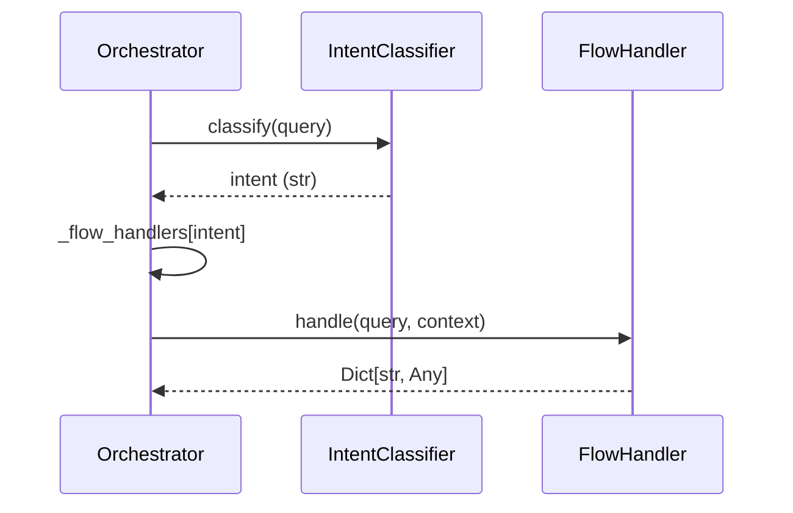
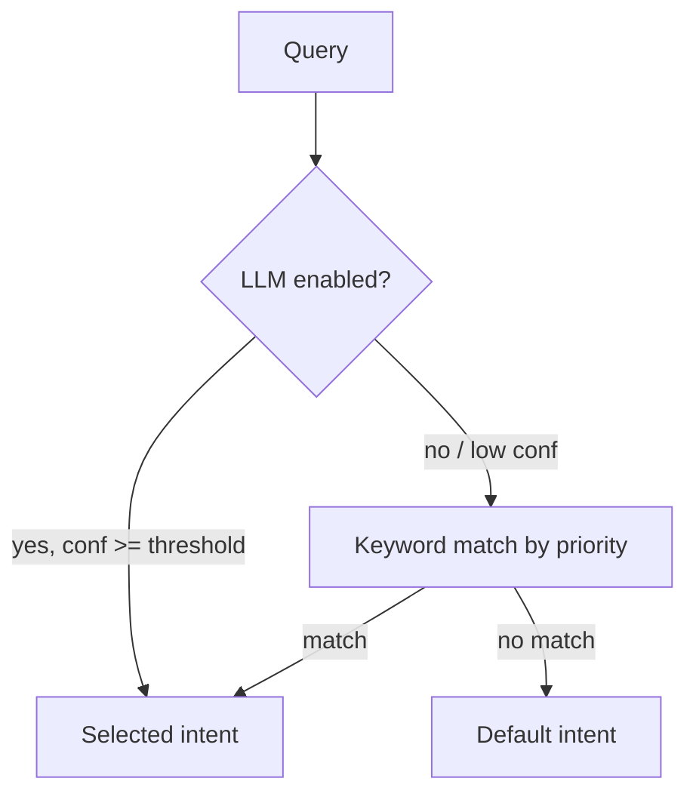

The `core/orchestration` module manages request routing to appropriate plugins.

## Module Structure

```text
core/orchestration/
├── __init__.py              # Public exports
├── orchestrator.py          # Main Orchestrator (mixin-composed)
├── intent_classifier.py     # IntentClassifier + ClassificationResult
├── router.py                # Router (semantic agent routing)
├── protocols.py             # FlowHandler / StreamHandler / *Protocol
├── limits.py                # LoopBudget / LoopLimits guardrails
├── contract.py              # AgentContract / ContractValidator
├── autonomy.py              # AutonomyPolicy / AutonomyUpgradeGate
├── task_classifier.py       # TaskClassifier (agentic vs deterministic)
├── mixins/                  # intent / handlers / execution mixins
└── handlers/                # Built-in flow handlers
```

Public exports (`from core.orchestration import ...`): `Orchestrator`,
`IntentClassifier`, `BaseFlowHandler`, `BaseStreamHandler`, the protocols
(`AgentProtocol`, `FlowHandler`, `StreamHandler`, `IntentClassifierProtocol`,
`OrchestratorProtocol`), and the efficiency modules (`ParallelToolExecutor`,
`ToolCall`, `ToolResult`, `ExecutionPlan`, `AdaptiveController`,
`ProcessingPath`, `AdaptiveConfig`).

---

## Orchestrator

The central component coordinating request processing. `Orchestrator` is
composed from `IntentMixin`, `HandlersMixin`, and `ExecutionMixin`; the public
entry points are `process()` and `process_stream()` (provided by
`ExecutionMixin`).

```python
from core.orchestration import Orchestrator

orchestrator = Orchestrator()

# Non-streaming handling — returns a result dict
result = await orchestrator.process(
    query="What's the weather in Rome?",
    context={"session_id": "user-123"},
)

# Streaming handling — async generator of string chunks
async for chunk in orchestrator.process_stream(
    query="Analyze this document",
    context={"session_id": "user-123"},
):
    print(chunk, end="")
```

`process` injects a per-request `LoopBudget` at `context["loop_budget"]` and,
when configured, a `ContractValidator` at `context["contract_validator"]` and
the `AutonomyPolicy` at `context["autonomy_policy"]` (see
[Runtime guardrails](#runtime-guardrails)).

### Internal Flow



### API Reference

```python
class Orchestrator(IntentMixin, HandlersMixin, ExecutionMixin):
    def __init__(
        self,
        intent_classifier: IntentClassifier | None = None,
        plugin_registry: "PluginRegistry" | None = None,
        default_intent: str = "qa_docs",
        memory_manager: "AgentMemory" | None = None,
        human_intervention: "HumanIntervention" | None = None,
        feedback_collector: "FeedbackCollector" | None = None,
        llm_service: Any | None = None,
        loop_limits: LoopLimits | None = None,
        agent_contract: AgentContract | None = None,
        autonomy_policy: AutonomyPolicy | None = None,
    ) -> None: ...

    async def process(
        self,
        query: str,
        context: dict[str, Any] | None = None,
        intent: str | None = None,
    ) -> dict[str, Any]:
        """Run a query through the orchestration pipeline."""

    def process_stream(
        self,
        query: str,
        context: dict[str, Any] | None = None,
        intent: str | None = None,
    ) -> AsyncGenerator[str, None]:
        """Stream a query response as string chunks."""

    def register_handler(self, intent: str, handler) -> None:
        """Register a flow/stream handler for an intent (HandlersMixin)."""

    def get_registered_intents(self) -> list[str]: ...
    def has_stream_handler(self, intent: str) -> bool: ...
```

---

## Intent Classifier

`IntentClassifier` determines which handler should manage the request. It
runs a tiered pipeline: LLM (if enabled and above the confidence threshold) →
keyword pattern match → default intent.

```python
from core.orchestration import IntentClassifier

classifier = IntentClassifier()

# classify(text) -> str
intent = await classifier.classify("Analyze market trends")
print(intent)  # e.g. "complex_reasoning"

# classify_with_confidence(text) -> ClassificationResult
result = await classifier.classify_with_confidence("Analyze market trends")
print(result.intent)          # "complex_reasoning"
print(result.confidence)      # 0.92
print(result.method)          # "llm" | "keyword" | "default"
print(result.alternatives)    # Optional[list[dict]]
```

`ClassificationResult` is a dataclass with fields `intent`, `confidence`,
`method`, and optional `alternatives`. (There is no `source` field; the
strategy that produced the result is reported via `method`.)

### Registering intents

Intents are registered via `register_intent`, and are also auto-loaded from
plugins through the `PluginRegistry`:

```python
classifier.register_intent(
    intent_name="weather",
    patterns=["meteo", "weather", "temperature"],
    priority=100,
    description="Weather questions",
)

print(classifier.get_available_intents())
```

### Priority Resolution



The default intent is `qa_docs` and the default confidence threshold is `0.6`.

---

## Router

`core/orchestration/router.py` provides a semantic `Router` that maps a query
to candidate agents using vector similarity. It is a separate component from
the `Orchestrator` (there is no `FlowRouter`).

```python
from core.orchestration.router import Router, RouteRequest
from core.config import get_router_config

router = Router(
    config=get_router_config(),
    llm_service=llm_service,
    vector_store=vector_store,
    embedder=embedder,
)

results = await router.route(RouteRequest(query="summarize this PDF"))
for r in results:
    print(r.agent_id, r.confidence, r.reasoning)
```

`route(request)` returns a ranked `list[RouteResult]` (`agent_id`,
`confidence`, `reasoning`, `metadata`).

---

## Flow Handler Protocol

Handlers implement the `FlowHandler` protocol. `handle` is async and returns a
`Dict[str, Any]`. Streaming is a separate `StreamHandler` protocol whose
`handle` returns an `AsyncGenerator[str, None]`.

```python
from typing import Any, AsyncGenerator
from core.orchestration.protocols import FlowHandler, StreamHandler


class MyFlowHandler:  # structural match for FlowHandler
    async def handle(self, query: str, context: dict[str, Any]) -> dict[str, Any]:
        return {"answer": f"Echo: {query}"}


class MyStreamHandler:  # structural match for StreamHandler
    async def handle(
        self, query: str, context: dict[str, Any]
    ) -> AsyncGenerator[str, None]:
        for token in query.split():
            yield token
```

Register handlers on the orchestrator:

```python
orchestrator.register_handler("my_intent", MyFlowHandler())
orchestrator.register_handler("my_intent", MyStreamHandler())
```

`register_handler` inspects the object: an object whose `handle` returns an
async generator is stored as a stream handler; otherwise it is a flow handler.

---

## Configuration

`OrchestrationConfig` uses the `ORCHESTRATOR_` env prefix.

```python
from core.config import get_orchestration_config

config = get_orchestration_config()

print(config.default_intent)        # "qa_docs"
print(config.enable_telemetry)      # False
print(config.confidence_threshold)  # 0.6
```

```env title=".env"
ORCHESTRATOR_DEFAULT_INTENT=qa_docs
ORCHESTRATOR_ENABLE_TELEMETRY=false
ORCHESTRATOR_CONFIDENCE_THRESHOLD=0.6
```

The semantic `Router` is configured separately via `RouterConfig`
(`ROUTER_` prefix: `score_threshold`, `max_candidates`, `retrieval_limit`),
exposed through `get_router_config()`.

---

## Runtime guardrails

The orchestrator carries three optional, request-scoped guardrails that
fire before any tool is dispatched and any LLM call leaves the process.

### `LoopBudget` — iteration + cost cap

`core/orchestration/limits.py` enforces hard caps so a runaway loop
cannot burn budget. A fresh `LoopBudget` is instantiated per request
by `ExecutionMixin.process` and exposed as `context["loop_budget"]`.

| Symbol | Purpose |
|--------|---------|
| `LoopLimits` | Static caps (`max_iterations`, `max_tool_calls`, `budget_usd`) |
| `LoopBudget` | Mutable per-request tracker with `tick()`, `record_tool_call()`, `charge(cost)` |
| `LoopBudgetSnapshot` | Immutable snapshot returned by `snapshot()` |
| `BudgetExceededError` | Raised when any cap is breached |

Defaults: 25 iterations, 50 tool calls, USD 0.50. Override at
construction:

```python
from core.orchestration import Orchestrator
from core.orchestration.limits import LoopLimits

orchestrator = Orchestrator(
    loop_limits=LoopLimits(
        max_iterations=10,
        max_tool_calls=20,
        budget_usd=0.10,
    ),
)
```

Handlers downstream call the budget directly:

```python
budget = context["loop_budget"]
budget.tick()                          # before each agentic step
budget.record_tool_call()              # before every tool dispatch
budget.charge(0.0008)                  # after each LLM completion
```

A breach raises `BudgetExceededError`, which `ExecutionMixin` catches
and converts into a structured failure reply with `budget_exceeded` and
a snapshot of the state at the breach.

### `AgentContract` — declarative spec

`core/orchestration/contract.py` loads a YAML file describing the
agent's identity, allowed/forbidden tools, output contract, and quality
gates. When a contract is wired into the orchestrator, the runtime
`ContractValidator` is exposed at `context["contract_validator"]`.

```yaml
# agent.yaml
name: example-agent
version: 1.0.0
identity: research assistant for internal teams
capabilities:
  allowed_tools: [search, read, summarize]
  must_not: [delete, rm_rf, transfer_funds]
output_contract:
  format: json
  required_fields: [answer, sources]
quality_gates:
  min_eval_pass_rate: 0.92
  max_cost_usd: 0.10
```

```python
from core.orchestration import Orchestrator
from core.orchestration.contract import load_contract

contract = load_contract("agent.yaml")
orchestrator = Orchestrator(agent_contract=contract)
```

Handlers gate tool dispatch with `validator.check_tool_call(name)` and
output shape with `validator.check_output(payload)`. Both raise
`ContractViolationError` on failure.

### `AutonomyPolicy` — three-tier spectrum

`core/orchestration/autonomy.py` provides a coarse-grained policy that
governs which tool categories require human approval.

| Level | Read-only | Mutating | Destructive | External side-effect |
|-------|-----------|----------|-------------|----------------------|
| `SUPERVISED` | auto | approval | approval | approval |
| `SEMI_AUTONOMOUS` | auto | auto | approval | approval |
| `FULLY_AUTONOMOUS` | auto | auto | auto | auto |

`AutonomyUpgradeGate` decides whether an operator may advance the
deployment to the next level. Upgrade is blocked until evaluation pass
rate, red-team pass rate, and successful-run count all clear their
thresholds (default 0.90 → 0.98).

```python
from core.orchestration.autonomy import (
    AutonomyLevel, AutonomyPolicy, AutonomyUpgradeGate,
)

policy = AutonomyPolicy(level=AutonomyLevel.SEMI_AUTONOMOUS)
orchestrator = Orchestrator(autonomy_policy=policy)

gate = AutonomyUpgradeGate(
    eval_pass_rate=0.97,
    red_team_pass_rate=1.0,
    successful_runs=120,
)
allowed, reasons = gate.can_upgrade_to(AutonomyLevel.FULLY_AUTONOMOUS)
```

#### Enforcing the policy: `enforce_approval`

The matrix above is enforced (not just declared) via
`enforce_approval(policy, category, tool_name, human_intervention=None)`,
exported from `core.orchestration`. Semantics are **fail-closed**: when the
category requires approval at the active level, a missing approval channel or
a human denial raises `ApprovalRequiredError` (a `PermissionError` subclass)
instead of letting the tool run.

```python
from core.orchestration import ApprovalRequiredError, enforce_approval

try:
    await enforce_approval(
        policy, "mutating", "write_file",
        human_intervention=context.get("human_intervention"),
    )
except ApprovalRequiredError as e:
    return {"error": str(e)}
result = await tool(**args)
```

Two core choke points apply the gate automatically:

- **MCP server** — construct with `MCPServer(autonomy_policy=policy)`:
  `tools/call` requests whose tool `category` requires approval are rejected
  (MCP transports have no human channel). See
  [MCP](mcp.md#autonomy-approval-gate).
- **ParallelToolExecutor** — construct with
  `ParallelToolExecutor(autonomy_policy=policy, human_intervention=channel)`
  and declare categories at registration
  (`executor.register_tool("write_file", fn, category="mutating")`): gated
  calls go through the human channel, or fail closed without one, returning a
  failed `ToolResult` (status `SKIPPED`) before any side effect.

### `TaskClassifier` — short-circuit deterministic tasks

`core/orchestration/task_classifier.py` is a lightweight heuristic that
returns one of `AGENTIC` / `DETERMINISTIC` / `AMBIGUOUS` for a task
description. It is conservative: when in doubt the recommendation is
`AGENTIC`. Use it at the front of the orchestrator to skip the loop on
clearly deterministic requests.

```python
from core.orchestration.task_classifier import (
    RoutingRecommendation, TaskClassifier,
)

result = TaskClassifier().classify(query)
if result.recommendation is RoutingRecommendation.DETERMINISTIC:
    return run_deterministic_pipeline(query)
```

Each result carries the extracted signal (`word_count`, `has_conditional`,
agentic/deterministic hit counts) and a short rationale string for
audit logging.
