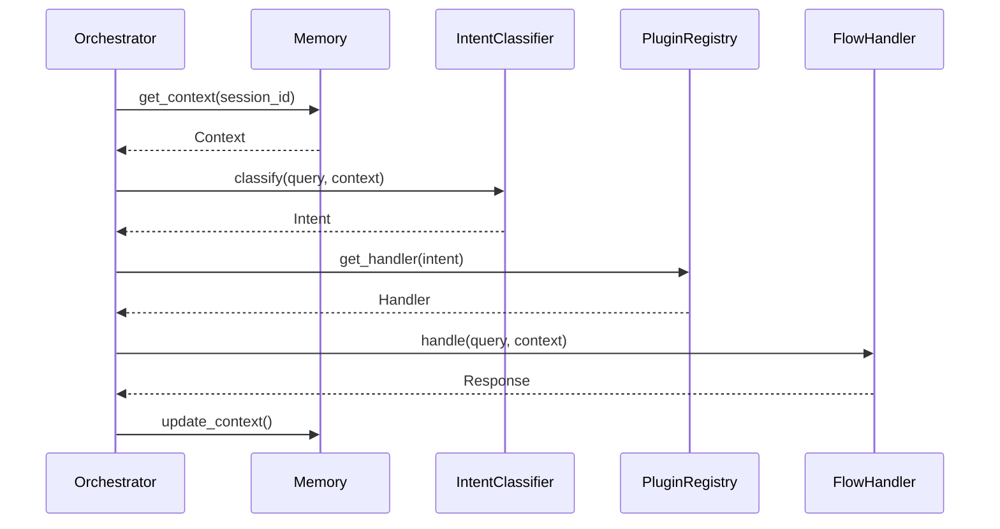
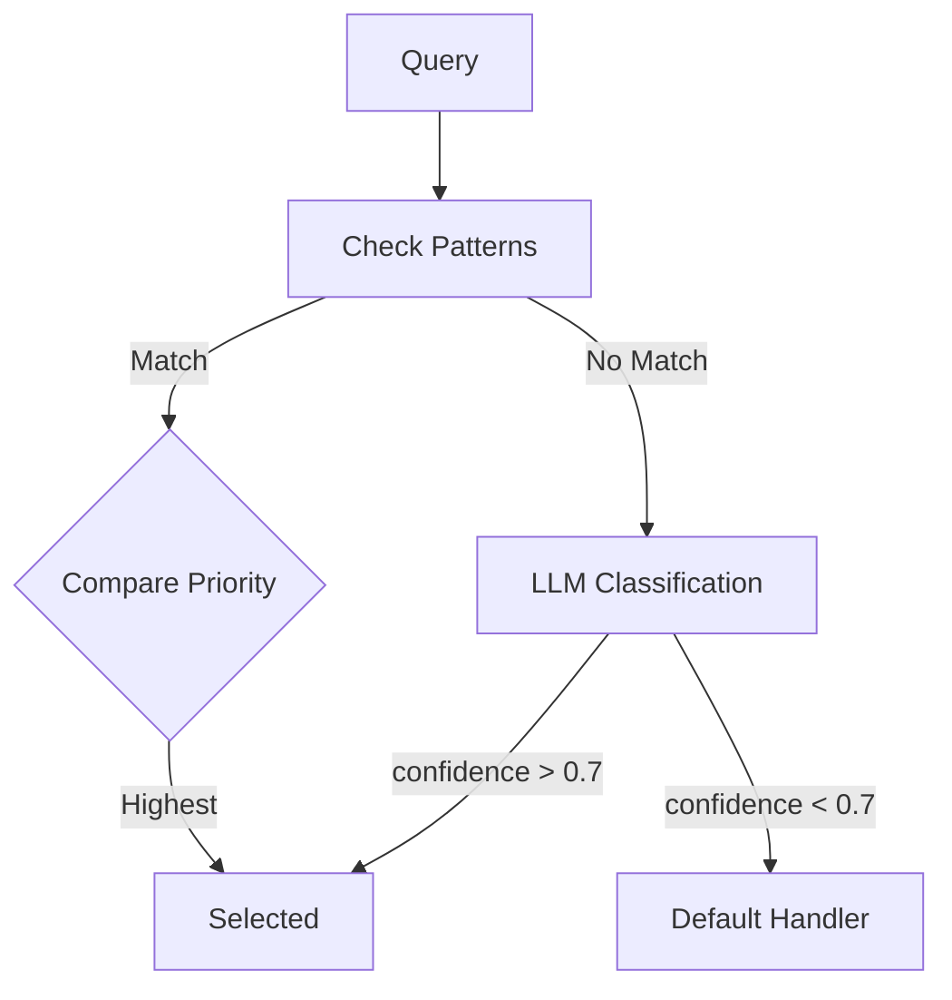

The `core/orchestration` module manages request routing to appropriate plugins.

## Module Structure

```text
core/orchestration/
├── __init__.py              # Public exports
├── orchestrator.py          # Main Orchestrator
├── intent_classifier.py     # Intent classification
├── router.py                # Plugin routing
├── protocols.py             # FlowHandler interfaces
└── handlers/                # Built-in handlers
    ├── default.py           # Fallback handler
    └── ...
```

---

## Orchestrator

The central component coordinating request processing:

```python
from core.orchestration import Orchestrator

orchestrator = Orchestrator()

# Synchronous handling
response = await orchestrator.handle_request(
    query="What's the weather in Rome?",
    session_id="user-123",
    stream=False
)

# Streaming handling
async for chunk in orchestrator.handle_stream(
    query="Analyze this document",
    session_id="user-123"
):
    print(chunk, end="")
```

### Internal Flow



### API Reference

```python
class Orchestrator:
    async def handle_request(
        self,
        query: str,
        session_id: str,
        stream: bool = True,
        metadata: dict | None = None
    ) -> str:
        """
        Handles a complete request.
        
        Args:
            query: User's query
            session_id: Session ID for context
            stream: If True, uses streaming handler
            metadata: Optional additional data
        
        Returns:
            Complete response as string
        """
    
    async def handle_stream(
        self,
        query: str,
        session_id: str,
        metadata: dict | None = None
    ) -> AsyncGenerator[str, None]:
        """
        Handles a streaming request.
        
        Yields:
            Response chunks
        """
```

---

## Intent Classifier

Determines which handler should manage the request:

```python
from core.orchestration import IntentClassifier

classifier = IntentClassifier()

result = await classifier.classify(
    query="Analyze market trends",
    context=context
)

print(result.intent)      # "reasoning"
print(result.confidence)  # 0.92
print(result.source)      # "pattern" | "llm"
```

### Pattern Matching

First fast phase based on patterns:

```python
# Plugins register patterns
patterns = [
    {
        "intent": "weather",
        "patterns": ["meteo", "weather", "temperature"],
        "priority": 100
    },
    {
        "intent": "reasoning",
        "patterns": ["analyze", "compare", "reason"],
        "priority": 90
    }
]
```

### LLM Fallback

If no pattern matches, uses LLM:

```python
# LLM-based classification
prompt = f"""
Classify the following query into one of these intents:
- weather: weather questions
- reasoning: complex analysis
- chat: generic conversation

Query: {query}
Intent:
"""

intent = await llm.generate(prompt)
```

### Priority Resolution



---

## Flow Router

Maps intents to handlers:

```python
from core.orchestration import FlowRouter

router = FlowRouter()

# Register handler
router.register("weather", WeatherHandler)
router.register("reasoning", ReasoningHandler)

# Resolve
handler = router.resolve("weather")
```

---

## Flow Handler Protocol

Plugins implement this protocol:

```python
from core.orchestration.protocols import FlowHandler

class FlowHandler(Protocol):
    async def handle(
        self,
        query: str,
        context: dict
    ) -> str:
        """Synchronous handler."""
        ...
    
    async def handle_stream(
        self,
        query: str,
        context: dict
    ) -> AsyncGenerator[str, None]:
        """Streaming handler."""
        ...
```

### Implementation

```python
class MyHandler(FlowHandler):
    def __init__(self, plugin):
        self.llm = resolve(LLMServiceProtocol)
    
    async def handle(self, query: str, context: dict) -> str:
        # Synchronous logic
        response = await self.llm.generate(query)
        return response.text
    
    async def handle_stream(
        self, 
        query: str, 
        context: dict
    ) -> AsyncGenerator[str, None]:
        # Streaming logic
        async for chunk in self.llm.stream(query):
            yield chunk
```

---

## Plugin Registration

Plugins register handlers via `get_flow_handlers()`:

```python
# plugins/my-plugin/plugin.py
class MyPlugin(Plugin):
    def get_flow_handlers(self) -> dict:
        return {
            "my_intent": {
                "sync": MySyncHandler,
                "stream": MyStreamHandler,
            }
        }
    
    def get_intent_patterns(self) -> list:
        return [
            {
                "intent": "my_intent",
                "patterns": ["keyword1", "keyword2"],
                "priority": 100
            }
        ]
```

---

## Context Management

The orchestrator manages conversation context:

```python
@dataclass
class ConversationContext:
    session_id: str
    tenant_id: str | None
    user_id: str | None
    messages: list[Message]
    compressed_memory: str | None
    metadata: dict
```

### Context Propagation

```python
async def handle_request(self, query: str, session_id: str):
    # 1. Load context
    context = await self.memory.get_context(session_id)
    
    # 2. Classify with context
    intent = await self.classifier.classify(query, context)
    
    # 3. Execute with context
    handler = self.router.resolve(intent)
    response = await handler.handle(query, context.to_dict())
    
    # 4. Update context
    await self.memory.add_message(session_id, "user", query)
    await self.memory.add_message(session_id, "assistant", response)
    
    return response
```

---

## Event Emission

The orchestrator emits events for observability:

```python
from core.events import get_event_bus, EventNames

async def handle_request(self, ...):
    start = time.time()
    
    # Emit start
    await self.bus.emit(EventNames.FLOW_STARTED, {
        "intent": intent,
        "session_id": session_id
    })
    
    try:
        result = await handler.handle(query, context)
        
        # Emit completion
        await self.bus.emit(EventNames.FLOW_COMPLETED, {
            "intent": intent,
            "duration_ms": (time.time() - start) * 1000,
            "success": True
        })
        
        return result
        
    except Exception as e:
        await self.bus.emit(EventNames.FLOW_COMPLETED, {
            "intent": intent,
            "success": False,
            "error": str(e)
        })
        raise
```

---

## Configuration

```python
from core.config import get_orchestration_config

config = get_orchestration_config()

print(config.default_intent)        # "chat"
print(config.classifier_threshold)  # 0.7
print(config.max_context_messages)  # 20
```

```env title=".env"
ORCHESTRATION_DEFAULT_INTENT=chat
ORCHESTRATION_CLASSIFIER_THRESHOLD=0.7
ORCHESTRATION_MAX_CONTEXT_MESSAGES=20
```
