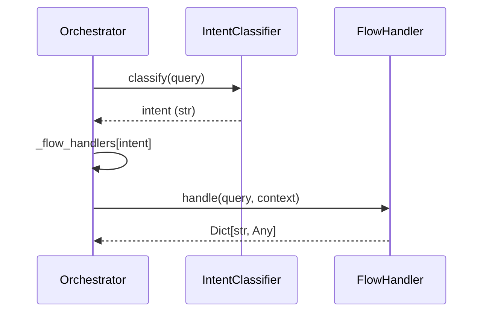
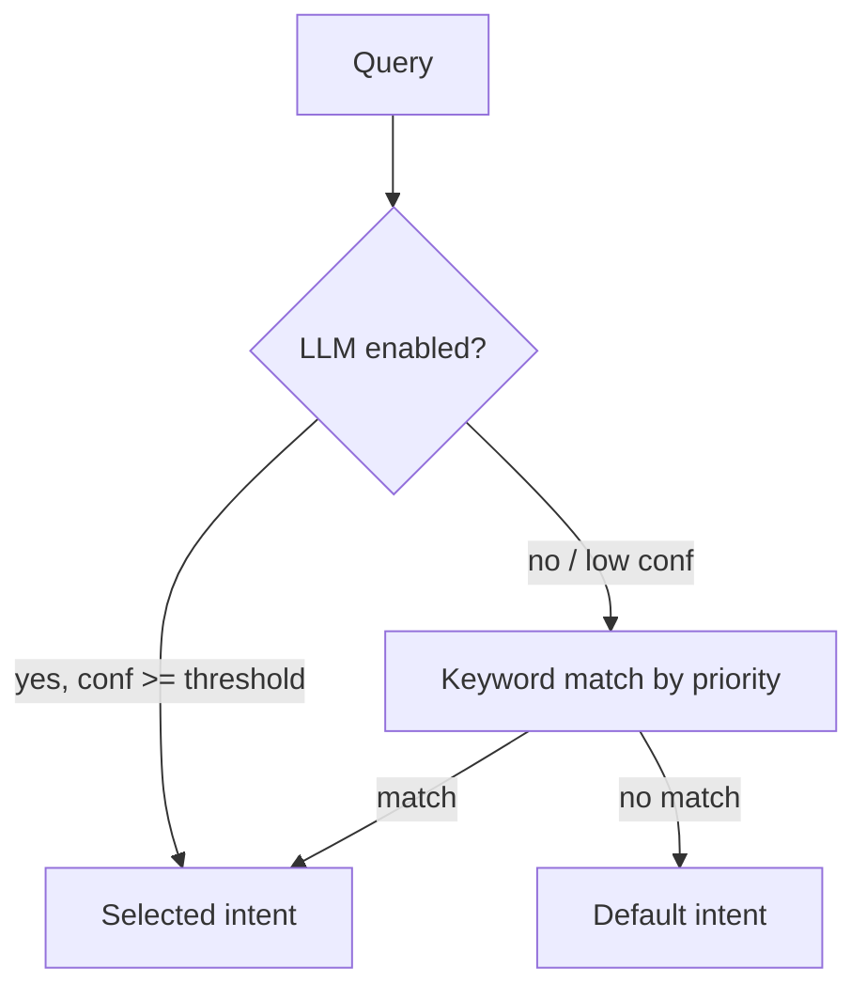

The `core/orchestration` module manages request routing to appropriate plugins.

## Module Structure

```text
core/orchestration/
├── __init__.py              # Public exports
├── orchestrator.py          # Main Orchestrator (mixin-composed)
├── intent_classifier.py     # IntentClassifier + ClassificationResult
├── router.py                # Router (semantic agent routing)
├── protocols.py             # FlowHandler / StreamHandler / *Protocol
├── limits.py                # LoopBudget / LoopLimits guardrails
├── enforcement.py           # enforce_iteration / enforce_tool_invocation chokepoint
├── hooks.py                 # ToolHookRegistry — deterministic pre/post tool hooks
├── rate_limit.py            # ToolRateLimiter — sliding-window burst limit
├── contract.py              # AgentContract / ContractValidator
├── autonomy.py              # AutonomyPolicy / AutonomyUpgradeGate
├── task_classifier.py       # TaskClassifier (agentic vs deterministic)
├── adaptive.py              # AdaptiveController — fast/slow (SwiftSage) path routing
├── parallel.py              # ParallelToolExecutor — LLMCompiler-style concurrent tool calls
├── budget_context.py        # ContextVar-based ambient LoopBudget
├── checkpoint.py            # Durable checkpoint model + CheckpointStore contract + manager
├── checkpoint_memory.py     # InMemoryCheckpointStore (re-exported by checkpoint.py)
├── checkpoint_postgres.py   # Postgres-backed CheckpointStore
├── checkpoint_sqlite.py     # SQLite-backed CheckpointStore (single durable file)
├── checkpoint_factory.py    # Default store resolution (enabled by default)
├── checkpoint_history.py    # Versioned snapshots: list_runs / get_state_history (time-travel)
├── recovery.py              # Crash recovery: re-enter interrupted runs via process(resume=True)
├── run_events.py            # Structured per-run_id AgentEvent stream (stream_run_events)
├── run_events_bridge.py     # Redis bridge fanning run events out across replicas
├── guard_pipeline.py        # Guardrails pipeline: input validation in, output filtering out
├── guard_groundedness.py    # Opt-in groundedness rail (BASELITH_OUTPUT_GROUNDEDNESS)
├── stream_guard.py          # Streamed-chunk guarding: holdback redaction + moderation
├── modality_router.py       # Attachment modality detection (magic bytes → MIME → extension)
├── tool_output.py           # Deterministic head/tail truncation of tool output
├── mixins/                  # intent / handlers / execution mixins
└── handlers/                # Built-in flow handlers (incl. streaming RAG twin)
```

Public exports (`from core.orchestration import ...`): `Orchestrator`,
`IntentClassifier`, `BaseFlowHandler`, `BaseStreamHandler`, the protocols
(`AgentProtocol`, `FlowHandler`, `StreamHandler`, `IntentClassifierProtocol`,
`OrchestratorProtocol`), and the efficiency modules (`ParallelToolExecutor`,
`ToolCall`, `ToolResult`, `ExecutionPlan`, `AdaptiveController`,
`ProcessingPath`, `AdaptiveConfig`).

---

## Orchestrator

The central component coordinating request processing. `Orchestrator` is
composed from `IntentMixin`, `HandlersMixin`, and `ExecutionMixin`; the public
entry points are `process()` and `process_stream()` (provided by
`ExecutionMixin`).

```python
from core.orchestration import Orchestrator

orchestrator = Orchestrator()

# Non-streaming handling — returns a result dict
result = await orchestrator.process(
    query="What's the weather in Rome?",
    context={"session_id": "user-123"},
)

# Streaming handling — async generator of string chunks
async for chunk in orchestrator.process_stream(
    query="Analyze this document",
    context={"session_id": "user-123"},
):
    print(chunk, end="")
```

`process` injects a per-request `LoopBudget` at `context["loop_budget"]` and,
when configured, a `ContractValidator` at `context["contract_validator"]` and
the `AutonomyPolicy` at `context["autonomy_policy"]` (see
[Runtime guardrails](#runtime-guardrails)).

These primitives are **enforced**, not just injected. Handlers call the
chokepoint helpers in `core/orchestration/enforcement.py`:

- `enforce_iteration(context)` — one `LoopBudget.tick()` per loop step.
- `await enforce_tool_invocation(context, tool_name, category, cost_usd=...,
  args=...)` — fail-closed order: contract capability check → autonomy
  approval → budget tool-call/cost accounting → tool burst rate limit →
  registered pre-hooks (see [Tool hooks](#tool-hooks-hookspy) and
  [Tool burst rate limit](#tool-burst-rate-limit-rate_limitpy)).

Each helper is a no-op when its primitive is absent, so they are safe to call
from any handler. `ParallelToolExecutor` enforces the same controls
internally when constructed with `loop_budget` / `contract_validator` /
`autonomy_policy`.

Every gated invocation is also recorded on the audit trail — `tool.invoke` on
success, `tool.blocked` (with the refusal reason) when any gate raises. The
record carries the tool name as `resource`, the autonomy category as
`action`, `agent_id`/`tenant_id` from the context, and the arguments only as
a SHA-256 digest of their canonical JSON (pass the optional `args` parameter
to include it) — never the raw values. Emission is best-effort and can never
break the tool path. See
[Audit Trail › What gets recorded](audit-trail.md#what-gets-recorded).

!!! note "Request-lifecycle concurrency"
    `ExecutionMixin.process` overlaps I/O at the request boundaries. The
    request-start memory reads (`recall` + `get_context_async`) run
    **concurrently**, and post-response memory writes run as a **tracked
    background task** instead of delaying the reply.

### Internal Flow


```mermaid
sequenceDiagram
    participant O as Orchestrator
    participant I as IntentClassifier
    participant H as FlowHandler

    O->>I: classify(query)
    I-->>O: intent (str)
    O->>O: _flow_handlers[intent]
    O->>H: handle(query, context)
    H-->>O: Dict[str, Any]
```

### API Reference

```python
class Orchestrator(IntentMixin, HandlersMixin, ExecutionMixin):
    def __init__(
        self,
        intent_classifier: IntentClassifier | None = None,
        plugin_registry: "PluginRegistry" | None = None,
        default_intent: str = "qa_docs",
        memory_manager: "AgentMemory" | None = None,
        human_intervention: "HumanIntervention" | None = None,
        feedback_collector: "FeedbackCollector" | None = None,
        llm_service: Any | None = None,
        loop_limits: LoopLimits | None = None,
        agent_contract: AgentContract | None = None,
        autonomy_policy: AutonomyPolicy | None = None,
        checkpoint_store: "CheckpointStore" | None = None,
        skill_service: "SkillService" | None = None,
    ) -> None: ...

    async def process(
        self,
        query: str,
        context: dict[str, Any] | None = None,
        intent: str | None = None,
        run_id: str | None = None,
        resume: bool = False,
    ) -> dict[str, Any]:
        """Run a query through the orchestration pipeline.

        run_id: stable id for durable checkpointing — required to ``resume``
            a prior run; auto-generated for a fresh run when a
            ``checkpoint_store`` is configured.
        resume: with ``run_id`` and a configured store, reload the prior
            checkpoint and continue — completed tool steps replay from the
            store instead of re-executing.
        """

    def process_stream(
        self,
        query: str,
        context: dict[str, Any] | None = None,
        intent: str | None = None,
    ) -> AsyncGenerator[str, None]:
        """Stream a query response as string chunks."""

    def register_handler(self, intent: str, handler) -> None:
        """Register a flow/stream handler for an intent (HandlersMixin)."""

    def get_registered_intents(self) -> list[str]: ...
    def has_stream_handler(self, intent: str) -> bool: ...
```

### Streaming pipeline

`process_stream` yields real, guarded output on every path:

- **Streaming handler registered** — chunks from the intent's `StreamHandler`
  pass through the streaming output guard
  (`core/orchestration/stream_guard.py`: holdback redaction, plus opt-in
  streaming moderation) before they reach the caller; see
  [Content guard pipeline](#content-guard-pipeline-guard_pipelinepy).
- **No streaming handler** — the query runs through the full non-streaming
  `process()` pipeline (memory, budget, checkpoint, output guard) and the
  final `response` is emitted as a single chunk: a real answer delivered late
  instead of the old `[INFO] Processing <intent>...` placeholder delivered
  never.

The default `qa_docs` intent streams out of the box. `StandardRagStreamHandler`
(`core/orchestration/handlers/rag_stream.py`) is the streaming twin of
`StandardRagHandler`, registered automatically alongside it — only when the
builtin flow handler is used; a plugin overriding `qa_docs` owns its own
streaming story. Retrieval is delegated to `StandardRagHandler.retrieve()` and
the shared prompt constants (`RAG_SYSTEM_PROMPT`, `RAG_NOT_FOUND_MESSAGE`,
`build_rag_user_prompt` in `handlers/rag.py`), so the two paths cannot drift;
generation then streams tokens via `LLMService.generate_response_stream`.

!!! note "Sources ride on the context, not the stream"
    The stream chunk protocol carries text only, so the streaming RAG handler
    exposes its citations by mutating the orchestration context —
    `context["sources"]` after retrieval — instead of returning them.

### Modality routing (`modality_router.py`)

Labels can lie — a browser's `Content-Type` is whatever the client sent, a
filename whatever the uploader chose — so
`core/orchestration/modality_router.py` detects what an attachment *actually*
is, layered by trustworthiness: **magic bytes** first (raster images, `%PDF`,
audio/video containers incl. RIFF and ISO-BMFF disambiguation), then the
declared **MIME type**, then the **filename extension**, and finally `"text"`
for anything undetectable. The PDF and audio signatures are delegated to
`core/utils/media.py` (`sniff_document_type`, `sniff_audio_type`) — the same
sniffers the vision service's
[native document/audio path](services.md#native-documents-audio) fails closed
on, so the signature knowledge lives in exactly one place.

```python
from core.orchestration import Modality, annotate_context, detect_modality

detect_modality(raw_bytes, filename="report.pdf", mime="application/pdf")
# -> "image" | "pdf" | "audio" | "video" | "text"

annotate_context(context, raw_bytes, filename=name, mime=mime)
# stamps context["modality"] and returns the detected modality
```

The router is pure and dependency-free, so any surface receiving attachments
(API upload paths, MCP tool inputs) can use it. The orchestrator wires it in
during context assembly: `annotate_modality(context)` runs in
`Orchestrator.process` **before intent classification**, deriving the hint
from `attachment_data` bytes, `attachment_mime`, `attachment_name`, or the
first `image_paths` entry (a plain `image_data` base64 payload is an image by
the vision surface's contract). Handlers can then branch on
`context["modality"]` without re-sniffing bytes. A context without attachment
material stays unannotated — plain text queries carry no `modality` key — and
an existing annotation is never overwritten.

---

## Intent Classifier

`IntentClassifier` determines which handler should manage the request. It
runs a tiered pipeline: LLM (if enabled and above the confidence threshold) →
keyword pattern match → default intent.

```python
from core.orchestration import IntentClassifier

classifier = IntentClassifier()

# classify(text) -> str
intent = await classifier.classify("Analyze market trends")
print(intent)  # e.g. "complex_reasoning"

# classify_with_confidence(text) -> ClassificationResult
result = await classifier.classify_with_confidence("Analyze market trends")
print(result.intent)          # "complex_reasoning"
print(result.confidence)      # 0.92
print(result.method)          # "llm" | "keyword" | "default"
print(result.alternatives)    # Optional[list[dict]]
```

`ClassificationResult` is a dataclass with fields `intent`, `confidence`,
`method`, and optional `alternatives`. (There is no `source` field; the
strategy that produced the result is reported via `method`.)

The LLM strategy's classification prompt is a registry-served catalog prompt
(`intent_classification`, rendered via `build_classification_prompt` with the
embedded template as fallback), so deployments can version/override it through
the prompt registry — see
[Prompt Registry › Packaged catalog prompts](prompts.md#packaged-catalog-prompts).
The swarm task-decomposition prompt
(`core/orchestration/handlers/swarm_agents.py`, `build_decomposition_prompt`)
is catalog-served the same way.

### Registering intents

Intents are registered via `register_intent`, and are also auto-loaded from
plugins through the `PluginRegistry`:

```python
classifier.register_intent(
    intent_name="weather",
    patterns=["meteo", "weather", "temperature"],
    priority=100,
    description="Weather questions",
)

print(classifier.get_available_intents())
```

### Priority Resolution


```mermaid
flowchart TD
    Query --> LLM{LLM enabled?}
    LLM --> |yes, conf >= threshold| Handler[Selected intent]
    LLM --> |no / low conf| Keywords[Keyword match by priority]
    Keywords --> |match| Handler
    Keywords --> |no match| Default[Default intent]
```

The default intent is `qa_docs` and the default confidence threshold is `0.6`.

---

## Router

`core/orchestration/router.py` provides a semantic `Router` that maps a query
to candidate agents using vector similarity. It is a separate component from
the `Orchestrator` (there is no `FlowRouter`).

```python
from core.orchestration.router import Router, RouteRequest
from core.config import get_router_config

router = Router(
    config=get_router_config(),
    llm_service=llm_service,
    vector_store=vector_store,
    embedder=embedder,
)

results = await router.route(RouteRequest(query="summarize this PDF"))
for r in results:
    print(r.agent_id, r.confidence, r.reasoning)
```

`route(request)` returns a ranked `list[RouteResult]` (`agent_id`,
`confidence`, `reasoning`, `metadata`).

---

## Flow Handler Protocol

Handlers implement the `FlowHandler` protocol. `handle` is async and returns a
`Dict[str, Any]`. Streaming is a separate `StreamHandler` protocol whose
`handle` returns an `AsyncGenerator[str, None]`.

```python
from typing import Any, AsyncGenerator
from core.orchestration.protocols import FlowHandler, StreamHandler


class MyFlowHandler:  # structural match for FlowHandler
    async def handle(self, query: str, context: dict[str, Any]) -> dict[str, Any]:
        return {"answer": f"Echo: {query}"}


class MyStreamHandler:  # structural match for StreamHandler
    async def handle(
        self, query: str, context: dict[str, Any]
    ) -> AsyncGenerator[str, None]:
        for token in query.split():
            yield token
```

Register handlers on the orchestrator:

```python
orchestrator.register_handler("my_intent", MyFlowHandler())
orchestrator.register_handler("my_intent", MyStreamHandler())
```

`register_handler` inspects the object: an object whose `handle` returns an
async generator is stored as a stream handler; otherwise it is a flow handler.

A declarative workflow graph is a first-class handler — the recommended way
to route an intent into one is `register_workflow`:

```python
orchestrator.register_workflow("report_pipeline", workflow, executor=executor)
```

Sugar over `register_handler(intent, WorkflowFlowHandler(workflow, executor))`:
the graph inherits the request's durable checkpoint (replayable nodes, HUMAN
gates through the same `/approvals` API) like any other handler — see
[Workflow Engine › Orchestrator Bridge](workflows.md#orchestrator-bridge-workflowflowhandler).

---

## Configuration

`OrchestrationConfig` uses the `ORCHESTRATOR_` env prefix.

```python
from core.config import get_orchestration_config

config = get_orchestration_config()

print(config.default_intent)        # "qa_docs"
print(config.enable_telemetry)      # False
print(config.confidence_threshold)  # 0.6
```

```env title=".env"
ORCHESTRATOR_DEFAULT_INTENT=qa_docs
ORCHESTRATOR_ENABLE_TELEMETRY=false
ORCHESTRATOR_CONFIDENCE_THRESHOLD=0.6

# Durable checkpointing / HITL — on by default (see Runtime guardrails below)
ORCHESTRATOR_CHECKPOINT_ENABLED=true
ORCHESTRATOR_CHECKPOINT_BACKEND=auto        # auto | postgres | sqlite | memory
ORCHESTRATOR_CHECKPOINT_SQLITE_PATH=data/checkpoints.db
ORCHESTRATOR_CHECKPOINT_MEMORY_MAX_ENTRIES=1000

# Burst limit on side-effecting tools — opt-in (see Runtime guardrails below)
ORCHESTRATOR_TOOL_RATE_LIMIT_ENABLED=false
ORCHESTRATOR_TOOL_RATE_LIMIT_MAX_CALLS=30
ORCHESTRATOR_TOOL_RATE_LIMIT_WINDOW_SECONDS=60
```

The semantic `Router` is configured separately via `RouterConfig`
(`ROUTER_` prefix: `score_threshold`, `max_candidates`, `retrieval_limit`),
exposed through `get_router_config()`.

---

## Runtime guardrails

The orchestrator carries three optional, request-scoped guardrails that
fire before any tool is dispatched and any LLM call leaves the process.

### Content guard pipeline (`guard_pipeline.py`)

Every `Orchestrator.process` call passes through
`core/orchestration/guard_pipeline.py` (on by default,
`BASELITH_ORCHESTRATOR_GUARDRAILS=false` to bypass): inbound queries hit
`InputGuard`'s synchronous regex validation **before any budget or LLM spend**
— a blocked query returns a structured result
(`intent="blocked_by_guardrails"`, `error=True`) instead of entering the loop
— and the final `response` text is filtered by `OutputGuard` (PII redaction,
harmful-content patterns) with redaction counts surfaced under
`result["guardrails"]`. The chat surface's binary LLM check
(`InputGuard.validate_async`) stays a chat-surface concern; the always-on
loop path is deterministic and adds microseconds.

The inbound gate is `guard_input_async` — a three-layer pipeline, cheapest
first, each layer running only on what the previous one passed:

1. **Regex** (always on, microseconds, no network) — a regex-blocked query
   never spends a moderation or taxonomy call.
2. **Content moderation** (opt-in via `BASELITH_MODERATION_PROVIDER=openai` —
   see [Guardrails › Content Moderation](guardrails.md#content-moderation));
   a flagged query returns `intent="blocked_by_moderation"`, `error=True`.
3. **LLM intent taxonomy** (opt-in via `BASELITH_INPUT_GUARD_TAXONOMY`,
   **default off** — one LLM call per request). `InputGuard.classify` labels
   the query `in_scope` / `out_of_scope` / `jailbreak` / `harmful`; the gate
   blocks `jailbreak` and `harmful` — plus `out_of_scope` when
   `GuardrailsConfig.allowed_topics` defines a topical rail — at or above
   `BASELITH_INPUT_GUARD_TAXONOMY_THRESHOLD` (default `0.8`). A block returns
   `intent="blocked_by_taxonomy"`, `error=True` and emits
   `mas_guardrail_blocks_total{layer="input_taxonomy"}`. See
   [Guardrails › Intent taxonomy](guardrails.md#intent-taxonomy-classify).

Moderator and classifier failures are **fail-open** — an outage degrades to
unguarded service, never a chat outage.

The outbound gate is `guard_output_async`, awaited by `process()` on the final
result. The synchronous `guard_output` (PII redaction, harmful-content
patterns) always applies first. The **groundedness rail** then applies when
enabled (`BASELITH_OUTPUT_GROUNDEDNESS=off` default | `annotate` | `block` —
`core/orchestration/guard_groundedness.py`): a response whose result dict
carries non-empty retrieved source material (`sources` or `context`) is
judged against it by `FaithfulnessEvaluator` — one extra LLM call per sourced
response, which is why the default is off. `annotate` surfaces
`{score, should_refine}` under `result["guardrails"]["groundedness"]`;
`block` additionally replaces a response scoring below
`BASELITH_OUTPUT_GROUNDEDNESS_THRESHOLD` (default `0.6`) with a
refusal-to-assert message, sets `groundedness["blocked"]`, and emits
`mas_guardrail_blocks_total{layer="output_groundedness"}`. Judge failures —
exceptions **and** the evaluator's own score-0 fallback verdict on an LLM
outage — are strictly fail-open: annotate nothing, log.

**Output-side moderation** of the final response is a further opt-in on top
of the provider gate — `BASELITH_MODERATION_OUTPUT=true` — because it spends
**one extra moderation call per response**. A flagged response is replaced
wholesale with `"Response blocked by content moderation."` and the verdict
surfaced under `result["guardrails"]["moderation"]` (`blocked`, `provider`,
`categories`). Same fail-open posture as the input gate.

`Orchestrator.process_stream` applies the same inbound gate (regex + optional
moderation) before intent classification — a blocked query yields a single
blocked chunk and terminates. On the way out, every stream handler is wrapped in
`guard_stream` (`core/orchestration/stream_guard.py`): the same `OutputGuard`
(PII redaction, harmful-content patterns, cumulative output-length cap)
applied on the wire, chunk by chunk, with a **holdback window**
(`DEFAULT_HOLDBACK = 128` characters). Text is emitted only once it is at
least one window behind the live edge, so a pattern split across chunk
boundaries is fully buffered before its text is released — the exact case a
naive per-chunk filter cannot catch. The retained tail is already-filtered
text, and re-filtering it with the next chunk is idempotent (redaction
placeholders never re-match their own pattern), so no span is redacted twice
or emitted unredacted. Two trade-offs, by design: time-to-first-byte grows by
one window, and chunk boundaries may shift relative to the handler's output
(the concatenated stream equals the filtered text). The
`BASELITH_ORCHESTRATOR_GUARDRAILS` kill switch bypasses the streaming guard
together with the rest of the pipeline.

With `BASELITH_MODERATION_OUTPUT=true` (and a moderation provider configured),
`process_stream` composes `moderate_stream(guard_stream(...))`: the
**accumulated** text is re-moderated every `MODERATION_CHECK_INTERVAL = 512`
newly buffered characters, **before** the chunk that crossed the boundary is
emitted. A flagged stream stops with the abort marker
`\n[Response blocked by content moderation]` — the flagging chunk and
everything after it are never delivered, but text already emitted **cannot be
recalled**; that is inherent to streaming, and the reason output moderation
is a deliberate opt-in rather than a default. The interval bounds
moderation-API spend on long answers, and a short answer that never crosses
it spends **zero** mid-stream calls. Moderator failures are fail-open, same
as everywhere else in the pipeline.

### `LoopBudget` — iteration, cost + token cap

`core/orchestration/limits.py` enforces hard caps so a runaway loop
cannot burn budget. A fresh `LoopBudget` is instantiated per request
by `ExecutionMixin.process` and exposed as `context["loop_budget"]`.

| Symbol | Purpose |
|--------|---------|
| `LoopLimits` | Static caps (`max_iterations`, `max_tool_calls`, `budget_usd`, `max_tokens`, `max_seconds`) |
| `LoopBudget` | Mutable per-request tracker: `tick()`, `record_tool_call()`, `charge(cost)`, `record_tokens(n)`, `record_context_tokens(n)`, `token_pressure()`, `context_share()`, `elapsed_seconds()`, `remaining_seconds()`, `check_deadline()` |
| `LoopBudgetSnapshot` | Immutable snapshot returned by `snapshot()` (includes `tokens`, `context_tokens` and `elapsed_seconds`) |
| `BudgetExceededError` | Raised when any cap is breached (`reason` ∈ `max_iterations` / `max_tool_calls` / `budget_usd` / `max_tokens` / `max_seconds`) |

Defaults: 25 iterations, 50 tool calls, USD 0.50, **no token cap**
(`max_tokens=None` — a token budget is model/context-window specific, so opt in
explicitly), **no wall-clock deadline** (`max_seconds=None`). When a deadline is
set, `tick()` re-checks it each iteration and `remaining_seconds()` (clamped at
0) can be passed directly as the timeout for the next tool or LLM call so a
single slow call cannot outlive the request. `ParallelToolExecutor` applies
that clamp automatically: constructed with a `loop_budget`, it caps each
per-call timeout (`ToolCall.timeout_seconds`, else the executor default) at
`remaining_seconds()`, so a parallel tool cannot outlive the request's
`max_seconds` deadline — matching the sequential ReAct tool path, which
already clamped the same way. Override at construction:

```python
from core.orchestration import Orchestrator
from core.orchestration.limits import LoopLimits

orchestrator = Orchestrator(
    loop_limits=LoopLimits(
        max_iterations=10,
        max_tool_calls=20,
        budget_usd=0.10,
        max_tokens=200_000,   # cumulative input+output tokens for the request
    ),
)
```

Handlers downstream call the budget directly:

```python
budget = context["loop_budget"]
budget.tick()                          # before each agentic step
budget.record_tool_call()              # before every tool dispatch
budget.charge(0.0008)                  # after each LLM completion
```

**Tokens are charged automatically.** `charge_llm_cost` (called ambiently from
`LLMService`) records every call's input+output tokens against the budget for
**all** models — including self-hosted/unpriced ones absent from the pricing
table — so `max_tokens` is enforced even where `budget_usd` can't be. Token
counting uses the tiered tokenizer in `core/utils/tokens` (tiktoken when
installed, a content-aware heuristic otherwise), the same counter memory context
assembly (`HierarchicalMemory.get_context`) now budgets by — replacing the old
character-length heuristic.

**Compaction on token pressure.** `budget.token_pressure()` returns the fraction
of the token cap consumed (`0.0` when no cap). Poll it to compact context
*before* the hard cap aborts the request:

```python
if budget.token_pressure() > 0.8:
    context["recent_history"] = memory_manager.get_context(max_tokens=1000)
```

**Where the budget went: recall vs reasoning.** `context_tokens` records the
size of the context block assembled for the request — recalled memories plus
recent history — and `context_share()` reports it as a fraction of the tokens
the request actually spent. `inject_memory_context` records it automatically;
the value rides on every `LoopBudgetSnapshot`, so it reaches callers in the
reply's `budget` field with no extra wiring.

```python
snap = budget.snapshot()
snap.context_tokens      # e.g. 640 — tokens of injected memory context
budget.context_share()   # e.g. 0.21 — a fifth of the request went to recall
```

This is **measurement, not accounting**: `record_context_tokens` deliberately
does not charge `tokens` or `max_tokens`. The injected block travels inside the
prompt of the LLM calls that `record_tokens` already counts, so charging it
again would double-bill and could abort a request that never exceeded its real
budget. Two consequences worth knowing before you tune on the number:

- The block is measured **once** but re-sent in **every** iteration's prompt,
  so on a multi-step run its true cost is higher than `context_tokens`;
  `context_share()` clamps at `1.0` rather than reporting a ratio above one.
- A share that is persistently high with flat answer quality means the budget
  is going to static recall that the model is not using — tighten
  `similarity_threshold` on `recall`, or lower the `_CONTEXT_TOKENS` allowance.
  A share near zero on knowledge-heavy traffic means the opposite.

A breach raises `BudgetExceededError`, which `ExecutionMixin` catches
and converts into a structured failure reply with `budget_exceeded` and
a snapshot of the state at the breach.

#### Ambient budget & enforced USD cost

`core/orchestration/budget_context.py` publishes the per-request `LoopBudget`
as a `ContextVar`. `ExecutionMixin.process` binds it at request start, so code
far from the handler — notably `LLMService` — can charge against it without
threading the budget through every call. After each generation `LLMService`
charges the call's **real USD cost** (via `core/models/pricing`), which makes
`LoopLimits.budget_usd` an **enforced** cap rather than advisory. Models absent
from the pricing table are not charged, so self-hosted models never abort a
request on an unknown price.

### Durable checkpointing & resume

A crash mid-request otherwise loses the entire run and re-runs side effects on
retry. `core/orchestration/checkpoint.py` adds a durable checkpoint (wired on
by default in the app — see
[below](#on-by-default-orchestrator_checkpoint_enabled-and-the-approvals-api)): a
JSON-serializable snapshot of run state (query, intent, budget, trajectory,
per-step results) persisted to a pluggable `CheckpointStore`, plus a
`CheckpointManager` that makes each tool step idempotent via deterministic
replay (modelled on LangGraph's checkpointer / Temporal's event history).

Wire a store into the orchestrator; `process()` then persists run state and
supports `resume`:

```python
from core.orchestration import InMemoryCheckpointStore, Orchestrator
from core.orchestration.checkpoint_postgres import PostgresCheckpointStore

store = PostgresCheckpointStore()      # durable across restarts
await store.initialize()               # idempotent CREATE TABLE IF NOT EXISTS
orch = Orchestrator(checkpoint_store=store)

# Fresh run — persists a checkpoint under run_id.
await orch.process("analyze X", run_id="run-42")

# After a crash: resume. Completed steps replay from the store; budget
# counters continue from the snapshot instead of resetting.
await orch.process("analyze X", run_id="run-42", resume=True)
```

!!! info "Who creates the table"
    `initialize()` skips its DDL when `DB_RUNTIME_DDL` is off — the
    production default, where
    [migration 007](db.md#who-creates-the-schema) owns the
    schema and the runtime role holds no DDL rights. The call stays safe
    either way: with the gate off the table is expected to exist already.

Handlers make their tool steps durable via the manager on the context:

```python
async def handle(self, query, context):
    checkpoint = context["checkpoint"]          # None when no store configured

    async def do_search():
        return await search_tool(query)          # the real (side-effecting) call

    # Executes once and records the result; on resume returns the stored
    # result WITHOUT re-executing — no duplicated side effect.
    hits = await checkpoint.run_step("search", {"q": query}, do_search)
    ...
```

| Component | Role |
|-----------|------|
| `Checkpoint` | JSON-serializable run snapshot (`to_dict`/`from_dict`) |
| `CheckpointStore` | Protocol: `save` / `load` / `delete` / `list_resumable` |
| `InMemoryCheckpointStore` | In-process store for single-process use and tests (`checkpoint_memory`); copies state in and out; optional `max_entries` retained-run bound (`None` = unbounded, the constructor default) |
| `PostgresCheckpointStore` | Durable `agent_checkpoints` (JSONB) backend |
| `SQLiteCheckpointStore` | Durable single-file backend (`checkpoint_sqlite`) — stdlib `sqlite3`, WAL journal, blocking statements hopped off the event loop via `run_in_executor` |
| `CheckpointManager` | Per-request façade: idempotent `run_step`, `complete`, `fail` |

`ReActAgent` applies `run_step` automatically: with a checkpoint attached
(orchestrated runs pass it via `context["checkpoint"]`), every tool invocation
of both ReAct loops records its observation durably and replays it on resume —
see [Reasoning › Durable tool execution](reasoning.md#durable-tool-execution-checkpoint-replay).

The idempotency key is `(replay-cursor, tool-name, args-hash)`, so a divergent
replay (different tool/args at the same position) executes fresh rather than
reusing a stale result. A bare `Orchestrator()` constructed without a store
runs without checkpointing — `context["checkpoint"]` is absent and the loop
stays in-memory — but the app wiring resolves a store **by default** (see
[below](#on-by-default-orchestrator_checkpoint_enabled-and-the-approvals-api)).
`list_resumable(tenant_id, *, limit=None)` surfaces `running` **and**
`awaiting_approval` runs (crash recovery + paused approvals). The listing is
**always bounded** — `limit=None` means `DEFAULT_RESUMABLE_LIMIT` (500, clamped
to `MAX_RESUMABLE_LIMIT` = 5000), never "everything": a crash that left tens of
thousands of runs `running` must not stream the whole table into one list at
startup. The Postgres backend orders `running` rows first and then oldest
first, because pending approvals can stay resumable indefinitely and would
otherwise fill every page and starve crash recovery.

**How the in-memory store copies state.** `InMemoryCheckpointStore` copies
state on every `save`, `save_step` and `load`, so a caller holding a returned
`Checkpoint` cannot mutate what the store kept. The copy is
`_copy_json_shaped`: a walk over `dict` (with `str` keys), `list` and the
immutable JSON atoms that hands **every** other value — `tuple`, `set`,
`bytes`, `datetime`, `UUID`, `Enum`, non-`str` dict keys, `dict`/`list`
subclasses, custom objects — straight to `copy.deepcopy`. The result is
value- and type-identical to a plain `deepcopy` at ~3.8x the speed (a 100-step
run spends 10 ms copying instead of 38 ms), and `_copy_state` catches
`RecursionError` to fall back on a whole-payload `deepcopy` for
self-referential state.

A JSON round-trip (`orjson.loads(orjson.dumps(state))`) would be faster still
and is deliberately **not** used: it *silently* rewrites `tuple` to `list`,
`datetime`/`UUID` to `str`, `NaN`/`Infinity` to `null` and `str`/`int` `Enum`
members to plain scalars, raising only on `set`, `bytes` and non-`str` keys —
so even a `try`/`except TypeError` would corrupt the first group without
noticing. `PostgresCheckpointStore` tolerates that coercion because JSONB
imposes it anyway; the in-memory store is the **default backend whenever
Postgres is not configured** (`ORCHESTRATOR_CHECKPOINT_BACKEND=auto`), not just
a test double, so it must hand back the objects it was given.

#### Listing runs for an operator surface (`list_runs`)

`list_resumable` answers *what must crash recovery pick up* — deliberately
narrow. A dashboard or audit surface needs the other question: *what has this
deployment run lately*, completed and failed runs included. That is
`list_runs`:

```python
from core.orchestration import list_runs

rows = await list_runs(store, tenant_id="acme", status=None, limit=50)
# [{"run_id": ..., "query": ..., "status": "completed", "step": 4,
#   "version": 7, "trajectory_length": 12, "awaiting_approval": False,
#   "created_at": ..., "updated_at": ...}, ...]
```

Summaries deliberately omit the heavy fields (`trajectory`, `steps`,
`plugin_data`, `answer`) so a list stays cheap to serve; load the run to get
them. Both shipped stores implement it natively (Postgres orders by
`updated_at` and filters server-side); a store without the method degrades to
its resumable ids loaded individually, so protocol-only stores still answer.
An unset `tenant_id` on a row is treated as the `default` tenant, matching the
Postgres column default, so both backends filter identically.

### Durable human-in-the-loop approvals (pause → decide → resume)

With a checkpoint store configured, the autonomy approval gate
(`enforce_approval`, reached through `enforce_tool_invocation`) becomes
**durable** instead of failing terminally when no synchronous approval
channel exists:

1. **Pause** — a tool whose category requires approval, with no
   `human_intervention` channel available, persists the checkpoint as
   `awaiting_approval` (with the pending tool/category) and raises
   `ApprovalPendingError`. The orchestrator surfaces it as a non-error
   response: `{"awaiting_approval": true, "run_id": ..., "pending_approval":
   {...}}` — the run survives process restarts.
2. **Decide** — an operator (or approval UI) records the reviewer's verdict:

    ```python
    from core.orchestration import record_approval_decision

    await record_approval_decision(store, "run-42", True, approver="giovanni")
    ```

3. **Resume** — `process(run_id="run-42", resume=True)` re-enters the loop;
   completed steps replay, the gate consumes the recorded decision and the
   run continues (approved) or aborts with a terminal
   `ApprovalRequiredError` (denied).

A synchronous `human_intervention` channel, when present, still takes
precedence (the classic blocking `request_approval` flow); the durable path
engages only where that channel is absent. The parallel tool executor keeps
its terminal-denial semantics (pausing mid-batch is not supported).

Workflow graphs plug into the exact same contract:
[`HUMAN` gate nodes](workflows.md#human-approval-gates-human-nodes) persist
`awaiting_approval` and raise `ApprovalPendingError` through the executor and
the flow-handler bridge, so one `/approvals` surface reviews both ReAct tool
calls and graph gates.

#### On by default: `ORCHESTRATOR_CHECKPOINT_ENABLED` and the `/approvals` API

`ORCHESTRATOR_CHECKPOINT_ENABLED` defaults to `True`, so the whole flow is
active end-to-end in a stock deployment — durable runs, durable HITL pause,
and the `/approvals` API. Set it to `false` to run without checkpointing:

- `core/orchestration/checkpoint_factory.py` resolves a process-wide store —
  `ORCHESTRATOR_CHECKPOINT_BACKEND` picks `postgres`, `sqlite`, `memory`, or
  `auto` (the default: postgres when Postgres storage is enabled, else
  memory). The app lifespan runs the store's idempotent schema init at
  startup.
- The **`sqlite` backend** fills the gap between the other two: `memory`
  loses every run on restart and `postgres` needs a running server.
  `SQLiteCheckpointStore` gives development laptops, air-gapped deployments
  and single-node installs crash-durable resume from a single file
  (`ORCHESTRATOR_CHECKPOINT_SQLITE_PATH`, default `data/checkpoints.db`;
  parent directories are created on first use). It implements the full store
  surface — `save_step`, `list_runs`, `list_resumable`, and the history
  snapshots behind `ORCHESTRATOR_CHECKPOINT_HISTORY_ENABLED` — so durable
  approvals, `/runs` history and time-travel forks all work without
  Postgres.
- The memory backend is **bounded**: the factory passes
  `ORCHESTRATOR_CHECKPOINT_MEMORY_MAX_ENTRIES` (default `1000`) as the store's
  retained-run cap, so a long-lived process cannot leak one entry per run.
  Beyond the cap the oldest *finished* (non-resumable) run is evicted first;
  only when every retained run is still resumable does the hard cap evict the
  oldest resumable one.
- `ChatService` builds its `Orchestrator` with this store, so every chat run
  checkpoints durably and approval gates pause instead of failing.
- The `api_routers` plugin mounts the operator-facing **`/approvals` API**
  (admin Basic Auth):
    - `GET /approvals` — runs paused `awaiting_approval` (tool, category,
      query, tenant).
    - `POST /approvals/{run_id}/decision` — record
      `{"approved": true|false, "approver": ..., "reason": ...}`.
    - `POST /approvals/{run_id}/resume` — re-enter the loop; the gate
      consumes the recorded decision and the run continues or aborts.

#### Crash recovery (`ORCHESTRATOR_CHECKPOINT_RESUME_ON_STARTUP`)

With checkpointing on, `core/orchestration/recovery.py` closes the always-on
loop: `resume_interrupted_runs` consumes `list_resumable()` and re-enters
runs left in the `running` state by a crash/restart (completed tool steps
replay from the store, so recovery is idempotent). Runs paused
`awaiting_approval` are never auto-resumed — they wait for the `/approvals`
API. Set `ORCHESTRATOR_CHECKPOINT_RESUME_ON_STARTUP=true` to run one sweep
as a background task at app startup (default off).

**One sweep per fleet, not per worker.** With `WEB_CONCURRENCY > 1` (or
multiple replicas) every worker runs the startup sweep, and an unguarded sweep
re-entered the same interrupted runs once per worker — duplicate agent
executions and duplicate LLM spend. `resume_interrupted_runs` therefore takes
a keyword-only `lock` (anything `DistributedLock`-compatible:
`acquire(blocking=False)` / `release()`): a worker that loses the non-blocking
race skips the sweep entirely and returns an empty report, while an
acquisition *error* fails **open** — the sweep still runs, because recovery
matters more than exclusion and the worst case is the old duplicate sweep. The
startup wiring in `core/api/_recovery_startup.py` (extracted from the app
lifespan) passes the Redis-backed `DistributedLock` named
`checkpoint_recovery_sweep` (TTL 60 s, `auto_renew=True` — resumed runs
re-enter full agent loops, so a sweep can legitimately hold the lock for
minutes, while a crashed holder frees it within one TTL) whenever the cache
backend is Redis (`CACHE_BACKEND=redis` with a `CACHE_REDIS_URL`); without
Redis the sweep runs unguarded, which is safe for a single process.

Two bounds compose on that startup path, and both matter after a bad crash:
the store returns at most one page (`DEFAULT_RESUMABLE_LIMIT`, 500) so the
query cannot become a full-table read at boot, and each sweep then re-enters at
most `max_runs` (default 20) of that page so a backlog drains gradually instead
of hammering providers. Resumed runs leave the resumable set as they finish, so
later sweeps advance through the page. `resume_interrupted_runs` deliberately
calls `list_resumable(tenant_id)` without an explicit `limit`, so third-party
stores written against the older signature keep working.

**Incremental step persistence.** Stores may expose an optional
`save_step(checkpoint, key, entry, trajectory_entry)` fast-path;
`CheckpointManager.run_step` uses it when present and falls back to the full
`save()` otherwise. Both shipped stores implement it.
`PostgresCheckpointStore` uses `jsonb_set`, patching only the new step (plus
the scalar bookkeeping fields) into the JSONB row — cumulative bytes written
over an n-step run drop from O(n²) to O(n), and a `load()` after incremental
writes is identical to one after full saves (see
[Runtime tuning](../advanced/runtime-tuning.md#checkpoint-serialization)).
`InMemoryCheckpointStore` does the same in-process: only the new step entry
and trajectory line are copied into the stored state (version/`updated_at`
bookkeeping in lock-step with `save`), so cumulative copy work drops from
O(n²) to O(n) over a run; history snapshots are still appended when enabled,
and a run not yet in the store falls back to a full `save`.

#### Stale-run sweep (`sweep_stale_runs`)

Resume handles runs a crash left behind; `sweep_stale_runs` (also in
`core/orchestration/recovery.py`) handles the other failure mode — a process
that is still *alive* but wedged. A liveness probe answers HTTP while an agent
loop hangs on a dead connection; the checkpoint knows better. A run's last
progress is the **newer** of its `updated_at` (bumped on every step save) and
the per-attempt loop heartbeat `plugin_data["loop_last_progress_at"]` (written
by the [loop flow handler](loops.md) at the start of each attempt). A
`running` run whose last progress is older than `max_age_seconds` is marked
`failed` with an explanatory error
(`stale: no progress for <n>s (threshold <t>s)`), so operators see a wedge
instead of an eternally "running" ghost. Runs `awaiting_approval` are **never**
swept — they are waiting on a human, not stuck.

```python
from core.orchestration.recovery import sweep_stale_runs

report = await sweep_stale_runs(
    store,                      # the shared CheckpointStore
    max_age_seconds=1800.0,     # progress-silence threshold
    tenant_id=None,             # optional tenant scope
    max_runs=50,                # bound per sweep (default 50)
)
# report.stale   -> list of run ids just marked failed
# report.checked -> how many running runs were examined
```

Run it from a periodic task (cron, task queue) — it is idempotent and bounded,
and the `now=` keyword accepts a clock override for tests.

### State history & time-travel (`ORCHESTRATOR_CHECKPOINT_HISTORY_ENABLED`)

The base flow keeps exactly **one live row per run** — enough to resume, but
the past is overwritten on every save. With
`ORCHESTRATOR_CHECKPOINT_HISTORY_ENABLED=true` (requires
`ORCHESTRATOR_CHECKPOINT_ENABLED`), both stores additionally append an
**immutable snapshot at every version**, and
`core/orchestration/checkpoint_history.py` turns them into LangGraph-style
time-travel primitives:

```python
from core.orchestration import fork_run, get_state, get_state_history

history = await get_state_history(store, "run-42")
# [{"version": 1, "status": "running", "step": 0, "updated_at": ...}, ...]

past = await get_state(store, "run-42", version=3)   # full Checkpoint at v3

# Rewind = fork at an earlier version: the fork keeps the steps recorded up
# to v3, starts `running`, and resuming it replays those steps (no side
# effects re-executed) then diverges live after the fork point.
fork = await fork_run(store, "run-42", version=3, new_run_id="run-42-alt")
await orch.process(fork.query, run_id="run-42-alt", resume=True)
```

Snapshot support is duck-typed like `save_step` (optional
`list_snapshots` / `load_snapshot` store methods): the helpers degrade to
"no history" against protocol-only stores instead of failing. In Postgres,
snapshots live in `agent_checkpoint_history` keyed `(run_id, version)`; the
`save_step` fast-path snapshots the just-patched live row **server-side**
(`INSERT ... SELECT`), so no full payload crosses the wire and the O(n) write
property is preserved. `ORCHESTRATOR_CHECKPOINT_HISTORY_LIMIT` (default 200,
0 = unlimited) caps retained snapshots per run, newest kept.

The `api_routers` plugin mounts the operator-facing **`/runs` API** alongside
`/approvals` (admin Basic Auth):

- `GET /runs/{run_id}/history` — version-ascending snapshot summaries.
- `GET /runs/{run_id}/history/{version}` — full state at that version.
- `POST /runs/{run_id}/fork` — `{"version": N, "new_run_id": ...?}` → fork
  the run from that state; resume it via the orchestrator or
  `POST /approvals/{run_id}/resume`.
- `GET /runs/{run_id}/events` — SSE stream of the run's structured events
  (see below).

### Structured run-event streaming (astream-events equivalent)

Token streaming tells a client what the agent is *saying*; the structured
event stream tells it what the agent is *doing*. `core/orchestration/run_events.py`
fans out `AgentEvent`s (`core/api/events.py`) per `run_id`: `run_started`,
`tool_call` / `tool_result` (emitted by `CheckpointManager.run_step`,
including replays flagged `replayed: true`), `final`, `error`, and `human`
(durable approval pause). Publishing with zero subscribers is a no-op, so the
loop pays nothing when nobody listens.

Library-level consumption — run a query and iterate its events:

```python
from core.orchestration import stream_run_events

async for event in stream_run_events(orchestrator, "analyze X"):
    print(event.type, event.data)        # run_started → tool_call → ... → final
```

Lifecycle events flow whenever the run is addressable by id — a checkpoint
store is **not** required (without one you get `run_started` + `final`/`error`;
tool-step events come from `run_step`, i.e. with checkpointing on). Over HTTP,
`GET /runs/{run_id}/events` serves the same stream as SSE frames
(`event: <type>` / `data: <AgentEvent JSON>`) and closes after a terminal
event. Subscribe before starting/resuming the run: events are fan-out only,
never replayed — the checkpoint trajectory remains the durable record.

The consumer's lifetime bounds the run. If the iterator stops **before** a
terminal event — the SSE client disconnected, or the generator was
`aclose()`d — `stream_run_events` **cancels** the underlying run task instead
of silently blocking until the abandoned run finishes (and keeps spending
its budget). After a terminal event the task is simply awaited to completion,
as before; a cancellation of the consuming generator itself still propagates.

Payload safety: tool events carry names/category/cursor, never tool arguments
or results.

#### Cross-replica delivery: the Redis bridge

Local fan-out is per-process (asyncio queues), which breaks down behind the
default 2+-replica HPA: `GET /runs/{run_id}/events` only saw events when the
SSE connection happened to land on the replica executing the run. Setting
`BASELITH_RUN_EVENTS_BRIDGE=redis` (documented in `.env.example`; read by the
app lifespan at startup) starts `RedisRunEventsBridge`
(`core/orchestration/run_events_bridge.py`), which closes the gap:

- **Publish** — the bridge installs itself as the stream's broadcaster
  (`set_run_event_broadcaster` in `core.orchestration.run_events`); every
  `publish_run_event` is serialized and published to the Redis channel
  `events:run:<run_id>` as a fire-and-forget task off the running loop.
- **Listen** — one pattern subscription per process re-injects every received
  event into the local stream, **including on the publishing replica**: one
  Redis round trip of latency buys symmetry with no dedup machinery, and any
  replica can serve any run's SSE feed.
- **Fail-open at both ends** — a broadcaster error falls back to local
  fan-out; a failed Redis publish re-injects the event locally so this
  replica's subscribers still see it; the listener reconnects with a 2 s
  backoff; and a bridge that fails to start degrades the deployment to
  per-process fan-out with a warning. Events remain transient either way —
  the checkpoint trajectory is the durable record.

Without the flag (the default), fan-out stays per-process — correct for a
single replica, and zero Redis traffic.

### `AgentContract` — declarative spec

`core/orchestration/contract.py` loads a YAML file describing the
agent's identity, allowed/forbidden tools, output contract, and quality
gates. When a contract is wired into the orchestrator, the runtime
`ContractValidator` is exposed at `context["contract_validator"]`.

```yaml
# agent.yaml
name: example-agent
version: 1.0.0
identity: research assistant for internal teams
capabilities:
  allowed_tools: [search, read, summarize]
  must_not: [delete, rm_rf, transfer_funds]
output_contract:
  format: json
  required_fields: [answer, sources]
  schema_ref: output.schema.json   # optional: full JSON-Schema validation
quality_gates:
  min_eval_pass_rate: 0.92
  max_cost_usd: 0.10
```

```python
from core.orchestration import Orchestrator
from core.orchestration.contract import load_contract

contract = load_contract("agent.yaml")
orchestrator = Orchestrator(agent_contract=contract)
```

Handlers gate tool dispatch with `validator.check_tool_call(name)` and
output shape with `validator.check_output(payload)`. Both raise
`ContractViolationError` on failure.

`check_output` enforces the **full JSON Schema** when the contract carries
one — inline via `output_contract.json_schema`, or `schema_ref` (a JSON/YAML
schema file resolved relative to the contract file by `load_contract`,
fail-closed when missing or invalid). Type, range, enum and nesting
violations are caught, not just missing keys; the schema is compiled once at
validator construction.

### `AutonomyPolicy` — three-tier spectrum

`core/orchestration/autonomy.py` provides a coarse-grained policy that
governs which tool categories require human approval.

| Level | Read-only | Mutating | Destructive | External side-effect | Self-modify |
|-------|-----------|----------|-------------|----------------------|-------------|
| `SUPERVISED` | auto | approval | approval | approval | approval |
| `SEMI_AUTONOMOUS` | auto | auto | approval | approval | approval |
| `FULLY_AUTONOMOUS` | auto | auto | auto | auto | auto |

The `self_modify` category (`SELF_MODIFY` in `autonomy.py`) covers anything
that changes the system's **own future behavior** — skill synthesis and
automated prompt tuning route their apply step through it, so below
`FULLY_AUTONOMOUS` a self-modification needs a human even after passing its
eval gate. See
[Skill Evolution › Governed self-modification](skill-evolution.md#governed-self-modification)
and [Optimization › Eval gate on auto-tune](optimization.md#eval-gate-on-auto-tune-baselith_optimizer_eval_gate).

`AutonomyUpgradeGate` decides whether an operator may advance the
deployment to the next level. Upgrade is blocked until evaluation pass
rate, red-team pass rate, and successful-run count all clear their
thresholds (default 0.90 → 0.98).

```python
from core.orchestration.autonomy import (
    AutonomyLevel, AutonomyPolicy, AutonomyUpgradeGate,
)

policy = AutonomyPolicy(level=AutonomyLevel.SEMI_AUTONOMOUS)
orchestrator = Orchestrator(autonomy_policy=policy)

gate = AutonomyUpgradeGate(
    eval_pass_rate=0.97,
    red_team_pass_rate=1.0,
    successful_runs=120,
)
allowed, reasons = gate.can_upgrade_to(AutonomyLevel.FULLY_AUTONOMOUS)
```

#### Enforcing the policy: `enforce_approval`

The matrix above is enforced (not just declared) via
`enforce_approval(policy, category, tool_name, human_intervention=None)`,
exported from `core.orchestration`. Semantics are **fail-closed**: when the
category requires approval at the active level, a missing approval channel or
a human denial raises `ApprovalRequiredError` (a `PermissionError` subclass)
instead of letting the tool run.

```python
from core.orchestration import ApprovalRequiredError, enforce_approval

try:
    await enforce_approval(
        policy, "mutating", "write_file",
        human_intervention=context.get("human_intervention"),
    )
except ApprovalRequiredError as e:
    return {"error": str(e)}
result = await tool(**args)
```

Two core choke points apply the gate automatically:

- **MCP server** — construct with `MCPServer(autonomy_policy=policy)`:
  `tools/call` requests whose tool `category` requires approval are rejected
  (MCP transports have no human channel). See
  [MCP](mcp.md#autonomy-approval-gate).
- **ParallelToolExecutor** — construct with
  `ParallelToolExecutor(autonomy_policy=policy, human_intervention=channel)`
  and declare categories at registration
  (`executor.register_tool("write_file", fn, category="mutating")`): gated
  calls go through the human channel, or fail closed without one, returning a
  failed `ToolResult` (status `SKIPPED`) before any side effect.

!!! note "Gates run outside the concurrency semaphore"
    In `ParallelToolExecutor._execute_single` the four pre-checks — registration
    lookup, contract, autonomy approval, and budget — run **before** the
    `max_parallel` semaphore is acquired; only the actual tool execution holds a
    slot. This matters in `SUPERVISED` mode: `enforce_approval` can block waiting
    on a human decision, so if it held a concurrency slot, `max_parallel` pending
    approvals would stall every other tool call of the request — a practical
    deadlock. Keeping the gate outside the slot means an awaiting-approval call
    never starves the rest of the batch.

!!! warning "Fail-closed defaults (breaking change in 0.27)"
    `ReActAgent`, `ParallelToolExecutor`, and `MCPServer` constructed
    **without** an `autonomy_policy` now default to
    `AutonomyPolicy()` — `SUPERVISED` — instead of running ungated, and an
    undeclared tool `category` defaults to `destructive` instead of
    `read_only` (`ToolDefinition`, `MCPTool`, `register_tool`, the plugin
    bridge). Consequence: undeclared tools are gated by default. Declare
    `category="read_only"` on side-effect-free tools, and pass an explicit
    `AutonomyPolicy(level=AutonomyLevel.FULLY_AUTONOMOUS)` (or raise
    `MCP_AUTONOMY_LEVEL`) where headless side-effect execution is
    intentional.

### Tool hooks (`hooks.py`)

Prompts can only *suggest* side-effect policy ("always log writes", "lint
after editing"); `ToolHookRegistry` enforces it deterministically. Operators
register async callables matched by tool name (fnmatch glob) in two phases
with asymmetric semantics — by design:

- **`pre`** hooks run inside `enforce_tool_invocation`, after every built-in
  gate has passed, and **may veto**: an exception raised by a pre-hook
  propagates and blocks the invocation (fail-closed) — that is how a policy
  hook says no.
- **`post`** hooks are dispatched by the executors after an observation is
  produced and are **observers**: exceptions are logged and swallowed, so a
  broken audit/lint hook can never break the agent loop.

```python
from core.orchestration.hooks import ToolHookEvent, get_tool_hook_registry

async def forbid_demo_writes(event: ToolHookEvent) -> None:
    if event.tenant_id == "prod-demo":
        raise PermissionError(f"{event.tool_name} is frozen for this tenant")

registry = get_tool_hook_registry()          # process-wide default registry
registry.register("pre", "db_*", forbid_demo_writes)
```

`ToolHookEvent` carries `tool_name`, `category`, `phase`, `tenant_id`,
`args_digest` (SHA-256 of the canonicalized arguments — never the raw
values, which may hold secrets or PII) and phase-specific `metadata`. A
registry placed on the orchestration context under `context["tool_hooks"]`
overrides the process-wide default per request; with no registry the
dispatch is a no-op, matching every other primitive the chokepoint consults.
`reset_tool_hook_registry()` drops the default (tests / reconfiguration).

The first production consumer of the `post` phase is Baselithbot's
computer-use `fs_write`: it dispatches a post event carrying the
compile-verification outcome of each written `.py` file, observed by a
`*fs_write` logging hook — see
[Baselithbot › Post-write verification](../plugins/baselithbot.md#post-write-verification-computer-use).

### Tool burst rate limit (`rate_limit.py`)

The per-run `LoopBudget` caps how many tool calls one request may make in
total; nothing caps how *fast* an agent fires a side-effecting tool — fifty
emails in ten seconds fit a generous per-run cap and are still an incident.
`ToolRateLimiter` bounds the burst: an in-process sliding window keyed
`(tenant, tool)`, consulted by `enforce_tool_invocation` only for the
autonomy categories that touch the world (`destructive` /
`external_side_effect`), so read-heavy loops pay nothing. A refused call
raises `ToolRateLimitExceededError` and increments the
`mas_tool_rate_limited_total{tool_name}` metric.

Off by default; the config-resolved default limiter engages with:

```env
ORCHESTRATOR_TOOL_RATE_LIMIT_ENABLED=true      # default false
ORCHESTRATOR_TOOL_RATE_LIMIT_MAX_CALLS=30      # per (tenant, tool) window
ORCHESTRATOR_TOOL_RATE_LIMIT_WINDOW_SECONDS=60
```

A `ToolRateLimiter` placed at `context["tool_rate_limiter"]` overrides the
default per request. State is in-process — each worker enforces its own
window; a cross-replica limiter would need Redis and belongs to the HTTP
middleware family.

### Scanning tool observations (`tool_output.py`)

Tool results are external content the moment a tool touches the outside
world (HTTP bodies, file contents, DB rows). `sanitize_tool_output(text,
source=...)` is the opt-in universal chokepoint for the observation path:
with `BASELITH_INDIRECT_SCAN_TOOL_OUTPUT=true`, every observation returned
by the ReAct tool loop and the parallel executor is scanned for
indirect-injection smuggling (findings logged with the tool name as
`source`) and sanitized per the external-content policy before it re-enters
the context window. Default off — the dedicated MCP/web-scraper boundaries
stay authoritative until the operator opts in. See
[Guardrails › Indirect Injection Scanning](guardrails.md#indirect-injection-scanning).

### `TaskClassifier` — short-circuit deterministic tasks

`core/orchestration/task_classifier.py` is a lightweight heuristic that
returns one of `AGENTIC` / `DETERMINISTIC` / `AMBIGUOUS` for a task
description. It is conservative: when in doubt the recommendation is
`AGENTIC`. Use it at the front of the orchestrator to skip the loop on
clearly deterministic requests.

```python
from core.orchestration.task_classifier import (
    RoutingRecommendation, TaskClassifier,
)

result = TaskClassifier().classify(query)
if result.recommendation is RoutingRecommendation.DETERMINISTIC:
    return run_deterministic_pipeline(query)
```

Each result carries the extracted signal (`word_count`, `has_conditional`,
agentic/deterministic hit counts) and a short rationale string for
audit logging.
