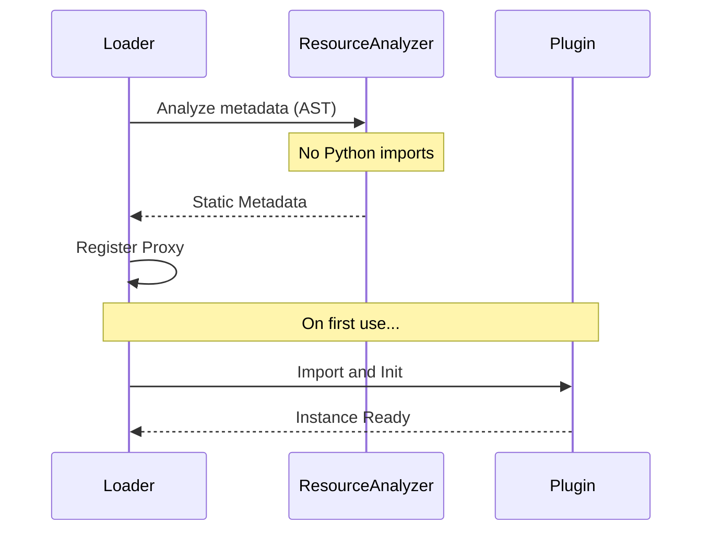
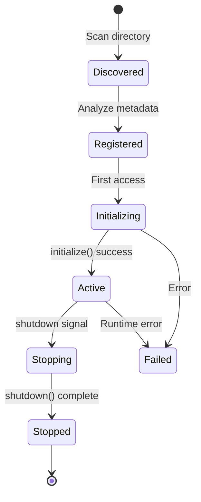

The `core/plugins` module manages the complete lifecycle of plugins within the system, providing a robust framework for extension and modularity.

---

## Module Structure

```text
core/plugins/
├── __init__.py           # Public exports
├── interface.py          # Base Plugin class
├── manifest.py           # Manifest loading and validation
├── agent_plugin.py       # AgentPlugin mixin
├── router_plugin.py      # RouterPlugin mixin
├── graph_plugin.py       # GraphPlugin mixin
├── registry.py           # PluginRegistry implementation
├── loader.py             # PluginLoader implementation
├── lifecycle.py          # Lifecycle management
├── hotreload.py          # Hot reload support
├── metrics.py            # Plugin metrics collection
├── health.py             # Health checking
├── version.py            # Version management
├── lookup.py             # Plugin lookup utilities
├── registration.py       # Registration logic
└── resource_analyzer.py  # AST-based static analysis
```

---

## Plugin Base Class

Modern plugins are discovered through a manifest file that is automatically loaded by the framework. `manifest.yaml` is the preferred long-term format, while `manifest.json` remains fully supported and is still emitted by some CLI scaffolding flows for backward compatibility.

```yaml title="plugins/my-plugin/manifest.yaml"
name: "my-plugin"
version: "1.0.0"
description: "An example plugin"
author: "Your Name"
```

```python title="plugins/my-plugin/plugin.py"
from core.plugins import Plugin

class MyPlugin(Plugin):
    """Example Plugin implementation."""

    async def initialize(self, config: dict) -> None:
        """Plugin initialization logic."""
        self.config = config

    async def shutdown(self) -> None:
        """Cleanup resources on shutdown."""
        pass
```

---

## Capability Mixins

Mixins allow plugins to expose specific capabilities, such as Agents, APIs, or Graph extensions.

### AgentPlugin

Use this mixin for plugins that provide agents.

```python
from core.plugins import AgentPlugin, PluginMetadata

class MyPlugin(AgentPlugin):
    def create_agent(self, **kwargs) -> MyAgent:
        return MyAgent(agent_id="main-agent", config=self.config)

    def get_agents(self) -> list:
        return [self.create_agent()]

    def get_intent_patterns(self) -> list:
        return [
            {
                "name": "my_intent",
                "patterns": ["keyword1", "keyword2"],
                "priority": 100
            }
        ]
```

### RouterPlugin

Use this mixin to expose REST API endpoints via FastAPI.

```python
from core.plugins import Plugin, RouterPlugin
from fastapi import APIRouter

class MyPlugin(Plugin, RouterPlugin):
    def create_router(self) -> APIRouter:
        router = APIRouter()

        @router.get("/status")
        async def get_status():
            return {"status": "ok"}

        return router

    def get_router_prefix(self) -> str:
        return "/my-plugin"  # Default: /<plugin-name>
```

### GraphPlugin

Use this mixin to extend the system's Knowledge Graph schema.

```python
from core.plugins import Plugin, GraphPlugin

class MyPlugin(Plugin, GraphPlugin):
    def register_entity_types(self) -> list:
        return ["CustomEntity", "CustomRelation"]

    def get_graph_service(self):
        from .graph_service import MyGraphService
        return MyGraphService()
```

---

## App-Level Middleware

The standard `initialize()` hook runs **inside** the FastAPI lifespan — after
Starlette has frozen the middleware stack. A plugin that needs to register
Starlette middleware (CORS overrides, per-path gates, telemetry collectors)
must instead override the `setup_app_middleware` **classmethod**, which the
factory invokes at app construction time:

```python
from core.plugins import Plugin

class MyPlugin(Plugin):
    @classmethod
    def setup_app_middleware(cls, app) -> None:
        # Runs before the stack is frozen; no plugin instance required.
        app.add_middleware(MyASGIMiddleware)
```

Discovery (`core/plugins/app_setup.py`, `apply_plugin_app_middleware`) is
synchronous and **best-effort**: it AST-scans each plugin to skip those that
don't declare the hook (avoiding heavy import side effects), enforces the same
SHA-256 integrity check as the async loader before `exec_module`, and a failing
hook is logged without blocking boot. The method is a `classmethod` so it never
pays a plugin's `__init__` cost. Write middleware as **pure ASGI** (never
`BaseHTTPMiddleware`).

## Shared Core Primitives

To keep plugins consistent, the core exposes domain-agnostic building blocks
plugins should reuse instead of reimplementing:

- **`core.registries.BaseRegistry[T]`** — thread-safe, name-keyed
  `register` / `get` / `require` / `list` / `remove` registry. Keys come from an
  explicit `name=`, a `key=` callable, or the item's `.name` attribute.
- **`core.exceptions`** — shared hierarchy rooted at `BaselithError`:
  `PluginError` (+ `PluginInitError`, `PluginConfigError`, `PluginIntegrityError`,
  `PluginDependencyError`) and `RegistryError` (+ `DuplicateRegistrationError`,
  `ItemNotFoundError`). Subclass the closest family rather than raising bare
  `Exception`.
- **`core.plugins.result.SkillResult`** (`ok`/`fail`/`partial`) — the canonical
  tool/skill return envelope.

```python
from core.registries import BaseRegistry
from core.exceptions import DuplicateRegistrationError

handlers: BaseRegistry[Handler] = BaseRegistry()
handlers.register(my_handler)            # keyed by my_handler.name
handlers.register(other, name="custom", overwrite=False)  # may raise
```

---

## PluginRegistry

The `PluginRegistry` serves as the central catalog for all active plugins.

```python
from core.plugins import get_plugin_registry

registry = get_plugin_registry()

# List all loaded plugins
for plugin in registry.get_all():
    print(f"{plugin.name}: {plugin.version}")

# Retrieve a specific plugin instance
weather = registry.get("weather-agent")

# Find a handler for a specific intent
handler = registry.get_handler("weather")

# Check if a plugin is registered
if registry.is_registered("my-plugin"):
    ...
```

### Thread Safety

The registry is designed to be thread-safe for concurrent access.

```python
class PluginRegistry:
    def __init__(self):
        self._lock = threading.RLock()
        self._plugins: dict[str, Plugin] = {}

    def register(self, plugin: Plugin) -> None:
        with self._lock:
            self._plugins[plugin.name] = plugin
```

---

## PluginLoader

The `PluginLoader` handles discovering and loading plugins from the filesystem.

```python
from core.plugins import PluginLoader

loader = PluginLoader(plugins_dir="plugins/")

# Load all plugins in the directory
plugins = await loader.load_all()

# Load a specific plugin by name
plugin = await loader.load("weather-agent")
```

### Plugin Signing & Integrity

Before executing any plugin module, the loader verifies it against the
`integrity_sha256` declared in its manifest (`core/plugins/integrity.py`,
`verify_plugin_integrity`). Enforcement is controlled by environment flags:

| Variable | Effect |
|----------|--------|
| `BASELITH_REQUIRE_SIGNED_PLUGINS=true` | Strict mode: reject plugins lacking a manifest hash. |
| `BASELITH_SKIP_INTEGRITY_CHECK=true` | Dev escape hatch: skip hash verification (ignored when strict). |
| `BASELITH_FAIL_ON_UNSIGNED_IN_PROD=true` | Turn the production posture warning into a hard error. |

At the start of `load_all_plugins`, `enforce_signing_policy()` checks the
posture: in a **production** environment (`APP_ENV`/`ENVIRONMENT` == `production`)
without strict mode it logs a **CRITICAL** warning that unsigned plugins will
load unverified (a supply-chain risk). It is warn-only by default — so it never
breaks an existing deployment — and becomes a hard `RuntimeError` only when
`BASELITH_FAIL_ON_UNSIGNED_IN_PROD=true`. Outside production it is a no-op.

!!! warning "Production recommendation"
    Set `BASELITH_REQUIRE_SIGNED_PLUGINS=true` and sign all plugins in
    production. Add `BASELITH_FAIL_ON_UNSIGNED_IN_PROD=true` to fail closed.

### Load-time Admission Gates

After a plugin is instantiated and before `initialize()` is called, the loader
runs two admission gates (`core/plugins/load_gates.py`). Both are **warn-only by
default** — they log problems but still load the plugin, so existing deployments
are unaffected — and only *skip* an offending plugin when their matching
enforcement flag is set.

**Version compatibility** (`check_plugin_compatibility`) checks the plugin's
declared `min_core_version` / `max_core_version` against the running core version
(`core._version.__version__`) and each entry in `plugin_dependencies` (a map of
plugin name → version constraint such as `">=0.1.0"`) against the versions of the
plugins actually present.

**Config schema validation** (`validate_plugin_config`) validates the
user-supplied config against the JSON Schema returned by the plugin's
`get_config_schema()` (Draft 7). A plugin that declares no schema is a no-op.
Validation runs in both the single-plugin path and `load_all_plugins`, giving
authors precise, early feedback instead of an opaque failure during init.

| Variable | Effect |
|----------|--------|
| `BASELITH_ENFORCE_PLUGIN_COMPAT=true` | Skip plugins whose core/plugin-dependency version constraints are not satisfied. |
| `BASELITH_ENFORCE_PLUGIN_CONFIG=true` | Skip plugins whose config fails their declared JSON Schema. |

```yaml
# manifest.yaml — declare compatibility bounds and dependencies
name: my-plugin
version: "1.2.0"
min_core_version: "0.10.0"
max_core_version: "1.0.0"
plugin_dependencies:
  browser_agent: ">=0.1.0"
```

### Lazy Loading

The system uses [Lazy Loading](../advanced/lazy-loading.md) to optimize startup time.



### ResourceAnalyzer

Performs static analysis to extract metadata without executing code, which is crucial for performance.

```python
from core.plugins import ResourceAnalyzer

analyzer = ResourceAnalyzer()

# Extract metadata without importing the module
metadata = analyzer.analyze_plugin("plugins/weather-agent/")

print(metadata.name)           # "weather-agent"
print(metadata.version)        # "1.0.0"
print(metadata.dependencies)   # ["httpx", "pydantic"]
```

---

## Lifecycle Management

Plugins go through a defined lifecycle state machine.



### Lifecycle Hooks

Implement these methods to manage your plugin's state.

```python
class MyPlugin(Plugin):
    async def initialize(self, config: dict) -> None:
        """Called upon first use, before processing requests."""
        self.db = await connect_database()

    async def on_ready(self) -> None:
        """Called when the entire system is fully ready."""
        await self.warm_cache()

    async def shutdown(self) -> None:
        """Called during system shutdown."""
        await self.db.close()
```

---

## Hot Reload

The `HotReloader` allows reloading plugins code without restarting the entire server—ideal for development.

```python
from core.plugins import HotReloader

reloader = HotReloader()

# Watch directory for changes
await reloader.watch("plugins/")

# Callback on change
@reloader.on_change
async def handle_reload(plugin_name: str):
    print(f"Plugin {plugin_name} reloaded")
```

---

## Health Checks

Ensure robust operation by validating plugin health.

```python
from core.plugins import PluginHealthChecker

checker = PluginHealthChecker()

# Check health of all plugins
health = await checker.check_all()

for plugin_name, status in health.items():
    print(f"{plugin_name}: {status.healthy}")
    if not status.healthy:
        print(f"  Error: {status.error}")
```

---

## Metrics

Monitor plugin performance using `PluginMetrics`.

```python
from core.plugins import PluginMetrics

metrics = PluginMetrics()

# Get stats for a specific plugin
stats = metrics.get_stats("weather-agent")

print(stats.requests_total)
print(stats.errors_total)
print(stats.avg_latency_ms)
```

### Prometheus Integration

Metrics are automatically exposed for Prometheus.

```text
# Exposed Metrics
plugin_requests_total{plugin="weather-agent"}
plugin_errors_total{plugin="weather-agent"}
plugin_latency_seconds{plugin="weather-agent"}
plugin_active{plugin="weather-agent"}
```

---

## Configuration

Plugins are configured via `configs/plugins.yaml`.

```yaml title="configs/plugins.yaml"
plugins:
  weather-agent:
    enabled: true
    config:
      api_key: "${WEATHER_API_KEY}"
      cache_ttl: 300

  analytics:
    enabled: true
    config:
      batch_size: 100

  legacy-plugin:
    enabled: false  # Disabled
```

### Accessing Configuration

Inherited configuration is available in the `initialize` method.

```python
class MyPlugin(Plugin):
    async def initialize(self, config: dict) -> None:
        self.api_key = config.get("api_key")
        self.cache_ttl = config.get("cache_ttl", 60)
```

### Plugin-Specific Environment Variables (.env)

Plugins can define their own `.env` file directly inside their plugin directory (e.g., `plugins/my-plugin/.env`).

This is particularly useful for:

- Sensitive credentials that shouldn't be committed to version control.
- Local development overrides specifically for this plugin.

Variables defined in the plugin's `.env` file are automatically:

1. Loaded into the global environment (`os.environ`), without overwriting existing variables from the main `.env`.
2. Merged into the plugin's `config` dictionary that is passed to the `initialize(config)` method.

```env title="plugins/my-plugin/.env"
API_KEY=my_secret_key_here
CUSTOM_SETTING=local_value
```

---

## CLI Commands

Manage plugins directly from the command line.

```bash
# List all local plugins with readiness status
baselith plugin list

# Create a new plugin (supports --interactive wizard)
baselith plugin create my-plugin --type agent

# Comprehensive status (aligned with configs/plugins.yaml)
baselith plugin status

# Verify dependencies and environment
baselith plugin deps check my-plugin

# Target logs for a specific plugin
baselith plugin logs my-plugin

# Visualize dependency tree
baselith plugin tree

# Validate syntax and manifest
baselith plugin validate my-plugin
```

---

## Best Practices

!!! tip "Structure"
    - Use `plugin.py` as the single entry point.
    - Keep logic in separate files (`agent.py`, `handlers.py`) for maintainability.
    - Always include a `README.md` for documentation.

!!! tip "Performance"
    - Leverage [Lazy Loading](../advanced/lazy-loading.md) for heavy dependencies.
    - Implement health checks.
    - Monitor exposed metrics.

!!! tip "Security"
    - **Always** validate external inputs.
    - Use configuration for secrets; **never** hardcode API keys or credentials.

---

## Plugin Management API

The REST API at `/api/plugins` exposes plugin lifecycle operations (list, enable, disable, reload, metrics). **All endpoints require the `admin` role** — unauthenticated or unprivileged requests receive `401`/`403`.

Every mutating operation (enable, disable, reload, reset metrics) is written to the application audit log in the format:

```txt
AUDIT | PLUGIN | <action> plugin=<name> success=<bool> from=<ip>
```

### Available Endpoints

| Method   | Path                                | Description                      |
| -------- | ----------------------------------- | -------------------------------- |
| `GET`    | `/api/plugins/`                     | List all plugins and their state |
| `GET`    | `/api/plugins/{name}`               | Get plugin details               |
| `POST`   | `/api/plugins/{name}/enable`        | Enable a disabled plugin         |
| `POST`   | `/api/plugins/{name}/disable`       | Disable an active plugin         |
| `POST`   | `/api/plugins/{name}/reload`        | Hot-reload a plugin              |
| `POST`   | `/api/plugins/reload-all`           | Reload all active plugins        |
| `GET`    | `/api/plugins/metrics/{name}`       | Plugin metrics                   |
| `DELETE` | `/api/plugins/metrics/{name}`       | Reset plugin metrics             |
| `DELETE` | `/api/plugins/metrics/system/reset` | Reset all metrics                |

!!! warning "Management Plane"
    The reload endpoint accepts an optional `config` payload that is passed directly to the plugin's `initialize` method. Only trusted administrators should have access to this API.
    - Implement rate limiting if you expose public APIs.

---

## SkillResult — canonical tool/skill envelope

`core/plugins/result.py` defines the standard return type for any
plugin-exposed tool, MCP tool, or orchestration handler. Returning a
raw string from a tool is forbidden — every call resolves to a typed
envelope with success / data / error fields plus an LLM-safe
`snapshot` preview.

### Public API

| Symbol | Purpose |
|--------|---------|
| `SkillResult` | Frozen Pydantic envelope (`success`, `message`, `data`, `snapshot`, `error_code`, `metadata`) |
| `ok(data, message, ...)` | Build a successful result; `snapshot` auto-derived from `data` |
| `fail(message, error_code, ...)` | Build a failed result |
| `partial(data, message, ...)` | Build a degraded-success result (flagged in metadata) |

The factories also live on the `core.plugins` package surface:
`from core.plugins import SkillResult, ok, fail, partial`.

### Example

```python
from core.plugins import ok, fail

async def fetch_user(user_id: str):
    record = await db.users.get(user_id)
    if record is None:
        return fail("user not found", error_code="not_found")
    return ok(
        data=record.model_dump(),
        message="resolved",
        metadata={"source": "primary"},
    )
```

`snapshot` is bounded to the first 500 characters by default so the LLM
sees a stable preview without flooding the context window; downstream
code consumes the full `data` directly.

---

## Declarative SKILL.md catalog

`core/plugins/declarative.py` discovers Markdown files named
`SKILL.md` under a set of trusted root directories and exposes them as
a progressive-disclosure catalog: the agent sees a lightweight index at
startup and only loads the heavy body when it activates a specific
skill.

### Public API

| Symbol | Purpose |
|--------|---------|
| `DeclarativeSkillLoader` | Discovers `SKILL.md` files and serves cards/bodies |
| `SkillCard` | Catalog entry: `name`, `description`, `path`, optional `version`, `requires_approval`, `tools` |
| `LoadedSkill` | Activation payload: card + body |
| `SkillLoadError` | Frontmatter or content failed validation |
| `SkillSandboxError` | Path escapes the configured roots |

The loader resolves and pins every root, so a malicious symlink or
prompt-injection attempt cannot escape into the filesystem.

### Frontmatter contract

```markdown
---
name: Migration Skill
description: Run a database migration with a clarification gate and rollback plan.
version: 1.2.0
requires_approval: true
tools: [run_sql, take_backup]
---

# Migration Skill

## Goal
...
```

### Example: discover + activate

```python
from pathlib import Path
from core.plugins.declarative import DeclarativeSkillLoader

loader = DeclarativeSkillLoader([Path(".agent/skills")])
catalog = loader.discover()      # list[SkillCard], no bodies

for card in catalog:
    print(card.name, "→", card.path)

# When the agent picks one, load the body:
skill = loader.activate(catalog[0].path)
print(skill.body)
```

Inject the catalog into the system prompt as an XML index (name +
description per skill) and expose `activate_skill(path)` as a tool.
