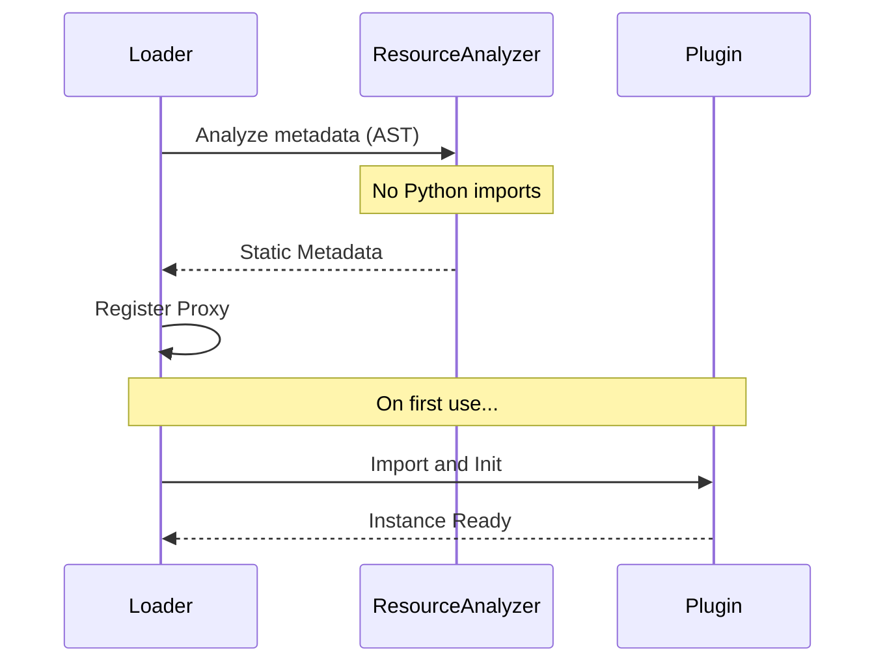
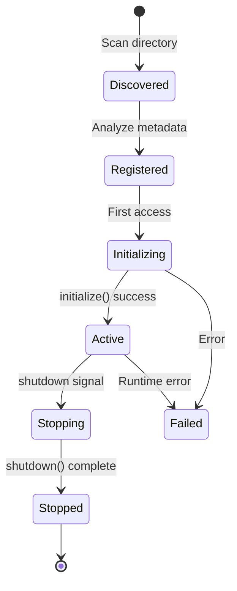

The `core/plugins` module manages the complete lifecycle of plugins within the system, providing a robust framework for extension and modularity.

---

## Module Structure

```text
core/plugins/
├── __init__.py           # Public exports
├── interface.py          # Base Plugin class + manifest loading/validation
├── agent_plugin.py       # AgentPlugin mixin
├── router_plugin.py      # RouterPlugin mixin
├── graph_plugin.py       # GraphPlugin mixin
├── registry.py           # PluginRegistry implementation
├── loader.py             # PluginLoader implementation
├── app_setup.py          # Sync pre-discovery for app-level middleware hooks
├── integrity.py          # SHA-256 integrity verification / signing policy
├── declarative.py        # SKILL.md declarative skill loader
├── result.py             # SkillResult envelope (ok/fail/partial)
├── load_gates.py         # Compatibility/config gates before init
├── lifecycle.py          # Lifecycle management
├── hotreload.py          # Hot reload support
├── metrics.py            # Plugin metrics collection
├── health.py             # Health checking
├── version.py            # Version management
├── lookup.py             # Plugin lookup utilities
├── registration.py       # Registration logic
└── resource_analyzer.py  # AST-based static analysis (helpers in _ast_utils.py)
```

---

## Plugin Base Class

Modern plugins are discovered through a manifest file that is automatically loaded by the framework. `manifest.yaml` is the preferred long-term format, while `manifest.json` remains fully supported and is still emitted by some CLI scaffolding flows for backward compatibility.

```yaml title="plugins/my-plugin/manifest.yaml"
name: "my-plugin"
version: "1.0.0"
description: "An example plugin"
author: "Your Name"
```

```python title="plugins/my-plugin/plugin.py"
from core.plugins import Plugin

class MyPlugin(Plugin):
    """Example Plugin implementation."""

    async def initialize(self, config: dict) -> None:
        """Plugin initialization logic."""
        self.config = config

    async def shutdown(self) -> None:
        """Cleanup resources on shutdown."""
        pass
```

### Tenant-scoped storage

Whenever a plugin persists data, scope it by `self.tenant_key()` rather than
calling `get_current_tenant_id()` directly. `tenant_key()` honours the manifest's
`tenancy` field — `shared` (default) returns the deployment tenant, `personal`
returns the authenticated user's id (1 user = 1 tenant) — so the plugin gets the
right isolation model on any deployment:

```yaml title="manifest.yaml"
tenancy: personal        # "shared" (default) | "personal"
```

```python
class MyPlugin(Plugin):
    async def save(self, value: str) -> None:
        await cursor.execute(
            "INSERT INTO notes (tenant_id, body) VALUES (%s, %s)",
            (self.tenant_key(), value),
        )
```

See [Per-plugin tenancy](../advanced/multi-tenancy.md#per-plugin-tenancy-personal-vs-shared)
for the full model.

---

## Capability Mixins

Mixins allow plugins to expose specific capabilities, such as Agents, APIs, or Graph extensions.

### AgentPlugin

Use this mixin for plugins that provide agents.

```python
from core.plugins import AgentPlugin, PluginMetadata

class MyPlugin(AgentPlugin):
    def create_agent(self, **kwargs) -> MyAgent:
        return MyAgent(agent_id="main-agent", config=self.config)

    def get_agents(self) -> list:
        return [self.create_agent()]

    def get_intent_patterns(self) -> list:
        return [
            {
                "name": "my_intent",
                "patterns": ["keyword1", "keyword2"],
                "priority": 100
            }
        ]
```

### RouterPlugin

Use this mixin to expose REST API endpoints via FastAPI.

```python
from core.plugins import Plugin, RouterPlugin
from fastapi import APIRouter

class MyPlugin(Plugin, RouterPlugin):
    def create_router(self) -> APIRouter:
        router = APIRouter()

        @router.get("/status")
        async def get_status():
            return {"status": "ok"}

        return router

    def get_router_prefix(self) -> str:
        return "/my-plugin"  # Default: /<plugin-name>
```

!!! warning "Reserved route namespaces"
    The prefix also drives **request attribution**: the plugin-context
    middleware binds the active plugin (per-plugin LLM policy, tenancy
    scoping, lazy activation) from the longest matching prefix. A prefix
    consisting of exactly one core-owned segment — `""`, `/api`, `/v1`,
    `/chat`, `/admin`, `/console`, `/feedback`, `/feedbacks`, `/health`,
    `/index`, `/metrics`, `/reindex`, `/status`, `/static`, `/docs`,
    `/redoc`, `/openapi.json`, `/.well-known` — cannot express ownership and
    is **excluded from attribution** (logged as a warning): it would claim
    unrelated core traffic, routing it through the wrong plugin's LLM policy
    and returning spurious 503s when the claiming plugin fails to activate.
    Multi-segment prefixes such as `/api/my-plugin` are unaffected.

### GraphPlugin

Use this mixin to extend the system's Knowledge Graph schema.

`GraphPlugin` declares entity and relationship schemas. Both
`register_entity_types()` and `register_relationship_types()` return a list of schema
**dicts** (each with a `name` plus its properties):

```python
from core.plugins import GraphPlugin

class MyPlugin(GraphPlugin):
    def register_entity_types(self) -> list[dict]:
        return [
            {"name": "CustomEntity", "properties": {"label": "str"}},
        ]

    def register_relationship_types(self) -> list[dict]:
        return [
            {"name": "RELATES_TO", "source": "CustomEntity", "target": "CustomEntity"},
        ]
```

`GraphPlugin` also provides `get_entity_types()`, `get_relationship_types()`,
`validate_entity()`, and `get_graph_config()`.

---

## App-Level Middleware

The standard `initialize()` hook runs **inside** the FastAPI lifespan — after
Starlette has frozen the middleware stack. A plugin that needs to register
Starlette middleware (CORS overrides, per-path gates, telemetry collectors)
must instead override the `setup_app_middleware` **classmethod**, which the
factory invokes at app construction time:

```python
from core.plugins import Plugin

class MyPlugin(Plugin):
    @classmethod
    def setup_app_middleware(cls, app) -> None:
        # Runs before the stack is frozen; no plugin instance required.
        app.add_middleware(MyASGIMiddleware)
```

Discovery (`core/plugins/app_setup.py`, `apply_plugin_app_middleware`) is
synchronous and **best-effort**: it AST-scans each plugin to skip those that
don't declare the hook (avoiding heavy import side effects), enforces the same
SHA-256 integrity check as the async loader before `exec_module`, and a failing
hook is logged without blocking boot. The method is a `classmethod` so it never
pays a plugin's `__init__` cost. Write middleware as **pure ASGI** (never
`BaseHTTPMiddleware`).

## Shared Core Primitives

To keep plugins consistent, the core exposes domain-agnostic building blocks
plugins should reuse instead of reimplementing:

- **`core.registries.BaseRegistry[T]`** — thread-safe, name-keyed
  `register` / `get` / `require` / `list` / `remove` registry. Keys come from an
  explicit `name=`, a `key=` callable, or the item's `.name` attribute.
- **`core.exceptions`** — shared hierarchy rooted at `BaselithError`:
  `PluginError` (+ `PluginInitError`, `PluginConfigError`, `PluginIntegrityError`,
  `PluginDependencyError`) and `RegistryError` (+ `DuplicateRegistrationError`,
  `ItemNotFoundError`). Subclass the closest family rather than raising bare
  `Exception`.
- **`core.plugins.result.SkillResult`** (`ok`/`fail`/`partial`) — the canonical
  tool/skill return envelope.

```python
from core.registries import BaseRegistry
from core.exceptions import DuplicateRegistrationError

handlers: BaseRegistry[Handler] = BaseRegistry()
handlers.register(my_handler)            # keyed by my_handler.name
handlers.register(other, name="custom", overwrite=False)  # may raise
```

---

## PluginRegistry

The `PluginRegistry` serves as the central catalog for all active plugins. Construct one
directly (the app factory wires the shared instance into the orchestrator and API
gateway at boot):

```python
from core.plugins import PluginRegistry

registry = PluginRegistry()

# Register a loaded plugin instance
registry.register(my_plugin)

# List all loaded plugins
for plugin in registry.get_all():
    print(f"{plugin.metadata.name}: {plugin.metadata.version}")

# Retrieve a specific plugin instance (returns None if absent)
weather = registry.get("weather-agent")

# Structured listing for inspection / APIs
rows = registry.list_plugins()  # list[dict]
```

The registry also aggregates contributions across all plugins via
`get_all_agents()`, `get_all_routers()`, `get_all_intent_patterns()`,
`get_all_entity_types()`, `get_all_flow_handlers()`, and `get_all_static_paths()`.

### Thread Safety

The registry is designed to be thread-safe for concurrent access (it guards its
internal maps with a lock).

---

## PluginLoader

The `PluginLoader` handles discovering and loading plugins from the filesystem.

```python
from pathlib import Path
from core.plugins import PluginLoader

loader = PluginLoader(plugins_dir=Path("plugins"))

# Discover plugin directories (no import side effects)
plugin_dirs = loader.discover_plugins()

# Load all plugins in the directory
plugins = await loader.load_all_plugins()

# Load a single plugin from its directory
plugin = await loader.load_plugin(Path("plugins/weather-agent"))
```

### Plugin Signing & Integrity

Before executing any plugin module, the loader verifies it against the
`integrity_sha256` declared in its manifest (`core/plugins/integrity.py`,
`verify_plugin_integrity`). The hashed surface covers `*.py`/`*.pyi`
sources, the build/packaging files `pip install` trusts (`pyproject.toml`,
`setup.cfg`, `MANIFEST.in`, `requirements*.txt`), and declarative
`SKILL.md` skill bodies (their contents reach the model's prompt);
`manifest.yaml`, `docs/` and `ui/` stay excluded. Enforcement is
controlled by environment flags:

| Variable | Effect |
|----------|--------|
| `BASELITH_REQUIRE_SIGNED_PLUGINS=true` | Strict mode (all environments): reject plugins lacking a manifest hash. |
| `BASELITH_SKIP_INTEGRITY_CHECK=true` | Dev escape hatch: skip hash verification. Ignored in production and when strict mode is on. |
| `BASELITH_ALLOW_UNSIGNED_IN_PROD=true` | Opt out of the production fail-closed default (below) and allow unsigned plugins in production — insecure. |

**Production is fail-closed by default.** In a production environment
(`APP_ENV`/`ENVIRONMENT` == `production`) `verify_plugin_integrity` refuses to
load a plugin that declares no `integrity_sha256`, unless the explicit
`BASELITH_ALLOW_UNSIGNED_IN_PROD=true` opt-out is set (which logs a **CRITICAL**
so the downgrade is never silent). At the start of `load_all_plugins`,
`enforce_signing_policy()` surfaces the posture. Outside production, unsigned
plugins load (dev/hot-reload convenience).

!!! warning "Production recommendation"
    Sign all plugins (`integrity_sha256`) and leave the fail-closed default in
    place. Set `BASELITH_REQUIRE_SIGNED_PLUGINS=true` to enforce signing in
    every environment, not just production.

### Load-time Admission Gates

After a plugin is instantiated and before `initialize()` is called, the loader
runs two admission gates (`core/plugins/load_gates.py`). Both are **warn-only by
default** — they log problems but still load the plugin, so existing deployments
are unaffected — and only *skip* an offending plugin when their matching
enforcement flag is set.

**Version compatibility** (`check_plugin_compatibility`) checks the plugin's
declared `min_core_version` / `max_core_version` against the running core version
(`core._version.__version__`) and each entry in `plugin_dependencies` (a map of
plugin name → version constraint such as `">=0.1.0"`) against the versions of the
plugins actually present.

**Config schema validation** (`validate_plugin_config`) validates the
user-supplied config against the JSON Schema returned by the plugin's
`get_config_schema()` (Draft 7). A plugin that declares no schema is a no-op.
Validation runs in both the single-plugin path and `load_all_plugins`, giving
authors precise, early feedback instead of an opaque failure during init.

| Variable | Effect |
|----------|--------|
| `BASELITH_ENFORCE_PLUGIN_COMPAT=true` | Skip plugins whose core/plugin-dependency version constraints are not satisfied. |
| `BASELITH_ENFORCE_PLUGIN_CONFIG=true` | Skip plugins whose config fails their declared JSON Schema. |

```yaml
# manifest.yaml — declare compatibility bounds and dependencies
name: my-plugin
version: "1.2.0"
min_core_version: "0.10.0"
max_core_version: "1.0.0"
plugin_dependencies:
  browser_agent: ">=0.1.0"
```

### Lazy Loading

The system uses [Lazy Loading](../advanced/lazy-loading.md) to optimize startup time.



### Resource analysis

The loader uses AST-based static analysis to extract plugin metadata without executing
code, which is crucial for startup performance. The `ResourceAnalyzer` class lives in
`core.plugins.resource_analyzer` (it is **not** re-exported from the `core.plugins`
package). A convenience function aggregates resource requirements across plugins:

```python
from pathlib import Path
from core.plugins.resource_analyzer import (
    ResourceAnalyzer,
    analyze_plugin_resources,
)

# Static discovery of a single plugin (no Python import)
analyzer = ResourceAnalyzer(Path("plugins"))
discovery = analyzer.discover_plugin(Path("plugins/weather-agent"))
print(discovery.name)

# Aggregate required/optional resources across configured plugins
resources = analyze_plugin_resources(
    plugins_dir=Path("plugins"),
    plugin_configs={"weather-agent": {"enabled": True}},
)  # -> dict[str, set[str]]
```

---

## Lifecycle Management

Plugins go through a defined lifecycle state machine.



### Lifecycle Hooks

Implement the two async lifecycle hooks to manage your plugin's state. (For
app-construction-time middleware, override the `setup_app_middleware` classmethod
described above.)

```python
class MyPlugin(Plugin):
    async def initialize(self, config: dict) -> None:
        """Called before the plugin processes requests."""
        self.db = await connect_database()

    async def shutdown(self) -> None:
        """Called during system shutdown."""
        await self.db.close()
```

---

## Hot Reload

The `HotReloadController` enables/disables/reloads plugin code at runtime without
restarting the server — ideal for development and for the plugin management API. It is
wired with the loader, registry, and lifecycle manager:

```python
from core.plugins import HotReloadController

controller = HotReloadController(
    loader=loader,
    registry=registry,
    lifecycle_manager=lifecycle_manager,
)

# Enable a discovered/disabled plugin (optionally with fresh config)
await controller.enable_plugin("weather-agent", config={"api_key": "..."})

# Disable an active plugin
await controller.disable_plugin("weather-agent")

# Reload (disable + re-enable) a plugin
await controller.reload_plugin("weather-agent")
```

All three methods are coroutines and return a `bool` indicating success.

### Lifecycle events

Each successful (or failed) call also publishes a best-effort notification on
the core event bus (`core.plugins.lifecycle_events`), so anything watching
plugin state — a control-plane dashboard, an operator tool — learns about a
change without polling the registry:

| Trigger | Topic | Payload |
|---|---|---|
| `enable_plugin` succeeds | `plugin.activated` | `{plugin, state: "active", op: "enable", ok: true}` |
| `enable_plugin` fails | `plugin.failed` | `{plugin, state: "failed", op: "enable", ok: false}` |
| `disable_plugin` succeeds | `plugin.deactivated` | `{plugin, state: "disabled", op: "disable", ok: true}` |
| `reload_plugin` succeeds | `plugin.reloaded` | `{plugin, state: "active", op: "reload", ok: true}` |
| `reload_plugin` fails | `plugin.failed` | `{plugin, state: "failed", op: "reload", ok: false}` |

A failed `disable_plugin` call emits nothing — the plugin's state didn't
change, so there is nothing to announce (emitting `plugin.failed` there would
wrongly mark a still-active plugin unhealthy for every subscriber). Emission
is fire-and-forget: it never raises, and a telemetry failure never affects the
outcome of the lifecycle operation itself.

```python
from core.events.bus import get_event_bus

async def on_plugin_activated(data: dict) -> None:
    print(f"{data['plugin']} is now {data['state']}")

get_event_bus().subscribe("plugin.activated", on_plugin_activated)
```

---

## Health Checks

Health checking is provided by the `HealthMixin` that `PluginRegistry` inherits — call
`health_check()` directly on the registry. With no argument it checks every plugin;
pass a name to check one. It returns a dict:

```python
report = registry.health_check()          # all plugins
# {"healthy": bool, "plugins": {name: {"status": ..., "initialized": ..., "version": ...}}}

print(report["healthy"])
for name, status in report["plugins"].items():
    print(name, status["status"])         # "healthy" | "unhealthy" | "not_found"

one = registry.health_check("weather-agent")   # single plugin
```

---

## Metrics

Monitor plugin lifecycle performance with the `PluginMetricsCollector`. Use the shared
singleton via `get_metrics_collector()`:

```python
from core.plugins import get_metrics_collector

collector = get_metrics_collector()

# Per-plugin metrics as a dict (None if the plugin has no recorded metrics)
stats = collector.get_plugin_metrics("weather-agent")
print(stats["load_count"], stats["avg_load_time_ms"], stats["failure_count"])

# Aggregate views
all_metrics = collector.get_all_metrics()
system = collector.get_system_metrics()
summary = collector.get_performance_summary()
```

The collector tracks lifecycle counts (`load_count`, `reload_count`, `enable_count`,
`disable_count`, `failure_count`), load/reload timings, time-in-state, and an error
history. The underlying per-plugin record is `PluginMetrics`, serialized via
`to_dict()`.

---

## Configuration

Plugins are configured via `configs/plugins.yaml`.

```yaml title="configs/plugins.yaml"
plugins:
  weather-agent:
    enabled: true
    config:
      api_key: "${WEATHER_API_KEY}"
      cache_ttl: 300

  analytics:
    enabled: true
    config:
      batch_size: 100

  legacy-plugin:
    enabled: false  # Disabled
```

### Accessing Configuration

Inherited configuration is available in the `initialize` method.

```python
class MyPlugin(Plugin):
    async def initialize(self, config: dict) -> None:
        self.api_key = config.get("api_key")
        self.cache_ttl = config.get("cache_ttl", 60)
```

### Plugin-Specific Environment Variables (.env)

Plugins can define their own `.env` file directly inside their plugin directory (e.g., `plugins/my-plugin/.env`).

This is particularly useful for:

- Sensitive credentials that shouldn't be committed to version control.
- Local development overrides specifically for this plugin.

Variables defined in the plugin's `.env` file are automatically:

1. Loaded into the global environment (`os.environ`), without overwriting existing variables from the main `.env`.
2. Merged into the plugin's `config` dictionary that is passed to the `initialize(config)` method.

!!! note "Security"
    The `.env` file is read **only after** the plugin passes its integrity check
    (`integrity_sha256`), and symlinked `.env` files are ignored — an untrusted
    plugin directory cannot inject environment variables into the process.

```env title="plugins/my-plugin/.env"
API_KEY=my_secret_key_here
CUSTOM_SETTING=local_value
```

---

## CLI Commands

Manage plugins directly from the command line.

```bash
# List all local plugins with readiness status
baselith plugin list

# Create a new plugin (supports --interactive wizard)
baselith plugin create my-plugin --type agent

# Comprehensive status (aligned with configs/plugins.yaml)
baselith plugin status

# Verify dependencies and environment
baselith plugin deps check my-plugin

# Target logs for a specific plugin
baselith plugin logs my-plugin

# Visualize dependency tree
baselith plugin tree

# Validate syntax and manifest
baselith plugin validate my-plugin
```

---

## Best Practices

!!! tip "Structure"
    - Use `plugin.py` as the single entry point.
    - Keep logic in separate files (`agent.py`, `handlers.py`) for maintainability.
    - Always include a `README.md` for documentation.

!!! tip "Performance"
    - Leverage [Lazy Loading](../advanced/lazy-loading.md) for heavy dependencies.
    - Implement health checks.
    - Monitor exposed metrics.

!!! tip "Security"
    - **Always** validate external inputs.
    - Use configuration for secrets; **never** hardcode API keys or credentials.

---

## Plugin Management API

The REST API at `/api/plugins` exposes plugin lifecycle operations (list, enable, disable, reload, metrics). **All endpoints require the `admin` role** — unauthenticated or unprivileged requests receive `401`/`403`.

Every mutating operation (enable, disable, reload, reset metrics) is written to the application audit log in the format:

```txt
AUDIT | PLUGIN | <action> plugin=<name> success=<bool> from=<ip>
```

### Available Endpoints

| Method   | Path                                | Description                      |
| -------- | ----------------------------------- | -------------------------------- |
| `GET`    | `/api/plugins/`                     | List all plugins and their state |
| `GET`    | `/api/plugins/{name}`               | Get plugin details               |
| `POST`   | `/api/plugins/{name}/enable`        | Enable a disabled plugin         |
| `POST`   | `/api/plugins/{name}/disable`       | Disable an active plugin         |
| `POST`   | `/api/plugins/{name}/reload`        | Hot-reload a plugin              |
| `POST`   | `/api/plugins/reload-all`           | Reload all active plugins        |
| `GET`    | `/api/plugins/metrics/{name}`       | Plugin metrics                   |
| `DELETE` | `/api/plugins/metrics/{name}`       | Reset plugin metrics             |
| `DELETE` | `/api/plugins/metrics/system/reset` | Reset all metrics                |

!!! warning "Management Plane"
    The reload endpoint accepts an optional `config` payload that is passed directly to the plugin's `initialize` method. Only trusted administrators should have access to this API.
    - Implement rate limiting if you expose public APIs.

---

## SkillResult — canonical tool/skill envelope

`core/plugins/result.py` defines the standard return type for any
plugin-exposed tool, MCP tool, or orchestration handler. Returning a
raw string from a tool is forbidden — every call resolves to a typed
envelope with success / data / error fields plus an LLM-safe
`snapshot` preview.

### Public API

| Symbol | Purpose |
|--------|---------|
| `SkillResult` | Frozen Pydantic envelope (`success`, `message`, `data`, `snapshot`, `error_code`, `metadata`) |
| `ok(data, message, ...)` | Build a successful result; `snapshot` auto-derived from `data` |
| `fail(message, error_code, ...)` | Build a failed result |
| `partial(data, message, ...)` | Build a degraded-success result (flagged in metadata) |

The factories also live on the `core.plugins` package surface:
`from core.plugins import SkillResult, ok, fail, partial`.

### Example

```python
from core.plugins import ok, fail

async def fetch_user(user_id: str):
    record = await db.users.get(user_id)
    if record is None:
        return fail("user not found", error_code="not_found")
    return ok(
        data=record.model_dump(),
        message="resolved",
        metadata={"source": "primary"},
    )
```

`snapshot` is bounded to the first 500 characters by default so the LLM
sees a stable preview without flooding the context window; downstream
code consumes the full `data` directly.

---

## Declarative SKILL.md catalog

`core/plugins/declarative.py` discovers Markdown files named
`SKILL.md` under a set of trusted root directories and exposes them as
a progressive-disclosure catalog: the agent sees a lightweight index at
startup and only loads the heavy body when it activates a specific
skill. Plugins ship skills under `plugins/<name>/skills/**/SKILL.md`;
`core/plugins/skills_service.py` (`SkillService`) aggregates every
plugin's root and the orchestrator exposes the catalog plus an
`activate_skill` tool to the loop — see
[Declarative Skills](skills.md) for the end-to-end flow, approval gate,
and integrity/signing requirements.

### Public API

| Symbol | Purpose |
|--------|---------|
| `DeclarativeSkillLoader` | Discovers `SKILL.md` files and serves cards/bodies |
| `SkillCard` | Catalog entry: `name`, `description`, `path`, optional `version`, `requires_approval`, `tools`, provider `plugin` |
| `LoadedSkill` | Activation payload: card + body |
| `SkillLoadError` | Frontmatter or content failed validation |
| `SkillSandboxError` | Path escapes the configured roots |
| `SkillService` | Registry-backed catalog + gated activation (`SkillResult` envelope) |
| `split_frontmatter` | Shared SKILL.md frontmatter parser (also reused by `baselithbot`) |

The loader resolves and pins every root, so a malicious symlink or
prompt-injection attempt cannot escape into the filesystem.

### Frontmatter contract

```markdown
---
name: Migration Skill
description: Run a database migration with a clarification gate and rollback plan.
version: 1.2.0
requires_approval: true
tools: [run_sql, take_backup]
---

# Migration Skill

## Goal
...
```

### Example: discover + activate

```python
from pathlib import Path
from core.plugins.declarative import DeclarativeSkillLoader

loader = DeclarativeSkillLoader([Path(".agent/skills")])
catalog = loader.discover()      # list[SkillCard], no bodies

for card in catalog:
    print(card.name, "→", card.path)

# When the agent picks one, load the body:
skill = loader.activate(catalog[0].path)
print(skill.body)
```

Inject the catalog into the system prompt as an XML index (name +
description per skill) and expose `activate_skill(path)` as a tool.
