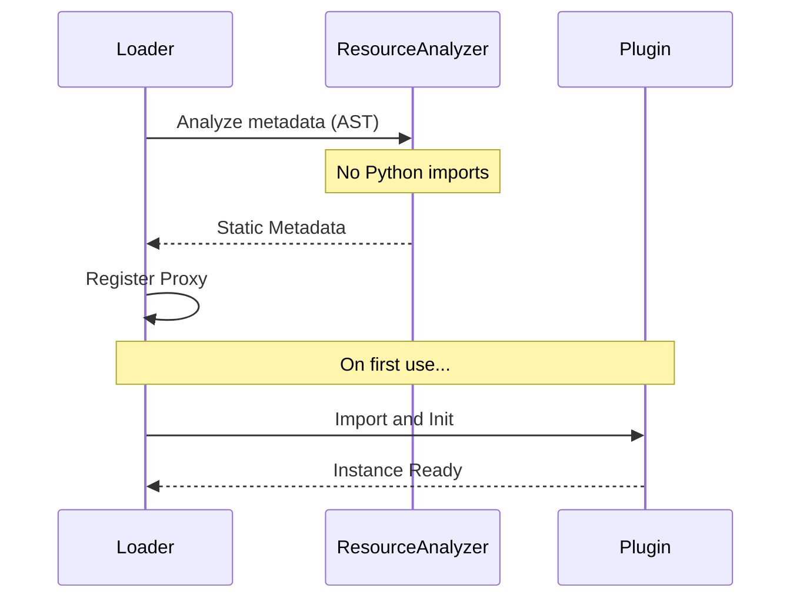
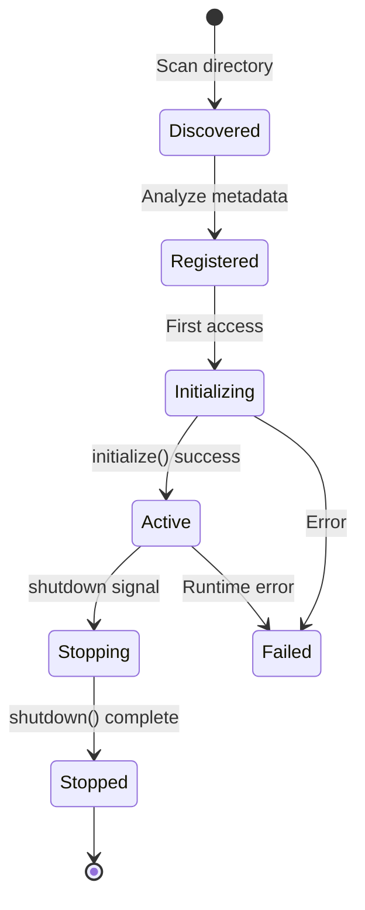

The `core/plugins` module manages the complete lifecycle of plugins within the system, providing a robust framework for extension and modularity.

---

## Module Structure

!!! info "Exports resolve on first access"
    `__init__.py` maps each exported name to the submodule that defines it and resolves it on first read ([PEP 562](https://peps.python.org/pep-0562/), via `core._lazy.lazy_exports`). Import sites are unchanged — `from core.plugins import SkillResult` and `core.plugins.loader` both still work — but importing one name no longer costs the whole package: reaching `SkillResult` used to load 955 modules and now loads 226.

Adding an export means adding it to **both** `_EXPORTS` and the literal
`__all__`. A test enforces that the two describe the same surface, and the
public API surface gate reads only the literal. See
[import-time laziness](../advanced/lazy-loading.md#import-time-laziness).

```text
core/plugins/
├── __init__.py           # Public exports
├── interface.py          # Base Plugin class + manifest loading/validation
├── manifest_model.py     # PluginManifestModel — the strict manifest schema
├── _metadata.py          # PluginMetadata, built from the manifest model
├── agent_plugin.py       # AgentPlugin mixin
├── router_plugin.py      # RouterPlugin mixin
├── graph_plugin.py       # GraphPlugin mixin
├── registry.py           # PluginRegistry implementation
├── loader.py             # PluginLoader implementation
├── bulk_load.py          # load_all_plugins — per-plugin failure containment
├── discovery.py          # baselith.plugins entry-point group + merge rules
├── plugin_class.py       # entry_point resolution / ambiguity refusal
├── nursery.py            # PluginTaskNursery — owned background tasks
├── app_setup.py          # Sync pre-discovery for app-level middleware hooks
├── integrity.py          # Hashed surface (V1–V5), canonical manifest digest
├── integrity_policy.py   # Verification policy: strict mode, legacy fallback
├── signing.py            # Ed25519 signatures, trust roots and trust store
├── manifest_rewrite.py   # Comment-preserving manifest writer used by signing
├── declarative.py        # SKILL.md declarative skill loader
├── skills_service.py     # SkillService — registry-backed catalog + gated activation
├── skill_scripts.py      # Sandboxed runner for a skill's bundled .py helpers
├── result.py             # SkillResult envelope (ok/fail/partial)
├── load_gates.py         # Compatibility/config gates before init (fail-closed)
├── lifecycle.py          # Lifecycle management
├── hotreload.py          # Hot reload support
├── metrics.py            # Plugin metrics collection
├── health.py             # Health checking + PluginHealth
├── version.py            # Version management
├── lookup.py             # Plugin lookup utilities
├── registration.py       # Registration logic
├── _audit.py             # plugin.load / plugin.unload audit events
└── resource_analyzer.py  # AST-based static analysis (helpers in _ast_utils.py)
```

---

## Plugin Base Class

Modern plugins are discovered through a manifest file that is automatically loaded by the framework. `manifest.yaml` is the preferred long-term format, while `manifest.json` remains fully supported and is still emitted by some CLI scaffolding flows for backward compatibility.

```yaml title="plugins/my-plugin/manifest.yaml"
name: "my-plugin"
version: "1.0.0"
description: "An example plugin"
author: "Your Name"
```

```python title="plugins/my-plugin/plugin.py"
from core.plugins import Plugin

class MyPlugin(Plugin):
    """Example Plugin implementation."""

    async def initialize(self, config: dict) -> None:
        """Plugin initialization logic."""
        self.config = config

    async def shutdown(self) -> None:
        """Cleanup resources on shutdown."""
        pass
```

### Tenant-scoped storage

Whenever a plugin persists data, scope it by `self.tenant_key()` rather than
calling `get_current_tenant_id()` directly. `tenant_key()` honours the manifest's
`tenancy` field — `shared` (default) returns the deployment tenant, `personal`
returns the authenticated user's id (1 user = 1 tenant) — so the plugin gets the
right isolation model on any deployment:

```yaml title="manifest.yaml"
tenancy: personal        # "shared" (default) | "personal"
```

```python
class MyPlugin(Plugin):
    async def save(self, value: str) -> None:
        await cursor.execute(
            "INSERT INTO notes (tenant_id, body) VALUES (%s, %s)",
            (self.tenant_key(), value),
        )
```

See [Per-plugin tenancy](../advanced/multi-tenancy.md#per-plugin-tenancy-personal-vs-shared)
for the full model.

### Schema is deploy work, not boot work

A plugin that owns tables creates them in `init_schema()`, not in
`initialize()`. The default is a no-op, so a plugin whose tables come from an
Alembic migration implements nothing:

```python
class MyPlugin(Plugin):
    async def init_schema(self, config: dict | None = None) -> None:
        """Create or upgrade this plugin's own tables. Runs as their owner."""
        await cursor.execute("CREATE TABLE IF NOT EXISTS notes (...)")
```

`baselith plugin schema-init` runs it on every enabled plugin at deploy time,
loading them **cold** — instantiated, never initialised — so no runtime client
is opened; its exit code is the number of failures, so a deploy stops rather
than starting an application against a half-built schema.

The split exists because the serving process must not hold DDL. A deployment
that isolates tenants at the database connects as a least-privilege role
(`NOSUPERUSER NOBYPASSRLS`, owning nothing), and PostgreSQL exempts a
superuser, a `BYPASSRLS` role and a table's *owner* from that table's own
policy. A plugin building its schema at boot fails there with
`permission denied for schema public` — or, once granted that, with
`must be owner of table …`, which no grant fixes — and one that *did* own its
tables would be exempt from the policies meant to isolate it.

In Kubernetes the chart runs the command for you: set
`database.pluginSchemaInit.enabled` and the Job lands after the migrations and
after the runtime role exists, before the Deployment. See
[`plugin schema-init`](../api/cli.md#plugin-schema-init-build-plugin-schemas-at-deploy-time).

---

## Capability Mixins

Mixins allow plugins to expose specific capabilities, such as Agents, APIs, or Graph extensions.

### AgentPlugin

Use this mixin for plugins that provide agents.

```python
from core.plugins import AgentPlugin, PluginMetadata

class MyPlugin(AgentPlugin):
    def create_agent(self, **kwargs) -> MyAgent:
        return MyAgent(agent_id="main-agent", config=self.config)

    def get_agents(self) -> list:
        return [self.create_agent()]

    def get_intent_patterns(self) -> list:
        return [
            {
                "name": "my_intent",
                "patterns": ["keyword1", "keyword2"],
                "priority": 100
            }
        ]
```

### RouterPlugin

Use this mixin to expose REST API endpoints via FastAPI.

```python
from core.plugins import Plugin, RouterPlugin
from fastapi import APIRouter

class MyPlugin(Plugin, RouterPlugin):
    def create_router(self) -> APIRouter:
        router = APIRouter()

        @router.get("/status")
        async def get_status():
            return {"status": "ok"}

        return router

    def get_router_prefix(self) -> str:
        return "/my-plugin"  # Default: "/api/<plugin-name>" (f"/api/{self.metadata.name}")
```

!!! warning "Reserved route namespaces"
    The prefix also drives **request attribution**: the plugin-context
    middleware binds the active plugin (per-plugin LLM policy, tenancy
    scoping, lazy activation) from the longest matching prefix. A prefix
    consisting of exactly one core-owned segment — `""`, `/api`, `/v1`,
    `/chat`, `/admin`, `/console`, `/feedback`, `/feedbacks`, `/health`,
    `/index`, `/metrics`, `/reindex`, `/status`, `/static`, `/docs`,
    `/redoc`, `/openapi.json`, `/.well-known` — cannot express ownership and
    is **excluded from attribution** (logged as a warning once per plugin
    and process — the route snapshot is rebuilt on every discovery change,
    the deployment shape it describes is not): it would claim unrelated core
    traffic, routing it through the wrong plugin's LLM policy and returning
    spurious 503s when the claiming plugin fails to activate. Requests under
    such a prefix simply stay unattributed. Multi-segment prefixes such as
    `/api/my-plugin` are unaffected.

### GraphPlugin

Use this mixin to extend the system's Knowledge Graph schema.

`GraphPlugin` declares entity and relationship schemas. Both
`register_entity_types()` and `register_relationship_types()` return a list of schema
**dicts** (each with a `name` plus its properties):

```python
from core.plugins import GraphPlugin

class MyPlugin(GraphPlugin):
    def register_entity_types(self) -> list[dict]:
        return [
            {"name": "CustomEntity", "properties": {"label": "str"}},
        ]

    def register_relationship_types(self) -> list[dict]:
        return [
            {"name": "RELATES_TO", "source": "CustomEntity", "target": "CustomEntity"},
        ]
```

`GraphPlugin` also provides `get_entity_types()`, `get_relationship_types()`,
`validate_entity()`, and `get_graph_config()`.

---

## App-Level Middleware

The standard `initialize()` hook runs **inside** the FastAPI lifespan — after
Starlette has frozen the middleware stack. A plugin that needs to register
Starlette middleware (CORS overrides, per-path gates, telemetry collectors)
must instead override the `setup_app_middleware` **classmethod**, which the
factory invokes at app construction time:

```python
from core.plugins import Plugin

class MyPlugin(Plugin):
    @classmethod
    def setup_app_middleware(cls, app) -> None:
        # Runs before the stack is frozen; no plugin instance required.
        app.add_middleware(MyASGIMiddleware)
```

Discovery (`core/plugins/app_setup.py`, `apply_plugin_app_middleware`) is
synchronous and **best-effort**: it AST-scans each plugin to skip those that
don't declare the hook (avoiding heavy import side effects), runs the same
admission checks as the async loader before `exec_module`, and a failing hook is
logged without blocking boot. The method is a `classmethod` so it never pays a
plugin's `__init__` cost. Write middleware as **pure ASGI** (never
`BaseHTTPMiddleware`).

!!! warning "This path imports plugin code before the async loader runs"
    `apply_plugin_app_middleware` executes at app-construction time, so it is
    the *first* place a plugin's module body runs. Both gates therefore apply
    here, in order: `verify_plugin_integrity` (SHA-256 of the hashed surface)
    **and** `enforce_plugin_signature` (Ed25519 publisher signature, active
    under `BASELITH_REQUIRE_PLUGIN_SIGNATURES=true`). Previously only the hash
    check ran here, so a plugin declaring `setup_app_middleware` reached
    `exec_module` with signature enforcement entirely bypassed — the hash only
    proves the tree matches its own manifest, which an attacker able to write
    the plugin tree simply recomputes. A plugin failing either check is skipped
    with an `ERROR` log; boot continues.

## Shared Core Primitives

To keep plugins consistent, the core exposes domain-agnostic building blocks
plugins should reuse instead of reimplementing:

- **`core.registries.BaseRegistry[T]`** — thread-safe, name-keyed
  `register` / `get` / `require` / `list` / `remove` registry. Keys come from an
  explicit `name=`, a `key=` callable, or the item's `.name` attribute.
- **`core.exceptions`** — shared hierarchy rooted at `BaselithError`:
  `PluginError` (+ `PluginInitError`, `PluginConfigError`, `PluginIntegrityError`,
  `PluginDependencyError`) and `RegistryError` (+ `DuplicateRegistrationError`,
  `ItemNotFoundError`). Subclass the closest family rather than raising bare
  `Exception`.
- **`core.plugins.result.SkillResult`** (`ok`/`fail`/`partial`) — the canonical
  tool/skill return envelope.

```python
from core.registries import BaseRegistry
from core.exceptions import DuplicateRegistrationError

handlers: BaseRegistry[Handler] = BaseRegistry()
handlers.register(my_handler)            # keyed by my_handler.name
handlers.register(other, name="custom", overwrite=False)  # may raise
```

---

## PluginRegistry

The `PluginRegistry` serves as the central catalog for all active plugins. Construct one
directly (the app factory wires the shared instance into the orchestrator and API
gateway at boot):

```python
from core.plugins import PluginRegistry

registry = PluginRegistry()

# Register a loaded plugin instance
registry.register(my_plugin)

# List all loaded plugins
for plugin in registry.get_all():
    print(f"{plugin.metadata.name}: {plugin.metadata.version}")

# Retrieve a specific plugin instance (returns None if absent)
weather = registry.get("weather-agent")

# Structured listing for inspection / APIs
rows = registry.list_plugins()  # list[dict]
```

The registry also aggregates contributions across all plugins via
`get_all_agents()`, `get_all_routers()`, `get_all_intent_patterns()`,
`get_all_entity_types()`, `get_all_flow_handlers()`, and `get_all_static_paths()`.

### Thread Safety

The registry is designed to be thread-safe for concurrent access (it guards its
internal maps with a lock).

---

## PluginLoader

The `PluginLoader` handles discovering and loading plugins from the filesystem.
It is constructed with the plugins directory and the `PluginRegistry` that
loaded plugins are registered into — `PluginLoader(plugins_dir, registry,
lifecycle_manager=None)`; the optional `lifecycle_manager` receives state
transitions.

The application runtime (`core/api/lifespan.py`) builds its loader and its
`ResourceAnalyzer` on `PLUGIN_PLUGINS_PATH` (`PluginConfig.plugins_path`,
default `plugins`, resolved against the working directory), the same root
[marketplace](marketplace.md#configuration) installs write to. Before, the
runtime hard-coded `plugins/`, so a plugin installed into a custom path was
never loaded. The middleware pre-discovery above scans `PLUGIN_PLUGINS_PATH`
only when the variable is set explicitly; otherwise it scans the checkout's own
`plugins/`, independent of the working directory.

```python
from pathlib import Path
from core.plugins import PluginLoader, PluginRegistry

registry = PluginRegistry()
loader = PluginLoader(Path("plugins"), registry)

# Discover plugin directories (no import side effects) -> list[Path]
plugin_dirs = loader.discover_plugins()

# Load every discovered plugin with dependency resolution -> int (number loaded)
loaded_count = await loader.load_all_plugins()

# Load a single plugin from its directory -> Plugin | None
plugin = await loader.load_plugin(Path("plugins/weather-agent"))
```

`load_all_plugins(configs=None)` takes an optional map of plugin name → config
dict and returns **how many** plugins loaded, not the instances — those are in
the registry. One plugin that fails to instantiate is logged and skipped; it
never aborts the rest of the boot (`core/plugins/bulk_load.py`).

### Discovery sources

`discover_plugins()` merges two sources (`core/plugins/discovery.py`):

1. the **directory scan** under the loader's plugins root, and
2. every installed distribution advertising the **`baselith.plugins` entry-point
   group**, resolved to the package directory holding its manifest.

The directory scan is authoritative: on a name clash the local tree wins, the
installed package is ignored and a warning names both paths. Broken distribution
metadata, an entry point that no longer imports, and a package without a manifest
are each logged and skipped — discovery can never stop the process from starting.
`BASELITH_DISABLE_PLUGIN_ENTRY_POINTS=true` (default `false`) turns the second
source off entirely.

`core/api/lifespan.py` hands the merged list to `ResourceAnalyzer.discover_plugins(
extra_dirs=...)`, so entry-point plugins contribute routes, UI tabs and flow
handlers exactly like directory ones — the two paths cannot disagree about which
plugins exist. See
[Packaging › Shipping a plugin as a distribution](../plugins/packaging.md#distribution-entry-points).

### Which class gets instantiated

`resolve_plugin_class()` (`core/plugins/plugin_class.py`) honours the manifest's
`entry_point` — `module:Class`, `:Class` or a bare `Class`, with the module half
resolved inside the plugin's own package. Without one it falls back to scanning the
executed module for a concrete `Plugin` subclass, and **more than one candidate is
an error** (`PluginClassError`) rather than the old alphabetical coin flip. A class
imported from a dependency does not create ambiguity by itself: when several exist,
the ones defined inside the plugin's own package win, and a lone candidate is
accepted wherever it was defined.

### The manifest schema is strict

`PluginManifestModel` (`core/plugins/manifest_model.py`) is `extra="forbid"` and
defines the whole contract. `validate_manifest_data()` checks the key set *before*
Pydantic so it can name every offending key at once with a `difflib` suggestion:

```text
manifest.yaml: unknown manifest key(s): 'min_core_verison' (did you mean
'min_core_version'?). Remove the key or fix the spelling — the loader ignores
nothing.
```

`ManifestValidationError` subclasses `ValueError`, so the existing "skip this
plugin" handlers keep working. Two cases that look alike are now separated:

| Shape | Outcome |
| --- | --- |
| No manifest at all | Loads. The documented legacy shape; it grants nothing either way. |
| Manifest present but invalid | **Refused in every environment**, with the reason from `describe_manifest_failure()` and a `transition_to_failed` on the lifecycle manager. |

The second used to load the plugin with `discovery=None` — meaning no declared
`permissions`, no `min_core_version` and no declared `environment_variables`. A typo
therefore bought the plugin *more* authority than its author asked for.

Three keys that were previously read and silently dropped are now carried on
`PluginMetadata`: `entry_point`, `id` (as `.plugin_id`) and `repository`.

`PluginMetadata` also carries the two keys the Docker installer reads,
`frontend` and `health_endpoint` (`core/plugins/_metadata.py`), so
`to_dict()` — what `/plugins` and the marketplace see — reports the same
installation contract the manifest declared instead of dropping it at parse
time. `frontend` is the build block (`path`, `package_manager`,
`build_command`, `output_dir`) or `false` to disable frontend detection;
`health_endpoint` is the unauthenticated path probed after installation. Both
are declarative metadata: the runtime carries them, the CLI acts on them —
`baselith doctor` reads the same `frontend` block to check that the declared
build output exists, resolving `path` against the plugin directory and
`output_dir` against `path` exactly as the installer does. See
[Packaging › Docker installation contract](../plugins/packaging.md#docker-installation-contract).

`display_name` is an optional, presentation-only name (e.g. `CV Intake`).
`name` keys the plugin's routes, `configs/plugins.yaml` entry, env prefix,
stored data and grants, so it is never renamed for looks; `display_name` is
what consoles show and what the Backstage exporter uses as the Component and
API titles (`plugin_title()` in `core/plugins/exporters/component_entity.py`).
Absent, the title is derived from `name` (`my_plugin` → "My Plugin"), and the
catalog entity name stays the registry name either way.

`PluginManifestModel` accepts `entrypoint` as a legacy spelling of
`entry_point`; `from_model()` prefers the canonical key and falls back to the
legacy one, so an old manifest keeps resolving its class while the schema stays
`extra="forbid"` for everything else.

#### Vendor extensions: the `x-` namespace

A fail-closed schema has exactly as many legal keys as the core understands, so
`split_extension_keys()` partitions the parsed mapping **before** validation: the
core half goes through the unchanged `extra="forbid"` model, and every key
matching `^x-[A-Za-z0-9][A-Za-z0-9._/-]*$` lands in
`PluginManifestModel.extensions`. The refusal message carries the rule, so an
author who just hit the error finds the remedy in it —
`'control' (vendor data? declare it as 'x-control')`.

```python
from core.plugins import VENDOR_EXTENSION_PREFIX, is_extension_key

VENDOR_EXTENSION_PREFIX          # "x-"
is_extension_key("x-control")    # True
```

`PluginMetadata.extensions` is the mapping keyed as written;
`.extension(name, default=None)` accepts either spelling; `to_dict()` re-emits the
keys at top level so a round-trip stays a valid manifest.

Two design points are what keep this a namespace rather than a hole:

- `extensions` is a **read-only property over a private attribute**, not a field,
  so `extensions:` never becomes a second unprefixed door, and
  `known_manifest_keys()` — the surface the CLI validator and the marketplace read
  — stays exactly the set of keys the core interprets.
- No core key starts with `x-` and none may, so the namespaces are syntactically
  disjoint: a misspelled core key can never acquire the prefix by accident and
  disappear into the extension bucket. Typo protection is untouched, and the
  did-you-mean hint still wins whenever a close known key exists.

Extensions are inside the V5 digest by construction — the surface hashes the whole
canonicalised manifest minus the three self-referential keys — so editing one
breaks the signature exactly like editing `permissions` does. Nothing in
`core/plugins/integrity.py` changed to achieve that. See
[Packaging › Vendor extensions](../plugins/packaging.md#vendor-extensions).

### Plugin Signing & Integrity

Before executing any plugin module, the loader verifies it against the
`integrity_sha256` declared in its manifest (`core/plugins/integrity.py`,
`verify_plugin_integrity`). The hashed surface is everything the plugin
ships that also executes: `*.py`/`*.pyi` sources, the build/packaging files
`pip install` trusts (`pyproject.toml`, `setup.cfg`, `MANIFEST.in`,
`requirements*.txt`), declarative `SKILL.md` skill bodies (their contents
reach the model's prompt), native extension modules and shell scripts
(`*.so`, `*.pyd`, `*.dylib`, `*.sh`), the front-end assets the operator
console serves from the plugin's own origin (`*.js`, `*.mjs`, `*.cjs`,
`*.wasm`, `*.html`, `*.htm`, `*.svg`, `*.css` — in practice
`ui/{dist,out,build}/**` and `static/**`), and — since V5 — the
**canonicalised manifest** (below). `docs/` and the non-shipped part of
`ui/` (`ui/src`, `ui/node_modules`, the tsconfig/vite build inputs) stay
excluded, as do the build directories of the two toolchains whose output
would otherwise be hashed: `node_modules` and Cargo's `target`. Both are
gitignored and never distributed, and both are full of files the rules above
match — leaving `target` in made the signature of a plugin with a Rust
component depend on whether `cargo build` had been run locally, so the same
tree hashed differently before and after compiling. Enforcement is controlled by environment flags:

| Variable | Effect |
|----------|--------|
| `BASELITH_REQUIRE_SIGNED_PLUGINS=true` | Strict mode (all environments): reject plugins lacking a manifest hash. |
| `BASELITH_SKIP_INTEGRITY_CHECK=true` | Dev escape hatch: skip hash verification. Ignored in production and when strict mode is on. |
| `BASELITH_ALLOW_UNSIGNED_IN_PROD=true` | Opt out of the production fail-closed default (below) and allow unsigned plugins in production — insecure. |

**Production is fail-closed by default.** In a production environment
`verify_plugin_integrity` refuses to load a plugin that declares no
`integrity_sha256`, unless the explicit `BASELITH_ALLOW_UNSIGNED_IN_PROD=true`
opt-out is set (which logs a **CRITICAL** so the downgrade is never silent). At
the start of `load_all_plugins`, `enforce_signing_policy()` surfaces the
posture. Outside production, unsigned plugins load (dev/hot-reload
convenience).

!!! warning "`APP_ENV=prod` counts as production now"
    `core/plugins/integrity.py` used to match the literal string `production`
    on its own, so `APP_ENV=prod` disabled the fail-closed default entirely. It
    now shares `core.utils.runtime_env` with the rest of the framework:
    `production`, `prod`, `prd` and `live` all harden, and an environment name
    the framework cannot classify hardens too. See [Configuration › Runtime
    environment](config.md#runtime-environment) for the full alias table. The
    module stays stdlib-only — no pydantic import — which is why the helper
    lives under `core/utils/` rather than in `core/config/`.

**The surface is versioned.** `HashSurface` names each generation of the hashed
set — `V1_SOURCE` (pre-0.17), `V2_BUILD` (0.17–0.26), `V3_SHIPPED` (0.27+),
`V4_UI_EXPORT` (0.31+), `V5_MANIFEST` (0.33+) — and `CURRENT_HASH_SURFACE` is what
the signing tools produce (`V5_MANIFEST`). Widening the surface
invalidates older digests, so `verify_plugin_integrity` re-computes the previous
generations as a fallback: a plugin signed against a superseded surface still
loads **outside** strict mode, with a warning naming what its signature does not
cover, and is **refused** under `BASELITH_REQUIRE_SIGNED_PLUGINS=true` until it
is re-signed. Both `compute_plugin_hash(plugin_dir, surface=...)` and
`is_hashed_path(path, surface=...)` accept an explicit generation; omitted, they
use the current one.

**The manifest is inside the digest (V5).** Up to V4 the manifest was excluded so
a publisher could inject `integrity_sha256` after computing the hash — which left
the file declaring the plugin's `permissions` (egress, tools, secrets),
`python_dependencies`, `min_core_version` and `name` as the one thing a signed
plugin could rewrite freely. V5 hashes a *canonical projection* instead of the
bytes: `canonical_manifest_bytes()` parses the manifest, drops the three
self-referential keys (`integrity_sha256`, `signature_ed25519`,
`hash_surface_version`) and dumps the rest as compact sorted JSON. Injection still
works, formatting and comments stay free, and any other edit breaks both the hash
and the signature over it. `is_hashed_path()` still answers **False** for a
manifest — it asks "does this file contribute its raw bytes?" — so pair it with
`is_manifest_path()` when the question is "does this file move the digest?".

`hash_surface_version` in the manifest records the generation a digest was computed
under (`read_declared_surface()`). It is **advisory**: it sits outside the digest by
construction, and verification always tries the current surface first and falls back
through the superseded ones, so tampering with the number buys nothing.

!!! warning "Re-sign after building a plugin UI — or editing the manifest"
    `ui/dist/**` entered the surface in 0.27 and the manifest in V5, so both
    `npm run build` and a `permissions:` edit change the plugin hash. Re-sign with
    `baselith plugin sign <path>` (or `python scripts/sign_changed_plugins.py <path>
    | --all`) or load the tree with `BASELITH_SKIP_INTEGRITY_CHECK=true` (dev only).
    See [Packaging › What is hashed](../plugins/packaging.md#what-is-hashed) for the
    full file list, and [Security › Plugin trust
    store](../advanced/security.md#plugin-trust-store) for publisher keys.

!!! warning "Production recommendation"
    Sign all plugins (`integrity_sha256`) and leave the fail-closed default in
    place. Set `BASELITH_REQUIRE_SIGNED_PLUGINS=true` to enforce signing in
    every environment, not just production.

### Load-time Admission Gates

After a plugin is instantiated and before `initialize()` is called, the loader
runs two admission gates — `compat_gate(plugin, available_versions)` and
`config_gate(plugin, config)` in `core/plugins/load_gates.py`, thin wrappers
that run the checks below and apply the enforcement flags. Both **fail closed**:
a plugin whose declarations are not satisfied is skipped, because the manifest is
the author's own statement of what is safe to run. The matching environment
variables survive only as explicit *downgrade* flags, for booting a deployment
while a manifest is corrected.

**Version compatibility** (`check_plugin_compatibility`,
`core/plugins/version.py`) checks the plugin's
declared `min_core_version` / `max_core_version` against the running core version
(`core._version.__version__`) and each entry in `plugin_dependencies` (a map of
plugin name → version constraint such as `">=0.1.0"`) against the versions of the
plugins actually present. Prerelease ordering (`_compare_prerelease`) prefers PEP
440 semantics and falls back to semver §11 precedence only when a segment isn't
expressible as one; the comparison result is coerced to an explicit `int` rather
than relying on `packaging.version.Version`'s untyped `__gt__`/`__lt__`.

**Config schema validation** (`validate_plugin_config`,
`core/plugins/config_validation.py`) validates the
user-supplied config against the JSON Schema returned by the plugin's
`get_config_schema()` (Draft 7). A plugin that declares no schema is a no-op.
Validation runs in both the single-plugin path and `load_all_plugins`, giving
authors precise, early feedback instead of an opaque failure during init.

| Variable | Default | Effect |
|----------|---------|--------|
| `BASELITH_ENFORCE_PLUGIN_COMPAT` | `true` | Skip plugins whose core/plugin-dependency version constraints are not satisfied. Set to `false`/`0`/`no`/`off` to downgrade to warn-only. |
| `BASELITH_ENFORCE_PLUGIN_CONFIG` | `true` | Skip plugins whose config fails their declared JSON Schema. Same downgrade values. |

!!! warning "Disabling a plugin now disables its dependents"
    `plugin_dependencies` are part of the compat gate, so a dependency that is absent
    from the load set is a refusal, not a warning. Turning `browser_agent` off in
    `configs/plugins.yaml` therefore skips `baselithbot` as well. Either disable the
    dependents too, or set `BASELITH_ENFORCE_PLUGIN_COMPAT=false` for the duration.

`BASELITH_ENFORCE_PLUGIN_CONFIG` has a **single** reading, owned by
`core.plugins.config_validation.is_config_enforcement_enabled()` and fail-closed:
enforcement is on unless the variable is explicitly `false`/`0`/`no`/`off`.
`load_gates.is_config_gate_enforced()` is an alias of it, kept for existing
callers. The two used to disagree on an unset environment — the gate fail-closed,
the older helper opt-in — so the honest answer to "is plugin config enforced
here?" depended on which function you happened to call.

```yaml
# manifest.yaml — declare compatibility bounds and dependencies
name: my-plugin
version: "1.2.0"
min_core_version: "0.10.0"
max_core_version: "1.0.0"
plugin_dependencies:
  browser_agent: ">=0.1.0"
```

### Lazy Loading

The system uses [Lazy Loading](../advanced/lazy-loading.md) to optimize startup time.


```mermaid
sequenceDiagram
    participant Loader
    participant Analyzer as ResourceAnalyzer
    participant Plugin

    Loader->>Analyzer: Analyze metadata (AST)
    Note over Analyzer: No Python imports
    Analyzer-->>Loader: Static Metadata
    Loader->>Loader: Register Proxy

    Note over Loader,Plugin: On first use...

    Loader->>Plugin: Import and Init
    Plugin-->>Loader: Instance Ready
```

### Resource analysis

The loader uses AST-based static analysis to extract plugin metadata without executing
code, which is crucial for startup performance. The `ResourceAnalyzer` class lives in
`core.plugins.resource_analyzer` (it is **not** re-exported from the `core.plugins`
package). A convenience function aggregates resource requirements across plugins:

```python
from pathlib import Path
from core.plugins.resource_analyzer import (
    ResourceAnalyzer,
    analyze_plugin_resources,
)

# Static discovery of a single plugin (no Python import)
analyzer = ResourceAnalyzer(Path("plugins"))
discovery = analyzer.discover_plugin(Path("plugins/weather-agent"))
print(discovery.name)

# Aggregate required/optional resources across configured plugins
resources = analyze_plugin_resources(
    plugins_dir=Path("plugins"),
    plugin_configs={"weather-agent": {"enabled": True}},
)  # -> dict[str, set[str]]
```

---

## Lifecycle Management

Plugins go through a defined lifecycle state machine.


```mermaid
stateDiagram-v2
    [*] --> Discovered: Scan directory
    Discovered --> Registered: Analyze metadata
    Registered --> Initializing: First access
    Initializing --> Active: initialize() success
    Active --> Stopping: shutdown signal
    Stopping --> Stopped: shutdown() complete
    Stopped --> [*]

    Initializing --> Failed: Error
    Active --> Failed: Runtime error
```

### Lifecycle Hooks

Implement the two async lifecycle hooks to manage your plugin's state. (For
app-construction-time middleware, override the `setup_app_middleware` classmethod
described above.)

```python
class MyPlugin(Plugin):
    async def initialize(self, config: dict) -> None:
        """Called before the plugin processes requests."""
        self.db = await connect_database()

    async def shutdown(self) -> None:
        """Called during system shutdown."""
        await self.db.close()
```

---

## Hot Reload

The `HotReloadController` enables/disables/reloads plugin code at runtime without
restarting the server — ideal for development and for the plugin management API. It is
wired with the loader, registry, and lifecycle manager:

```python
from core.plugins import HotReloadController

controller = HotReloadController(
    loader=loader,
    registry=registry,
    lifecycle_manager=lifecycle_manager,
)

# Enable a discovered/disabled plugin (optionally with fresh config)
await controller.enable_plugin("weather-agent", config={"api_key": "..."})

# Disable an active plugin
await controller.disable_plugin("weather-agent")

# Reload (disable + re-enable) a plugin
await controller.reload_plugin("weather-agent")
```

All three methods are coroutines and return a `bool` indicating success.

### Lifecycle events

Each successful (or failed) call also publishes a best-effort notification on
the core event bus (`core.plugins.lifecycle_events`), so anything watching
plugin state — a control-plane dashboard, an operator tool — learns about a
change without polling the registry:

| Trigger | Topic | Payload |
|---|---|---|
| `enable_plugin` succeeds | `plugin.activated` | `{plugin, state: "active", op: "enable", ok: true}` |
| `enable_plugin` fails | `plugin.failed` | `{plugin, state: "failed", op: "enable", ok: false}` |
| `disable_plugin` succeeds | `plugin.deactivated` | `{plugin, state: "disabled", op: "disable", ok: true}` |
| `reload_plugin` succeeds | `plugin.reloaded` | `{plugin, state: "active", op: "reload", ok: true}` |
| `reload_plugin` fails | `plugin.failed` | `{plugin, state: "failed", op: "reload", ok: false}` |

A failed `disable_plugin` call emits nothing — the plugin's state didn't
change, so there is nothing to announce (emitting `plugin.failed` there would
wrongly mark a still-active plugin unhealthy for every subscriber). Emission
is fire-and-forget: it never raises, and a telemetry failure never affects the
outcome of the lifecycle operation itself.

```python
from core.events.bus import get_event_bus

async def on_plugin_activated(data: dict) -> None:
    print(f"{data['plugin']} is now {data['state']}")

get_event_bus().subscribe("plugin.activated", on_plugin_activated)
```

---

## Health Checks

Health checking is provided by the `HealthMixin` that `PluginRegistry` inherits — call
`health_check()` directly on the registry. With no argument it checks every plugin;
pass a name to check one. It returns a dict:

```python
report = registry.health_check()          # all plugins
# {"healthy": bool, "plugins": {name: {"status": ..., "initialized": ..., "version": ...}}}

print(report["healthy"])
for name, status in report["plugins"].items():
    print(name, status["status"])         # "healthy" | "unhealthy" | "not_found"

one = registry.health_check("weather-agent")   # single plugin
```

### The `health()` hook

`health_check()` only knows whether `initialize()` completed. A plugin usually knows
more — a stale upstream, an expired credential, a drained queue — so it can override
the optional async hook:

```python
from core.plugins import Plugin, PluginHealth


class WeatherPlugin(Plugin):
    async def health(self) -> PluginHealth:
        lag = await self._feed.seconds_behind()
        return PluginHealth(
            healthy=lag < 300,
            detail=f"feed {lag:.0f}s behind",
            data={"lag_seconds": lag},
        )
```

`await registry.check_health()` is the async counterpart of `health_check()` and
returns the same shape, with `detail` and `data` added for each plugin that
overrides the hook. Two properties are worth knowing:

- the hook is awaited **only when overridden** (`Plugin.has_health_override()`), so a
  plugin that ignores it costs nothing and is still reported on its init state;
- a hook that raises marks *that* plugin unhealthy and is logged — a broken reporter
  never takes the health endpoint down with it.

The synchronous `health_check()` is unchanged and still callable from any thread.

---

## Background tasks

A plugin that starts its own `asyncio` task used to outlive its own reload: the new
generation initialized while the old one's loop kept touching shared state. Spawn
through the registry instead, and the task is owned by the plugin
(`core/plugins/nursery.py`):

```python
task = registry.spawn_task("weather-agent", self._poll_forever())

registry.get_plugin_task_count("weather-agent")   # -> int, outstanding tasks
await registry.cancel_plugin_tasks("weather-agent")  # cancels AND awaits
```

`unregister`, `reload_plugin` and the hot-reload controller all cancel a plugin's
tasks before `shutdown()`. Cancellation **awaits**, because a bare `cancel()` only
requests it. The wait is bounded: the registry holds its lock across `unregister`
and a task is free to swallow `CancelledError`, so on expiry the stragglers are
logged by name and abandoned rather than freezing the registry.

| Setting | Default | Meaning |
|---|---|---|
| `BASELITH_PLUGIN_TASK_CANCEL_TIMEOUT` | `10` | Seconds teardown waits for cancelled tasks to unwind. `0` means cancel and do not wait; a non-numeric value warns and falls back to the default. |

While teardown is in flight, `spawn_task()` raises `PluginTaskClosedError` rather
than accepting work that would outlive the generation being torn down — and it
closes the coroutine, so the refusal cannot leak a never-awaited coroutine.
Spawning works again once teardown finishes. Wrap cancel *and* shutdown in
`registry.closing_plugin(name)` when tearing a plugin down by hand, so work started
from inside `Plugin.shutdown()` is refused too.

---

## Metrics

Monitor plugin lifecycle performance with the `PluginMetricsCollector`. Use the shared
singleton via `get_metrics_collector()`:

```python
from core.plugins import get_metrics_collector

collector = get_metrics_collector()

# Per-plugin metrics as a nested dict (None if the plugin has no recorded metrics)
stats = collector.get_plugin_metrics("weather-agent")
if stats:
    print(stats["lifecycle_counts"]["load"], stats["lifecycle_counts"]["failure"])
    print(stats["timing"]["load"]["avg_ms"])
    print(stats["current_state"]["state"], stats["errors"]["last_error"])

# Aggregate views
all_metrics = collector.get_all_metrics()
system = collector.get_system_metrics()
summary = collector.get_performance_summary()
```

`get_plugin_metrics()` and `get_all_metrics()` return `PluginMetrics.to_dict()`,
which nests the record under fixed keys: `lifecycle_counts` (`load`, `reload`,
`enable`, `disable`, `failure`), `timing` (`load` with `total_ms` / `avg_ms` /
`min_ms` / `max_ms`, `reload` with `total_ms` / `avg_ms`), `state_duration`
(`active_ms`, `disabled_ms`, `failed_ms`), `errors` (`last_error`,
`last_error_timestamp`, `total_errors`, `recent_errors` — the last five),
`current_state` (`state`, `entered_at`, `duration_ms`) and `resources`
(`memory_bytes`, `cpu_percent` — placeholders, reported as `None`). The flat
attribute names (`load_count`, `avg_load_time_ms`, `failure_count`, …) exist
only on the `PluginMetrics` dataclass itself, not in the dict.

---

## Configuration

Plugins are configured via `configs/plugins.yaml` (or the file
`PLUGIN_CONFIG_PATH` names), a flat mapping keyed by plugin name:

```yaml title="configs/plugins.yaml"
api_routers:
  enabled: true

weather-agent:
  cache_ttl: 300     # no `enabled` key: counts as enabled

legacy-plugin:
  enabled: false     # Disabled
```

One reader and one rule (`core.plugins.config_file.read_plugin_configs` /
`plugin_enabled`) decide which plugins run, for discovery, startup
auto-activation and `baselith plugin sync` alike:

| Config file                                  | Plugin runs when                                                  |
| -------------------------------------------- | ----------------------------------------------------------------- |
| Missing, empty, unreadable or not a mapping  | Always — every discovered plugin                                  |
| Non-empty                                    | It has an entry (name, directory name or `-`/`_` variant) that does not say `enabled: false` |

Because a non-empty file excludes every plugin it does not list, the shipped file
carries an `api_routers` entry: without it the routers that plugin adds at
startup (`/prompts`, `/chat/ws`, async agent runs, and the feature-gated
webhooks, privacy, compliance, approvals and runs APIs) are never mounted. Values are literal — there is no `${VAR}` interpolation;
secrets go in the plugin-local `.env` described below.

### Accessing Configuration

Inherited configuration is available in the `initialize` method.

```python
class MyPlugin(Plugin):
    async def initialize(self, config: dict) -> None:
        self.api_key = config.get("api_key")
        self.cache_ttl = config.get("cache_ttl", 60)
```

### Plugin-Specific Environment Variables (.env)

Plugins can define their own `.env` file directly inside their plugin directory (e.g., `plugins/my-plugin/.env`).

This is particularly useful for:

- Sensitive credentials that shouldn't be committed to version control.
- Local development overrides specifically for this plugin.

Variables defined in the plugin's `.env` file are automatically:

1. Loaded into the global environment (`os.environ`), without overwriting
   existing variables from the main `.env` — **only for keys in the plugin's own
   namespace** (see below).
2. Merged into the plugin's `config` dictionary that is passed to the
   `initialize(config)` method.

#### Two gates: namespace allowlist, then protected-key denylist

The `.env` file is read **only after** the plugin passes its integrity check
(`integrity_sha256`), and symlinked or out-of-directory `.env` files are ignored
— an untrusted plugin directory cannot inject environment variables into the
process. What a `.env` may then set is decided by a single shared policy
(`core.plugins._env`), used identically by the plugin loader and by the public
`load_plugin_dotenv()` helper:

1. **Denylist first** (`is_protected_env_key`) — framework-global controls are
   refused unconditionally, whatever the plugin claims to own.
2. **Namespace allowlist** (`classify_plugin_env_key`) — only keys prefixed with
   the plugin's own `<DIRNAME>_` namespace (`document-sources` →
   `DOCUMENT_SOURCES_`), plus the exact keys its manifest declares in
   `environment_variables` — as a list of names, or as mappings with `name`,
   `description` and `required`, of which only the names count — are
   exported to `os.environ`.

!!! danger "Why an allowlist, not just a denylist"
    A `.env` sits **outside** the integrity-hashed surface by design — operators
    supply per-deployment secrets without re-signing the plugin. A denylist can
    only ever name the process-wide controls someone remembered to list: the
    framework's own, CPython's, and those of every third-party library in the
    venv. That set is unbounded and grows with each dependency bump, so
    "block the bad ones" loses by construction — `AWS_SECRET_ACCESS_KEY`,
    `GIT_SSH_COMMAND`, `NODE_OPTIONS` and the next library's `*_ENDPOINT` were
    all silently settable. "Only your own namespace leaves the plugin" is a
    closed policy and does not have that hole. The denylist is retained as a
    second line of defence, so a namespace that shadows a framework prefix (for
    example, a plugin directory named `baselith-x` would derive `BASELITH_X_`) still cannot
    reopen a control.

Refused keys are logged with the remedy; existing process/config values are
never clobbered (`override=False`).

##### Migrating a legitimately un-namespaced key

Some keys are named by a third party, not by the plugin — `SLACK_SIGNING_SECRET`,
`DISCORD_PUBLIC_KEY`, `PROMETHEUS_MULTIPROC_DIR`. Two supported routes:

- **Preferred** — declare the exact key in the manifest so the publisher, not
  the operator's `.env`, is on record about what the plugin reaches for:

    ```yaml title="plugins/my-plugin/manifest.yaml"
    environment_variables:
      - SLACK_SIGNING_SECRET
    ```

    A declaration only ever widens the allowlist to **non-protected** keys — the
    denylist is checked first, so declaring `HTTPS_PROXY` or `PYTHONPATH`
    changes nothing.

- **Or read it from `config`** — an out-of-namespace, non-protected key is still
  merged into the plugin's own `config` dict (a per-plugin surface handed to one
  `initialize()`), so `config["slack_signing_secret"]` keeps working. Only the
  process-global export is withdrawn.

!!! warning "Deprecated opt-out: `BASELITH_PLUGIN_ENV_LEGACY_DENYLIST`"
    Setting `BASELITH_PLUGIN_ENV_LEGACY_DENYLIST=true` restores the old
    denylist-only behaviour (out-of-namespace keys are exported to `os.environ`
    again) for a deployment whose plugins cannot be updated yet. It widens the
    allowlist only — protected keys stay refused. It is deprecated on
    introduction and scheduled for removal; the refusal warnings in the log name
    every key that has to move first.

The denylist (`is_protected_env_key`) covers:

- **Framework namespaces (prefixes)** — `BASELITH_`, `MCP_`, `JWT_`,
  `API_KEYS_`, `ADMIN_`, `OIDC_`, `DB_`, `REDIS_`, `A2A_`, `WEBHOOK_`,
  `SECRETS_`, `RATE_LIMIT_`, `CORS_`, `CSRF_`, `OTEL_`, `SENTRY_` (the last two
  because their `*_ENDPOINT`/`*_DSN` reroute traces and errors to an
  attacker-chosen collector).
- **Deployment identity and auth / exposure toggles** — `SECRET_KEY`,
  `APP_BASE_URL`, `APP_ENV`, `ENVIRONMENT`, `AUTH_REQUIRED`, `ALLOW_ORIGINS`,
  `TRUSTED_HOSTS`, `DOCS_ENABLED`, `DATA_ENCRYPTION_KEYS`, `DATABASE_URL`, plus
  the HTTP-surface controls `SECURITY_HEADERS_ENABLED`,
  `CONTENT_SECURITY_POLICY`, `X_FRAME_OPTIONS`, `MAX_REQUEST_SIZE_BYTES`,
  `METRICS_AUTH_REQUIRED`, `FORWARDED_ALLOW_IPS`, `PROXY_HEADERS`.
- **Egress / TLS knobs** honoured process-wide by httpx/requests/urllib —
  `HTTP_PROXY`/`HTTPS_PROXY`/`ALL_PROXY`/`NO_PROXY`, `SSL_CERT_FILE`/
  `SSL_CERT_DIR`, `REQUESTS_CA_BUNDLE`, `CURL_CA_BUNDLE`.
- **LLM-provider base-URL overrides** — repointing any of `OPENAI_BASE_URL`,
  `OPENAI_API_BASE`, `ANTHROPIC_BASE_URL`, `ANTHROPIC_API_URL`, `OLLAMA_HOST`,
  `OLLAMA_BASE_URL`, `HF_ENDPOINT`, `HUGGINGFACE_ENDPOINT`, `GEMINI_BASE_URL`,
  `GOOGLE_API_BASE`, `COHERE_BASE_URL`, `GOOGLE_APPLICATION_CREDENTIALS` would
  exfiltrate every prompt and tool output to an attacker-controlled endpoint.
- **Interpreter / dynamic-loader hijack vectors** (matched as **exact keys**,
  not prefixes, so a plugin's own `PYTHON_TOOLS_*` namespace is not caught) —
  `PYTHONPATH`, `PYTHONHOME`, `PYTHONSTARTUP`, `PYTHONEXECUTABLE`, `LD_PRELOAD`,
  `LD_LIBRARY_PATH`, `LD_AUDIT`, `DYLD_INSERT_LIBRARIES`, `DYLD_LIBRARY_PATH`,
  `DYLD_FRAMEWORK_PATH`. CPython and the OS loader read these before any
  framework code runs, so a plugin `.env` that set them could divert imports or
  preload an attacker library process-wide.

```env title="plugins/my-plugin/.env"
# Namespaced with the plugin's directory name -> exported to os.environ.
MY_PLUGIN_API_KEY=my_secret_key_here
MY_PLUGIN_CUSTOM_SETTING=local_value

# Un-namespaced: reaches config["api_key"] but NOT os.environ, unless the
# manifest declares it in `environment_variables`.
API_KEY=my_secret_key_here
```

---

## CLI Commands

Manage plugins directly from the command line.

```bash
# List all local plugins with readiness status
baselith plugin list

# Create a new plugin (supports --interactive wizard)
baselith plugin create my-plugin --type agent

# Comprehensive status (aligned with configs/plugins.yaml)
baselith plugin status

# Verify dependencies and environment
baselith plugin deps check my-plugin

# Target logs for a specific plugin
baselith plugin logs my-plugin

# Visualize dependency tree
baselith plugin tree

# Validate syntax and manifest
baselith plugin validate my-plugin
```

---

## Best Practices

!!! tip "Structure"
    - Use `plugin.py` as the single entry point.
    - Keep logic in separate files (`agent.py`, `handlers.py`) for maintainability.
    - Always include a `README.md` for documentation.

!!! tip "Performance"
    - Leverage [Lazy Loading](../advanced/lazy-loading.md) for heavy dependencies.
    - Implement health checks.
    - Monitor exposed metrics.

!!! tip "Security"
    - **Always** validate external inputs.
    - Use configuration for secrets; **never** hardcode API keys or credentials.

---

## Plugin Management API

The REST API at `/api/plugins` exposes plugin lifecycle operations (list, enable, disable, reload, metrics). **All endpoints require the `admin` role** — unauthenticated or unprivileged requests receive `401`/`403`.

Every mutating operation (enable, disable, reload, reset metrics) is written to the application audit log in the format:

```txt
AUDIT | PLUGIN | <action> plugin=<name> success=<bool> from=<ip>
```

### Available Endpoints

| Method   | Path                                | Description                      |
| -------- | ----------------------------------- | -------------------------------- |
| `GET`    | `/api/plugins/`                     | List all plugins and their state |
| `GET`    | `/api/plugins/{name}`               | Get plugin details               |
| `POST`   | `/api/plugins/{name}/enable`        | Enable a disabled plugin         |
| `POST`   | `/api/plugins/{name}/disable`       | Disable an active plugin         |
| `POST`   | `/api/plugins/{name}/reload`        | Hot-reload a plugin              |
| `POST`   | `/api/plugins/reload-all`           | Reload all active plugins        |
| `GET`    | `/api/plugins/metrics/{name}`       | Plugin metrics                   |
| `DELETE` | `/api/plugins/metrics/{name}`       | Reset plugin metrics             |
| `DELETE` | `/api/plugins/metrics/system/reset` | Reset all metrics                |

!!! warning "Management Plane"
    The reload endpoint accepts an optional `config` payload that is passed directly to the plugin's `initialize` method. Only trusted administrators should have access to this API.
    - Implement rate limiting if you expose public APIs.

---

## SkillResult — canonical tool/skill envelope

`core/plugins/result.py` defines the standard return type for any
plugin-exposed tool, MCP tool, or orchestration handler. Returning a
raw string from a tool is forbidden — every call resolves to a typed
envelope with success / data / error fields plus an LLM-safe
`snapshot` preview.

### Public API

| Symbol | Purpose |
|--------|---------|
| `SkillResult` | Frozen Pydantic envelope (`success`, `message`, `data`, `snapshot`, `error_code`, `metadata`) |
| `ok(data, message, ...)` | Build a successful result; `snapshot` auto-derived from `data` |
| `fail(message, error_code, ...)` | Build a failed result |
| `partial(data, message, ...)` | Build a degraded-success result (flagged in metadata) |

The factories also live on the `core.plugins` package surface:
`from core.plugins import SkillResult, ok, fail, partial`.

### Example

```python
from core.plugins import ok, fail

async def fetch_user(user_id: str):
    record = await db.users.get(user_id)
    if record is None:
        return fail("user not found", error_code="not_found")
    return ok(
        data=record.model_dump(),
        message="resolved",
        metadata={"source": "primary"},
    )
```

`snapshot` is bounded to the first 500 characters by default so the LLM
sees a stable preview without flooding the context window; downstream
code consumes the full `data` directly.

---

## Declarative SKILL.md catalog

`core/plugins/declarative.py` discovers Markdown files named
`SKILL.md` under a set of trusted root directories and exposes them as
a progressive-disclosure catalog: the agent sees a lightweight index at
startup and only loads the heavy body when it activates a specific
skill. Plugins ship skills under `plugins/<name>/skills/**/SKILL.md`;
`core/plugins/skills_service.py` (`SkillService`) aggregates every
plugin's root and the orchestrator exposes the catalog plus an
`activate_skill` tool to the loop — see
[Declarative Skills](skills.md) for the end-to-end flow, approval gate,
and integrity/signing requirements.

### Public API

| Symbol | Purpose |
|--------|---------|
| `DeclarativeSkillLoader` | Discovers `SKILL.md` files and serves cards/bodies |
| `SkillCard` | Catalog entry: `name`, `description`, `path`, optional `version`, `requires_approval`, `tools`, provider `plugin` |
| `LoadedSkill` | Activation payload: card + body + enumerated `scripts`/`references`/`assets` (sandbox-validated bundled files) |
| `SkillLoadError` | Frontmatter or content failed validation |
| `SkillSandboxError` | Path escapes the configured roots |
| `SkillService` | Registry-backed catalog + gated activation (`SkillResult` envelope); `render_catalog(query=)` BM25-pre-filters large catalogs |
| `run_skill_script` / `make_run_skill_script_tool` / `SkillScriptResult` | Sandboxed execution of a skill's bundled `.py` helpers — defined in `core/plugins/skill_scripts.py`, re-exported from `core.plugins` (see [Declarative Skills](skills.md#bundled-files-scripts-references-assets)) |
| `split_frontmatter` | Shared SKILL.md frontmatter parser (also reused by `baselithbot`) |

The loader resolves and pins every root, so a malicious symlink or
prompt-injection attempt cannot escape into the filesystem.

`SkillService` lookups balance freshness against re-walk cost. A name missing
from the TTL-cached catalog triggers **one forced refresh** — a skill added
after the last walk is visible without waiting a full TTL window. A name
*still* unknown after that refresh goes on a **negative cache**, so repeated
bad lookups (a hallucinated skill name retried in a loop) do not re-walk the
whole catalog (a sync `os.walk` + `read_text` over all plugin roots) on every
call. The negative cache is cleared on every refresh, so a newly added skill
appears within at most one TTL window; a never-before-looked-up name still
gets the immediate forced refresh.

### Frontmatter contract

```markdown
---
name: Migration Skill
description: Run a database migration with a clarification gate and rollback plan.
version: 1.2.0
requires_approval: true
tools: [run_sql, take_backup]
---

# Migration Skill

## Goal
...
```

### Example: discover + activate

```python
from pathlib import Path
from core.plugins.declarative import DeclarativeSkillLoader

loader = DeclarativeSkillLoader([Path(".agent/skills")])
catalog = loader.discover()      # list[SkillCard], no bodies

for card in catalog:
    print(card.name, "→", card.path)

# When the agent picks one, load the body:
skill = loader.activate(catalog[0].path)
print(skill.body)
```

Inject the catalog into the system prompt as an XML index (name +
description per skill) and expose `activate_skill(path)` as a tool.
