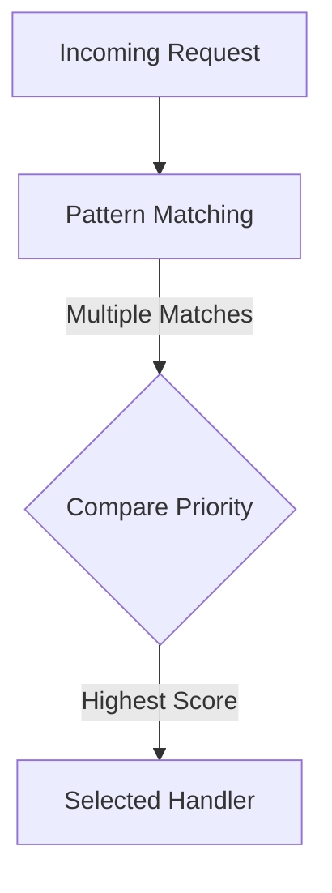

**Module**: `core/prioritization/`

The Prioritization module dictates how the Orchestrator and the Flow Handlers resolve conflicts when multiple routing rules or intents match a single user request.
By default, the framework orchestrates plugins and workflows using a deterministic priority score, where a higher integer value represents a higher routing preference.

## Priority Resolution Logic

During an orchestration cycle, the system matches the input against available capability patterns. If multiple handlers match, the `priority` integer dictates the winner.



## Using Priorities in Plugins

When defining flow handlers in a plugin, you must assign a priority to ensure your plugin takes precedence over fallback or generic handlers.

```python
# snippet from a Flow Handler definition
{
    "intent": "domain_specific_action",
    "description": "Handles highly specific domain tasks",
    "patterns": ["analyze financial data", "run quarterly report"],
    "priority": 100  # High priority for precise matches
}
```

### Priority Tiers Guidelines

| Priority Range | Use Case                                                                                                     |
| -------------- | ------------------------------------------------------------------------------------------------------------ |
| **100 - 199**  | High-priority, domain-specific intents. Use these for explicit, precise commands targeting specific plugins. |
| **50 - 99**    | Normal routing rules and standard agent tasks.                                                               |
| **1 - 49**     | Low-priority, catch-all, fallback intents, or generic AI chatting.                                           |

If you notice a plugin is not intercepting requests properly because a generic `chat` router is triggering instead, the **solution is to increase the `priority`** of your specific plugin's flow handler.
