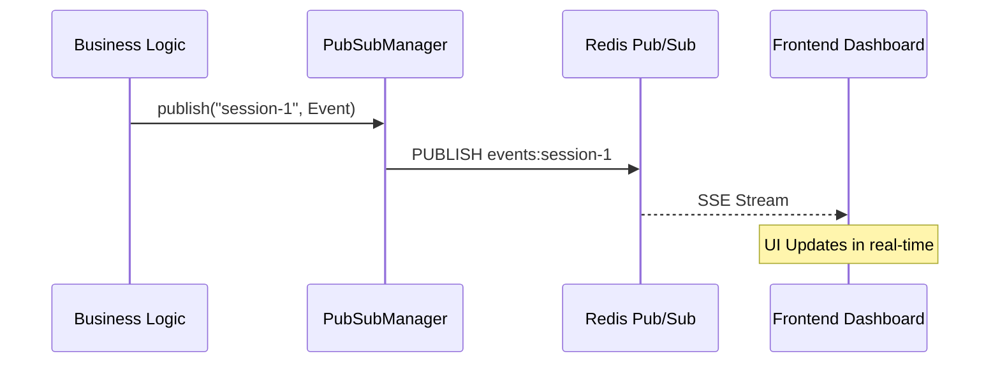

The `core/realtime` module provides the infrastructure for real-time event broadcasting within the BaselithCore framework. It primarily uses Redis Pub/Sub to facilitate Server-Sent Events (SSE) for the frontend dashboard and inter-service communication.

## Overview

The system is designed for high-concurrency event delivery, allowing the frontend to react instantly to agent activities, task updates, and system alerts without constant polling.

**Key Features**:

- **Redis-Backed**: Low-latency event delivery using Redis Pub/Sub.
- **Channel Partitioning**: Targeted broadcasting (Global, Session-specific, or Agent-specific).
- **SSE Compatible**: Native support for Server-Sent Events payloads.
- **Typed Events**: Enforced structure for consistency across different types of triggers.

---

## Publishing Events

Use the `PubSubManager` to broadcast events to the system.

```python
from core.realtime.pubsub import PubSubManager
from core.realtime.events import RealtimeEvent

pubsub = PubSubManager(redis_url="redis://localhost:6379")

# Broadcast a global alert
await pubsub.publish(
    channel="global",
    event=RealtimeEvent(
        type="system_alert",
        data={"message": "System maintainance in 10 minutes"}
    )
)

# Send an update for a specific session
await pubsub.publish(
    channel="session-123",
    event=RealtimeEvent(
        type="agent_typing",
        data={"agent": "researcher"}
    )
)
```

---

## Subscribing to Events

The system allows async consumers to listen to multiple channels simultaneously.

```python
async for message in pubsub.subscribe(["session-123", "alerts"]):
    # message format: {"event": str, "data": str}
    print(f"Received {message['event']}: {message['data']}")
```

---

## Event Architecture



---

## Common Event Types

The framework uses the following standard event types:

| Type             | Description                                |
| ---------------- | ------------------------------------------ |
| `agent_status`   | Lifecycle changes (thinking, responding)   |
| `task_progress`  | Updates on background job completion       |
| `chat_message`   | New messages in a session                  |
| `system_metric`  | Real-time CPU/Memory/Cost updates          |
| `security_audit` | Alerts from guardrails or adversarial test |

---

## Best Practices

!!! danger "Payload Limits"
    Redis Pub/Sub is not designed for transferring large files. Keep event payloads small (KB range). For large data, publish a reference (UUID/URL) and store the data in a persistent database.

!!! tip "Scaling"
    The `global` channel is delivered to every connected client. Use specific channels (`session-{id}`) whenever possible to reduce network overhead.
