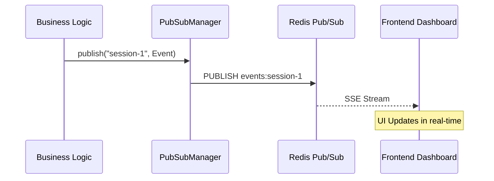

The `core/realtime` module provides the infrastructure for real-time event broadcasting within the BaselithCore framework. It primarily uses Redis Pub/Sub to facilitate Server-Sent Events (SSE) for the frontend dashboard and inter-service communication. It also hosts the transport-agnostic
[duplex voice session contract](#duplex-voice-sessions-duplexvoicesession)
that provider adapters in plugins implement.

## Overview

The system is designed for high-concurrency event delivery, allowing the frontend to react instantly to agent activities, task updates, and system alerts without constant polling.

**Key Features**:

- **Redis-Backed**: Low-latency event delivery using Redis Pub/Sub.
- **Channel Partitioning**: Targeted broadcasting (Global, Session-specific, or Agent-specific).
- **SSE Compatible**: Native support for Server-Sent Events payloads.
- **Typed Events**: Enforced structure for consistency across different types of triggers.

---

## Publishing Events

Use the `PubSubManager` to broadcast events to the system.

```python
from core.realtime.pubsub import PubSubManager
from core.realtime.events import RealtimeEvent

pubsub = PubSubManager(redis_url="redis://localhost:6379")

# Broadcast a global alert
await pubsub.publish(
    channel="global",
    event=RealtimeEvent(
        type="system_alert",
        data={"message": "System maintainance in 10 minutes"}
    )
)

# Send an update for a specific session
await pubsub.publish(
    channel="session-123",
    event=RealtimeEvent(
        type="agent_typing",
        data={"agent": "researcher"}
    )
)
```

`publish()` never raises: a broker failure is logged at `error` level and
swallowed, because a dropped UI notification must not fail the request that
produced it. Treat SSE delivery as best-effort and keep authoritative state in
the database.

### Connection reuse

`PubSubManager` keeps **one long-lived publisher client** for the process,
built lazily on first publish behind an `asyncio.Lock` (double-checked, so a
burst of concurrent first-publishes creates exactly one). It comes from
`core.cache.redis_cache.create_redis_client`, which hands out clients backed by
the process-wide **bounded** connection pool — the same pool the cache layer
uses, with `max_connections`, health checks and socket deadlines already
configured.

!!! info "Why not a client per event"
    Building a client *and* its own `ConnectionPool` per published event, then
    closing it, meant a TCP connect, a Redis handshake and a teardown on **every
    SSE broadcast** — with agent status, task progress and metric events, that
    is per-token-ish traffic. `PUBLISH` is stateless: one connection serves the
    whole process.

Subscribers are the exception. `subscribe()` still calls `get_redis_async()` for
a **distinct** client per stream, because a `pubsub()` connection is held for
the lifetime of the subscription and cannot be shared with publishers; only the
pool underneath is shared.

Release the publisher on shutdown (idempotent — safe to call twice, and a later
`publish()` transparently rebuilds it):

```python
await pubsub.close()
```

A short-lived manager — the indexing job in `core/task_queue/jobs/indexing.py`
builds one per invocation — does not have to close: the client hands its
connections back to the process-wide pool, so an unclosed manager leaks neither
a pool nor a socket. Call `close()` when you own the lifecycle explicitly.

---

## Subscribing to Events

The system allows async consumers to listen to multiple channels simultaneously.

```python
async for message in pubsub.subscribe(["session-123", "alerts"]):
    # message format: {"event": str, "data": str}
    print(f"Received {message['event']}: {message['data']}")
```

---

## Event Architecture


```mermaid
sequenceDiagram
    participant Logic as Business Logic
    participant PS as PubSubManager
    participant Redis as Redis Pub/Sub
    participant Dash as Frontend Dashboard

    Logic->>PS: publish("session-1", Event)
    PS->>Redis: PUBLISH events:session-1
    Redis-->>Dash: SSE Stream
    Note over Dash: UI Updates in real-time
```

---

## Common Event Types

The framework uses the following standard event types:

| Type             | Description                                |
| ---------------- | ------------------------------------------ |
| `agent_status`   | Lifecycle changes (thinking, responding)   |
| `task_progress`  | Updates on background job completion       |
| `chat_message`   | New messages in a session                  |
| `system_metric`  | Real-time CPU/Memory/Cost updates          |
| `security_audit` | Alerts from guardrails or adversarial test |

---

## Best Practices

!!! danger "Payload Limits"
    Redis Pub/Sub is not designed for transferring large files. Keep event payloads small (KB range). For large data, publish a reference (UUID/URL) and store the data in a persistent database.

!!! tip "Scaling"
    The `global` channel is delivered to every connected client. Use specific channels (`session-{id}`) whenever possible to reduce network overhead.

---

## Duplex voice sessions (`DuplexVoiceSession`)

`core/realtime/duplex.py` defines the event vocabulary and the
`DuplexVoiceSession` protocol for full-duplex, low-latency voice
conversations: user audio streaming up while assistant audio streams down,
with barge-in support. The contract is deliberately transport- and
provider-agnostic — WebSocket adapters, WebRTC bridges, or in-process fakes
all satisfy the same protocol, and consumers (playback loops, telephony
bridges, tests) depend only on this module.

The protocol (all symbols exported from `core.realtime`):

| Member | Purpose |
|--------|---------|
| `async events()` | Coroutine returning the inbound async iterator of `DuplexEvent` values; connection failures must surface as a `SessionError` event followed by the end of the stream |
| `async send_audio(pcm)` | Stream a chunk of user microphone audio (raw PCM16 bytes) to the provider |
| `async cancel_response()` | Abort the in-flight assistant response (barge-in) |
| `async close()` | Tear down the transport and release resources |
| `closed` (property) | Whether the session is closed or has terminally failed |

Because `events()` is a coroutine *returning* an async iterator, the
consumption idiom is:

```python
async for event in await session.events():
    ...
```

### Event vocabulary (`DuplexEvent`)

| Event | Meaning |
|-------|---------|
| `AudioDelta(data)` | A chunk of assistant audio (raw PCM bytes) to play back |
| `TranscriptDelta(text, role)` | Incremental transcript for `"user"` or `"assistant"` |
| `SpeechStarted` | The user started speaking (voice-activity detection fired) |
| `SpeechStopped` | The user stopped speaking (end of utterance detected) |
| `ResponseStarted` | The assistant began generating a response |
| `ResponseDone` | The assistant finished (or aborted) the current response |
| `SessionError(message)` | A session-level error from the transport or provider |

### The boundary

Only the protocol belongs in core. Domain-specific adapters — the OpenAI
Realtime WebSocket session, audio device plumbing, and the barge-in
playback loop — live under `plugins/` per the Sacred Core rule. The
shipped implementation is in the `baselithbot` plugin
(`OpenAIRealtimeSession`, `RealtimeVoiceLoop`, opt-in via
`BASELITHBOT_VOICE_REALTIME_ENABLED`): see
[Baselithbot — Realtime duplex voice](../plugins/baselithbot.md#realtime-duplex-voice).
