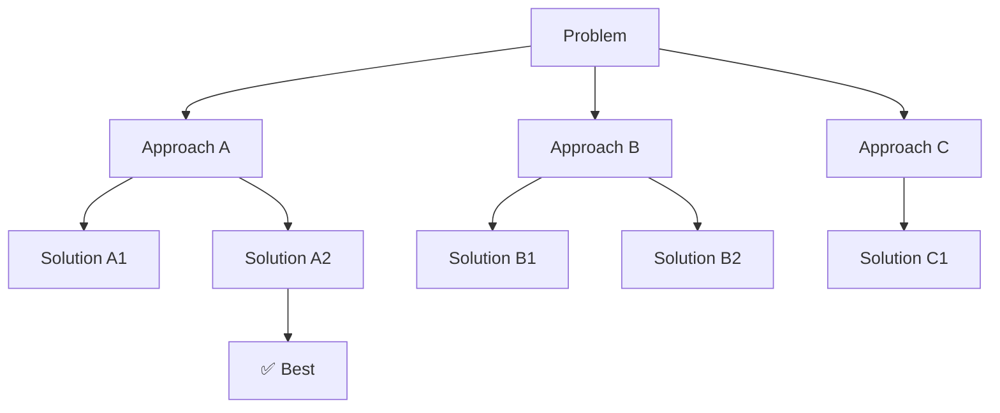

<!-- markdownlint-disable MD046 -->

The `core/reasoning` module implements advanced reasoning patterns.

## Available Patterns

| Pattern              | Description           | Module               |
| -------------------- | --------------------- | -------------------- |
| **ReAct**            | Reasoning + Acting    | `react.py`           |
| **Chain-of-Thought** | Sequential reasoning  | `cot.py`             |
| **Reflection**       | Generate-Critique     | `self_correction.py` |
| **Plan-and-Execute** | Fixed planning        | `patterns.py`        |
| **Tree-of-Thoughts** | Parallel exploration  | `tot/`               |

### Pattern Comparison Matrix

Choosing the right pattern depends on the problem and resource constraints.

| Feature             | Chain-of-Thought | Tree-of-Thoughts                         | Self-Correction     |
| ------------------- | ---------------- | ---------------------------------------- | ------------------- |
| **Complexity**      | Low              | High                                     | Medium              |
| **Latency**         | ~2-5s            | ~10-30s                                  | ~5-10s              |
| **LLM Costs**       | 1x               | 5-15x                                    | 2-3x                |
| **Accuracy**        | Good             | Excellent                                | Very good           |
| **Parallelization** | No               | Yes                                      | No                  |
| **Ideal Use Case**  | Linear problems  | Complex problems with multiple solutions | Response validation |

### When to Use Which Pattern

#### Usage: Chain-of-Thought (CoT)

**When to Use**:

- Problems with clear and linear solution
- Limited budget (latency or costs)
- Simple reasoning (3-5 steps)

**Examples**:

- Step-by-step mathematical calculations
- Sequential analysis ("First do X, then Y, then Z")
- Guided troubleshooting

```python
# Good case for CoT
answer, steps = await cot.reason("Calculate 15% of 80, then add 20")
```

#### Usage: Tree-of-Thoughts (ToT)

**When to Use**:

- Open problems with multiple valid solutions
- Critical quality (worth paying 5-10x)
- Creative exploration needed

**Examples**:

- Business strategy ("How to increase sales?")
- Architectural design ("Which tech stack to choose?")
- Creative problem solving

```python
# Good case for ToT
result = await tot.solve("Propose 3 strategies to reduce user churn", k=3)
```

#### Usage: Self-Correction

**When to Use**:

- Critical responses that must be accurate
- Medium budget (acceptable 2-3x)
- Post-generation quality verification

**Examples**:

- Factual data responses ("Who is the CEO of...?")
- Code generation (syntax verification)
- Translations (accuracy verification)

```python
# Good case for Self-Correction
response = await llm.generate_response("What is the capital of France?")
result = await self_corrector.correct(response)
print(result.corrected)
```

!!! tip "Pattern Combination"
    You can combine patterns:
    ```python
    # ToT to explore solutions + Self-Correction to validate them
    tot_result = await tot.solve(problem)
    correction = await self_corrector.correct(tot_result["best_solution"])
    ```

---

## ReAct (Reasoning + Acting)

The `ReActAgent` implements the **Thought/Action/Observation** loop. It allows the agent to reason about a task, execute a tool, observe the result, and decide the next step dynamically.

### Basic Usage

```python
from core.reasoning.react import ReActAgent, ToolDefinition

async def search(query: str) -> str:
    return f"Results for: {query}"

agent = ReActAgent(
    tools=[ToolDefinition(name="search", fn=search, description="Search the web")],
    max_iterations=5
)

result = await agent.run("What is the population of Tokyo?")
print(result.final_answer)
```

### Trace Logic

ReAct produces a detailed execution trace, which is invaluable for debugging complex multi-step reasoning.

```python
for step in result.trace:
    print(step)

# [iter=1] Thought: I need to search for the population of Tokyo.
# [iter=1] Action: search(Tokyo population)
# [iter=1] Observation: Tokyo's population is approx 14 million.
# [iter=2] Thought: I have the information.
# [iter=2] Final Answer: The population of Tokyo is approximately 14 million.
```

---

## Pattern Selection Registry

BaselithCore includes a **Pattern Registry** and a **Heuristic Selector** to automatically choose the best reasoning pattern for a given task.

### Registry Definitions

| Pattern | Best For |
| :--- | :--- |
| **ReAct** | Information gathering, multi-step research. |
| **CoT** | Logic, math, deep analysis without tools. |
| **Reflection** | Content creation, code generation, iterative refinement. |
| **Plan-and-Execute** | Stable, predictable workflows with clear steps. |

### Usage: Pattern Selector

```python
from core.reasoning.patterns import PatternSelector

selector = PatternSelector()
result = selector.select("Calculate the ROI of a $10k investment over 5 years.")
print(f"Chosen Pattern: {result.pattern}")
# Chosen Pattern: chain_of_thought
```

---

## Complexity Classifier

*“If you can draw the logic as a flowchart with no branches that depend on LLM output, you don't need an agent.”* — §1.4 of the framework guide.

The `ComplexityClassifier` helps you decide whether to use an autonomous agent or a simpler, deterministic pipeline.

```python
from core.reasoning import ComplexityClassifier  # lives in core/reasoning/complexity.py

assessment = ComplexityClassifier.assess("Send a reminder email to user #123")
if assessment.use_agent:
    print("Agent recommended:", assessment.reason)
else:
    print("Pipeline sufficient:", assessment.reason)
    # Output: Pipeline sufficient: simple CRUD/notification operation
```

---

## Chain-of-Thought (CoT)

Linear step-by-step reasoning:

`ChainOfThought(llm_service=None)` lazily resolves the global LLM service if none is
passed. `reason(question, context=None)` returns a `tuple[str, list[ReasoningStep]]` —
the final answer plus the structured trace. `reason` awaits
`generate_response` directly on the event loop (no thread offload of an async
method), so it composes cleanly with the async orchestration stack:

```python
from core.reasoning import ChainOfThought, ReasoningStep

cot = ChainOfThought()

answer, steps = await cot.reason(
    "If I have 15 apples and give 3 to Marco and 2 to Lucia, how many are left?"
)

print(answer)  # "10 apples"
for step in steps:
    # ReasoningStep(step_number, thought, conclusion=None)
    print(step.step_number, step.thought)
```

---

## Tree-of-Thoughts (ToT)

Parallel exploration of solutions. `TreeOfThoughts(llm_service=None)` takes only an
optional LLM service — search parameters are passed to `solve()`, not the constructor.
`solve()` returns a **dict** (keys: `solution`, `best_solution`, `steps`,
`tree_visualization`, `tree_data`):

```python
from core.reasoning import TreeOfThoughts

tot = TreeOfThoughts()

result = await tot.solve(
    problem="How to optimize web application performance?",
    k=3,             # branching factor (thoughts per expansion)
    max_steps=4,     # maximum tree depth
    strategy="mcts", # "mcts" (default) or "bfs"
    iterations=30,   # MCTS rollouts (passed via **kwargs)
)

print(result["best_solution"])
print(result["steps"])
print(result["tree_visualization"])  # Mermaid diagram
```

`TreeOfThoughts` is fully async and drives the real
`LLMService.generate_response` directly. Each expansion issues **one batched LLM
call** requesting all `k` thoughts at once, instead of `k` identical
single-thought calls (which single-flight deduplication would collapse into one,
destroying branching diversity). `TreeOfThoughtsAsync` remains a
backward-compatible alias subclass that parallelizes evaluation with
`asyncio.gather()`.

### ToT Structure

```text
core/reasoning/
├── mcts_common.py  # Shared MCTS utilities (uct_score, backpropagate_*)
└── tot/
    ├── __init__.py
    ├── tree.py         # Tree structure (ThoughtNode, export helpers)
    ├── mcts.py         # MCTS search (uct_select, backpropagate, mcts_search[_async])
    ├── engine.py       # TreeOfThoughts / TreeOfThoughtsAsync solve loop
    └── cache.py        # ThoughtCache (LRU + TTL)
```

The `mcts_common` module provides shared utility functions (`uct_score`, `backpropagate_moving_avg`, `backpropagate_cumulative`) used by both the Tree-of-Thoughts MCTS and the World Model simulation.

!!! note "Bounded exploration"
    Every ToT path is bounded. The MCTS phase is capped by `iterations`/`max_steps`, and the non-MCTS fallback expansion is bounded by the same step budget (it never spins unconditionally) and stops early when a node can no longer be expanded. This keeps a degenerate run from burning latency or cost — set a maximum and the engine respects it.

### Visualization



### Search Strategies in ToT

`solve()` accepts a `strategy` argument selecting the exploration algorithm:

| Strategy | Value | Description |
| -------- | ----- | ----------- |
| **MCTS** | `"mcts"` (default) | Monte Carlo Tree Search with UCT selection. Best exploration/efficiency balance. |
| **BFS**  | `"bfs"` | Breadth-first beam expansion over the tree. |

```python
# Monte Carlo Tree Search (default), 30 rollouts
result = await tot.solve("...", k=3, max_steps=4, strategy="mcts", iterations=30)

# Breadth-first expansion
result = await tot.solve("...", k=3, max_steps=4, strategy="bfs")
```

!!! note "Tuning"
    - **`k`** (branching factor) — thoughts generated per expansion. 3-5 is a good range.
    - **`max_steps`** — tree depth cap; each extra level adds latency and cost.
    - **`iterations`** — MCTS rollout budget; bounds total work so a run can never spin unconditionally.

The default search depth, branching factor, and beam width also come from the
`ReasoningConfig` (env prefix `TOT_`) — see [Configuration](#configuration).

---

## Self-Correction

Response self-correction. `SelfCorrector(llm_service=None, max_corrections=None,
config=None)` runs an iterative critique/repair loop. `correct(response, context=None)`
returns a `CorrectionResult`:

```python
from core.reasoning import SelfCorrector

corrector = SelfCorrector(max_corrections=2)

# Initial potentially incorrect response
initial_response = "The capital of France is London"

result = await corrector.correct(initial_response)

print(result.corrected)          # "The capital of France is Paris"
print(result.corrections_made)   # number of repair iterations applied
print(result.is_valid)
```

`CorrectionResult` exposes `original`, `corrected`, `corrections_made`, and `is_valid`.
When `max_corrections` is omitted it falls back to `ReasoningConfig.self_correction_max_iterations`.

---

## Integration with Orchestrator

Reasoning patterns are exposed as Flow Handlers:

```python
# plugins/reasoning/handlers.py
from core.reasoning import TreeOfThoughts

class ReasoningHandler:
    def __init__(self, plugin):
        self.tot = TreeOfThoughts()
        self.depth = plugin.config.get("depth", 3)

    async def handle(self, query: str, context: dict) -> str:
        result = await self.tot.solve(query, k=3, max_steps=self.depth)
        return result["best_solution"]
```

---

## Performance Metrics

Expected metrics for each pattern on medium complexity problems.

### Chain-of-Thought Metrics

| Metric              | Typical Value |
| ------------------- | ------------- |
| Latency             | 2-5 seconds   |
| Token Usage         | 500-1500      |
| Cost (GPT-4)        | $0.01-$0.03   |
| Success (math)      | 85-92%        |
| Success (reasoning) | 75-85%        |

### Tree-of-Thoughts Metrics

| Metric            | Typical Value | Configuration        |
| ----------------- | ------------- | -------------------- |
| Latency           | 15-30 seconds | branching=3, depth=3 |
| Token Usage       | 5000-15000    | beam_width=5         |
| Cost (GPT-4)      | $0.10-$0.30   |                      |
| Success (complex) | 90-95%        | With good evaluator  |

**Scaling**:

- Each additional level: +5-10s latency
- Each additional branch: +30-50% costs

### Self-Correction Metrics

| Metric        | Typical Value | Configuration    |
| ------------- | ------------- | ---------------- |
| Latency       | 5-10 seconds  | max_iterations=3 |
| Token Usage   | 1500-3000     |                  |
| Cost (GPT-4)  | $0.03-$0.06   |                  |
| Accuracy Lift | +10-15%       | vs single-shot   |

### Internal Benchmark

Data from 1000+ runs on mixed problems:

```python
# Metrics tracking example
from core.reasoning import ChainOfThought
import time

cot = ChainOfThought()

start = time.time()
answer, steps = await cot.reason(problem)
latency = time.time() - start

print(f"Latency: {latency:.2f}s")
print(f"Steps: {len(steps)}")
print(f"Answer: {answer}")
```

!!! tip "Optimization"
    To reduce ToT cost, keep `k` (branching factor), `max_steps`, and `iterations`
    small, and reserve `strategy="mcts"` with a larger `iterations` budget only for
    genuinely hard problems.

---

## Configuration

Reasoning settings live in `ReasoningConfig` (`core/config/reasoning.py`) under the
`TOT_` env prefix:

```env title=".env"
TOT_MAX_DEPTH=3
TOT_BRANCHING_FACTOR=3
TOT_BEAM_WIDTH=3
TOT_STRATEGY=bfs            # "bfs" or "dfs"

# Self-correction
TOT_SELF_CORRECTION_MAX_ITERATIONS=2

# Thought cache
TOT_THOUGHT_CACHE_MAXSIZE=1000
TOT_THOUGHT_CACHE_TTL=1800.0
```
