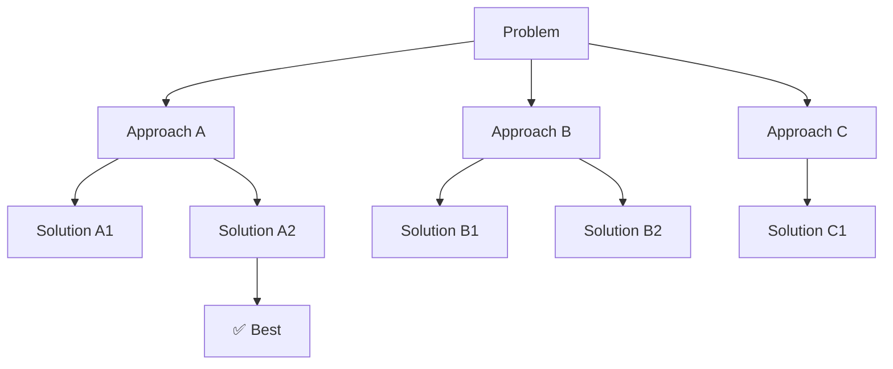

<!-- markdownlint-disable MD046 -->

The `core/reasoning` module implements advanced reasoning patterns.

## Available Patterns

| Pattern              | Description           | Module               |
| -------------------- | --------------------- | -------------------- |
| **ReAct**            | Reasoning + Acting    | `react.py`           |
| **Chain-of-Thought** | Sequential reasoning  | `cot.py`             |
| **Reflection**       | Generate-Critique     | `self_correction.py` |
| **Plan-and-Execute** | Fixed planning        | `patterns.py`        |
| **Tree-of-Thoughts** | Parallel exploration  | `tot/`               |

### Pattern Comparison Matrix

Choosing the right pattern depends on the problem and resource constraints.

| Feature             | Chain-of-Thought | Tree-of-Thoughts                         | Self-Correction     |
| ------------------- | ---------------- | ---------------------------------------- | ------------------- |
| **Complexity**      | Low              | High                                     | Medium              |
| **Latency**         | ~2-5s            | ~10-30s                                  | ~5-10s              |
| **LLM Costs**       | 1x               | 5-15x                                    | 2-3x                |
| **Accuracy**        | Good             | Excellent                                | Very good           |
| **Parallelization** | No               | Yes                                      | No                  |
| **Ideal Use Case**  | Linear problems  | Complex problems with multiple solutions | Response validation |

### When to Use Which Pattern

#### Usage: Chain-of-Thought (CoT)

**When to Use**:

- Problems with clear and linear solution
- Limited budget (latency or costs)
- Simple reasoning (3-5 steps)

**Examples**:

- Step-by-step mathematical calculations
- Sequential analysis ("First do X, then Y, then Z")
- Guided troubleshooting

```python
# Good case for CoT
problem = "Calculate 15% of 80, then add 20"
result = await cot.reason(problem, steps=3)
```

#### Usage: Tree-of-Thoughts (ToT)

**When to Use**:

- Open problems with multiple valid solutions
- Critical quality (worth paying 5-10x)
- Creative exploration needed

**Examples**:

- Business strategy ("How to increase sales?")
- Architectural design ("Which tech stack to choose?")
- Creative problem solving

```python
# Good case for ToT
problem = "Propose 3 strategies to reduce user churn"
result = await tot.explore(problem, branching_factor=3)
```

#### Usage: Self-Correction

**When to Use**:

- Critical responses that must be accurate
- Medium budget (acceptable 2-3x)
- Post-generation quality verification

**Examples**:

- Factual data responses ("Who is the CEO of...?")
- Code generation (syntax verification)
- Translations (accuracy verification)

```python
# Good case for Self-Correction
response = await llm.generate("What is the capital of France?")
corrected = await self_corrector.check_and_correct(query, response)
```

!!! tip "Pattern Combination"
    You can combine patterns:
    ```python
    # ToT to explore solutions + Self-Correction to validate them
    solutions = await tot.explore(problem)
    best = await self_corrector.validate_and_improve(solutions[0])
    ```

---

## ReAct (Reasoning + Acting)

The `ReActAgent` implements the **Thought/Action/Observation** loop. It allows the agent to reason about a task, execute a tool, observe the result, and decide the next step dynamically.

### Basic Usage

```python
from core.reasoning.react import ReActAgent, ToolDefinition

async def search(query: str) -> str:
    return f"Results for: {query}"

agent = ReActAgent(
    tools=[ToolDefinition(name="search", fn=search, description="Search the web")],
    max_iterations=5
)

result = await agent.run("What is the population of Tokyo?")
print(result.final_answer)
```

### Trace Logic

ReAct produces a detailed execution trace, which is invaluable for debugging complex multi-step reasoning.

```python
for step in result.trace:
    print(step)

# [iter=1] Thought: I need to search for the population of Tokyo.
# [iter=1] Action: search(Tokyo population)
# [iter=1] Observation: Tokyo's population is approx 14 million.
# [iter=2] Thought: I have the information.
# [iter=2] Final Answer: The population of Tokyo is approximately 14 million.
```

---

## Pattern Selection Registry

BaselithCore includes a **Pattern Registry** and a **Heuristic Selector** to automatically choose the best reasoning pattern for a given task.

### Registry Definitions

| Pattern | Best For |
| :--- | :--- |
| **ReAct** | Information gathering, multi-step research. |
| **CoT** | Logic, math, deep analysis without tools. |
| **Reflection** | Content creation, code generation, iterative refinement. |
| **Plan-and-Execute** | Stable, predictable workflows with clear steps. |

### Usage: Pattern Selector

```python
from core.reasoning.patterns import PatternSelector

selector = PatternSelector()
result = selector.select("Calculate the ROI of a $10k investment over 5 years.")
print(f"Chosen Pattern: {result.pattern}")
# Chosen Pattern: chain_of_thought
```

---

## Complexity Classifier

*“If you can draw the logic as a flowchart with no branches that depend on LLM output, you don't need an agent.”* — §1.4 of the framework guide.

The `ComplexityClassifier` helps you decide whether to use an autonomous agent or a simpler, deterministic pipeline.

```python
from core.reasoning.patterns import ComplexityClassifier

assessment = ComplexityClassifier.assess("Send a reminder email to user #123")
if assessment.use_agent:
    print("Agent recommended:", assessment.reason)
else:
    print("Pipeline sufficient:", assessment.reason)
    # Output: Pipeline sufficient: simple CRUD/notification operation
```

---

## Chain-of-Thought (CoT)

Linear step-by-step reasoning:

```python
from core.reasoning import ChainOfThought

cot = ChainOfThought()

result = await cot.reason(
    problem="If I have 15 apples and give 3 to Marco and 2 to Lucia, how many are left?",
    steps=4
)

print(result.final_answer)  # "10 apples"
print(result.reasoning_chain)
# [
# "Step 1: I have 15 initial apples",
# "Step 2: I give 3 apples to Marco, 15-3=12 remain",
# "Step 3: I give 2 apples to Lucia, 12-2=10 remain",
# "Step 4: The answer is 10 apples"
# ]
```

---

## Tree-of-Thoughts (ToT)

Parallel exploration of solutions:

```python
from core.reasoning import TreeOfThoughts

tot = TreeOfThoughts(
    branching_factor=3,  # Branches per node
    max_depth=4,         # Max depth
    beam_width=5         # Top N nodes to expand
)

result = await tot.explore(
    problem="How to optimize web application performance?",
    evaluation_fn=score_solution
)

print(result.best_solution)
print(result.solution_score)
print(result.explored_nodes)
```

### ToT Structure

```text
core/reasoning/
├── mcts_common.py  # Shared MCTS utilities (UCB1, backpropagation)
└── tot/
    ├── __init__.py
    ├── tree.py         # Tree structure (ThoughtNode)
    ├── mcts.py         # MCTS search (uses mcts_common)
    ├── search.py       # BFS/DFS/Beam search strategies
    └── evaluator.py    # Solution evaluation
```

The `mcts_common` module provides shared utility functions (`uct_score`, `backpropagate_moving_avg`, `backpropagate_cumulative`) used by both the Tree-of-Thoughts MCTS and the World Model simulation.

!!! note "Bounded exploration"
    Every ToT path is bounded. The MCTS phase is capped by `iterations`/`max_steps`, and the non-MCTS fallback expansion is bounded by the same step budget (it never spins unconditionally) and stops early when a node can no longer be expanded. This keeps a degenerate run from burning latency or cost — set a maximum and the engine respects it.

### Visualization



### Search Algorithms in ToT

TreeOfThoughts supports different tree exploration strategies.

#### Breadth-First Search (BFS)

Explores all nodes at each level before descending:

```python
tot = TreeOfThoughts(
    branching_factor=3,
    search_strategy="bfs"
)
```

**Pros**: Finds shallowest solution (fewest steps)
**Cons**: High memory usage with wide trees

#### Depth-First Search (DFS)

Explores a branch thoroughly before backtracking:

```python
tot = TreeOfThoughts(
    branching_factor=3,
    search_strategy="dfs",
    max_depth=5
)
```

**Pros**: Low memory usage
**Cons**: Can get lost in unpromising branches

#### Beam Search (Recommended)

Keeps only the top-K most promising nodes:

```python
tot = TreeOfThoughts(
    branching_factor=5,     # Generate 5 options per node
    beam_width=3,           # Keep only best 3
    search_strategy="beam"
)
```

**Pros**: Balance between exploration and efficiency
**Cons**: Requires good evaluation function

**Visual Example**:

```text
Level 0:     [Root]
               |
               v
Level 1:  [A] [B] [C] [D] [E]  (5 generated)
           ^   ^   ^
Level 2:  Top-3 expanded (beam_width=3)
```

!!! tip "Tuning Beam Width"
    - **beam_width=1**: Greedy (fast but risky)
    - **beam_width=3-5**: Sweet spot for most use cases
    - **beam_width=10+**: Wide exploration (expensive)

---

## Self-Correction

Response self-correction:

```python
from core.reasoning import SelfCorrector

corrector = SelfCorrector()

# Initial potentially incorrect response
initial_response = "The capital of France is London"

result = await corrector.check_and_correct(
    query="What is the capital of France?",
    response=initial_response
)

if result.was_corrected:
    print(f"Correction: {result.corrected_response}")
    # "The capital of France is Paris"
    print(f"Reason: {result.reason}")
```

---

## Integration with Orchestrator

Reasoning patterns are exposed as Flow Handlers:

```python
# plugins/reasoning/handlers.py
from core.reasoning import TreeOfThoughts

class ReasoningHandler:
    def __init__(self, plugin):
        self.tot = TreeOfThoughts(
            branching_factor=3,
            max_depth=plugin.config.get("depth", 3)
        )

    async def handle(self, query: str, context: dict) -> str:
        result = await self.tot.explore(query)
        return result.best_solution
```

---

## Performance Metrics

Expected metrics for each pattern on medium complexity problems.

### Chain-of-Thought Metrics

| Metric              | Typical Value |
| ------------------- | ------------- |
| Latency             | 2-5 seconds   |
| Token Usage         | 500-1500      |
| Cost (GPT-4)        | $0.01-$0.03   |
| Success (math)      | 85-92%        |
| Success (reasoning) | 75-85%        |

### Tree-of-Thoughts Metrics

| Metric            | Typical Value | Configuration        |
| ----------------- | ------------- | -------------------- |
| Latency           | 15-30 seconds | branching=3, depth=3 |
| Token Usage       | 5000-15000    | beam_width=5         |
| Cost (GPT-4)      | $0.10-$0.30   |                      |
| Success (complex) | 90-95%        | With good evaluator  |

**Scaling**:

- Each additional level: +5-10s latency
- Each additional branch: +30-50% costs

### Self-Correction Metrics

| Metric        | Typical Value | Configuration    |
| ------------- | ------------- | ---------------- |
| Latency       | 5-10 seconds  | max_iterations=3 |
| Token Usage   | 1500-3000     |                  |
| Cost (GPT-4)  | $0.03-$0.06   |                  |
| Accuracy Lift | +10-15%       | vs single-shot   |

### Internal Benchmark

Data from 1000+ runs on mixed problems:

```python
# Metrics tracking example
from core.reasoning import ChainOfThought
import time

cot = ChainOfThought()

start = time.time()
result = await cot.reason(problem)
latency = time.time() - start

print(f"Latency: {latency:.2f}s")
print(f"Steps: {len(result.reasoning_chain)}")
print(f"Tokens: {result.token_usage}")
print(f"Cost: ${result.cost:.4f}")
```

!!! tip "Optimization"
    To reduce ToT costs:
    - Use cheaper model for exploration (e.g., GPT-3.5)
    - Premium model only for final refinement

    ```python
    tot = TreeOfThoughts(
        exploration_model="gpt-3.5-turbo",  # Cheap
        refinement_model="gpt-4o",          # Expensive
    )
    ```

---

## Configuration

```env title=".env"
REASONING_DEFAULT_DEPTH=3
REASONING_BRANCHING_FACTOR=3
REASONING_BEAM_WIDTH=5
REASONING_TIMEOUT_SECONDS=60
```
