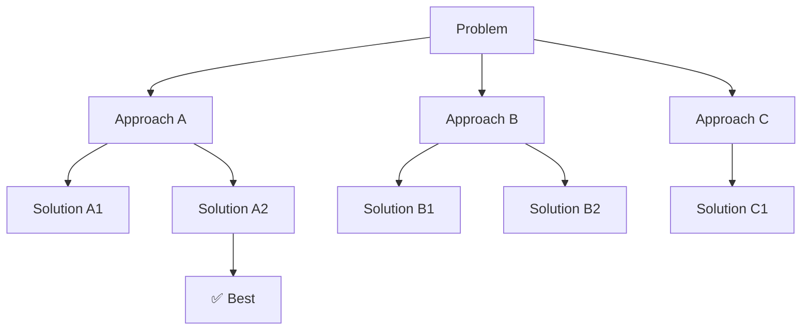

<!-- markdownlint-disable MD046 -->

The `core/reasoning` module implements advanced reasoning patterns.

## Available Patterns

| Pattern              | Description           | Module               |
| -------------------- | --------------------- | -------------------- |
| **ReAct**            | Reasoning + Acting    | `react.py`           |
| **Chain-of-Thought** | Sequential reasoning  | `cot.py`             |
| **Reflection**       | Generate-Critique     | `self_correction.py` |
| **Tree-of-Thoughts** | Parallel exploration  | `tot/`               |

`AgentPattern.PLAN_AND_EXECUTE` exists in `patterns.py` only as a registry and
selector label — there is no plan-and-execute engine in `core/reasoning`. The
planning side lives in [Planning](planning.md) (`TaskPlanner`,
`plan_to_workflow`).

### Pattern Comparison Matrix

Choosing the right pattern depends on the problem and resource constraints.

| Feature             | Chain-of-Thought | Tree-of-Thoughts                         | Self-Correction     |
| ------------------- | ---------------- | ---------------------------------------- | ------------------- |
| **Complexity**      | Low              | High                                     | Medium              |
| **Latency**         | ~2-5s            | ~10-30s                                  | ~5-10s              |
| **LLM Costs**       | 1x               | 5-15x                                    | 2-3x                |
| **Accuracy**        | Good             | Excellent                                | Very good           |
| **Parallelization** | No               | Yes                                      | No                  |
| **Ideal Use Case**  | Linear problems  | Complex problems with multiple solutions | Response validation |

### When to Use Which Pattern

#### Usage: Chain-of-Thought (CoT)

**When to Use**:

- Problems with clear and linear solution
- Limited budget (latency or costs)
- Simple reasoning (3-5 steps)

**Examples**:

- Step-by-step mathematical calculations
- Sequential analysis ("First do X, then Y, then Z")
- Guided troubleshooting

```python
# Good case for CoT
answer, steps = await cot.reason("Calculate 15% of 80, then add 20")
```

#### Usage: Tree-of-Thoughts (ToT)

**When to Use**:

- Open problems with multiple valid solutions
- Critical quality (worth paying 5-10x)
- Creative exploration needed

**Examples**:

- Business strategy ("How to increase sales?")
- Architectural design ("Which tech stack to choose?")
- Creative problem solving

```python
# Good case for ToT
result = await tot.solve("Propose 3 strategies to reduce user churn", k=3)
```

#### Usage: Self-Correction

**When to Use**:

- Critical responses that must be accurate
- Medium budget (acceptable 2-3x)
- Post-generation quality verification

**Examples**:

- Factual data responses ("Who is the CEO of...?")
- Code generation (syntax verification)
- Translations (accuracy verification)

```python
# Good case for Self-Correction
response = await llm.generate_response("What is the capital of France?")
result = await self_corrector.correct(response)
print(result.corrected)
```

!!! tip "Pattern Combination"
    You can combine patterns:
    ```python
    # ToT to explore solutions + Self-Correction to validate them
    tot_result = await tot.solve(problem)
    correction = await self_corrector.correct(tot_result["best_solution"])
    ```

---

## ReAct (Reasoning + Acting)

The `ReActAgent` implements the **Thought/Action/Observation** loop. It allows the agent to reason about a task, execute a tool, observe the result, and decide the next step dynamically.

!!! info "Live via the reasoning handler"
    `ReasoningHandler` (intent `complex_reasoning`) dispatches on
    `context["strategy"]`: `"react"` runs `ReActAgent` over
    `context["react_tools"]`, `"parallel_tools"` runs
    [`ParallelToolExecutor`](orchestration.md) over `context["tool_calls"]` +
    `context["tool_registry"]` (wired with the request's autonomy policy and
    `LoopBudget`; per-tool autonomy categories come from
    `context["tool_categories"]`, defaulting to `destructive` — fail-safe:
    gated for approval — with a warning
    when a policy is active), and `"bfs"` / `"mcts"` (or no value — the
    `TOT_STRATEGY` default) run Tree of Thoughts. An unknown value is rejected
    with `error: True` and `metadata["error"] == "unsupported_strategy"`; a
    tool strategy whose inputs are missing falls back to Tree of Thoughts with
    a warning. `metadata["strategy"]` always names the strategy that actually
    ran, and `metadata["requested_strategy"]` records a request that was not
    honoured. Both engines are reachable through the orchestrator, not only
    standalone.

!!! warning "LLM failures are errors, not answers"
    When no LLM service can be resolved (the failure is logged) or an LLM call
    raises, the loop stops and `ReActResult.error` is set to
    `"llm_unavailable"` or `"llm_error"`; `final_answer` then holds a
    user-safe message, never text parsed as a `Final Answer`. The reasoning
    handler turns a set `error` into `error: True` on its result, with the
    reason in `metadata["error"]`.

### Basic Usage

```python
from core.reasoning.react import ReActAgent, ToolDefinition

async def search(query: str) -> str:
    return f"Results for: {query}"

agent = ReActAgent(
    tools=[ToolDefinition(name="search", fn=search, description="Search the web")],
    max_iterations=5,
    tool_timeout=120.0,   # per-tool-call cap; None (default) = unbounded
    tool_retries=1,       # extra attempts on ConnectionError/OSError only
)

result = await agent.run("What is the population of Tokyo?")
print(result.final_answer)
```

!!! tip "Bounded tool execution"
    `tool_timeout` wraps every tool call in `asyncio.wait_for` so a hung tool
    can't stall the loop (a timed-out *sync* tool keeps running in its thread —
    the loop just stops waiting). `tool_retries` re-attempts **transient**
    failures (`ConnectionError`/`OSError`) with exponential backoff
    (`retry_backoff`, doubled per attempt); timeouts and other exceptions are
    never retried. The orchestrated path (`ReasoningHandler`, strategy
    `"react"`) defaults to `tool_timeout=120.0`/`tool_retries=1`, overridable
    per request via `context["tool_timeout"]` / `context["tool_retries"]`.

!!! note "Registry-served system prompts"
    Both loop variants build their system prompt from the packaged prompt
    catalog (`react_system` for the text loop, `react_native_system` for the
    native loop) via `resolve_catalog_prompt`, with the embedded template as
    fallback when the registry is unavailable. Deployments can version or
    override them through the prompt registry (`BASELITH_PROMPTS_DIR`), and
    every render carries `prompt.name`/`prompt.version` provenance — see
    [Prompt Registry › Packaged catalog prompts](prompts.md#packaged-catalog-prompts).

### Native tool calling

`ReActAgent` can drive the loop over the LLM service's **structured
tool-calling API** (`core/reasoning/react_native.py`) instead of regex-parsing
`Action: tool(args)` text. Tools are described to the model as JSON-Schema
specs and invocations come back as parsed `LLMResult.tool_calls` — typed
keyword arguments, multi-tool turns, no text parsing.

- **Mode selection** — `ReActAgent(native_tools=...)`: `None` (default)
  auto-detects and goes native only when `LLMConfig.enable_native_tools` is on
  **and** the active provider advertises `supports_native_tools` (auto never
  lands on the prompt-coercion fallback); `True` forces the structured loop;
  `False` forces the legacy text loop. Orchestrated path: set
  `context["native_tools"]`. Either transport qualifies as "structured": a
  service exposing only `generate_messages()` is native-capable, and demanding
  a `generate()` would have routed it into the regex text parser — the weakest
  path available — instead.
- **Tool schemas** — `ToolDefinition.parameters` takes an explicit JSON-Schema
  object; when omitted, the schema is inferred from the callable's signature
  (annotations → JSON types, parameters without defaults → `required`).
- **Same contract** — identical `ReActResult`/trace shape, same guarded tool
  execution (`tool_timeout`, transient-only `tool_retries`, output
  truncation), same graceful degradation on LLM errors. The flag is **on by
  default** (`LLM_ENABLE_NATIVE_TOOLS=false` restores the legacy text loop
  everywhere); the `supports_native_tools` guard keeps providers without a
  native API on the text path regardless.

#### The turn is a message, not a rebuilt prompt

The native loop keeps a [neutral `Message` history](messages.md) and only ever
**appends** to it. It does not rebuild a prompt string per iteration any more:

```text
user(query)
  → assistant turn VERBATIM       (message_from_result: thinking + text + tool_use)
  → ONE user message holding every ToolResultBlock of that turn
  → assistant …
```

The transport is
[`generate_over_messages`](services.md#one-round-trip-for-a-message-history),
shared with the typed [`Agent`](agent.md) so the two loops cannot drift apart
— and a service built before the message API still runs, on the flattened
transcript.

What the old flat prompt lost, and the history does not:

| Lost by rebuilding a transcript | Carried by the history |
|---|---|
| Which call a result answers | `ToolResultBlock.tool_use_id` |
| Whether that call failed | `ToolResultBlock.is_error` |
| The assistant turn as the API wants it replayed | `message_from_result(result)`, thinking blocks included |
| Any prompt-cache hit | Append-only, so the prefix stays byte-stable |

Every tool result of a turn goes back in **one** `Message.tool_results([...])`:
a provider rejects a conversation whose parallel `tool_use` blocks are answered
apart, or one whose `tool_use` has no answering `tool_result` at all.

!!! note "Why `is_error` can be read off the observation text"
    The flag comes from `observation_is_error(observation)`
    (`core/reasoning/react_tools.py`) — true when the observation starts with
    `Error`. That prefix is one a tool cannot forge: the loop's own narration is
    the only part of an observation *outside* the
    [untrusted-output envelope](orchestration.md#untrusted-output-envelope),
    while tool-controlled text is sealed inside it with its markers escaped.
    The idempotency ledger already decided success this way; single-sourcing the
    convention keeps the flag the model sees and the outcome the ledger records
    from disagreeing.

#### Concurrent multi-tool turns

When the model emits several tool calls in one turn, it produced all of them
**before seeing any of their results** — they are independent by construction.
`agent._execute_tool_calls()` (`core/reasoning/react_tools.py`) therefore runs
them concurrently, so the turn costs the slowest call instead of the sum:

```python
# core/reasoning/react_native.py — one turn, N calls
observations = await agent._execute_tool_calls(
    [(call.name, call.arguments) for call in calls]
)
```

Concurrency is capped at `MAX_PARALLEL_TOOL_CALLS = 8` via a semaphore, so a
pathological fan-out cannot open an unbounded number of sockets or thread-pool
slots at once. Text-parsed turns are unaffected — the legacy loop emits one
`Action:` at a time by construction.

!!! danger "Gates stay sequential — that is the whole design"
    `_execute_tool_calls` walks the calls **in emission order** and runs the
    contract / autonomy / budget gates for each one *before any tool executes*.
    Only the approved invocations are then overlapped. This ordering is
    load-bearing: `ApprovalPendingError` and `BudgetExceededError` are
    fail-closed refusals that abort the turn, and a refusal is worthless if a
    later tool in the same turn has already run its side effect. Unknown-tool
    and denial observations are filled in at their own index, so the trace and
    the `tool_result` blocks stay in emission order regardless of completion
    order.

    Any gate you add in a subclass must keep this contract — do the check in
    the sequential pass, never inside the concurrent `_invoke_tool` phase.

!!! note "Failure-streak escalation is evaluated after the batch"
    `max_consecutive_tool_failures` / `stall_threshold` are still applied in
    emission order, but only once the concurrent batch has completed: the calls
    already in flight for that turn are not cancelled. The escalation ends the
    *loop*, not the turn that tripped it.

!!! note "Durable runs execute the turn sequentially"
    With a checkpoint attached, `_execute_tool_calls` runs the approved calls
    of a turn **sequentially** instead of concurrently: concurrent per-step
    saves would interleave version bumps in the store. (Step keys no longer
    depend on order — they are content-addressed — so this is about the
    store, not about matching keys.) Correctness of resume beats intra-turn latency.
    Without a checkpoint the concurrent path is unchanged. See
    [Durable tool execution](#durable-tool-execution-checkpoint-replay).

### Gated tool execution

Every tool call — text-parsed and native alike — passes through the same
runtime gates as the parallel executor before it runs:

- **Contract gate** — with a `contract_validator`
  ([`ContractValidator`](orchestration.md)), a tool absent from
  `allowed_tools` or listed in `must_not` is rejected; the denial is returned
  to the model as an error observation so the loop can adapt.
- **Autonomy gate** — always active: an agent constructed without an
  `autonomy_policy` defaults to `AutonomyPolicy()` (`SUPERVISED`). Tools whose
  `ToolDefinition.category` (`read_only` | `mutating` | `destructive` |
  `external_side_effect`, default `destructive` — fail-safe) requires
  approval at the policy's level go through `enforce_approval`: a
  `human_intervention` channel is consulted when present; with a `checkpoint`
  the run pauses durably (`ApprovalPendingError` propagates); otherwise the
  call fails closed and the denial becomes an error observation. Declare
  `category="read_only"` explicitly for side-effect-free tools; pass
  `AutonomyPolicy(level=AutonomyLevel.FULLY_AUTONOMOUS)` where headless
  side-effect execution is intentional.
- **Budget gate** — each invocation is recorded against the request
  `LoopBudget` tool-call cap (explicit `loop_budget` argument, else the
  ambient budget from `budget_context`). At the cap `BudgetExceededError`
  propagates and aborts the run — fail-closed, a runaway loop cannot keep
  dispatching tools.

The orchestrated path (`ReasoningHandler`, strategy `"react"`) wires all of
these automatically from the request context (`autonomy_policy`,
`human_intervention`, `contract_validator`, `loop_budget`, `checkpoint`), so
ReAct runs get the same gating and caps as `parallel_tools`. Standalone
agents constructed without gates behave as before.

**Observation hygiene** — every tool observation is deterministically
truncated (head + tail kept, `BASELITH_TOOL_OUTPUT_MAX_CHARS`, default
`8000`) before it re-enters the context window, then scanned for
indirect-injection smuggling at the same chokepoint (on by default;
`BASELITH_INDIRECT_SCAN_TOOL_OUTPUT` is the kill switch), then wrapped in the
[untrusted-output envelope](orchestration.md#untrusted-output-envelope) so the
model reads it as data rather than instruction — see
[Guardrails › Indirect Injection Scanning](guardrails.md#indirect-injection-scanning).

**Early escalation on consecutive failures** — after
`max_consecutive_tool_failures` failed tool observations in a row (default
3; any success resets the streak; `None` disables), both loop variants stop
with an explanatory final answer instead of letting a broken tool burn the
whole iteration budget. Orchestrated path: override per request via
`context["max_consecutive_tool_failures"]`.

**Futility guard (opt-in)** — the streak above counts *how many* failures;
`stall_threshold` counts how many times the **same** failure came back, using
the failure fingerprint from [`core/loops`](loops.md). A tool failing
differently each time is still producing information; a tool returning the
identical error is burning budget while looking busy. Default `None`
(disabled) — enabling it is an ops decision, not a silent behavior change:

```python
agent = ReActAgent(tools=tools, stall_threshold=3)
```

Whichever guard trips first ends the loop, and the final answer names which
one it was.

### Durable tool execution (checkpoint replay)

With a [`CheckpointManager`](orchestration.md#durable-checkpointing-resume)
attached (constructor argument `checkpoint=`; the orchestrated path wires
`context["checkpoint"]` automatically), every tool invocation — text-parsed
and native alike — runs through `CheckpointManager.run_step`: the observation
is recorded under a content-addressed `(tool, args, occurrence)` key, and a
resumed run replays the recorded observation **without re-executing the side
effect** — in whatever order the regenerated turns ask for it. Without a
checkpoint, invocation behavior is unchanged.

```python
from core.reasoning.react import ReActAgent

agent = ReActAgent(tools=tools, checkpoint=context["checkpoint"])
result = await agent.run(task)
# After a crash: resuming the run replays completed tool steps from the
# store — same observations, no duplicated side effects — then continues live.
```

A call with different arguments is a different effect and executes fresh; a
deliberate second identical call in the same pass (occurrence 1) executes too.
The step key and the ledger key inside it draw on one occurrence
(`CheckpointManager.next_occurrence`), so the two layers agree on which call
is which; the wrapper lives in `core/reasoning/react_ledger.py`, shared by
the text loop and `run_native_loop`. Checkpoints written under the old
positional `(cursor, tool, args)` key still replay along their original path.
In durable mode a multi-tool turn executes sequentially so per-step saves do
not interleave — see the note under
[Concurrent multi-tool turns](#concurrent-multi-tool-turns).

**Across processes, not just across a resume.** Checkpoint replay covers one
run's recorded steps; the idempotency ledger covers the same call arriving
again from outside (a redelivered task, a second replica). Both loop variants
claim a ledger entry for every non-`read_only` tool through
`claim_ledger_entry` (`core/reasoning/react_tool_gate.py`), and the ledger a
host did not wire is now resolved from configuration by `new_ledger()` —
one process-wide instance chosen by `ORCHESTRATOR_TOOL_LEDGER`, instead of a
fresh in-process one per agent. `ORCHESTRATOR_TOOL_LEDGER=off` yields no
ledger at all, which the claim path treats as a configured choice rather than
a missing dependency: the call runs, unrecorded. So does a ledger that errors
or times out — the loop fails open either way. Full flow, and the four
values the setting takes:
[Orchestration › Choosing the ledger](orchestration.md#choosing-the-ledger-orchestrator_tool_ledger).

### Bounded history & deadlines

Both loop variants bound their resource use on long runs:

- **Iteration budget tick** — every reasoning pass of BOTH loop variants
  (text-parsed and native tool-calling alike) calls `LoopBudget.tick()`
  (explicit `loop_budget` argument, else the ambient request budget), raising
  `BudgetExceededError` — fail-closed — once `LoopLimits.max_iterations` is
  spent. Before this, only tool calls were recorded against the budget, so the
  iteration cap never actually bounded the loop: a turn that produced no
  approved tool call cost nothing, and the agent could spin to its own
  constructor `max_iterations` regardless of the request budget.
- **History compaction** — before each LLM turn the conversation is
  deterministically compacted (`core/reasoning/history.py`) against
  `BASELITH_REACT_HISTORY_MAX_TOKENS` (default `8000`; `0` disables compaction
  entirely). By default no extra LLM call — predictable cost, no added
  prompt-injection surface (the LLM summary below is opt-in). The trace keeps full fidelity; only what is sent to the model
  shrinks. The text loop calls `compact_history()`, which collapses the oldest
  transcript lines to head excerpts; the native loop calls
  `compact_message_history()`, its structural counterpart. Both keep the newest
  `keep_recent=4` entries intact, and the system prompt sits outside the
  history either way.
- **Compacting a message history never drops a turn** — a provider rejects a
  conversation whose `tool_use` has no answering `tool_result`, so
  `compact_message_history()` shortens the *contents* of older blocks
  (`TextBlock.text`, `ToolResultBlock.content`) rather than removing anything.
  Three things are left alone: a `ToolUseBlock` (it carries the correlation id
  its result is paired by), any message holding a `ThinkingBlock` (editing the
  text beside it can invalidate the signature that travels with it), and index
  `0` — the task itself, which the model would otherwise be left guessing at.
- **Optional LLM-summarised compaction** — with
  `ORCHESTRATOR_COMPACTION_SUMMARIZE=true` (default `false`) the native loop
  calls `compact_history_for_loop()` (`core/reasoning/history_summary.py`),
  which, once the history is over budget, replaces the older *complete* turns
  with a single summary written by one LLM call, then runs the deterministic
  pass above over the result. The contract:
    - **Pairing is kept.** Only whole turns go, and the retained tail always
      opens on an assistant turn, so no `tool_result` loses its `tool_use`.
      The newest `keep_recent` messages stay verbatim; index `0` (the task) is
      never summarised and the system prompt is not in the history at all.
    - **The summary is untrusted data.** The dropped span contains tool
      output, so the summary goes back as a *user* turn labelled
      `[conversation summary]` and wrapped in the `<untrusted_tool_output>`
      envelope — never in the system role. It sits right after the task (the
      Anthropic API combines consecutive user turns).
    - **One summary, never a stack.** A summary already at the head is folded
      into the next summary call; the deterministic pass never cuts the
      summary turn down to an excerpt.
    - **Never fails the run.** A timeout
      (`ORCHESTRATOR_COMPACTION_SUMMARY_TIMEOUT_SECONDS`, default `30`), a
      provider error or an empty answer logs `history_summary_failed` /
      `history_summary_empty` and falls back to the deterministic truncation.
    - **Governed and costed like any call.** The call goes through the loop's
      `LLMService`, resolved per call with `governed_target` so a per-plugin
      policy pin applies. It is tagged `task_category="summarization"` (the
      cheap tier when `LLM_ROUTING_ENABLED`), capped at
      `ORCHESTRATOR_COMPACTION_SUMMARY_MAX_TOKENS` (default `1024`), and can be
      pointed at a specific model with `ORCHESTRATOR_COMPACTION_SUMMARY_MODEL`.
  Disabled, the loop's behaviour is byte-identical to the deterministic path.
  The text-parsed loop does not summarise.
- **Budget-aware tool timeout** — inside an orchestrated request the
  effective per-tool timeout is `min(tool_timeout, LoopBudget remaining
  seconds)`, so a single tool call can never outlive the request's
  `max_seconds` wall-clock. The LLM streaming path is bounded the same way
  (`stream_within_deadline`): a stalled provider stream surfaces as
  `BudgetExceededError("max_seconds")` instead of hanging past the deadline.

### Trace Logic

ReAct produces a detailed execution trace, which is invaluable for debugging complex multi-step reasoning.

```python
for step in result.trace:
    print(step)

# [iter=1] Thought: I need to search for the population of Tokyo.
# [iter=1] Action: search(Tokyo population)
# [iter=1] Observation: Tokyo's population is approx 14 million.
# [iter=2] Thought: I have the information.
# [iter=2] Final Answer: The population of Tokyo is approximately 14 million.
```

---

## Pattern Selection Registry

BaselithCore includes a **Pattern Registry** and a **Heuristic Selector** to automatically choose the best reasoning pattern for a given task.

!!! note "Library API — not wired by default"
    The orchestrator does not select patterns on its own: no route, handler or
    startup hook calls `PatternSelector` in the default app — the
    `complex_reasoning` handler picks its engine from `context["strategy"]`.
    Call it from host or plugin code to choose a strategy before dispatch.

### Registry Definitions

| Pattern | Best For |
| :--- | :--- |
| **ReAct** | Information gathering, multi-step research. |
| **CoT** | Logic, math, deep analysis without tools. |
| **Reflection** | Content creation, code generation, iterative refinement. |
| **Plan-and-Execute** | Stable, predictable workflows with clear steps. |

### Usage: Pattern Selector

```python
from core.reasoning.patterns import PatternSelector

selector = PatternSelector()
result = selector.select("Calculate the ROI of a $10k investment over 5 years.")
print(f"Chosen Pattern: {result.pattern.value}")
# Chosen Pattern: chain_of_thought
```

---

## Complexity Classifier

*“If you can draw the logic as a flowchart with no branches that depend on LLM output, you don't need an agent.”* — §1.4 of the framework guide.

The `ComplexityClassifier` helps you decide whether to use an autonomous agent or a simpler, deterministic pipeline.

!!! note "Library API — not wired by default"
    No route, handler or startup hook calls `ComplexityClassifier` in the
    default app (it consults `PatternSelector` internally). Call it from host
    or plugin code when deciding how to route a request.

```python
from core.reasoning import ComplexityClassifier  # lives in core/reasoning/complexity.py

assessment = ComplexityClassifier.assess("Send a reminder email to user #123")
if assessment.use_agent:
    print("Agent recommended:", assessment.reason)
else:
    print("Pipeline sufficient:", assessment.reason)
    # Output: Pipeline sufficient: Plain pipeline sufficient (1 pipeline signal(s) detected, no strong agent signal).
    print(assessment.signals)
    # ['simple CRUD/notification operation']
```

---

## Chain-of-Thought (CoT)

Linear step-by-step reasoning:

!!! note "Library API — not wired by default"
    No route, handler or startup hook calls `ChainOfThought` in the default
    app; the `complex_reasoning` handler runs Tree of Thoughts, ReAct or
    parallel tools. Call it from host or plugin code, for example inside a
    custom flow handler.

`ChainOfThought(llm_service=None)` lazily resolves the global LLM service if none is
passed. `reason(question, context=None)` returns a `tuple[str, list[ReasoningStep]]` —
the final answer plus the structured trace. `reason` awaits
`generate_response` directly on the event loop (no thread offload of an async
method), so it composes cleanly with the async orchestration stack:

```python
from core.reasoning import ChainOfThought, ReasoningStep

cot = ChainOfThought()

answer, steps = await cot.reason(
    "If I have 15 apples and give 3 to Marco and 2 to Lucia, how many are left?"
)

print(answer)  # "10 apples"
for step in steps:
    # ReasoningStep(step_number, thought, conclusion=None)
    print(step.step_number, step.thought)
```

---

## Tree-of-Thoughts (ToT)

Parallel exploration of solutions. `TreeOfThoughts(llm_service=None)` takes only an
optional LLM service — search parameters are passed to `solve()`, not the constructor.
`solve()` returns a **dict** (keys: `solution`, `best_solution`, `steps`,
`tree_visualization`, `tree_data`):

```python
from core.reasoning import TreeOfThoughts

tot = TreeOfThoughts()

result = await tot.solve(
    problem="How to optimize web application performance?",
    k=3,             # branching factor (thoughts per expansion)
    max_steps=4,     # maximum tree depth
    strategy="mcts", # "mcts" (default) or "bfs"
    iterations=30,   # MCTS rollouts (passed via **kwargs)
)

print(result["best_solution"])
print(result["steps"])
print(result["tree_visualization"])  # Mermaid diagram
```

`TreeOfThoughts` is fully async and drives the real
`LLMService.generate_response` directly. Each expansion issues **one batched LLM
call** requesting all `k` thoughts at once, instead of `k` identical
single-thought calls (which single-flight deduplication would collapse into one,
destroying branching diversity). `TreeOfThoughtsAsync` remains a
backward-compatible alias subclass that parallelizes evaluation with
`asyncio.gather()`.

### ToT Structure

```text
core/reasoning/
├── mcts_common.py  # Shared MCTS utilities (uct_score, backpropagate_*)
└── tot/
    ├── __init__.py
    ├── tree.py         # Tree structure (ThoughtNode, export helpers)
    ├── mcts.py         # MCTS search (uct_select, backpropagate, mcts_search[_async])
    ├── engine.py       # TreeOfThoughts / TreeOfThoughtsAsync solve loop
    └── cache.py        # ThoughtCache (LRU + TTL)
```

The `mcts_common` module provides shared utility functions (`uct_score`, `backpropagate_moving_avg`, `backpropagate_cumulative`) used by both the Tree-of-Thoughts MCTS and the World Model simulation.

!!! note "Bounded exploration"
    Every ToT path is bounded. The MCTS phase is capped by `iterations`/`max_steps`, and the non-MCTS fallback expansion is bounded by the same step budget (it never spins unconditionally) and stops early when a node can no longer be expanded. This keeps a degenerate run from burning latency or cost — set a maximum and the engine respects it.

### Visualization


```mermaid
graph TD
    Root[Problem] --> A[Approach A]
    Root --> B[Approach B]
    Root --> C[Approach C]

    A --> A1[Solution A1]
    A --> A2[Solution A2]

    B --> B1[Solution B1]
    B --> B2[Solution B2]

    C --> C1[Solution C1]

    A2 --> Best[✅ Best]
```

### Search Strategies in ToT

`solve()` accepts a `strategy` argument selecting the exploration algorithm:

| Strategy | Value | Description |
| -------- | ----- | ----------- |
| **MCTS** | `"mcts"` (default) | Monte Carlo Tree Search with UCT selection. Best exploration/efficiency balance. |
| **BFS**  | `"bfs"` | Breadth-first beam expansion over the tree. |

```python
# Monte Carlo Tree Search (default), 30 rollouts
result = await tot.solve("...", k=3, max_steps=4, strategy="mcts", iterations=30)

# Breadth-first expansion
result = await tot.solve("...", k=3, max_steps=4, strategy="bfs")
```

!!! note "Tuning"
    - **`k`** (branching factor) — thoughts generated per expansion. 3-5 is a good range.
    - **`max_steps`** — tree depth cap; each extra level adds latency and cost.
    - **`iterations`** — MCTS rollout budget; bounds total work so a run can never spin unconditionally.

`solve()` is tuned **only** through these arguments. `ReasoningConfig` (env
prefix `TOT_`) supplies the defaults the orchestrator's reasoning handler
passes in — see [Configuration](#configuration).

#### Deadline and convergence bounds on async MCTS

`iterations` alone is a *work* bound, not a *time* bound. One iteration of
`mcts_search_async` is one batched generation call plus `branching_factor`
evaluation calls, all serialized — at the defaults (`iterations=30`,
`branching_factor=3`) that is roughly **120 LLM round trips** for a single
`solve()`. Two extra bounds keep that from running past the request:

- **Wall-clock deadline** — every iteration calls `check_deadline()` on the
  ambient [`LoopBudget`](orchestration.md) from
  `core.orchestration.budget_context`. Past `max_seconds` it raises
  `BudgetExceededError("max_seconds")`, which the orchestrator treats as a
  terminated flow. This matters because the orchestrator ticks the budget
  **once for the whole flow** — before this check, nothing inside the search
  consulted it, so a long MCTS run could outlive the deadline it was supposedly
  under. Outside an orchestrated request there is no ambient budget and the
  check is skipped.
- **Convergence patience** — `mcts_search_async(..., patience=...)` stops after
  `patience` consecutive *expansions* that fail to improve the best node
  (`DEFAULT_PATIENCE = 8`; `None` runs the full `iterations` count). The
  counter advances only on iterations that actually expand a node — an
  iteration that selects a max-depth or already-expanded node costs no LLM call
  and does not count against patience. A search that has stopped improving is
  spending LLM budget for nothing.

```python
from core.reasoning.tot.mcts import mcts_search_async

best = await mcts_search_async(
    root,
    max_depth=4,
    generator=generate_thoughts,   # async (node, k, problem) -> list[ThoughtNode]
    evaluator=evaluate_thoughts,   # async (nodes, problem) -> list[float]
    iterations=30,
    problem="How to optimize web application performance?",
    branching_factor=3,
    patience=8,      # None to disable the early stop
)
```

!!! note "`solve()` uses the default patience"
    `TreeOfThoughts.solve()` and `_mcts_search_async()` do not expose
    `patience` — they inherit `DEFAULT_PATIENCE`. Call `mcts_search_async`
    directly to override it. The synchronous `mcts_search()` has neither bound;
    it is not on the request path.

---

## Self-Correction

!!! note "Library API — not wired by default"
    No route, handler or startup hook runs `SelfCorrector` over responses in
    the default app. Call it from host or plugin code on a response you want
    critiqued and repaired.

Response self-correction. `SelfCorrector(llm_service=None, max_corrections=None,
config=None)` runs an iterative critique/repair loop. `correct(response, context=None)`
returns a `CorrectionResult`:

```python
from core.reasoning import SelfCorrector

corrector = SelfCorrector(max_corrections=2)

# Initial potentially incorrect response
initial_response = "The capital of France is London"

result = await corrector.correct(initial_response)

print(result.corrected)          # "The capital of France is Paris"
print(result.corrections_made)   # number of repair iterations applied
print(result.is_valid)
```

`CorrectionResult` exposes `original`, `corrected`, `corrections_made`, and `is_valid`.
When `max_corrections` is omitted it falls back to `ReasoningConfig.self_correction_max_iterations`.

---

## Integration with Orchestrator

The `reasoning_agent` plugin (`plugins/reasoning_agent/plugin.py`) exposes the
engine to the orchestrator through `ReasoningFlowHandler`. Per-request
`context` keys override the plugin config (`configs/plugins.yaml` →
`reasoning_agent:`), which overrides the defaults (`max_steps=5`,
`branching_factor=3`):

```python
# plugins/reasoning_agent/plugin.py (abridged)
class ReasoningFlowHandler:
    def __init__(self, agent, config_provider=None):
        self.agent = agent                       # ReasoningAgent (wraps TreeOfThoughtsAsync)
        self._config_provider = config_provider  # (key, default) -> value

    async def handle(self, query: str, context: dict) -> dict:
        max_steps = context.get("max_steps", self._setting("max_steps", 5))
        branching_factor = context.get(
            "branching_factor", self._setting("branching_factor", 3)
        )
        result = await self.agent.solve(
            problem_description=query,
            max_steps=max_steps,
            branching_factor=branching_factor,
        )
        return {
            "type": "reasoning_result",
            "content": result.get("best_solution", "No solution found."),
            "metadata": {
                "steps": result.get("steps", []),
                "tree_visualization": result.get("tree_visualization", ""),
            },
        }
```

---

## Performance Metrics

Expected metrics for each pattern on medium complexity problems.

### Chain-of-Thought Metrics

| Metric              | Typical Value |
| ------------------- | ------------- |
| Latency             | 2-5 seconds   |
| Token Usage         | 500-1500      |
| Cost (GPT-4)        | $0.01-$0.03   |
| Success (math)      | 85-92%        |
| Success (reasoning) | 75-85%        |

### Tree-of-Thoughts Metrics

| Metric            | Typical Value | Configuration        |
| ----------------- | ------------- | -------------------- |
| Latency           | 15-30 seconds | k=3, max_steps=3     |
| Token Usage       | 5000-15000    | iterations=30        |
| Cost (GPT-4)      | $0.10-$0.30   |                      |
| Success (complex) | 90-95%        | With good evaluator  |

**Scaling**:

- Each additional level: +5-10s latency
- Each additional branch: +30-50% costs

### Self-Correction Metrics

| Metric        | Typical Value | Configuration    |
| ------------- | ------------- | ---------------- |
| Latency       | 5-10 seconds  | max_iterations=3 |
| Token Usage   | 1500-3000     |                  |
| Cost (GPT-4)  | $0.03-$0.06   |                  |
| Accuracy Lift | +10-15%       | vs single-shot   |

### Internal Benchmark

Data from 1000+ runs on mixed problems:

```python
# Metrics tracking example
from core.reasoning import ChainOfThought
import time

cot = ChainOfThought()

start = time.time()
answer, steps = await cot.reason(problem)
latency = time.time() - start

print(f"Latency: {latency:.2f}s")
print(f"Steps: {len(steps)}")
print(f"Answer: {answer}")
```

!!! tip "Optimization"
    To reduce ToT cost, keep `k` (branching factor), `max_steps`, and `iterations`
    small, and reserve `strategy="mcts"` with a larger `iterations` budget only for
    genuinely hard problems.

---

## Configuration

`ReasoningConfig` (`core/config/reasoning.py`, env prefix `TOT_`) is consumed
by the self-correction and thought-cache components:

| Setting | Default | Read by |
| ------- | ------- | ------- |
| `TOT_SELF_CORRECTION_MAX_ITERATIONS` | `2` | `SelfCorrector` when `max_corrections` is omitted |
| `TOT_THOUGHT_CACHE_MAXSIZE` | `1000` | `get_thought_cache()` on first call (`ThoughtCache` max entries) |
| `TOT_THOUGHT_CACHE_TTL` | `1800.0` | `get_thought_cache()` on first call (`ThoughtCache` TTL, seconds) |

```env title=".env"
# Self-correction
TOT_SELF_CORRECTION_MAX_ITERATIONS=2

# Thought cache
TOT_THOUGHT_CACHE_MAXSIZE=1000
TOT_THOUGHT_CACHE_TTL=1800.0
```

The orchestrator's `ReasoningHandler` (`core/orchestration/handlers/reasoning.py`)
reads three more fields as the defaults of its Tree-of-Thoughts run. A request
context carrying `k`, `max_steps` or `strategy` still overrides them:

| Setting | Default | Handler argument |
| ------- | ------- | ---------------- |
| `TOT_BRANCHING_FACTOR` | `3` | `k` |
| `TOT_MAX_DEPTH` | `3` | `max_steps` |
| `TOT_STRATEGY` | `bfs` | `strategy` (`bfs` or `mcts`; the never-implemented `dfs` is read as `bfs` with a warning; per request, `"dfs"` also runs `bfs`) |

`TOT_BEAM_WIDTH` is deprecated and ignored: the engine has no beam search.
Calling `TreeOfThoughts.solve()` directly still takes depth, branching and
strategy from its own arguments only.
