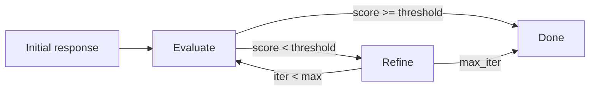

The `core/reflection` module empowers agents to **evaluate and improve their own responses** through an iterative process. This self-correction capability significantly enhances the quality and accuracy of agent outputs.

## How the Loop Works

Reflection is implemented as a cycle: **Evaluate → Refine → Repeat**. The agent does
not generate the initial response — you pass it in. It then evaluates and iteratively
refines it.

**Phases:**

1. **Evaluate**: Assign a quality score (0.0 - 1.0) and generate feedback.
2. **Refine**: If the score is below the threshold, improve the response based on the feedback.
3. **Repeat**: Continue until the quality threshold is met, no improvement is detected, or the maximum iterations are reached.

---

## Structure

```text
core/reflection/
├── __init__.py
├── agent.py          # ReflectionAgent (the reflection loop)
├── evaluators.py     # DefaultEvaluator (LLM-as-judge quality assessor)
├── refiners.py       # DefaultRefiner (feedback-driven rewrite)
└── protocols.py      # SelfEvaluator / Refiner protocols, EvaluationResult
```

The reflection types (`EvaluationResult`, `QualityLevel`, the `Evaluator` protocol, and
`BaseLLMEvaluator`) are defined in `core/evaluation/` and re-exported through
`core.reflection.protocols`.

---

## ReflectionAgent

The `ReflectionAgent` orchestrates the reflection loop. Its constructor **requires** an
`evaluator` and a `refiner` — wire in the bundled defaults:

```python
from core.reflection import ReflectionAgent, DefaultEvaluator, DefaultRefiner

agent = ReflectionAgent(
    evaluator=DefaultEvaluator(),
    refiner=DefaultRefiner(),
    max_iterations=3,        # overrides config; default 3
    quality_threshold=0.7,   # overrides config; default 0.7
)

# Full loop: evaluate + refine until the threshold or iteration cap is hit.
# Returns (final_response, final_evaluation, iterations_used).
final, evaluation, iterations = await agent.reflect(
    response="The capital of France is London.",
    query="What is the capital of France?",
)
print(final, evaluation.score, iterations)

# Manual control: step-by-step
evaluation = await agent.evaluate(response, query)
if evaluation.score < agent.quality_threshold:
    response = await agent.refine(response, evaluation.feedback, query)
```

When `max_iterations` / `quality_threshold` are omitted they default to
`ReflectionConfig` (`core/config/reflection.py`, env prefix `REFLECTION_`).

---

## Evaluators

`DefaultEvaluator` is the bundled LLM-as-judge evaluator (a `BaseLLMEvaluator`
subclass). It scores a response across relevance, accuracy, completeness, clarity, and
helpfulness, then returns an `EvaluationResult`:

```python
from core.reflection import DefaultEvaluator

evaluator = DefaultEvaluator()                 # llm_service auto-resolved
result = await evaluator.evaluate(response, query, context=None)

print(result.score)        # float, 0.0 - 1.0
print(result.quality)      # QualityLevel enum
print(result.feedback)     # str, improvement suggestions
print(result.should_refine)
print(result.aspects)      # {"relevance": ..., "accuracy": ..., ...}
```

To add custom evaluation logic, implement the `SelfEvaluator` protocol (an
`async evaluate(response, query, context)` returning an `EvaluationResult`) — or
subclass `BaseLLMEvaluator` and override `get_prompt` / `_parse_response`.

### `EvaluationResult` fields

| Field           | Type                 | Description                              |
| --------------- | -------------------- | ---------------------------------------- |
| `score`         | `float`              | Normalized quality score (0.0 - 1.0)     |
| `quality`       | `QualityLevel`       | Discrete quality tier                    |
| `feedback`      | `str`                | Actionable improvement suggestions       |
| `should_refine` | `bool`               | Whether a refine pass is recommended     |
| `aspects`       | `dict[str, float]`   | Per-dimension sub-scores                 |

---

## Refiners

`DefaultRefiner` rewrites a response to address evaluator feedback. Implement the
`Refiner` protocol for custom strategies.

```python
from core.reflection import DefaultRefiner

refiner = DefaultRefiner()                     # llm_service auto-resolved
improved = await refiner.refine(
    response="Too verbose answer...",
    feedback="Be more concise.",
    query="Summarize quantum entanglement.",
    context=None,
)
```

---

## Anti-Patterns and Pitfalls

Avoid these common mistakes when implementing reflection:

### Over-Refinement

Iterating too many times often yields diminishing returns.

- Iteration 1: Score +0.12 (Significant)
- Iteration 2: Score +0.05 (Moderate)
- Iteration 3: Score +0.01 (Marginal)

**Fix**: Terminate the loop if the improvement between iterations is negligible (e.g., < 0.05).

### Unreachable Threshold

Setting the quality threshold too high (e.g., 0.99) causes excessive looping and latency.

**Fix**: Use a realistic threshold, typically **0.7 - 0.85**, for most use cases.

---

## Balancing Quality and Latency

Reflection introduces a trade-off between response quality and latency/cost.

| Iterations | Latency | Quality Lift | Cost |
| :--- | :--- | :--- | :--- |
| 0 | 1x | Baseline | 1x |
| 1 | 2x | +10-15% | 2x |
| 2 | 3x | +15-20% | 3x |
| 3 | 4x | +18-23% | 4x |

**Recommendation**: Set a target threshold of **0.75 - 0.80** and a strict `max_iterations` limit of **2 or 3**.

---

## Reflection Loop Diagram



## Implementation Example

The full loop is already implemented by `ReflectionAgent.reflect()`:

```python
from core.reflection import ReflectionAgent, DefaultEvaluator, DefaultRefiner

async def reflect_loop(response: str, query: str, max_iterations: int = 3):
    agent = ReflectionAgent(
        evaluator=DefaultEvaluator(),
        refiner=DefaultRefiner(),
        max_iterations=max_iterations,
    )
    final, evaluation, iterations = await agent.reflect(response, query)
    return final
```

If you prefer to drive it manually:

```python
agent = ReflectionAgent(evaluator=DefaultEvaluator(), refiner=DefaultRefiner())

for _ in range(agent.max_iterations):
    evaluation = await agent.evaluate(response, query)
    if evaluation.score >= agent.quality_threshold:
        break
    response = await agent.refine(response, evaluation.feedback, query)
```
