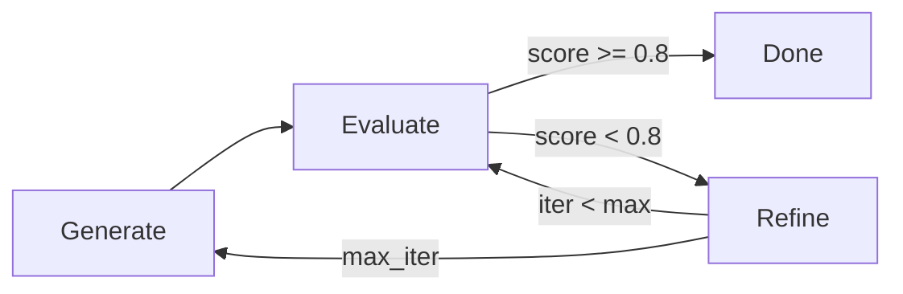

The `core/reflection` module empowers agents to **evaluate and improve their own responses** through an iterative process. This self-correction capability significantly enhances the quality and accuracy of agent outputs.

## How the Loop Works

Reflection is implemented as a cycle: **Generate → Evaluate → Refine → Repeat**.

**Phases:**

1. **Generate**: Produce an initial response.
2. **Evaluate**: Assign a quality score (0.0 - 1.0) and generate feedback.
3. **Refine**: If the score is below a threshold, improve the response based on the feedback.
4. **Repeat**: Continue until the quality threshold is met or the maximum iterations are reached.

---

## Structure

```text
core/reflection/
├── __init__.py
├── agent.py          # ReflectionAgent implementation
├── evaluators.py     # Specialized evaluators
├── refiners.py       # Refinement strategies
└── protocols.py      # Standard interfaces
```

---

## ReflectionAgent

The `ReflectionAgent` orchestrates the reflection cycle.

```python
from core.reflection import ReflectionAgent

agent = ReflectionAgent()

# Automatic: Generate, evaluate, and refine in a loop
response = await agent.generate(query, auto_reflect=True)

# Manual control: Step-by-step
response = await agent.generate(query)
evaluation = await agent.evaluate(response)

if evaluation.score < 0.8:
    response = await agent.refine(response, evaluation.feedback)
```

---

## Evaluators

Evaluators assess specific aspects of a response.

### Relevance Evaluator

Measures how well the response answers the query.

```python
from core.reflection import RelevanceEvaluator

evaluator = RelevanceEvaluator()
score = await evaluator.evaluate(query, response)
# Returns a float between 0.0 and 1.0
```

### Coherence Evaluator

Assesses the logical flow and structure of the response.

```python
from core.reflection import CoherenceEvaluator

evaluator = CoherenceEvaluator()
score = await evaluator.evaluate(response)
```

### Faithfulness Evaluator

Verifies that the response adheres to the provided context and does not hallucinate information.

```python
from core.reflection import FaithfulnessEvaluator

evaluator = FaithfulnessEvaluator()
score = await evaluator.evaluate(response, context)
```

### Composite Evaluator

Combines multiple evaluators with specific weights for a holistic score.

```python
from core.reflection import CompositeEvaluator

evaluator = CompositeEvaluator(
    weights={
        "relevance": 0.4,
        "coherence": 0.3,
        "faithfulness": 0.3
    }
)

result = await evaluator.evaluate(query, response, context)
print(result.score)
print(result.aspects)  # e.g., {"relevance": 0.9, "coherence": 0.8, ...}
```

---

## Refiners

Refiners implement strategies to improve responses based on feedback.

```python
from core.reflection import ClarityRefiner, AccuracyRefiner

# Improve clarity/conciseness
clarity = ClarityRefiner()
improved = await clarity.refine(response, "Too verbose")

# Improve factual accuracy
accuracy = AccuracyRefiner()
improved = await accuracy.refine(response, "Incorrect data points", context)
```

---

## Anti-Patterns and Pitfalls

Avoid these common mistakes when implementing reflection:

### Over-Refinement

Iterating too many times often yields diminishing returns.

- Iteration 1: Score +0.12 (Significant)
- Iteration 2: Score +0.05 (Moderate)
- Iteration 3: Score +0.01 (Marginal)

**Fix**: Terminate the loop if the improvement between iterations is negligible (e.g., < 0.05).

### Unreachable Threshold

Setting the quality threshold too high (e.g., 0.99) causes excessive looping and latency.

**Fix**: Use a realistic threshold, typically **0.7 - 0.85**, for most use cases.

---

## Balancing Quality and Latency

Reflection introduces a trade-off between response quality and latency/cost.

| Iterations | Latency | Quality Lift | Cost |
| :--- | :--- | :--- | :--- |
| 0 | 1x | Baseline | 1x |
| 1 | 2x | +10-15% | 2x |
| 2 | 3x | +15-20% | 3x |
| 3 | 4x | +18-23% | 4x |

**Recommendation**: Set a target threshold of **0.75 - 0.80** and a strict `max_iterations` limit of **2 or 3**.

---

## Reflection Loop Diagram



## Implementation Example

```python
async def reflect_loop(query: str, max_iterations: int = 3):
    agent = ReflectionAgent()
    
    # 1. Initial Generation
    response = await agent.generate(query)
    
    for i in range(max_iterations):
        # 2. Evaluation
        evaluation = await agent.evaluate(response)
        
        # 3. Success Check
        if evaluation.score >= 0.8:
            break
            
        # 4. Refinement
        response = await agent.refine(response, evaluation.feedback)
    
    return response
```
