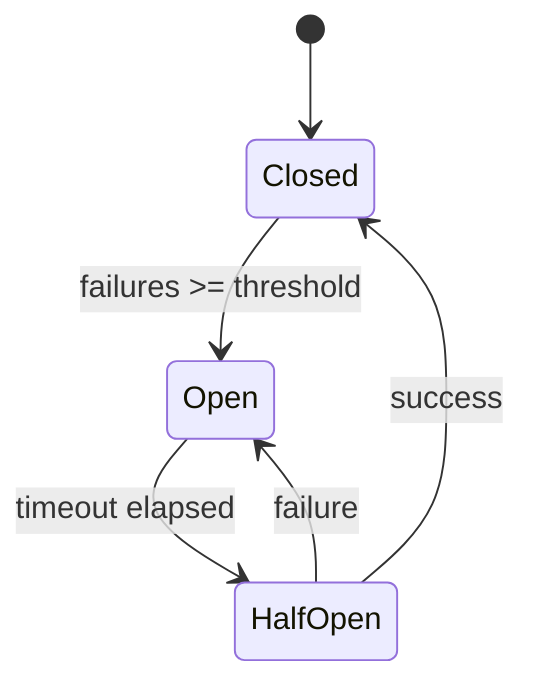

The `core/resilience` module provides resilience patterns to manage failures and high loads.

---

## Implemented Patterns

| Pattern             | Purpose                               |
| ------------------- | ------------------------------------- |
| **Circuit Breaker** | Prevents cascade failures             |
| **Rate Limiter**    | Limits requests per time unit         |
| **Retry**           | Retries failed operations             |
| **Bulkhead**        | Isolates resources between components |

---

## Module Structure

```text
core/resilience/
├── __init__.py           # Public exports
├── circuit_breaker.py    # Circuit breaker
├── rate_limiter.py       # Rate limiting (In-memory & Redis)
├── retry.py              # Retry logic
├── bulkhead.py           # Bulkhead isolation
└── ...
```

---

## Circuit Breaker

Prevents a failed service from causing cascade failures.

Supports **both sync and async** functions — the decorator auto-detects coroutine functions:

```python
from core.resilience import CircuitBreaker, CircuitBreakerError

cb = CircuitBreaker(
    name="external-api",
    fail_max=5,             # Failures before opening
    reset_timeout=30,       # Seconds before half-open
    half_open_max=3         # Probe requests in half-open
)

# Async decorator (auto-detected)
@cb
async def call_external_api():
    return await httpx.get("https://api.example.com")

# Sync decorator (auto-detected)
@cb
def call_sync_service():
    return requests.get("https://api.example.com")

# Async context manager
async with cb:
    result = await some_async_call()

# Usage
try:
    result = await call_external_api()
except CircuitBreakerError:
    # Circuit open, use fallback
    result = get_cached_result()
```

### Streaming (async generators)

The decorator also wraps **async-generator** functions. It records a failure when
the generator raises **during** iteration — previously a streaming call recorded
success at generator construction and any mid-stream error was a silent no-op, so
a failing streaming LLM call never tripped the breaker. A fully consumed stream
records a success; a stream abandoned before completion records nothing.

### Circuit States



### Thread Safety

The circuit breaker is safe for concurrent use. A **single `threading.Lock`**
guards every state mutation — both the sync path (`call`, `_record_success/failure`)
and the async path (`async_call`). The lock is only ever held across synchronous
work and never across an `await`, so it gives sync threads (e.g. a sync psycopg
pool) and concurrent coroutines genuine mutual exclusion over the same state.

The `OPEN → HALF_OPEN` timeout transition is **idempotent**: only the first
caller past `reset_timeout` flips the state and resets the probe counter, so
`half_open_max` is honoured under concurrency instead of every waiting caller
zeroing the budget and stampeding the recovering service.

The process-wide `get_circuit_breaker(name)` registry is itself lock-guarded, so
concurrent first-time lookups for the same name resolve to a single shared
breaker instance rather than racing to create duplicates.

### Monitoring

```python
stats = cb.get_stats()
print(stats["state"])       # "closed" | "open" | "half_open"
print(stats["failures"])
print(stats["successes"])
print(stats["fail_max"])
```

---

## Rate Limiter

Limits the number of requests to protect resources. `RateLimiter(limit, window, backend)` — `limit`/`window` default from config when omitted; the default backend is `InMemoryRateLimiter`:

```python
from core.resilience import RateLimiter, InMemoryRateLimiter

# 100 requests per 60s window, in-memory backend (default)
limiter = RateLimiter(limit=100, window=60, backend=InMemoryRateLimiter())

async def handle_request(request):
    # check() takes only the key; limit/window are bound to the instance
    result = limiter.check(request.client.host)

    if not result.allowed:
        raise HTTPException(429, f"Too many requests. Retry after {result.retry_after}s")

    return await process_request(request)
```

`check()` returns a `RateLimitResult` with `allowed`, `remaining`, `reset_at`, and
`retry_after`. There is also a boolean shortcut `limiter.is_allowed(key)`.

### Pre-configured limiters

Two module-level helpers return limiters pre-bound to config values:

```python
from core.resilience import get_api_limiter, get_llm_limiter

api = get_api_limiter()   # uses api_rate_limit / api_rate_window
llm = get_llm_limiter()   # uses the more restrictive llm_rate_limit / llm_rate_window
```

### Redis Rate Limiter

Using Redis for multi-instance applications (sliding window). It falls back to
`InMemoryRateLimiter` automatically when Redis is unavailable:

```python
from core.resilience import RateLimiter, RedisRateLimiter

# Reads the Redis URL from core.config when redis_url is omitted
limiter = RateLimiter(limit=1000, window=60, backend=RedisRateLimiter())

# Atomic sliding window via a registered Lua script
```

| Algorithm          | Backend               | Description                      |
| ------------------ | --------------------- | -------------------------------- |
| **Sliding Window** | `InMemoryRateLimiter` | Per-key bucket, single-process   |
| **Sliding Window** | `RedisRateLimiter`    | Atomic sorted sets + Lua scripts |

---

## Retry

Automatically retries failed operations. `retry` is a keyword-argument decorator —
every argument is optional and falls back to the resilience config when omitted. It
auto-detects coroutine functions and wraps them accordingly:

```python
from core.resilience import retry

@retry(
    max_attempts=3,
    base_delay=1.0,
    max_delay=30.0,
    exponential_base=2.0,
    jitter=True,
)
async def unreliable_operation():
    return await call_flaky_service()
```

### Backoff Strategies

Delay grows as `base_delay * exponential_base ** (attempt - 1)`, capped at `max_delay`,
with optional jitter:


### Selective Retry

Restrict which exceptions trigger a retry with `retryable_exceptions` (defaults to
`(Exception,)`):

```python
from core.resilience import retry

@retry(
    max_attempts=3,
    retryable_exceptions=(ConnectionError, TimeoutError),
)
async def api_call():
    return await client.post(...)
```

### Timeout

`core.resilience` also exports a `timeout` decorator for async functions (raises
`core.resilience.TimeoutError` after `seconds`):

```python
from core.resilience import timeout, TimeoutError

@timeout(5.0)
async def slow_operation():
    await asyncio.sleep(10)  # raises TimeoutError
```

---

## Bulkhead

Isolates resources to prevent one component from overloading others by capping the
number of concurrent in-flight operations. `Bulkhead(max_concurrent=None, name="default")`
is used **directly as a decorator** (it only supports async functions):

```python
from core.resilience import Bulkhead

# Limit concurrency to 10 (defaults to bulkhead_max_concurrent from config when omitted)
llm_bulkhead = Bulkhead(max_concurrent=10, name="llm")

@llm_bulkhead
async def call_llm(prompt):
    return await llm.generate(prompt)
```

Inspect remaining capacity via the `available` property:

```python
cpu_bulkhead = Bulkhead(max_concurrent=4, name="cpu-intensive")

@cpu_bulkhead
async def heavy_computation():
    return await asyncio.to_thread(compute_embeddings)

print(cpu_bulkhead.available)  # slots currently free
```

---

## Combining Patterns

Patterns combine effectively:

```python
from core.resilience import (
    CircuitBreaker,
    retry,
    Bulkhead,
    get_api_limiter,
)

# Setup
cb = CircuitBreaker(name="external", fail_max=5)
bulkhead = Bulkhead(max_concurrent=10, name="external")
limiter = get_api_limiter()

@cb
@retry(max_attempts=3)
@bulkhead
async def resilient_call(user_id: str):
    result = limiter.check(user_id)
    if not result.allowed:
        raise RuntimeError("rate limit exceeded")

    return await external_service.call()
```

### Recommended Order

```text
1. Rate Limiter (filters excessive requests)
2. Circuit Breaker (avoids calls to down services)
3. Bulkhead (limits concurrency)
4. Retry (retries transient failures)
```

---

## Graceful Shutdown

Clean shutdown management:

```python
from core.resilience import GracefulShutdown

shutdown = GracefulShutdown(timeout=30)  # max seconds for all callbacks

# Register cleanup handlers (sync or async) — run in reverse (LIFO) order
shutdown.register(close_database)
shutdown.register(flush_queues)
shutdown.register(close_connections)

# Install SIGTERM/SIGINT handlers and block until a signal arrives,
# then run the registered callbacks.
shutdown.install_handlers()
await shutdown.wait_for_shutdown()
```

A process-wide singleton is available via `get_shutdown_handler()`.

---

## Distributed Lock

In-memory coordination (e.g. `core.cache.single_flight`) only protects a single
process. Across multiple replicas — the normal production topology — periodic
triggers, cron jobs, and run-once startup tasks would otherwise fire on **every**
pod. `DistributedLock` is a Redis-backed mutex that guarantees exactly one
replica runs such work.

```python
from core.resilience import get_distributed_lock, LockNotAcquired

# Guard a periodic trigger so only one replica enqueues the job.
lock = get_distributed_lock("nightly-reindex", ttl_ms=60_000)
try:
    async with lock.guard(timeout=0):      # non-blocking: skip if another pod holds it
        enqueue_task(reindex_all)
except LockNotAcquired:
    pass                                    # another replica is handling it
```

For long critical sections, enable the watchdog so the TTL is extended while the
work runs (a crash still releases the lock within one TTL):

```python
lock = get_distributed_lock("migration", ttl_ms=30_000, auto_renew=True)
async with lock:                            # blocks until acquired; auto-releases
    await run_long_migration()
```

Correctness guarantees:

- **Mutual exclusion** — `SET key token NX PX ttl`; the TTL prevents deadlock if
  a holder crashes.
- **Safe release** — a compare-and-delete Lua script only deletes the key if the
  caller still owns the unique token, so an expired-then-reacquired lock is never
  released by the previous holder.
- **Auto-renew** — optional watchdog extends the TTL at ~⅓ of `ttl_ms`.

`DistributedLock` is covered by the strict resilience typing gate
(`scripts/check_core_resilience_typing.py`).

---

## Configuration

```python
from core.config import get_resilience_config

config = get_resilience_config()

# Circuit Breaker
print(config.cb_fail_max)             # 5
print(config.cb_reset_timeout)        # 60.0

# Rate Limiter (API level)
print(config.api_rate_limit)          # 100
print(config.api_rate_window)         # 60

# Retry
print(config.retry_max_attempts)      # 3
print(config.retry_base_delay)        # 1.0
```

All resilience settings share the `RESILIENCE_` env prefix
(`core/config/resilience.py`):

```env title=".env"
# Circuit Breaker
RESILIENCE_CB_FAIL_MAX=5
RESILIENCE_CB_RESET_TIMEOUT=60
RESILIENCE_CB_HALF_OPEN_MAX=1

# Rate Limiter (API + LLM)
RESILIENCE_API_RATE_LIMIT=100
RESILIENCE_API_RATE_WINDOW=60
RESILIENCE_LLM_RATE_LIMIT=20
RESILIENCE_LLM_RATE_WINDOW=60

# Retry
RESILIENCE_RETRY_MAX_ATTEMPTS=3
RESILIENCE_RETRY_BASE_DELAY=1.0
RESILIENCE_RETRY_MAX_DELAY=60.0
RESILIENCE_RETRY_EXPONENTIAL_BASE=2.0
RESILIENCE_RETRY_JITTER=true

# Bulkhead
RESILIENCE_BULKHEAD_MAX_CONCURRENT=10
```

---

## Production Usage

BaselithCore uses these resilience patterns natively in its core providers to ensure production stability:

- **LLM Providers**: OpenAI and Anthropic providers are protected by automatic retries and circuit breakers to handle API downtime and rate limits.
- **VectorStore**: Qdrant operations use circuit breakers and retries to maintain search availability.
- **Database**: Core DAOs for tenants, feedback, and documents implement retry logic with exponential backoff for relational persistence.

---

## Metrics and Monitoring

Patterns export metrics for Prometheus:

```python
# Exposed metrics
circuit_breaker_state{name="llm"}  # 0=closed, 1=open, 2=half_open
circuit_breaker_failures_total{name="llm"}
rate_limiter_rejected_total{name="api"}
bulkhead_active{name="compute"}
bulkhead_queue_size{name="compute"}
retry_attempts_total{name="external"}
```

---

## Best Practices

!!! tip "Circuit Breaker"
    - Use low thresholds for critical services
    - Always implement a fallback
    - Monitor circuit state

!!! tip "Rate Limiting"
    - Use Redis for distributed environments
    - Implement per-tenant rate limits
    - Return `Retry-After` header

!!! tip "Retry"
    - Use exponential backoff with jitter
    - Do not retry unrecoverable errors (4xx)
    - Set reasonable timeouts
