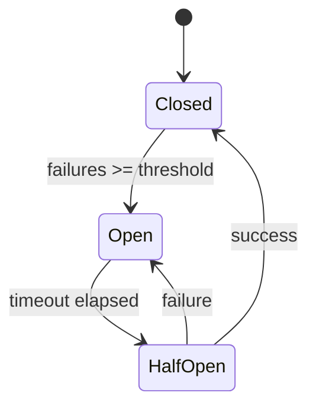

The `core/resilience` module provides resilience patterns to manage failures and high loads.

---

## Implemented Patterns

| Pattern             | Purpose                               |
| ------------------- | ------------------------------------- |
| **Circuit Breaker** | Prevents cascade failures             |
| **Rate Limiter**    | Limits requests per time unit         |
| **Retry**           | Retries failed operations             |
| **Bulkhead**        | Isolates resources between components |

---

## Module Structure

```text
core/resilience/
├── __init__.py           # Public exports
├── circuit_breaker.py    # Circuit breaker
├── rate_limiter.py       # Rate limiting (In-memory & Redis)
├── retry.py              # Retry logic
├── bulkhead.py           # Bulkhead isolation
└── ...
```

---

## Circuit Breaker

Prevents a failed service from causing cascade failures.

Supports **both sync and async** functions — the decorator auto-detects coroutine functions:

```python
from core.resilience import CircuitBreaker, CircuitBreakerError

cb = CircuitBreaker(
    name="external-api",
    fail_max=5,             # Failures before opening
    reset_timeout=30,       # Seconds before half-open
    half_open_max=3         # Probe requests in half-open
)

# Async decorator (auto-detected)
@cb
async def call_external_api():
    return await httpx.get("https://api.example.com")

# Sync decorator (auto-detected)
@cb
def call_sync_service():
    return requests.get("https://api.example.com")

# Async context manager
async with cb:
    result = await some_async_call()

# Usage
try:
    result = await call_external_api()
except CircuitBreakerError:
    # Circuit open, use fallback
    result = get_cached_result()
```

### Circuit States



### Monitoring

```python
stats = cb.get_stats()
print(stats["state"])       # "closed" | "open" | "half_open"
print(stats["failures"])
print(stats["successes"])
print(stats["fail_max"])
```

---

## Rate Limiter

Limits the number of requests to protect resources:

```python
from core.resilience import RateLimiter, InMemoryRateLimiter

# Uses InMemoryRateLimiter by default
limiter = RateLimiter(
    backend=InMemoryRateLimiter(),
    default_limit=100,
    default_window=60
)

async def handle_request(request):
    # Check rate limit
    result = limiter.check(key=request.client_ip)
    
    if not result.allowed:
        raise HTTPException(429, f"Too many requests. Retry after {result.retry_after}s")
    
    return await process_request(request)
```

### Redis Rate Limiter

Using Redis for multi-instance applications (sliding window):

```python
from core.resilience import RateLimiter, RedisRateLimiter

# Connects to Redis automatically using core.config
limiter = RateLimiter(
    backend=RedisRateLimiter(),
    default_limit=1000,
    default_window=60
)

# Atomic sliding window via Lua scripts
```

| Algorithm          | Backend               | Description              |
| ------------------ | --------------------- | ------------------------ |
| **Fixed Window**   | `InMemoryRateLimiter` | Simple counter with TTL  |
| **Sliding Window** | `RedisRateLimiter`    | Atomic sorted sets + Lua |

---

## Retry

Automatically retries failed operations:

```python
from core.resilience import retry, RetryConfig

config = RetryConfig(
    max_attempts=3,
    base_delay=1.0,
    max_delay=30.0,
    exponential_base=2,
    jitter=True
)

@retry(config)
async def unreliable_operation():
    return await call_flaky_service()
```

### Backoff Strategies


### Selective Retry

```python
from core.resilience import retry, should_retry

@retry(
    max_attempts=3,
    retry_on=[ConnectionError, TimeoutError],
    retry_if=lambda e: e.status_code >= 500
)
async def api_call():
    return await client.post(...)
```

---

## Bulkhead

Isolates resources to prevent one component from overloading others:

```python
from core.resilience import Bulkhead

# Limits concurrency
llm_bulkhead = Bulkhead(
    max_concurrent=10,
    max_waiting=50,
    timeout=30.0
)

@llm_bulkhead.protect
async def call_llm(prompt):
    return await llm.generate(prompt)
```

### Thread Pool Isolation

```python
# Isolate CPU-bound operations
cpu_bulkhead = Bulkhead(
    max_concurrent=4,  # Limit to 4 threads
    name="cpu-intensive"
)

@cpu_bulkhead.protect
async def heavy_computation():
    return await asyncio.to_thread(compute_embeddings)
```

---

## Combining Patterns

Patterns combine effectively:

```python
from core.resilience import (
    CircuitBreaker, 
    retry, 
    RateLimiter,
    Bulkhead
)

# Setup
cb = CircuitBreaker(name="external", fail_max=5)
limiter = RateLimiter(max_requests=100, window_seconds=60)
bulkhead = Bulkhead(max_concurrent=10)

@cb
@retry(max_attempts=3)
@bulkhead.protect
async def resilient_call(user_id: str):
    # Use the global API limiter
    from core.resilience import get_api_limiter
    limiter = get_api_limiter()
    
    result = limiter.check(user_id)
    if not result.allowed:
        raise RateLimitExceeded()
    
    return await external_service.call()
```

### Recommended Order

```text
1. Rate Limiter (filters excessive requests)
2. Circuit Breaker (avoids calls to down services)
3. Bulkhead (limits concurrency)
4. Retry (retries transient failures)
```

---

## Graceful Shutdown

Clean shutdown management:

```python
from core.resilience import GracefulShutdown

shutdown = GracefulShutdown(timeout=30.0)

# Register cleanup handlers
shutdown.register(close_database)
shutdown.register(flush_queues)
shutdown.register(close_connections)

# In FastAPI
@app.on_event("shutdown")
async def on_shutdown():
    await shutdown.execute()
```

---

## Configuration

```python
from core.config import get_resilience_config

config = get_resilience_config()

# Circuit Breaker
print(config.cb_fail_max)             # 5
print(config.cb_reset_timeout)        # 60.0

# Rate Limiter (API level)
print(config.api_rate_limit)          # 100
print(config.api_rate_window)         # 60

# Retry
print(config.retry_max_attempts)      # 3
print(config.retry_base_delay)        # 1.0
```

```env title=".env"
# Circuit Breaker
RESILIENCE_CB_FAIL_MAX=5
RESILIENCE_CB_RESET_TIMEOUT=60

# Rate Limiter
RESILIENCE_API_RATE_LIMIT=100
RESILIENCE_API_RATE_WINDOW=60

# Retry
RETRY_MAX_ATTEMPTS=3
RETRY_BASE_DELAY=1.0
```

---

## Metrics and Monitoring

Patterns export metrics for Prometheus:

```python
# Exposed metrics
circuit_breaker_state{name="llm"}  # 0=closed, 1=open, 2=half_open
circuit_breaker_failures_total{name="llm"}
rate_limiter_rejected_total{name="api"}
bulkhead_active{name="compute"}
bulkhead_queue_size{name="compute"}
retry_attempts_total{name="external"}
```

---

## Best Practices

!!! tip "Circuit Breaker"
    - Use low thresholds for critical services
    - Always implement a fallback
    - Monitor circuit state

!!! tip "Rate Limiting"
    - Use Redis for distributed environments
    - Implement per-tenant rate limits
    - Return `Retry-After` header

!!! tip "Retry"
    - Use exponential backoff with jitter
    - Do not retry unrecoverable errors (4xx)
    - Set reasonable timeouts
