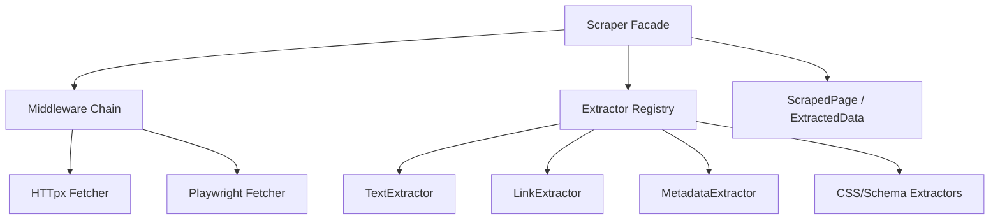

The canonical web scraping implementation now lives in the official plugin `plugins/web_scraper/`. The historical `core/scraper` surface remains available as a compatibility layer, but the framework no longer treats scraping as Sacred Core functionality.

!!! info "Current State"
    Use `plugins.web_scraper` for new code. Existing imports from `core.scraper` are maintained only to preserve backward compatibility during migration.

## Overview

The scraper is designed to be **resilient** and **extensible**. It handles rate limiting, caching, and common extraction tasks out of the box, allowing agents to gather real-time information from the internet safely and efficiently.

**Key Features**:

- **Dual Rendering**: Static (fast) and Dynamic (JS-aware) fetchers.
- **Middleware Chain**: Built-in support for caching, rate limiting, and logging.
- **Pluggable Extractors**: Dedicated logic for text, links, images, metadata, and Schema.org.
- **Concurrent Execution**: Scrape multiple URLs in parallel with controlled concurrency.
- **Semantic Extraction**: Integrated with NLP utilities for cleaning and structuring web content.

---

## Architecture



---

## Basic Usage

The `Scraper` class is the main entry point for all operations.

```python
from plugins.web_scraper import Scraper

async with Scraper() as scraper:
    # 1. Scrape a single page (static)
    page, data = await scraper.scrape("https://example.com")
    
    print(f"Title: {data.metadata.title}")
    print(f"Text length: {len(data.text)}")
    
    # 2. Scrape with JavaScript rendering
    page, data = await scraper.scrape(
        "https://react-app.com",
        use_js=True
    )
```

### Batch Scraping

For high-volume tasks, use `scrape_many` to process URLs concurrently.

```python
urls = ["https://site1.com", "https://site2.com", "https://site3.com"]

async for page, data in scraper.scrape_many(urls, concurrency=3):
    print(f"Scraped {page.url} - Status: {page.status_code}")
```

---

## Extractors

The scraper uses a registry of specialized extractors to structure the raw HTML.

| Extractor         | Key            | Description                                    |
| ----------------- | -------------- | ---------------------------------------------- |
| `TextExtractor`   | `text`         | Main content extraction (markdown-like)        |
| `LinkExtractor`   | `links`        | List of all absolute URLs found on the page    |
| `ImageExtractor`  | `images`       | List of image URLs and alt text                |
| `MetaExtractor`   | `metadata`     | Page title, description, and OpenGraph tags    |
| `SchemaExtractor` | `schema_org`   | Structured data in JSON-LD or Microdata format |
| `CssExtractor`    | `css_selector` | Custom extraction via CSS selectors            |

---

## Security & SSRF Protection

The scraper includes industry-standard protections against **Server-Side Request Forgery (SSRF)** and Resource Exhaustion.

1. **DNS Rebinding Protection**: The scraper performs explicit DNS resolution via `socket.getaddrinfo` for every request. Resolved IP addresses are validated against private network ranges (RFC 1918) to prevent DNS rebinding attacks that might bypass standard hostname-based blocks.
2. **Redirect Handling**: Automatic redirects are disabled in the underlying fetchers. Redirects are followed manually (up to 10 hops), with SSRF validation re-performed at every hop.
3. **Response Size Limits**: To prevent "Decompression Bombs" or memory exhaustion, a strict **10MB limit** is enforced on all responses. Fetchers use streaming APIs to monitor data transfer and terminate connections immediately if the limit is exceeded.
4. **Robots.txt Safety**: Validation is also performed on `robots.txt` URLs to prevent path-based attacks.
5. **Playwright Sandbox Hardening**: Dynamic scraping via Playwright enforces Chromium's process-level sandboxing (`--enable-sandbox`, `--disable-setuid-sandbox`) and isolates resources (`--disable-dev-shm-usage`) to prevent escaping the browser context when visiting untrusted pages.

---

## Configuration

The scraper is configured via `ScraperConfig` (or environment variables).

```python
from core.config.scraper import ScraperConfig

config = ScraperConfig(
    cache_enabled=True,
    rate_limit_enabled=True,
    requests_per_minute=20,
    user_agent="BaselithBot/1.0"
)

scraper = Scraper(config=config)
```

**Environment Variables**:

- `SCRAPER_USER_AGENT`: Custom User-Agent string.
- `SCRAPER_CACHE_TTL`: Cache duration in seconds (default: 3600).
- `SCRAPER_DEFAULT_FETCHER`: Set to `playwright` for global JS rendering.
- `SCRAPER_RATE_LIMIT_ENABLED`: Global toggle for throttle.

---

## Best Practices

!!! tip "Performance"
    Always use the static fetcher (default) unless the page explicitly requires JavaScript. Playwright is much heavier and slower.

!!! warning "Robots.txt"
    While the scraper provides tools, developers are responsible for complying with a site's `robots.txt` and terms of service.

!!! note "Related Plugin"
    Document ingestion and file readers were also moved out of the core and now live under `plugins/document_sources/`.
