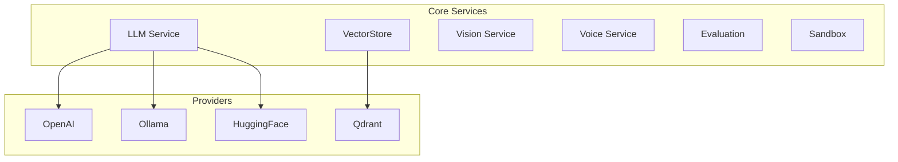

The `core/services` module provides domain-agnostic services.

## Overview



---

## LLM Service

Abstraction for language model providers.

### LLM Structure

```text
core/services/llm/
├── __init__.py
├── service.py          # Main LLMService
├── providers/          # Provider implementations
│   ├── openai.py
│   ├── ollama.py
│   └── huggingface.py
├── cost_control.py     # Cost control
└── exceptions.py
```

### LLM Basic Usage

```python
from core.services.llm import get_llm_service

llm = get_llm_service()

# Synchronous generation
response = await llm.generate(
    prompt="Explain relativity",
    max_tokens=500,
    temperature=0.7
)
print(response.text)
print(response.usage)  # {"prompt_tokens": 10, "completion_tokens": 150}

# Streaming generation
async for chunk in llm.stream("Tell a story"):
    print(chunk, end="")
```

### Provider Selection

All providers implement an **async** interface (`async def generate()`,
`async def generate_stream()`). The `LLMService` calls them via `await`.

```python
from core.services.llm import LLMService

# Use Ollama (async-native)
llm = LLMService(provider="ollama", model="llama3.2")

# Use OpenAI (async-native)
llm = LLMService(provider="openai", model="gpt-4o-mini")

# Use HuggingFace (sync ops wrapped via asyncio.to_thread)
llm = LLMService(provider="huggingface", model="mistralai/Mistral-7B")
```

### Cost Control

```python
from core.services.llm.cost_control import CostTracker, estimate_tokens

tracker = CostTracker(max_tokens=10000)

# Estimate tokens before calling
estimated = estimate_tokens("My prompt text here")

# Track usage after calling
tracker.track_tokens(count=estimated, model="gpt-4o-mini")

# Check remaining budget
print(tracker.get_usage())
# {"tokens_used": 150, "max_tokens": 10000, "remaining": 9850}
```

Token estimation uses `tiktoken` when available (exact count per model encoding), with an intelligent character-class heuristic as fallback (different ratios for English prose, code, and CJK text). The implementation is shared via `core.utils.tokens`.

---

## VectorStore Service

Semantic search and vector indexing.

### VectorStore Structure

```text
core/services/vectorstore/
├── __init__.py
├── service.py            # VectorStoreService
├── embedding_cache.py    # Cached embedding generation (model-scoped keys)
├── chunking.py           # Text chunking utilities
└── providers/
    └── qdrant_provider.py  # Qdrant implementation
```

!!! info "Embedding Cache"
    The embedding cache keys are scoped by **model identifier** to prevent
    cross-model collisions. Switching the `VECTORSTORE_EMBEDDING_MODEL` env var
    automatically invalidates stale cache entries.

### VectorStore Basic Usage

```python
from core.services.vectorstore import get_vectorstore_service

vs = get_vectorstore_service()

# Index documents
await vs.upsert(
    collection="documents",
    documents=[
        {"id": "doc1", "text": "Document content 1", "metadata": {...}},
        {"id": "doc2", "text": "Document content 2", "metadata": {...}},
    ]
)

# Semantic search
results = await vs.search(
    collection="documents",
    query="find similar documents",
    limit=5,
    filter={"category": "tech"}
)

for result in results:
    print(f"{result.id}: {result.score}")
```

### Tenant Isolation

BaselithCore enforces strict multi-tenant isolation at the service level. The `VectorStoreService` automatically extracts the `tenant_id` from the current execution context (via `get_current_tenant_id()`) and injects it into all operations:

- **Indexing**: Every vector point is tagged with the `tenant_id` in its payload.
- **Search & Retrieval**: A mandatory filter is applied to every query to ensure only the current tenant's data is visible.
- **Deletion**: Documents can only be deleted if they belong to the active tenant.

This isolation is executed **server-side** by the underlying provider (e.g., Qdrant), ensuring that data remains segmented even if internal identifiers are leaked.

### Embedding Generation

```python
from core.services.vectorstore import EmbeddingService

embedder = EmbeddingService(model="all-MiniLM-L6-v2")

# Single embedding
embedding = await embedder.embed("Text to embed")

# Batch
embeddings = await embedder.embed_batch([
    "Text 1",
    "Text 2",
    "Text 3"
])
```

---

## Vision Service

Image analysis and OCR.

### Vision Structure

```text
core/services/vision/
├── __init__.py
├── service.py          # VisionService
├── ocr.py              # Text extraction
└── analysis.py         # Image analysis
```

### Vision Basic Usage

```python
from core.services.vision import get_vision_service

vision = get_vision_service()

# Image analysis
analysis = await vision.analyze(
    image_path="/path/to/image.png",
    prompt="Describe what you see in this image"
)
print(analysis.description)
print(analysis.objects)  # ["person", "car", "building"]

# OCR
text = await vision.extract_text(image_path="/path/to/document.png")
print(text.content)
print(text.confidence)
```

### Screenshot Analysis

```python
# Screenshot analysis
result = await vision.analyze_screenshot(
    screenshot=screenshot_bytes,
    context="Application user interface"
)
```

---

## Voice Service

Speech synthesis and recognition.

### Voice Structure

```text
core/services/voice/
├── __init__.py
├── service.py          # VoiceService
├── tts.py              # Text-to-Speech
└── stt.py              # Speech-to-Text
```

### Text-to-Speech

```python
from core.services.voice import get_voice_service

voice = get_voice_service()

# Generate audio
audio = await voice.synthesize(
    text="Hello, how can I help you?",
    voice="it-IT-Wavenet-A",
    format="mp3"
)

# Save or stream
with open("output.mp3", "wb") as f:
    f.write(audio)
```

### Speech-to-Text

```python
# Transcribe audio
transcription = await voice.transcribe(
    audio_path="/path/to/audio.mp3",
    language="it"
)
print(transcription.text)
print(transcription.confidence)
```

---

## Evaluation Service

LLM-as-a-Judge evaluation using DeepEval.

```python
from core.services.evaluation import get_evaluation_service

evaluator = get_evaluation_service()

# Evaluate a RAG response
result = await evaluator.evaluate_rag_response(
    query="What is the capital of Italy?",
    response="The capital of Italy is Rome.",
    retrieved_context=["Italy is a country in Europe. Its capital is Rome."],
    expected_output="Rome",  # enables precision/recall metrics
)

print(result["faithfulness"])          # {"score": 0.95, "reason": "...", "passed": True}
print(result["answer_relevancy"])      # {"score": 0.92, "reason": "...", "passed": True}
print(result["contextual_precision"])  # {"score": 0.88, ...} (when expected_output given)
print(result["contextual_recall"])     # {"score": 0.90, ...} (when expected_output given)
```

### Available Metrics

| Metric                 | Description                            | Requires `expected_output` |
| ---------------------- | -------------------------------------- | -------------------------- |
| `faithfulness`         | Is the answer grounded in context?     | No                         |
| `answer_relevancy`     | Does it answer the question?           | No                         |
| `contextual_precision` | Are retrieved docs relevant & ordered? | Yes                        |
| `contextual_recall`    | Did we retrieve all relevant docs?     | Yes                        |

---

## Sandbox Service

Secure code execution.

```python
from core.services.sandbox import SandboxService

sandbox = SandboxService()

# Execute Python code (defaults to config provider, e.g., 'docker' or 'sbx')
result = await sandbox.execute_code_async(
    code="print(2 + 2)",
    language="python",
    timeout=5.0
)

print(result.stdout)   # "4\n"
print(result.stderr)   # ""
print(result.exit_code)  # 0
```

### Isolation & Security

BaselithCore supports two types of sandboxing for secure code execution:

1. **Docker (Standard)**: Uses standard Docker containers with `network_mode="none"` and resource limits. It provides a good balance between performance and security for most tasks.
2. **Docker Sandbox (sbx)**: A premium, **MicroVM-based** isolation layer. It uses the `sbx` CLI to spin up lightweight microVMs for every agent session, providing the strongest possible security boundary against "jailbreak" attempts.

- **MicroVM Isolation (sbx)**: Unlike containers that share the host kernel, MicroVMs have their own kernel, offering hardware-level isolation.
- **Network Isolation**: All sandboxes are launched with networking disabled by default (or strictly limited via `sbx` profiles).
- **Resource Limits**: Configurable memory and CPU quotas are enforced per execution.
- **Host Protection**: Agents in "YOLO mode" (autonomous execution) are strictly confined to the sandbox environment.

### Sandbox Configuration

The sandbox behavior is controlled via environment variables:

```env
# Provider: 'docker' (default) or 'sbx'
SANDBOX_PROVIDER=sbx

# Docker specific
SANDBOX_IMAGE=python:3.12-slim
SANDBOX_DOCKER_SOCKET=/var/run/docker.sock

# Sbx specific
SANDBOX_SBX_PATH=sbx
SANDBOX_SBX_PROFILE=default

# General
SANDBOX_TIMEOUT=30
```

!!! note "Installation"
    To use the `sbx` provider, you must install the `sbx` CLI tool on your host. On macOS, use `brew install docker/tap/sbx`.

---

## Optimizer

LLM-driven performance tuning for agents (`core/optimization/optimizer.py`).

```python
from core.optimization.optimizer import HyperParameterOptimizer, TuneResult

optimizer = HyperParameterOptimizer(llm_service=llm)

# Dry-run: get suggestion without applying
result: TuneResult = await optimizer.auto_tune(agent_id="summarizer-v2")
print(result.suggestion)   # {"temperature": 0.3, "max_tokens": 512, ...}
print(result.applied)      # False (dry_run=True by default)

# Auto-apply via callback
async def apply_config(agent_id: str, suggestion: dict) -> bool:
    agent = get_agent(agent_id)
    agent.update_config(suggestion)
    return True

result = await optimizer.auto_tune(
    agent_id="summarizer-v2",
    apply_fn=apply_config,
    dry_run=False,
)
print(result.applied)            # True
print(optimizer.get_history())   # [{agent_id, suggestion, timestamp}, ...]
```

### `TuneResult` Fields

| Field            | Type    | Description                         |
| ---------------- | ------- | ----------------------------------- |
| `agent_id`       | `str`   | Agent that was tuned                |
| `suggestion`     | `dict`  | LLM-generated parameter suggestions |
| `applied`        | `bool`  | Whether the suggestion was applied  |
| `previous_score` | `float` | Performance score before tuning     |

### Optimization Loop (event-driven)

The `OptimizationLoop` subscribes to `EVALUATION_COMPLETED` events and triggers `auto_tune()` automatically when an agent's score drops below a threshold.

```python
from core.optimization import OptimizationLoop

loop = OptimizationLoop(
    feedback_collector=collector,
    apply_fn=apply_config,
    threshold=0.5,     # trigger when score < 0.5
    dry_run=False,     # actually apply suggestions
)
loop.start()   # subscribes to EventBus
# ... evaluation events flow in ...
loop.stop()
```

**Event flow**: `FLOW_COMPLETED` → `EvaluationService` → `EVALUATION_COMPLETED` → `OptimizationLoop` → `auto_tune()` → `OPTIMIZATION_COMPLETED`

---

## Indexing Service

Incremental document indexing with fingerprint-based change detection.

```python
from core.services.indexing import get_indexing_service

indexing = get_indexing_service()

# Index all configured document sources (incremental)
stats = await indexing.index_documents(incremental=True)
print(f"New: {stats.new_documents}, Skipped: {stats.skipped_documents}, Deleted: {stats.deleted_documents}")

# Ingest a single file
stats = await indexing.ingest_file("/path/to/doc.pdf", collection="default")
```

`ingest_file()` validates paths against `DOCUMENTS_ROOT`:

- Absolute paths are allowed only if they stay inside the configured documents root.
- Relative paths are resolved relative to `DOCUMENTS_ROOT`.
- Paths outside that root are rejected to prevent path traversal and accidental indexing of arbitrary files.

Example with a relative path:

```python
# If DOCUMENTS_ROOT=documents, this resolves to ./documents/manuals/guide.pdf
stats = await indexing.ingest_file("manuals/guide.pdf")
```

### Persistence

The indexing state (document fingerprints) is persisted to Redis under `baselith:indexing:state`. This means incremental indexing survives application restarts — only genuinely changed documents are re-indexed.

### Stale Document Cleanup

Documents that are no longer present in any active source are automatically deleted from the vector store at the end of each indexing run.

---

## Human-in-the-Loop

Standard mechanisms for agents to request human intervention, approval, or clarification.

```python
from core.human import HumanIntervention

intervention = HumanIntervention(callback=my_ui_callback)

# Request approval (with timeout)
approved = await intervention.request_approval(
    "Deploy to production?",
    timeout=60,
    context={"environment": "prod"}
)

# Ask for input
name = await intervention.ask_input("What is the project name?")

# Present selection
env = await intervention.request_selection(
    "Choose deployment target:",
    options=["staging", "production"]
)
```

Timeouts are enforced via `asyncio.wait_for()`. If no response is received within `timeout` seconds, the request is auto-rejected with status `TIMEOUT`.

---

## Protocol Pattern

All services follow the protocol pattern:

```python
# core/interfaces/llm.py
class LLMServiceProtocol(Protocol):
    async def generate(self, prompt: str, **kwargs) -> LLMResponse: ...
    async def stream(self, prompt: str, **kwargs) -> AsyncGenerator[str, None]: ...

# Implementation
class LLMService(LLMServiceProtocol):
    async def generate(self, prompt: str, **kwargs) -> LLMResponse:
        # Concrete implementation
        ...
```

---

## Dependency Injection

Access services via DI:

```python
from core.di import resolve
from core.interfaces import LLMServiceProtocol

# In a handler
class MyHandler:
    def __init__(self):
        self.llm = resolve(LLMServiceProtocol)
        self.vectorstore = resolve(VectorStoreProtocol)
```

---

## Configuration

```env title=".env"
# LLM
LLM_MODEL=llama3.2
LLM_API_BASE=http://localhost:11434
LLM_API_KEY=sk-...

# VectorStore
VECTORSTORE_HOST=localhost
VECTORSTORE_PORT=6333
VECTORSTORE_EMBEDDING_MODEL=all-MiniLM-L6-v2

# Vision
VISION_MODEL=gpt-4o-mini

# Voice
VOICE_PROVIDER=google
VOICE_LANGUAGE=it-IT
VOICE_ELEVENLABS_MODEL_ID=eleven_multilingual_v2
VOICE_ELEVENLABS_STABILITY=0.5
VOICE_ELEVENLABS_SIMILARITY_BOOST=0.75
VOICE_EMBEDDING_MODEL=all-MiniLM-L6-v2
```
