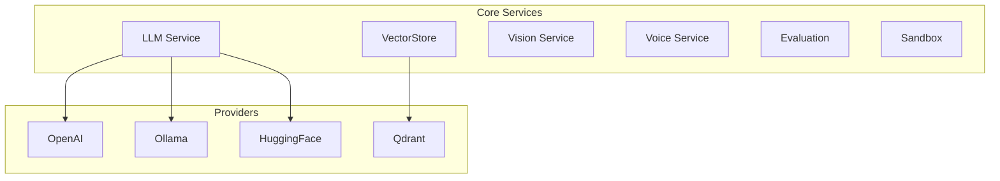

The `core/services` module provides domain-agnostic services.

## Overview



---

## LLM Service

Abstraction for language model providers.

### LLM Structure

```text
core/services/llm/
├── __init__.py
├── service.py          # Main LLMService (generate_response + generate)
├── interfaces.py       # Provider protocol
├── tool_calling.py     # Neutral tool/structured-output types
├── structured.py       # Native-vs-fallback orchestration for generate()
├── thinking.py         # Anthropic thinking-budget helpers
├── _telemetry.py       # Shared gen_ai.* span + cost-controller helpers
├── providers/          # Provider implementations
│   ├── anthropic_provider.py
│   ├── openai_provider.py
│   ├── ollama_provider.py
│   └── huggingface_provider.py
├── cost_control.py     # Cost control
└── exceptions.py
```

### LLM Basic Usage

```python
from core.services.llm import get_llm_service

llm = get_llm_service()

# Generate a response (returns a plain str)
text = await llm.generate_response(
    prompt="Explain relativity",
    model="gpt-4o-mini",      # optional; defaults to config
    system_prompt="You are concise.",
    temperature=0.2,          # optional; forwarded to the provider
    max_tokens=512,           # optional; forwarded to the provider
)
print(text)

# Streaming generation (async iterator of str chunks) — same sampling params
async for chunk in llm.generate_response_stream("Tell a story", temperature=0.7):
    print(chunk, end="")
```

### Sampling Parameters & Caching

Both `generate_response` and `generate_response_stream` accept optional
`temperature` and `max_tokens`; both now flow through to the underlying provider
(previously they were ignored). The exact-match response cache keys on
`prompt + system_prompt + temperature + max_tokens`, so calls that differ only in
their system prompt or sampling parameters no longer collide on a stale cached
answer.

### Native Tool-Calling & Structured Outputs

`generate_response` returns a plain `str`. For agentic use, `generate()` returns
a structured `LLMResult` (text and/or parsed tool calls), using each provider's
native tool API where available:

```python
from core.services.llm import get_llm_service, LLMToolSpec, ToolChoice, ResponseFormat

llm = get_llm_service()

result = await llm.generate(
    prompt="What's the weather in Paris?",
    tools=[
        LLMToolSpec(
            name="get_weather",
            description="Get current weather. Call when the user asks about weather.",
            parameters={
                "type": "object",
                "properties": {"city": {"type": "string"}},
                "required": ["city"],
            },
        )
    ],
    tool_choice=ToolChoice.forced("get_weather"),   # or the AUTO/ANY/NONE singletons
)

for call in result.tool_calls:
    print(call.name, call.arguments)   # arguments is already a parsed dict
print(result.text)                     # any assistant text
```

Structured JSON output uses `response_format=ResponseFormat(schema={...})`. Tool
specs are provider-agnostic; an MCP tool converts directly via
`tool_spec_from_mcp(mcp_tool)` (the MCP `input_schema` maps to `parameters`).

**Routing.** `generate()` uses a provider's native tool API only when the
`enable_native_tools` flag is on **and** the provider advertises
`supports_native_tools`:

| Provider | Native tool-calling |
|----------|---------------------|
| Anthropic (`tools` + `output_config.format`) | ✅ |
| OpenAI (`tools` + `response_format` json_schema) | ✅ |
| Ollama (`tools` + `format` schema) | ✅ |
| HuggingFace | ❌ (fallback only) |

When native tools are off or the provider lacks support, `generate()` falls back
to **prompt coercion**: the tool catalog (and any response schema) is injected
into the system prompt, JSON mode is requested via the legacy string path, and a
`{"tool": ..., "arguments": {...}}` object is parsed back into a `ToolCall`. The
return type is a uniform `LLMResult` in both modes. The flag is **off by
default** — opt in per deployment (`LLM_ENABLE_NATIVE_TOOLS=true`) after
confirming the provider/model supports native tools. Token usage, the
middleware cost controller, and the per-request `LoopBudget` are charged
identically on both paths.

The agentic loop consumes this end-to-end:
[`ReActAgent`](reasoning.md#native-tool-calling) auto-detects the flag +
provider support and drives its Thought/Action/Observation loop over
`generate(tools=...)`/`LLMResult.tool_calls` instead of regex-parsing action
text.

### Batch generation (offline, −50% cost)

`core/services/llm/batch.py` — for offline workloads (eval replays,
consolidation summaries, labeling) that don't need interactive latency:

```python
from core.services.llm.batch import BatchPrompt, generate_batch

results = await generate_batch(service, [
    BatchPrompt(custom_id="case-1", prompt="Summarize ..."),
    BatchPrompt(custom_id="case-2", prompt="Classify ...", system_prompt="..."),
])
```

On Anthropic this submits one **Message Batches** job (50% of standard token
prices; polls to completion, 24h ceiling); other providers get a sequential
fallback with the identical `BatchCompletion` result shape. Results are keyed
by `custom_id` and returned in submission order regardless of provider
ordering. Batch jobs are offline by design: they bypass the per-request
LoopBudget and cost-control middleware — callers own their own budgets.

### Gen AI metrics (semconv)

Every LLM call (plain, structured, streaming) emits the OTel Gen AI
semantic-convention Prometheus metrics `gen_ai_client_token_usage`
(input/output histograms) and `gen_ai_client_operation_duration_seconds`,
labeled by `gen_ai_system` and `gen_ai_request_model` — standard dashboards
light up without bespoke queries.

### Provider & Model Selection

`LLMService` reads its provider and model from configuration — they are **not**
constructor arguments. The constructor only controls caching and cost tracking:

```python
from core.services.llm import LLMService
from core.services.llm.cost_control import CostTracker

# Provider/model come from LLMConfig (env LLM_PROVIDER / LLM_MODEL, etc.)
llm = LLMService(
    cost_tracker=CostTracker(max_tokens=100_000),
    enable_cache=True,
    enable_semantic_cache=False,
    semantic_threshold=0.85,
)
```

Switch providers (OpenAI, Anthropic, Ollama, HuggingFace) via `LLM_PROVIDER` /
`LLM_MODEL` in the environment. All providers implement an async interface that
`LLMService` invokes via `await`.

!!! note "Credential handling"
    Each provider stores its API key as a `SecretStr` internally and unwraps it
    only at the SDK client boundary (`AsyncOpenAI(api_key=...)`,
    `AsyncAnthropic(api_key=...)`, `InferenceClient(token=...)`). The plaintext
    is never held as a bare instance attribute, so a provider captured in a
    traceback or Sentry frame does not leak the key. Constructors accept either
    a raw `str` or a `SecretStr`.

### Central Per-Plugin LLM Policy

`get_llm_service()` is **context-aware**: an operator can pin, per plugin, which
provider and/or model the shared funnel serves it — without the plugin changing
a line of code. Three framework pieces compose the mechanism:

1. **Plugin identity context** — `core.context.get_current_plugin()`. Bound only
   at framework chokepoints, never self-declared: the pure-ASGI
   `PluginContextMiddleware` attributes each HTTP request to the plugin owning
   its route (router prefix, then mounted sub-app), and the orchestrator binds
   the owner of an intent's flow handler around dispatch
   (`PluginRegistry.get_flow_handler_owner`).
2. **Policy seam** — `core.services.llm.set_plugin_llm_policy_resolver`. An
   admin-facing plugin registers a resolver at activation;
   `resolver(plugin_name)` returns a `PluginLLMPolicy(provider=..., model=...)`
   to pin that plugin's routing, or `None` to keep the deployment default. Like
   the tenancy-override seam, core never imports the policy source — the
   Sacred-Core boundary stays intact, and with no resolver registered behaviour
   is byte-for-byte the default.
3. **Policy-aware resolution** — `get_llm_service()` returns the config-default
   singleton, unless the bound plugin has a policy: then it returns a cached
   `LLMService` clone built for the pinned `(provider, model)` pair, sharing
   the central config's timeouts, caching and cost accounting.

```python
from core.services.llm import PluginLLMPolicy, set_plugin_llm_policy_resolver

# resolver(plugin_name) -> PluginLLMPolicy | None (cheap, cached, never raises)
set_plugin_llm_policy_resolver(my_policy_lookup)
```

Resolution rules (all fail **open** to the default service — governance must
never break LLM availability):

- A pinned **model** is governance, not a hint: it also wins over the plugin's
  own per-call `model=` overrides (string, streaming and structured paths).
- A pinned **provider** requires an explicit model when it differs from the
  default provider (the default model belongs to the default provider); a
  cross-provider pin without a model is ignored.
- An unsupported provider, a resolver error, or an unusable target (e.g.
  missing credentials) degrades to the deployment default.

Credentials are **never** part of a policy. The primary `LLM_API_KEY` belongs
to the default `LLM_PROVIDER`; policy-routed providers read their dedicated
config fields — `LLM_ANTHROPIC_API_KEY`/`ANTHROPIC_API_KEY`, `OPENAI_API_KEY`,
`LLM_HUGGINGFACE_API_KEY`/`HF_TOKEN` (`core.services.llm.runtime.api_key_for`
resolves the lookup; `provider_configured` reports which providers a policy may
pin). Ollama stays keyless (`LLM_API_BASE`).

!!! warning "Scope: the shared funnel only"
    A policy governs LLM calls that reach a provider through
    `get_llm_service()`. Code constructing its own `LLMService(config=...)`,
    using a provider class directly, or bundling its own SDK/keys is not
    intercepted — by design: an explicit config is a deliberate opt-out.

#### Governed clients for plugins that hold their own SDK

Some plugins keep their own provider SDK client (an OpenAI-compatible or native
Ollama client) because they depend on features the shared funnel does not model
— schema-constrained decoding, Ollama `think` / reasoning effort, per-role model
splits, in-process embeddings. Routing them through `get_llm_service()` would
drop the feature, so instead they resolve the *effective* routing for their
plugin and point their own client at that governed target:

```python
from core.services.llm import resolve_governed_client_config

gov = resolve_governed_client_config("my-plugin")   # None ⇒ keep your own defaults
if gov is not None and gov.provider in ("openai", "ollama"):
    base_url, api_key, model = gov.api_base, gov.key(), gov.model
    # build the plugin's own SDK client pointed at (provider, base_url, api_key)
    # and use `model` as the default model.
```

`resolve_governed_client_config(plugin_name)` returns a `GovernedClientConfig`
(`provider`, `model`, `api_key: SecretStr | None`, `api_base`) — exactly the pin
the funnel would apply — or `None` when the plugin is unpinned, the pin is a
cross-provider switch without a model, or resolution fails (fail-open: keep the
plugin's own defaults). It exposes the same policy the funnel obeys as plain
config; credentials still come only from central `LLMConfig`. A plugin whose SDK
cannot reach `gov.provider` (e.g. an OpenAI/Ollama-only engine pinned to
`anthropic`) should ignore it and fall back to its own default. Governance sets
the plugin's *default* provider/model; explicit per-call/per-role overrides
inside the plugin remain the plugin's choice.

#### Named LLM scopes (per-pipeline governance)

A plugin with more than one distinct LLM pipeline can expose each for
*independent* governance by declaring named **scopes** in its manifest, so an
operator pins them separately:

```yaml
# manifest.yaml
llm_scopes:
  - id: chat
    label: Chat / RAG
  - id: ingestion
    label: Ingestion
```

These surface on `PluginMetadata.llm_scopes` (`[{"id", "label"}]`). Both seams
take an optional `scope`:

```python
resolver(plugin_name, scope)                       # policy seam
resolve_governed_client_config(plugin_name, scope) # governed-client seam
```

`resolve_plugin_llm_policy(plugin_name, scope="ingestion")` resolves the pin for
that scope; a **scope with no pin of its own falls back to the plugin's default
pin** (`scope=None`), then to the deployment default — so a single default pin
still governs every scope exactly as before. A plugin resolves each pipeline with
its scope id (e.g. its chat client calls `resolve_governed_client_config(name,
"chat")`, its ingest client `"ingestion"`). Declaring nothing, or passing no
scope, is byte-for-byte the previous single-pin behaviour, and a resolver
registered with the legacy single-argument signature is still accepted (it pins
every scope alike).

### Cost Control

```python
from core.services.llm.cost_control import CostTracker, estimate_tokens

tracker = CostTracker(max_tokens=10000)

# Estimate tokens before calling
estimated = estimate_tokens("My prompt text here")

# Track usage after calling
tracker.track_tokens(count=estimated, model="gpt-4o-mini")

# Check remaining budget
print(tracker.get_usage())
# {"tokens_used": 150, "max_tokens": 10000, "remaining": 9850}
```

Token estimation uses `tiktoken` when available (exact count per model encoding), with an intelligent character-class heuristic as fallback (different ratios for English prose, code, and CJK text). The implementation is shared via `core.utils.tokens`.

!!! note "Enforced per-request budget"
    Beyond token tracking, each `generate_response` call charges its **real USD
    cost** (resolved from `core/models/pricing`) against the ambient per-request
    `LoopBudget`, so `LoopLimits.budget_usd` is an **enforced** cap rather than
    advisory. Models absent from the pricing table are not charged, so self-hosted
    models never abort a request on an unknown price. See
    [Orchestration › LoopBudget](orchestration.md#loopbudget-iteration-cost-cap).

### Retry & Circuit-Breaker Layering

`LLMService._generate_with_retry` is the **single retry layer** of the LLM
stack: it retries rate-limit errors only (3 attempts, exponential backoff)
and lets everything else fail fast. Providers carry **no retry of their
own** — a provider-level blanket retry on `Exception` multiplied attempts
(up to 3×3 upstream calls per request) and pointlessly re-tried
non-transient failures such as a bad API key. Providers keep a per-provider
**circuit breaker** (`@get_circuit_breaker("<name>_provider")`): failure
isolation is a separate concern from retrying.

To keep `_generate_with_retry` the single retry owner, the provider SDK clients
(Anthropic, OpenAI) are constructed with `max_retries=0` and an explicit
`httpx.Timeout(request_timeout, connect=connect_timeout)`, so no request can hang
indefinitely and no hidden SDK retry layer multiplies attempts. Two `LLMConfig`
fields tune the timeouts:

| Field | Default | Env |
| ----- | ------- | --- |
| `request_timeout` | 120 s | `LLM_REQUEST_TIMEOUT` |
| `connect_timeout` | 5 s | `LLM_CONNECT_TIMEOUT` |

### Extended Thinking / Reasoning Effort

The Anthropic provider supports an optional per-call **thinking budget**. Match the budget to the cognitive load of the task — hard problems benefit from a private reasoning scratchpad, while simple, high-volume calls do not (over-provisioning thinking wastes tokens and can degrade output).

It is **opt-in**: when neither `effort` nor `thinking_budget` is passed, behaviour is unchanged (no thinking block).

```python
from core.services.llm.thinking import resolve_thinking, EffortLevel

# Coarse effort tier → sweet-spot token budget
plan = resolve_thinking(effort=EffortLevel.HIGH, max_tokens=4096)
# plan.enabled is True, plan.budget_tokens == 12000, max_tokens grown for answer head-room

# Or pass through the provider directly
text, tokens = await provider.generate(prompt, model, effort="medium")
text, tokens = await provider.generate(prompt, model, thinking_budget=8000)
```

| Effort | Budget (tokens) | Typical task |
| ------ | --------------- | ------------ |
| `off`    | 0      | Simple Q&A, classification, routing |
| `low`    | 3 000  | Writing, summarization |
| `medium` | 6 000  | Code implementation, debugging |
| `high`   | 12 000 | Security review, architecture, hard reasoning |

When enabled, the provider sets `temperature=1` and grows `max_tokens` to leave room for the visible answer above the thinking budget (both required by the Messages API).

---

## VectorStore Service

Semantic search and vector indexing.

### VectorStore Structure

```text
core/services/vectorstore/
├── __init__.py
├── service.py            # VectorStoreService
├── embedding_cache.py    # Cached embedding generation (model-scoped keys)
├── chunking.py           # Text chunking utilities
└── providers/
    └── qdrant_provider.py  # Qdrant implementation
```

!!! info "Embedding Cache"
    The embedding cache keys are scoped by **model identifier** to prevent
    cross-model collisions. Switching the `VECTORSTORE_EMBEDDING_MODEL` env var
    automatically invalidates stale cache entries. Cached embeddings now **expire**
    after `VectorStoreConfig.embedding_cache_ttl` (default 7 days, env
    `EMBEDDING_CACHE_TTL`); the backing `RedisCache` applies this as its
    `default_ttl`, so cache keys never accumulate unbounded.

### VectorStore Basic Usage

```python
from core.services.vectorstore import get_vectorstore_service
from core.models.domain import Document

vs = get_vectorstore_service()

# Index documents (returns the number of points written)
count = await vs.index(
    documents=[
        Document(id="doc1", content="Document content 1", metadata={"category": "tech"}),
        Document(id="doc2", content="Document content 2", metadata={"category": "tech"}),
    ],
    collection_name="documents",
)

# Vector similarity search — pass the query embedding vector
results = await vs.search(
    query_vector=query_embedding,   # Sequence[float]
    k=5,
    collection_name="documents",
    query_text="find similar documents",   # optional, enables caching/rerank context
)

for result in results:           # Sequence[SearchResult]
    print(f"{result.document.id}: {result.score}")
```

### Tenant Isolation

BaselithCore enforces strict multi-tenant isolation at the service level. The `VectorStoreService` automatically extracts the `tenant_id` from the current execution context (via `get_current_tenant_id()`) and injects it into all operations:

- **Indexing**: Every vector point is tagged with the `tenant_id` in its payload.
- **Search & Retrieval**: A mandatory filter is applied to every query to ensure only the current tenant's data is visible.
- **Deletion**: Documents can only be deleted if they belong to the active tenant.

This isolation is executed **server-side** by the underlying provider (e.g., Qdrant), ensuring that data remains segmented even if internal identifiers are leaked.

### Payload Indexes & Grouped Retrieval

`QdrantProvider` creates keyword payload indexes on `tenant_id` and `document_id`
when a collection is created, and upgrades pre-existing collections with the same
indexes at startup — so tenant-filtered lookups stay fast as collections grow.

For per-document retrieval, `query_points_groups` returns the best-scoring chunk
per document in a **single** round trip. Chat retrieval uses it for its fallback
path instead of issuing one query per document.

### Embedding Generation

Embeddings are produced through an `EmbedderProtocol` implementation passed to
`index()` / `search()` (or resolved from configuration). The vector store caches
embeddings transparently via its model-scoped `embedding_cache`. There is no
`EmbeddingService` export in `core.services.vectorstore`.

---

## Vision Service

Image analysis and OCR.

### Vision Structure

```text
core/services/vision/
├── __init__.py
├── service.py          # VisionService (routing, prompts, shared HTTP client)
├── backends.py         # Provider calls (OpenAI, Anthropic, Google, Ollama)
├── models.py           # VisionRequest/VisionResponse/ImageContent
└── tools.py            # Vision tool adapters
```

### Vision Basic Usage

```python
from core.services.vision import get_vision_service

vision = get_vision_service()

# Image analysis
analysis = await vision.analyze(
    image_path="/path/to/image.png",
    prompt="Describe what you see in this image"
)
print(analysis.description)
print(analysis.objects)  # ["person", "car", "building"]

# OCR
text = await vision.extract_text(image_path="/path/to/document.png")
print(text.content)
print(text.confidence)
```

### Screenshot Analysis

```python
# Screenshot analysis
result = await vision.analyze_screenshot(
    screenshot=screenshot_bytes,
    context="Application user interface"
)
```

### Model Selection

Per-provider vision model identifiers are configuration-driven (no hardcoded model strings). Override them via environment variables; unset values fall back to the built-in defaults so existing deployments keep their current models.

| Env var | Default | Provider |
| ------- | ------- | -------- |
| `VISION_OPENAI_MODEL`    | `gpt-4o`                       | OpenAI |
| `VISION_ANTHROPIC_MODEL` | `claude-3-5-sonnet-20241022`   | Anthropic |
| `VISION_GOOGLE_MODEL`    | `gemini-2.0-flash`             | Google |
| `VISION_OLLAMA_MODEL`    | `llava`                        | Ollama (local) |

`VisionService` resolves these into `service.models` at init, so the same instance honours whatever the deployment configures.

---

## Voice Service

Speech synthesis and recognition.

### Voice Structure

```text
core/services/voice/
├── __init__.py
├── service.py          # VoiceService
├── tts.py              # Text-to-Speech
└── stt.py              # Speech-to-Text
```

### Text-to-Speech

```python
from core.services.voice import get_voice_service

voice = get_voice_service()

# Generate audio
audio = await voice.synthesize(
    text="Hello, how can I help you?",
    voice="it-IT-Wavenet-A",
    format="mp3"
)

# Save or stream
with open("output.mp3", "wb") as f:
    f.write(audio)
```

### Speech-to-Text

```python
# Transcribe audio
transcription = await voice.transcribe(
    audio_path="/path/to/audio.mp3",
    language="it"
)
print(transcription.text)
print(transcription.confidence)
```

---

## Evaluation Service

LLM-as-a-Judge evaluation using DeepEval.

```python
from core.services.evaluation import get_evaluation_service

evaluator = get_evaluation_service()

# Evaluate a RAG response
result = await evaluator.evaluate_rag_response(
    query="What is the capital of Italy?",
    response="The capital of Italy is Rome.",
    retrieved_context=["Italy is a country in Europe. Its capital is Rome."],
    expected_output="Rome",  # enables precision/recall metrics
)

print(result["faithfulness"])          # {"score": 0.95, "reason": "...", "passed": True}
print(result["answer_relevancy"])      # {"score": 0.92, "reason": "...", "passed": True}
print(result["contextual_precision"])  # {"score": 0.88, ...} (when expected_output given)
print(result["contextual_recall"])     # {"score": 0.90, ...} (when expected_output given)
```

### Available Metrics

| Metric                 | Description                            | Requires `expected_output` |
| ---------------------- | -------------------------------------- | -------------------------- |
| `faithfulness`         | Is the answer grounded in context?     | No                         |
| `answer_relevancy`     | Does it answer the question?           | No                         |
| `contextual_precision` | Are retrieved docs relevant & ordered? | Yes                        |
| `contextual_recall`    | Did we retrieve all relevant docs?     | Yes                        |

---

## Sandbox Service

Secure code execution.

```python
from core.services.sandbox import SandboxService

sandbox = SandboxService()

# Execute Python code (defaults to config provider, e.g., 'docker' or 'sbx')
result = await sandbox.execute_code_async(
    code="print(2 + 2)",
    language="python",
    timeout=5.0
)

print(result.stdout)   # "4\n"
print(result.stderr)   # ""
print(result.exit_code)  # 0
```

### Isolation & Security

BaselithCore supports two types of sandboxing for secure code execution:

1. **Docker (Standard)**: Uses standard Docker containers with `network_mode="none"` and resource limits. It provides a good balance between performance and security for most tasks.
2. **Docker Sandbox (sbx)**: A premium, **MicroVM-based** isolation layer. It uses the `sbx` CLI to spin up lightweight microVMs for every agent session, providing the strongest possible security boundary against "jailbreak" attempts.

- **MicroVM Isolation (sbx)**: Unlike containers that share the host kernel, MicroVMs have their own kernel, offering hardware-level isolation.
- **Network Isolation**: All sandboxes are launched with networking disabled by default (or strictly limited via `sbx` profiles).
- **Resource Limits**: Configurable memory and CPU quotas are enforced per execution.
- **Host Protection**: Agents in "YOLO mode" (autonomous execution) are strictly confined to the sandbox environment.

### Sandbox Configuration

The sandbox behavior is controlled via environment variables:

```env
# Provider: 'docker' (default) or 'sbx'
SANDBOX_PROVIDER=sbx

# Docker specific
SANDBOX_IMAGE=python:3.12-slim
SANDBOX_DOCKER_SOCKET=/var/run/docker.sock

# Sbx specific
SANDBOX_SBX_PATH=sbx
SANDBOX_SBX_PROFILE=default

# General
SANDBOX_TIMEOUT=30
```

!!! note "Installation"
    To use the `sbx` provider, you must install the `sbx` CLI tool on your host. On macOS, use `brew install docker/tap/sbx`.

---

## Optimizer

LLM-driven performance tuning for agents (`core/optimization/optimizer.py`).

```python
from core.optimization.optimizer import HyperParameterOptimizer, TuneResult

optimizer = HyperParameterOptimizer(llm_service=llm)

# Dry-run: get suggestion without applying
result: TuneResult = await optimizer.auto_tune(agent_id="summarizer-v2")
print(result.suggestion)   # {"temperature": 0.3, "max_tokens": 512, ...}
print(result.applied)      # False (dry_run=True by default)

# Auto-apply via callback
async def apply_config(agent_id: str, suggestion: dict) -> bool:
    agent = get_agent(agent_id)
    agent.update_config(suggestion)
    return True

result = await optimizer.auto_tune(
    agent_id="summarizer-v2",
    apply_fn=apply_config,
    dry_run=False,
)
print(result.applied)            # True
print(optimizer.get_history())   # [{agent_id, suggestion, timestamp}, ...]
```

### `TuneResult` Fields

| Field            | Type    | Description                         |
| ---------------- | ------- | ----------------------------------- |
| `agent_id`       | `str`   | Agent that was tuned                |
| `suggestion`     | `dict`  | LLM-generated parameter suggestions |
| `applied`        | `bool`  | Whether the suggestion was applied  |
| `previous_score` | `float` | Performance score before tuning     |

### Optimization Loop (event-driven)

The `OptimizationLoop` subscribes to `EVALUATION_COMPLETED` events and triggers `auto_tune()` automatically when an agent's score drops below a threshold.

```python
from core.optimization import OptimizationLoop

loop = OptimizationLoop(
    feedback_collector=collector,
    apply_fn=apply_config,
    threshold=0.5,     # trigger when score < 0.5
    dry_run=False,     # actually apply suggestions
)
loop.start()   # subscribes to EventBus
# ... evaluation events flow in ...
loop.stop()
```

**Event flow**: `FLOW_COMPLETED` → `EvaluationService` → `EVALUATION_COMPLETED` → `OptimizationLoop` → `auto_tune()` → `OPTIMIZATION_COMPLETED`

---

## Indexing Service

Incremental document indexing with fingerprint-based change detection.

```python
from core.services.indexing import get_indexing_service

indexing = get_indexing_service()

# Index all configured document sources (incremental)
stats = await indexing.index_documents(incremental=True)
print(f"New: {stats.new_documents}, Skipped: {stats.skipped_documents}, Deleted: {stats.deleted_documents}")

# Ingest a single file
stats = await indexing.ingest_file("/path/to/doc.pdf", collection="default")
```

`ingest_file()` validates paths against `DOCUMENTS_ROOT`:

- Absolute paths are allowed only if they stay inside the configured documents root.
- Relative paths are resolved relative to `DOCUMENTS_ROOT`.
- Paths outside that root are rejected to prevent path traversal and accidental indexing of arbitrary files.

Example with a relative path:

```python
# If DOCUMENTS_ROOT=documents, this resolves to ./documents/manuals/guide.pdf
stats = await indexing.ingest_file("manuals/guide.pdf")
```

### Persistence

The indexing state (document fingerprints) is persisted to Redis under `baselith:indexing:state`. This means incremental indexing survives application restarts — only genuinely changed documents are re-indexed.

### Stale Document Cleanup

Documents that are no longer present in any active source are automatically deleted from the vector store at the end of each indexing run.

---

## Human-in-the-Loop

Standard mechanisms for agents to request human intervention, approval, or clarification.

```python
from core.human import HumanIntervention

intervention = HumanIntervention(callback=my_ui_callback)

# Request approval (with timeout)
approved = await intervention.request_approval(
    "Deploy to production?",
    timeout=60,
    context={"environment": "prod"}
)

# Ask for input
name = await intervention.ask_input("What is the project name?")

# Present selection
env = await intervention.request_selection(
    "Choose deployment target:",
    options=["staging", "production"]
)
```

Timeouts are enforced via `asyncio.wait_for()`. If no response is received within `timeout` seconds, the request is auto-rejected with status `TIMEOUT`.

---

## Protocol Pattern

All services follow the protocol pattern:

```python
# core/interfaces/llm.py
class LLMServiceProtocol(Protocol):
    async def generate(self, prompt: str, **kwargs) -> LLMResponse: ...
    async def stream(self, prompt: str, **kwargs) -> AsyncGenerator[str, None]: ...

# Implementation
class LLMService(LLMServiceProtocol):
    async def generate(self, prompt: str, **kwargs) -> LLMResponse:
        # Concrete implementation
        ...
```

---

## Dependency Injection

Access services via DI:

```python
from core.di import ServiceRegistry
from core.interfaces import LLMServiceProtocol, VectorStoreProtocol

# In a handler
class MyHandler:
    def __init__(self):
        self.llm = ServiceRegistry.get(LLMServiceProtocol)
        self.vectorstore = ServiceRegistry.get(VectorStoreProtocol)
```

---

## Configuration

```env title=".env"
# LLM
LLM_MODEL=llama3.2
LLM_API_BASE=http://localhost:11434
LLM_API_KEY=sk-...
LLM_REQUEST_TIMEOUT=120
LLM_CONNECT_TIMEOUT=5

# VectorStore
VECTORSTORE_HOST=localhost
VECTORSTORE_PORT=6333
VECTORSTORE_EMBEDDING_MODEL=all-MiniLM-L6-v2
EMBEDDING_CACHE_TTL=604800   # 7 days

# Vision
VISION_MODEL=gpt-4o-mini

# Voice
VOICE_PROVIDER=google
VOICE_LANGUAGE=it-IT
VOICE_ELEVENLABS_MODEL_ID=eleven_multilingual_v2
VOICE_ELEVENLABS_STABILITY=0.5
VOICE_ELEVENLABS_SIMILARITY_BOOST=0.75
VOICE_EMBEDDING_MODEL=all-MiniLM-L6-v2
```
