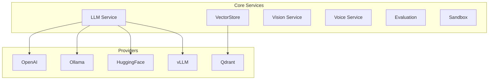

The `core/services` module provides domain-agnostic services. The chat service
(`core/services/chat/`: request handling, streaming and per-conversation history)
is documented in [Chat & RAG](chat.md), in particular
[Conversation History](chat.md#conversation-history).

## Overview


```mermaid
graph TB
    subgraph Services["Core Services"]
        LLM[LLM Service]
        VS[VectorStore]
        Vision[Vision Service]
        Voice[Voice Service]
        Eval[Evaluation]
        Sandbox[Sandbox]
    end

    subgraph Providers
        OpenAI[OpenAI]
        Ollama[Ollama]
        HF[HuggingFace]
        VLLM[vLLM]
        Qdrant[Qdrant]
    end

    LLM --> OpenAI & Ollama & HF & VLLM
    VS --> Qdrant
```

---

## LLM Service

Abstraction for language model providers.

!!! info "Provider SDKs are imported on demand"
    `core.services.llm.provider_factory` imports a provider client inside the branch that builds it, never at module scope. A deployment configures one provider; importing this module used to import the anthropic, openai, ollama and huggingface clients in order to construct exactly one of them, costing 0.38 s and roughly 1 800 modules on every path that reached the service.

In tests, patch a provider where it is **defined** —
`core.services.llm.providers.openai_provider.OpenAIProvider` — not as an
attribute of the factory, which no longer has one. See
[import-time laziness](../advanced/lazy-loading.md#import-time-laziness).

### LLM Structure

```text
core/services/llm/
├── __init__.py
├── service.py          # Main LLMService (generate_response + generate)
├── interfaces.py       # Provider protocol
├── tool_calling.py     # Neutral tool/structured-output types
├── structured.py       # Native-vs-fallback orchestration for generate()
├── thinking.py         # Anthropic thinking-budget helpers
├── _telemetry.py       # Shared gen_ai.* span + cost-controller helpers
├── providers/          # Provider implementations
│   ├── anthropic_provider.py
│   ├── _anthropic_client.py    # api|bedrock|vertex SDK client construction
│   ├── openai_provider.py
│   ├── ollama_provider.py
│   ├── vllm_provider.py        # OpenAI-compatible, self-hosted (subclasses OpenAIProvider)
│   └── huggingface_provider.py
├── cost_control.py     # Cost control
└── exceptions.py
```

### LLM Basic Usage

```python
from core.services.llm import get_llm_service

llm = get_llm_service()

# Generate a response (returns a plain str)
text = await llm.generate_response(
    prompt="Explain relativity",
    model="gpt-4o-mini",      # optional; defaults to config
    system_prompt="You are concise.",
    temperature=0.2,          # optional; forwarded to the provider
    max_tokens=512,           # optional; forwarded to the provider
)
print(text)

# Streaming generation (async iterator of str chunks) — same sampling params
async for chunk in llm.generate_response_stream("Tell a story", temperature=0.7):
    print(chunk, end="")
```

### Sampling Parameters & Caching

Both `generate_response` and `generate_response_stream` accept optional
`temperature` and `max_tokens`; both now flow through to the underlying provider
(previously they were ignored). The exact-match response cache keys on
`prompt + system_prompt + temperature + max_tokens`, so calls that differ only in
their system prompt or sampling parameters no longer collide on a stale cached
answer.

### Native Tool-Calling & Structured Outputs

`generate_response` returns a plain `str`. For agentic use, `generate()` returns
a structured `LLMResult` (text and/or parsed tool calls), using each provider's
native tool API where available:

```python
from core.services.llm import get_llm_service, LLMToolSpec, ToolChoice, ResponseFormat

llm = get_llm_service()

result = await llm.generate(
    prompt="What's the weather in Paris?",
    tools=[
        LLMToolSpec(
            name="get_weather",
            description="Get current weather. Call when the user asks about weather.",
            parameters={
                "type": "object",
                "properties": {"city": {"type": "string"}},
                "required": ["city"],
            },
        )
    ],
    tool_choice=ToolChoice.forced("get_weather"),   # or the AUTO/ANY/NONE singletons
)

for call in result.tool_calls:
    print(call.name, call.arguments)   # arguments is already a parsed dict
print(result.text)                     # any assistant text
```

Structured JSON output uses `response_format=ResponseFormat(schema={...})`. Tool
specs are provider-agnostic; an MCP tool converts directly via
`tool_spec_from_mcp(mcp_tool)` (the MCP `input_schema` maps to `parameters`).

**Pydantic bridge (`generate_typed`).** Instead of hand-writing a JSON Schema
and parsing text, pass a Pydantic model and get a validated instance back —
the schema comes from `model_json_schema()`, the response is
`model_validate`d, and a schema-violating answer is retried once with the
validation error fed back to the model:

```python
from pydantic import BaseModel
from core.services.llm import generate_typed, get_llm_service

class Verdict(BaseModel):
    is_real: bool
    confidence: float

verdict = await generate_typed(get_llm_service(), "Judge this claim: ...", Verdict)
verdict.is_real   # typed access — no json.loads, no manual validation
```

**Strict schemas.** A provider that enforces the schema exactly (OpenAI's
`json_schema` response format with `strict: true`) accepts a narrower dialect
than JSON Schema: every key in `properties` must appear in `required`, every
object must set `additionalProperties: false`, and a `$ref` may not carry
sibling keywords. `model_json_schema()` breaks the first rule for any field
with a default, and the request is rejected with a 400 *before* generation:

```text
Invalid schema for response_format 'ClaimSet': 'required' is required to be
supplied and to be an array including every key in properties. Missing 'kind'.
```

A defaulted field whose type is a nested model or enum fails a second way,
because Pydantic emits the default beside the reference — `{"$ref": "#/$defs/
Kind", "default": "fact"}` — which is rejected with `$ref cannot have keywords
{'default'}`. The adapter reduces such a node to the bare `$ref`.

`core/services/llm/_strict_schema.py::to_strict_schema` adapts the document
(including nested models under `$defs`) on the way out, so a response model
may keep its defaults. Requiring a defaulted field costs nothing: the model
now always emits a value, so the default is simply never exercised. A field
typed `X | None` keeps its `null` branch, which is the provider's own
recommended way to express "optional". The adaptation is skipped for
`ResponseFormat(strict=False)`, where the caller's schema is the contract.

**Images (`generate_image`).** Illustration is an ordinary model call, so it
sits next to the text seams rather than in each caller:

```python
from core.services.llm import generate_image, get_llm_service

image = await generate_image(
    get_llm_service(),
    "A paper tape threaded through a mechanical gate, stopped mid-run",
    size="1536x1024",
    quality="low",
)
image.data          # raw bytes — commit them, store them, serve them
image.media_type    # read off the bytes: "image/png", "image/webp", …
image.revised_prompt  # what the provider actually drew, when it rewrites
```

Bytes, not a URL: a hosted image expires and every consumer would otherwise
re-implement the download. A provider without image support raises
`LLMProviderError` immediately — no network call, so a caller can treat "this
deployment cannot draw" as a cheap, ordinary outcome. Implemented today by the
OpenAI provider (`gpt-image-1` by default).

**The payload is decoded defensively, and the format is sniffed, not assumed.**
Providers return base64 text, and two things go wrong there without raising.
`base64.b64decode` silently drops characters outside the alphabet, so a
gateway that answers with a data URL (`data:image/png;base64,…`) decodes into a
corrupt image that only shows up as a broken `` much later; and the
documented format is not always what arrives — the GPT image models return
WebP for some requests. `core/services/llm/images.py::decode_image_payload`
strips any data-URL prefix, decodes with `validate=True`, and identifies the
result with `core.utils.images.sniff_image_type` (PNG, JPEG, GIF, WebP by
magic bytes). Bytes that are not a recognised image raise `LLMProviderError`
quoting their head — an HTML error page from a proxy reads as
`3c 68 74 6d 6c` — so a caller stores a real image or a reason, never a
plausible-looking corruption. `media_type` therefore describes the bytes, and
a consumer can use it to name the file it writes.

`quality` is the cost lever: the GPT image models take `low`/`medium`/`high`
(and default to the priciest tier when unset), while other models accept
different values (`dall-e-3`: `standard`/`hd`) — so when `quality` is `None`
the provider omits the key entirely rather than guessing a tier the API would
reject. Size follows the same passthrough philosophy: the string goes to the
provider verbatim (`gpt-image-2` accepts any `WIDTHxHEIGHT` divisible by 16
within a 1:3–3:1 ratio; earlier models only their fixed sizes).

**Routing.** `generate()` uses a provider's native tool API only when the
`enable_native_tools` flag is on **and** the provider advertises
`supports_native_tools`:

| Provider | Native tool-calling |
|----------|---------------------|
| Anthropic (`tools` + `output_config.format`) | ✅ |
| OpenAI (`tools` + `response_format` json_schema) | ✅ |
| Ollama (`tools` + `format` schema) | ✅ |
| vLLM (`tools` + `response_format` json_schema, guided decoding) | ✅ when the server runs `--enable-auto-tool-choice` (`LLM_VLLM_NATIVE_TOOLS`) |
| Gemini (`function_declarations` + `response_schema`) | ✅ (optional extra `[gemini]`) |
| HuggingFace | ❌ (fallback only) |

When native tools are off or the provider lacks support, `generate()` falls back
to **prompt coercion**: the tool catalog (and any response schema) is injected
into the system prompt, JSON mode is requested via the legacy string path, and a
`{"tool": ..., "arguments": {...}}` object is parsed back into a `ToolCall`. The
return type is a uniform `LLMResult` in both modes. The flag is **on by
default** — the `supports_native_tools` guard keeps providers without a native
API on the coercion path, so the default is safe everywhere; set
`LLM_ENABLE_NATIVE_TOOLS=false` to force prompt coercion for every provider.
Token usage, the middleware cost controller, and the per-request `LoopBudget`
are charged identically on both paths.

**Cross-provider fallback (`LLM_FALLBACK_CHAIN`).** `generate_response()` can
fall through an ordered chain of `provider:model` stages when the primary
provider fails or its circuit breaker is open — e.g.
`LLM_FALLBACK_CHAIN=openai:gpt-4o-mini,ollama:llama3.2` (empty disables
fallback, the default). Each stage is a cached `LLMService` clone with the
provider's dedicated credentials (`core.services.llm.fallback_runtime`, whose
shared machinery lives in `_fallback_support`); a clone never recurses into its
own chain. The span records `gen_ai.baselith.serving_provider` and
`gen_ai.response.model`, and GenAI metrics are attributed to the provider that
actually served the call.

**What never falls through.** Budget and deadline errors, because the request
is out of money or time. A refusal, because the model ran and was billed. And
a **client error** (`LLMClientError`: expired or wrong key, unknown model,
malformed payload) — the chain covers outages, not configuration. Without that
last rule a deployment whose hosted key lapsed served every request from its
local stage instead, successfully and indefinitely, with a warning as the only
symptom. A 5xx, a timeout, a connection error and a rate limit still fail over,
which is what a chain is for.

**A fallback that serves is an alertable event.** The request returns 200
either way, so a log line is not enough: each fallback answer increments
`mas_llm_fallback_served_total{primary,served_by,path}` (paths: `text`,
`structured`, `messages`, `stream`) and logs `llm_fallback_served` with the
trail of stage failures behind it. Alert on the counter — inference moving to
another provider, often a local one on whichever host happens to run it, is an
operational event and not an implementation detail.

**Cost follows the answer, not the request.** Every ledger — the middleware
controller, the per-run `LoopBudget`, the tenant's cumulative spend and the
GenAI cost metric — books the model that actually served, provider-namespaced
when that provider is local (`core.models.pricing.qualified_model_id`). Two
bugs closed at once: a fallback answer used to be priced at the *primary's*
rate, and a self-hosted model, having no pricing row, was priced through the
unknown-model policy at `UNKNOWN_PRICE`'s punitive 100 $/M — spend that never
happened, large enough to abort a budgeted run. Any `ollama/<model>` id now
(and `vllm/<model>`) prices at zero without needing a table row, while tokens are still metered, so
a run cannot escape its token cap by moving to a local model. A local endpoint
that fronts a paid model can still be priced by adding an explicit row for its
qualified id.

Stages are identified by `provider:model`, not by provider alone, so a chain
may name the primary's own provider with a different model — big model first,
a cheaper one as the safety net. Keying stages by provider made that ordinary
configuration illegal: it collided with the primary and raised `duplicate
provider names in chain` on *every* call, turning a fallback into a total
outage. The circuit breaker stays keyed by **provider** (a rate limit is a
property of the provider, not of one model).

**Startup posture check (`LLM_PREFLIGHT`).** `core.services.llm.preflight`
runs once from the startup health checks and answers the question the runtime
cannot: *will this deployment serve from what it thinks it will?* It reports

- an **unset `LLM_PROVIDER`**, which inherits the package default (`ollama`)
  and serves every request from a local model on that host — successfully, and
  with no other symptom;
- a **primary without credentials**, which otherwise fails on the first
  request, after the rollout is live;
- **chain stages without credentials**, or a chain that cannot be parsed (it is
  parsed per request, so a typo used to surface only under load);
- **local endpoints and models**: every Ollama target the deployment may reach
  — primary, chain stage and the separately-configured vision provider — is
  probed with `GET /api/tags`, and a model that is not installed is named. It
  is never pulled: several gigabytes is an operator's decision, not a boot
  step. Severity follows the dependency, not the check: a gap on the inference
  path — the primary, a chain stage — blocks the boot, while one only the
  vision provider asks for is reported as a warning and the deployment starts.
  A model no request routes to must not cost a deployment everything it serves,
  which under `Restart=always` is what a fatal check amounts to. vLLM targets
  (primary or chain stage) are probed with `GET /v1/models`: an unreachable
  server (`vllm_unreachable`), a rejected key (`vllm_unauthorized`) and a model
  the server does not serve under that name (`vllm_model_missing`, listing
  what it does serve) are all inference-path errors.

`auto` (the default) raises in a production environment and warns elsewhere;
`warn`, `strict` and `off` force the behaviour. It **never calls a hosted
provider**: a startup that depends on a vendor answering is one a vendor
incident can stop, and a credential check that costs money is one nobody
leaves enabled. The same checks back `baselith doctor` (`LLM Fallback` and
`LLM Local Models`).

**Bound the stages (`LLM_FALLBACK_STAGE_TIMEOUT`).** Unset — the default —
each stage may spend the full `LLM_REQUEST_TIMEOUT`, so a chain ending at a
slow local model can hold one HTTP request open for minutes, long past the
point a reverse proxy (60s by default in nginx) gave up and the caller decided
the service was dead. Set it below that proxy's read timeout and an overrunning
stage becomes a failed attempt the chain moves past.

**Bound the whole chain (`LLM_FALLBACK_TOTAL_TIMEOUT`).** A per-stage bound
does not bound the chain, and with no stage timeout at all nothing did: every
stage could spend `LLM_REQUEST_TIMEOUT` across the three rate-limit attempts of
`_generate_with_retry` plus backoff, so a three-stage chain ran for many
minutes on a single request. This is the wall-clock budget for `run()` end to
end. Unset it and
`core.services.llm.fallback_runtime._chain_timeout` **falls back to
`LLM_REQUEST_TIMEOUT` (default `120.0`)** — the safe reading of "unset" here is
*one request's worth of time*, not *forever*.

| Setting | Default | Bounds |
| ------- | ------- | ------ |
| `LLM_FALLBACK_STAGE_TIMEOUT` | unset ⇒ each stage may use `LLM_REQUEST_TIMEOUT` | One stage |
| `LLM_FALLBACK_TOTAL_TIMEOUT` | unset ⇒ `LLM_REQUEST_TIMEOUT` (`120.0`) | The whole chain |

Each stage runs under `min(stage timeout, chain time remaining)`, and a stage
reached after the budget is spent is skipped rather than started — it lands in
`FallbackOutcome.attempts` as `skipped=True` with
`error="chain_deadline_exceeded"`, which is what distinguishes "everything
failed" from "we ran out of time" in a postmortem. Both bounds apply to the
buffered, streaming and native-structured paths alike. See
[Fallback chain](models.md#fallback-chain) for the primitive.

The **streaming path** (`generate_response_stream()`) falls through the same
chain via `core.services.llm._stream_fallback`, with one hard limit: failover
happens only **before the first chunk reaches the caller**. Each candidate is
opened and its first chunk awaited — a failure there is invisible to the
consumer and switches provider, while a failure afterwards propagates, because
a partially rendered answer cannot be un-sent. Without this, an unreachable
primary produced a split reality: buffered calls kept working off the chain
while every streaming surface (chat, interviews, any token-by-token UI) failed
with the primary's connection error. The typed event stream
(`generate_stream_events()`) deliberately does **not** fail over: a fallback
provider may not support native tool-call streaming, which would change the
contract mid-consumption.

The **native structured path** (`generate()` with tools / `response_format`)
falls through the same chain via `maybe_run_structured_with_fallback`:
stages whose provider lacks native tool support are skipped (a
prompt-coercion stage would silently change semantics mid-chain), and the
serving provider lands on the span identically.

**Cost-aware routing (`LLM_ROUTING_ENABLED` / `LLM_ROUTING_POLICY`).**
`generate_response()` and `generate()` accept a `task_category` hint (a
`core.models.routing.TaskCategory` value, e.g. `"classification"`). When
routing is enabled, the hint resolves to a model tier via `ModelRouter`;
`LLM_ROUTING_POLICY` is a JSON object mapping category to model id. Model
precedence is **pinned > per-call `model=` > routed > config default**, and
routing is a hint, never an error — unknown categories fall back to the
config default. The intent classifier passes `task_category="classification"`
so classification runs on the cheap tier out of the box.

`LLM_ROUTING_MAX_COST_PER_1K_USD` (unset by default; must be `> 0` when set)
adds a budget cap on top. When the routed model's approximate cost per 1K
tokens (500 in / 500 out, from the pricing table) exceeds it, the router
substitutes the *priciest* model in the policy pool that still fits
(`rule="cost_guard"`); when none fits, it takes the cheapest one rather than
raise. The provider check below still applies to the substituted model.

**The routed pick must be servable by the configured provider.** The built-in
policy names Claude ids for every category, so switching `LLM_ROUTING_ENABLED`
on in an OpenAI, Gemini, Ollama or HuggingFace deployment used to ask that
provider for a model it has never heard of — one 404 per categorized call, from
a feature sold as a cost optimization. `routed_model()` now resolves the pick's
vendor family from its id prefix and checks it against the configured provider:

| Family | Id prefixes | Providers that serve it |
| ------ | ----------- | ----------------------- |
| Anthropic | `claude-` | `anthropic`, `bedrock`, `vertex` |
| OpenAI | `gpt-`, `o1-`, `o3-` | `openai`, `azure`, `azure_openai` |
| Google | `gemini-` | `gemini`, `vertex`, `google` |

`LLM_PROVIDER` itself accepts only `openai`, `ollama`, `huggingface`,
`anthropic`, `gemini` and `vllm`; the extra names in the table exist for configs that
carry a provider string of their own. Anthropic-on-Bedrock/Vertex is
`LLM_PROVIDER=anthropic` plus `LLM_ANTHROPIC_BACKEND` (below), which already
resolves to the Anthropic family.

On a mismatch `routed_model()` logs a warning naming the model and the provider,
then resolves to `None` — the module's existing "fall back to the configured
default model" contract, so routing stays a hint and never raises. The check is deliberately **one-sided**:
it rejects only a *provable* mismatch. An id whose family cannot be recognized
passes untouched — that covers every local Ollama tag (`llama3.2`,
`qwen2.5-coder`), which is whatever the operator pulled — as does a config that
names no provider at all.

!!! warning "Non-Anthropic deployments need their own policy for routing to do anything"
    The built-in policy is Claude-only, so on any provider outside the
    Anthropic family — `openai` (what `.env.example` ships), the package
    default `ollama`, `gemini`, `huggingface` — every categorized call is
    blocked by the guard and falls back to `LLM_MODEL`. Routing stays a no-op
    until `LLM_ROUTING_POLICY` maps the categories onto that provider's own
    model ids, e.g. `{"planning": "gpt-4o", "classification": "gpt-4o-mini"}`.

The agentic loop consumes this end-to-end:
[`ReActAgent`](reasoning.md#native-tool-calling) auto-detects the flag +
provider support and drives its Thought/Action/Observation loop over
`LLMResult.tool_calls` instead of regex-parsing action text — through
`generate_messages(...)` where the service has it, and `generate(tools=...)`
where it does not.

### One round trip for a message history

`core/services/llm/message_transport.py` is the single seam both agent loops
send a conversation through. Only one of them had it for a while: the typed
[`Agent`](agent.md) spoke the [message API](messages.md), while the ReAct loop
the orchestrator actually runs rebuilt a flat prompt every turn. This is that
round trip, written once, so the two cannot drift apart again.

```python
from core.services.llm.message_transport import generate_over_messages
from core.services.llm.messages import Message

history = [Message.user("population of Rome?")]

result = await generate_over_messages(
    llm_service,               # an LLMService, or whatever a caller injected
    history,                   # list[Message], oldest first
    specs=specs,               # list[LLMToolSpec] | None
    response_format=None,      # ResponseFormat | None
    system="You are a precise geography assistant.",
    model=None,                # deployment default
    task_category=None,        # cost-aware routing hint
)
```

Everything after `history` is keyword-only, and the return is the ordinary
`LLMResult`. Import it by path; it is deliberately not re-exported from
`core.services.llm`.

**Two paths, one contract.** `service_supports_messages(service)` decides:
`service.generate_messages(...)` when the service advertises
`supports_messages` **and** that method is callable, otherwise
`render_as_prompt(history)` through the legacy `generate(prompt=...)`. The
degraded path appends
[`CONVERGENCE_NUDGE`](messages.md#degradation-render_as_prompt) whenever the
history contains a `ToolResultBlock` — a flattened conversation has no
`tool_result` block to say the work came back, so without the instruction the
model re-requests calls it has already been answered until the iteration cap.
It loses the structure, not the conversation.

**The history is passed as a copy, always.** A loop appends to its own list
after every turn, and handing the live object to the service would let a later
append rewrite what an earlier call was given — and make every traced request
look identical.

!!! danger "The capability check is `is True`, deliberately"
    `getattr` on a `Mock` answers with a truthy `Mock`, so
    `service_supports_messages` compares `supports_messages` with `True` by
    identity. Without that, a bare `AsyncMock` double would be routed down the
    message path and silently exercise the wrong seam.

See [Neutral Message API](messages.md) for the types themselves, and
[Reasoning › The turn is a message](reasoning.md#the-turn-is-a-message-not-a-rebuilt-prompt)
for what the ReAct loop appends between round trips.

### Streaming with tool calls

`core/services/llm/stream_events.py` — stream a structured generation as a
neutral event sequence, so agent UIs can render text deltas and show tool
invocations while the model emits them:

```python
from core.services.llm.stream_events import (
    StreamEnd, TextDelta, ToolCallStarted, generate_stream_events,
)

async for event in generate_stream_events(service, prompt, tools=specs):
    match event:
        case TextDelta(text):          ...   # render incrementally
        case ToolCallStarted(id, name): ...  # show "calling <name>…"
        case StreamEnd(result):        ...   # authoritative LLMResult
```

Events: `TextDelta` / `ToolCallStarted` / `ToolCallDelta` (partial arguments
JSON — render-only, never parse incrementally), then exactly one `StreamEnd`
carrying the same `LLMResult` the non-streaming path returns (parsed tool
calls, tokens, stop reason). Routing mirrors `generate()`: native SSE
streaming when `enable_native_tools` is on and the provider implements
`generate_structured_stream` (Anthropic); otherwise the buffered structured
path is replayed as events — the consumer contract is identical. Deadline
(`stream_within_deadline`) and token/cost accounting match the sibling paths.

!!! danger "Anthropic deltas are read off `content_block_delta`"
    The Anthropic reader (`core/services/llm/providers/_anthropic_streaming.py`)
    dispatched on `event.type == "text_delta"` — a shape no Anthropic SDK
    emits. The delta type lives on `event.delta.type`, inside a
    `content_block_delta` event, so the branch never matched and both
    Anthropic streaming paths (`stream_text` and `stream_structured`) yielded
    no text at all: token counts and the final message were right, the visible
    answer was empty. Both now normalise the raw `content_block_delta` event,
    which is also the only one carrying `index` — without it a partial-JSON
    delta cannot be attributed to the tool call it belongs to. The SDK's own
    accumulated companions (`TextEvent`, `InputJsonEvent`) are deliberately
    **not** read, or every chunk would be emitted twice; a top-level
    `text_delta` / `input_json_delta` is still accepted for hand-built doubles
    and wrappers that forward bare delta objects.

### Batch generation (offline, −50% cost)

`core/services/llm/batch.py` — for offline workloads (eval replays,
consolidation summaries, labeling) that don't need interactive latency:

!!! note "Library API — not wired by default"
    No framework code path calls `generate_batch`; it is a helper for your own
    offline jobs.

```python
from core.services.llm.batch import BatchPrompt, generate_batch

results = await generate_batch(service, [
    BatchPrompt(custom_id="case-1", prompt="Summarize ..."),
    BatchPrompt(custom_id="case-2", prompt="Classify ...", system_prompt="..."),
])
```

On Anthropic this submits one **Message Batches** job (50% of standard token
prices; polls to completion, 24h ceiling); other providers get a sequential
fallback with the identical `BatchCompletion` result shape. Results are keyed
by `custom_id` and returned in submission order regardless of provider
ordering. Batch jobs are offline by design: they bypass the per-request
LoopBudget and cost-control middleware — callers own their own budgets.

### Gen AI metrics (semconv)

Every LLM call (plain, structured, streaming) emits the OTel Gen AI
semantic-convention Prometheus metrics `gen_ai_client_token_usage`
(input/output histograms) and `gen_ai_client_operation_duration_seconds`,
labeled by `gen_ai_system` and `gen_ai_request_model` — standard dashboards
light up without bespoke queries. Calls to models in the pricing table also
emit `gen_ai_client_cost_usd_total` (estimated USD, extension metric — no
semconv name for cost exists yet), which powers the "LLM Cost (USD)" panel in
`grafana/dashboards/agentic-metrics.json`; the token panel there queries the
`gen_ai_*` metrics, not the legacy `mas_llm_*`/`llm_tokens_total` family.

### Per-plugin span attribution

Every LLM span also carries `baselith.plugin` — the plugin the call was made on
behalf of, or nothing at all when the call is not running for one. The value
comes from the request context, which is already bound by the time a generation
starts: the plugin-context middleware sets it for every request routed to a
plugin, and the orchestrator sets it around an intent dispatch.

It matters because without it a reader of the traces could see that *something*
spent tokens without seeing who. That is the difference between a per-plugin
cost view — or an agent topology — that covers the whole deployment and one
that covers only the work the orchestrator happens to mediate.

The lookup is best-effort by design: it is wrapped so that a context backend
failing can never fail a completion. When it cannot resolve a plugin the span
simply omits the key, and nothing is logged, because a failure here costs the
caller nothing and would otherwise fire once per completion.

### OpenInference span enrichment (Phoenix/Arize)

The same LLM spans that carry the `gen_ai.*` attributes can additionally carry
**OpenInference** attributes, the naming scheme LLM-observability backends
like Arize Phoenix key on. Opt in with `BASELITH_OPENINFERENCE_ENABLED=true`
and `generate_response` / `stream_response` add `openinference.span.kind=LLM`,
`llm.model_name`, `llm.provider` and
`llm.token_count.prompt`/`.completion`/`.total` to each span
(`core/observability/openinference.py`, wired in
`core/services/llm/_generation.py` and `_streaming.py`) — the existing OTLP
exporter then feeds a Phoenix-style backend directly, with no second
telemetry pipeline.

Capturing the actual text (`input.value`/`output.value`, truncated to
`MAX_CONTENT_CHARS = 4096`) is a **separate** opt-in,
`BASELITH_OPENINFERENCE_CAPTURE_CONTENT=true`, because prompts routinely carry
user PII. Streaming spans capture the prompt side only — the completion text
is not retained chunk-by-chunk. See
[Observability › OpenInference enrichment](observability-module.md#openinference-enrichment-openinferencepy).

### Provider & Model Selection

`LLMService` reads its provider and model from configuration — they are **not**
constructor arguments. The constructor only controls caching and cost tracking:

```python
from core.services.llm import LLMService
from core.services.llm.cost_control import CostTracker

# Provider/model come from LLMConfig (env LLM_PROVIDER / LLM_MODEL, etc.)
llm = LLMService(
    cost_tracker=CostTracker(max_tokens=100_000),
    enable_cache=True,
    enable_semantic_cache=False,
    semantic_threshold=0.85,
)
```

Switch providers (OpenAI, Anthropic, Gemini, Ollama, vLLM, HuggingFace) via `LLM_PROVIDER` /
`LLM_MODEL` in the environment. All providers implement an async interface that
`LLMService` invokes via `await`.

#### OpenAI-compatible endpoints (`LLM_API_BASE`)

`OpenAIProvider` accepts an optional `base_url`, and the provider factory
forwards `LLMConfig.api_base` (env `LLM_API_BASE`) when `LLM_PROVIDER=openai`
— so the default provider can be any OpenAI-compatible *hosted* gateway: an
Azure OpenAI gateway, LiteLLM, OpenRouter. Left unset (`None`), the SDK
default (`api.openai.com`) applies. A self-hosted vLLM server has its own
provider (below).

```python
from core.services.llm.providers.openai_provider import OpenAIProvider

provider = OpenAIProvider(
    api_key="sk-...",
    base_url="https://litellm.internal/v1",   # LiteLLM / gateway
)
```

`LLM_API_BASE` remains the endpoint of the *default* provider only — a policy
or fallback stage that switches provider resolves the endpoint that belongs to
the provider actually called, via `api_base_for` (see
[Central Per-Plugin LLM Policy](#central-per-plugin-llm-policy)).

#### vLLM (`LLM_PROVIDER=vllm`)

`VLLMProvider` talks to a self-hosted `vllm serve` over its OpenAI-compatible
API. It reuses the OpenAI request path — native tool calling, structured output
via `response_format` json_schema (enforced server-side by guided decoding),
streaming with an exact terminal usage chunk — and fixes what reaching vLLM
*as* `openai` got wrong:

| Concern | As `openai` + `LLM_API_BASE` | As `vllm` |
| ------- | ---------------------------- | --------- |
| API key | mandatory (a fake one) | optional; `EMPTY` is sent for a keyless server |
| Circuit breaker | `openai_provider` — a GPU outage opened the hosted OpenAI stage too | `vllm_provider`, its own |
| Cost | unpriced → `UNKNOWN_PRICE` (100 $/M) | `vllm/<model>` priced at zero, tokens still metered |
| Errors | reported as OpenAI's | reported as vLLM's |
| Startup check | none | `GET /v1/models`: server up, key accepted, model served |

```bash
# Server side
vllm serve Qwen/Qwen3-8B --served-model-name qwen3-8b \
    --enable-auto-tool-choice --tool-call-parser hermes --api-key "$VLLM_API_KEY"

# Framework side
LLM_PROVIDER=vllm
LLM_MODEL=qwen3-8b                        # must match --served-model-name
LLM_VLLM_API_BASE=http://gpu-host:8000/v1 # /v1 is appended when missing
LLM_VLLM_API_KEY=                         # the server's --api-key; empty = keyless
LLM_VLLM_NATIVE_TOOLS=true                # false without --enable-auto-tool-choice
```

- **The endpoint is required.** There is no default: vLLM's `:8000` is also
  where this backend listens, so a guessed `localhost:8000` would call the
  framework itself. `LLM_API_BASE` is honoured only when `vllm` is the default
  provider; a policy pin or fallback stage (`LLM_FALLBACK_CHAIN=openai:gpt-4o-mini,vllm:qwen3-8b`)
  reads `LLM_VLLM_API_BASE`.
- **Only the dedicated key is ever sent.** `LLM_VLLM_API_KEY` (or
  `VLLM_API_KEY`, the variable the server itself reads); `LLM_API_KEY` is
  ignored for vLLM even when it is the default provider, because that field
  also answers to `LLM_OPENAI_API_KEY` and a hosted OpenAI key must never
  reach a self-hosted box. No dedicated key means a keyless request.
- **Tool calling is a server flag.** Without `--enable-auto-tool-choice` and a
  `--tool-call-parser` matching the model, set `LLM_VLLM_NATIVE_TOOLS=false`:
  tool use then goes through prompt coercion instead of a rejected request.
- **vLLM-only sampling parameters** (`top_k`, `min_p`, `repetition_penalty`,
  `chat_template_kwargs` — e.g. `{"enable_thinking": false}` for Qwen3) travel
  in `extra_body`, forwarded untouched.
- **No image generation**: `generate_image` raises before any request.
- **Answers, not reasoning.** A thinking model (Qwen3, DeepSeek-R1) on a server
  started **without `--reasoning-parser`** returns its reasoning inside the
  answer — no opening tag, the reasoning closed by `</think>`, then the answer.
  `core.services.llm.reasoning_text` drops it: `strip_reasoning` for whole
  answers, `ReasoningStreamFilter` for streams (it holds text back until the
  `</think>` or the end of the stream, and stops holding back as soon as the
  server streams a separate `reasoning_content`). The provider applies both; a
  plugin with its own OpenAI client applies them to its vLLM path. Start the
  server with `--reasoning-parser <qwen3|deepseek_r1|…>` — that is the real
  fix, and with it the filter is inert.

#### Anthropic serving backends (`LLM_ANTHROPIC_BACKEND`)

The Anthropic provider serves the same models through three backends
(`LLMConfig.anthropic_backend`, default `"api"`), selected without a code
change and without an OpenAI-compatible gateway in between:

| Backend | SDK client | Credentials |
| ------- | ---------- | ----------- |
| `api` (default) | `AsyncAnthropic` | `ANTHROPIC_API_KEY` — required |
| `bedrock` | `AsyncAnthropicBedrock` | AWS credential chain (SigV4) — **no Anthropic key** |
| `vertex` | `AsyncAnthropicVertex` | Google ADC — **no Anthropic key** |

The "Anthropic API key is required" constructor check applies **only** to the
`api` backend; `bedrock`/`vertex` accept `api_key=None` and authenticate
through the cloud's own credential chain. An unknown backend raises
`LLMProviderError` at construction. All three clients are built by
`core/services/llm/providers/_anthropic_client.py` with the same discipline
as the rest of the stack: `max_retries=0` (the service owns retries) and an
explicit `httpx.Timeout` (no 600 s SDK default).

Region/project configuration is optional — each field, when unset, defers to
the Anthropic SDK's own environment resolution:

| Env | Backend | Unset falls back to |
| --- | ------- | ------------------- |
| `LLM_ANTHROPIC_BACKEND` | — | `api` |
| `LLM_ANTHROPIC_AWS_REGION` | `bedrock` | the SDK's `AWS_REGION` |
| `LLM_ANTHROPIC_VERTEX_PROJECT` | `vertex` | `GOOGLE_CLOUD_PROJECT` |
| `LLM_ANTHROPIC_VERTEX_REGION` | `vertex` | `CLOUD_ML_REGION` |

```env
LLM_PROVIDER=anthropic
LLM_ANTHROPIC_BACKEND=bedrock
LLM_ANTHROPIC_AWS_REGION=eu-west-1   # or leave unset and export AWS_REGION
```

The configured `LLM_MODEL` string is passed to the selected backend as-is, so
it must use that backend's model naming (Bedrock model IDs / Vertex model
names for the cloud backends).

!!! note "Cloud-auth dependencies"
    The Anthropic SDK resolves cloud credentials lazily at request time via
    `boto3`/`botocore` (Bedrock) or `google-auth` (Vertex). Install the
    matching package extra — `pip install "baselith-core[bedrock]"` or
    `pip install "baselith-core[vertex]"` (thin wrappers over the SDK's own
    `anthropic[bedrock]` / `anthropic[vertex]` extras); the default `api`
    backend needs neither.

!!! note "Credential handling"
    Each provider stores its API key as a `SecretStr` internally and unwraps it
    only at the SDK client boundary (`AsyncOpenAI(api_key=...)`,
    `AsyncAnthropic(api_key=...)`, `InferenceClient(token=...)`). The plaintext
    is never held as a bare instance attribute, so a provider captured in a
    traceback or Sentry frame does not leak the key. Constructors accept either
    a raw `str` or a `SecretStr`.

### Central Per-Plugin LLM Policy

`get_llm_service()` is **context-aware**: an operator can pin, per plugin, which
provider and/or model the shared funnel serves it — without the plugin changing
a line of code. Three framework pieces compose the mechanism:

1. **Plugin identity context** — `core.context.get_current_plugin()`. Bound only
   at framework chokepoints, never self-declared: the pure-ASGI
   `PluginContextMiddleware` attributes each HTTP request to the plugin owning
   its route (router prefix, then mounted sub-app), and the orchestrator binds
   the owner of an intent's flow handler around dispatch
   (`PluginRegistry.get_flow_handler_owner`).
2. **Policy seam** — `core.services.llm.set_plugin_llm_policy_resolver`. An
   admin-facing plugin registers a resolver at activation;
   `resolver(plugin_name)` returns a `PluginLLMPolicy(provider=..., model=...)`
   to pin that plugin's routing, or `None` to keep the deployment default. Like
   the tenancy-override seam, core never imports the policy source — the
   Sacred-Core boundary stays intact, and with no resolver registered behaviour
   is byte-for-byte the default.
3. **Policy-aware resolution** — `get_llm_service()` returns the config-default
   singleton, unless the bound plugin has a policy: then it returns a cached
   `LLMService` clone built for the pinned `(provider, model)` pair, sharing
   the central config's timeouts, caching and cost accounting.

```python
from core.services.llm import PluginLLMPolicy, set_plugin_llm_policy_resolver

# resolver(plugin_name) -> PluginLLMPolicy | None (cheap, cached, never raises)
set_plugin_llm_policy_resolver(my_policy_lookup)
```

Resolution rules (all fail **open** to the default service — governance must
never break LLM availability):

- A pinned **model** is governance, not a hint: it also wins over the plugin's
  own per-call `model=` overrides (string, streaming and structured paths).
- A pinned **provider** requires an explicit model when it differs from the
  default provider (the default model belongs to the default provider); a
  cross-provider pin without a model is ignored.
- An unsupported provider, a resolver error, or an unusable target (e.g.
  missing credentials) degrades to the deployment default. A resolver
  exception is never silent: it is logged at `debug` as
  `llm_policy_resolver_failed` with the plugin name and the traceback, so a
  misbehaving governance source shows up as soon as an operator raises the log
  level (see the [exception policy](../advanced/best-practices.md#exception-policy-and-the-silent-handler-ratchet)).

**Background jobs carry the pin with them.** A queue worker hosts no plugins,
so the resolver an admin plugin installs at activation does not exist there —
resolution in a worker would always answer "no policy", and a plugin pinned to
one provider would have its HTTP calls served by that provider and its queued
work by the deployment default. The same plugin, two different models, with
nothing on screen to say so. So the enqueuing side (where the resolver lives)
records the resolved policy on the job alongside its tenant and owning plugin
(`core.task_queue.scheduler.ambient_job_meta`), and `TenantAwareWorker`
restores all of it for the duration of the job
(`core.services.llm.policy.bind_llm_policy`). A live resolver always wins over
the carried policy, so a process that *does* host plugins keeps resolving
fresh. One consequence worth knowing: a self-rescheduling chain re-stamps what
it is running under, so it keeps the pin that was in force when the chain
started until it is restarted.

Credentials are **never** part of a policy. The primary `LLM_API_KEY` belongs
to the default `LLM_PROVIDER`; policy-routed providers read their dedicated
config fields — `LLM_ANTHROPIC_API_KEY`/`ANTHROPIC_API_KEY`, `OPENAI_API_KEY`,
`LLM_HUGGINGFACE_API_KEY`/`HF_TOKEN`, `LLM_VLLM_API_KEY`/`VLLM_API_KEY`
(`core.services.llm.runtime.api_key_for` resolves the lookup;
`provider_configured` reports which providers a policy may pin). Ollama stays
keyless; vLLM is keyless-capable and counts as configured once
`LLM_VLLM_API_BASE` names its server. A vLLM key may also arrive through the
credential seam (an operator storing it from an admin console): the provider
sends `LLM_VLLM_API_KEY` first, else that stored key, and the startup probe
and governed clients use the same one.

**Endpoints are per-provider too.** `LLM_API_BASE` is the endpoint of the
*default* `LLM_PROVIDER` — it is not a global base URL. A policy (or a fallback
stage) that switches provider must not inherit it: an OpenAI-compatible gateway
serves nothing on Ollama's `/api/chat`, so a call aimed there stalls until the
request timeout and then reports a timeout — a misconfiguration wearing the
costume of a slow model. `core.services.llm.runtime.api_base_for` resolves the
endpoint that belongs to the provider actually being called, and every seam that
builds a provider client goes through it (the policy clone, the governed-client
config, each fallback-stage clone, and the Ollama provider's own fallback).

For Ollama the order is widest to narrowest: `LLM_OLLAMA_API_BASE` (the
dedicated field, mirroring how a dedicated `<provider>_api_key` outranks the
primary one), then `LLM_API_BASE` **only when Ollama is the deployment
default**, then `OLLAMA_HOST` (the SDK's own convention — last, because it is
often exported machine-wide and must not shadow an explicit configuration
choice), then `http://localhost:11434`. So a deployment running a hosted
default *and* a local box side by side sets `LLM_OLLAMA_API_BASE` and leaves
`LLM_API_BASE` to the hosted provider.

A credential left **blank** — `ANTHROPIC_API_KEY=` in a `.env`, or one holding
only whitespace — counts as *unset*, not as an empty key: `provider_configured`
reports the provider as unconfigured instead of advertising a pin that would
only fail at the first call. Blank values are also skipped during alias
resolution, so an empty `LLM_ANTHROPIC_API_KEY=` line does not shadow a real key
supplied under the SDK-standard `ANTHROPIC_API_KEY`.

When central configuration carries nothing for a provider, `api_key_for` makes
one last call: `core.services.llm.credentials.resolve_llm_credential`. That is a
registration seam — like the policy resolver, core exposes it and never imports
whatever fills it — so a deployment can let an operator supply a missing key
from an admin surface without the environment ever losing precedence. The
resolver is reached only on the path where configuration already yielded
nothing, so a key present in the environment can never be displaced by a stored
one. It must be cheap and total: any failure degrades to "no stored credential",
and with no resolver registered behaviour is identical to a deployment without
a credential store. Credentials still never live in an LLM *policy* — a policy
names a provider, the credential seam supplies its key.

`api_key_from_config` is the configuration-only half of the same lookup: it
never consults the seam, so an admin surface can ask "does the deployment
already carry this key?" without a stored key making the provider look
deployment-managed.

Gemini is pinnable too, but its SDK is an optional extra
(`pip install "baselith-core[gemini]"`) imported lazily at first use, so
`provider_configured` additionally requires `google-genai` to be importable —
a key alone would otherwise advertise a pin that fails on the first call.

**The pin is read at call time, not when the service is fetched.** A service
issued by `get_llm_service()` — the default singleton or a policy clone, and
therefore also the one dependency injection hands out — re-resolves the pin on
every call (`generate_response`, `generate`, `generate_messages`,
`generate_response_stream`, and the module-level `generate_image`,
`generate_batch`, `generate_stream_events`) and forwards the call to the
service that pin selects for whoever is calling. A plugin that keeps the
service it got at load time — an agent, a flow handler, a DI-injected client —
therefore follows the console: the pin decides for the plugin bound to the
call, and a re-pin applies to the next call with no restart. Before this, such a
plugin ran on whatever was in force when it fetched the service (usually the
deployment default, since nothing is bound while plugins load). Services built
from an explicit `LLMService(config=...)` are not re-routed (see below).

!!! warning "Scope: the shared funnel only"
    A policy governs LLM calls that reach a provider through
    `get_llm_service()`. Code constructing its own `LLMService(config=...)`,
    using a provider class directly, or bundling its own SDK/keys is not
    intercepted — by design: an explicit config is a deliberate opt-out.

#### Governed clients for plugins that hold their own SDK

Some plugins keep their own provider SDK client (an OpenAI-compatible or native
Ollama client) because they depend on features the shared funnel does not model
— schema-constrained decoding, Ollama `think` / reasoning effort, per-role model
splits, in-process embeddings. Routing them through `get_llm_service()` would
drop the feature, so instead they resolve the *effective* routing for their
plugin and point their own client at that governed target:

```python
from core.services.llm import resolve_governed_client_config

gov = resolve_governed_client_config("my-plugin")   # None ⇒ keep your own defaults
if gov is not None and gov.speaks_openai:            # openai or vllm
    base_url, api_key, model = gov.api_base, gov.openai_key(), gov.model
    # build the plugin's own OpenAI client pointed at (base_url, api_key)
    # and use `model` as the default model.
```

**vLLM through a plugin's own SDK.** vLLM speaks the OpenAI protocol, so an
engine that bundles an OpenAI client can serve a vLLM pin — and must, or the pin
is dropped while the console reports the plugin as pinned.
`GovernedClientConfig.speaks_openai` is true for `openai` and `vllm`
(`OPENAI_WIRE_PROVIDERS`); for `vllm`, `api_base` already arrives as the `/v1`
root, and `openai_key()` returns vLLM's own key or the `EMPTY` placeholder the
OpenAI SDKs require for a keyless server. Never substitute the engine's own
OpenAI key: it belongs to api.openai.com.

`resolve_governed_client_config(plugin_name)` returns a `GovernedClientConfig`
(`provider`, `model`, `api_key: SecretStr | None`, `api_base`) — exactly the pin
the funnel would apply — or `None` when the plugin is unpinned, the pin is a
cross-provider switch without a model, or resolution fails (fail-open: keep the
plugin's own defaults). It exposes the same policy the funnel obeys as plain
config; credentials still come only from central `LLMConfig`. A plugin whose SDK
cannot reach `gov.provider` (e.g. an OpenAI/Ollama-only engine pinned to
`anthropic`) should ignore it and fall back to its own default. Governance sets
the plugin's *default* provider/model; explicit per-call/per-role overrides
inside the plugin remain the plugin's choice.

#### Named LLM scopes (per-pipeline governance)

A plugin with more than one distinct LLM pipeline can expose each for
*independent* governance by declaring named **scopes** in its manifest, so an
operator pins them separately:

```yaml
# manifest.yaml
llm_scopes:
  - id: chat
    label: Chat / RAG
  - id: ingestion
    label: Ingestion
```

These surface on `PluginMetadata.llm_scopes` (`[{"id", "label"}]`). Both seams
take an optional `scope`:

```python
resolver(plugin_name, scope)                       # policy seam
resolve_governed_client_config(plugin_name, scope) # governed-client seam
```

`resolve_plugin_llm_policy(plugin_name, scope="ingestion")` resolves the pin for
that scope; a **scope with no pin of its own falls back to the plugin's default
pin** (`scope=None`), then to the deployment default — so a single default pin
still governs every scope exactly as before. A plugin resolves each pipeline with
its scope id (e.g. its chat client calls `resolve_governed_client_config(name,
"chat")`, its ingest client `"ingestion"`). Declaring nothing, or passing no
scope, is byte-for-byte the previous single-pin behaviour, and a resolver
registered with the legacy single-argument signature is still accepted (it pins
every scope alike).

### Cost Control

```python
from core.services.llm.cost_control import CostTracker, estimate_tokens

tracker = CostTracker(max_tokens=10000)

# Estimate tokens before calling
estimated = estimate_tokens("My prompt text here")

# Track usage after calling
tracker.track_tokens(count=estimated, model="gpt-4o-mini")

# Check remaining budget
print(tracker.get_usage())
# {"tokens_used": 150, "max_tokens": 10000, "remaining": 9850}
```

Token estimation uses `tiktoken` when available (exact count per model encoding), with an intelligent character-class heuristic as fallback (different ratios for English prose, code, and CJK text). The implementation is shared via `core.utils.tokens`.

!!! note "Enforced per-request budget"
    Beyond token tracking, each `generate_response` call charges its **real USD
    cost** (resolved from `core/models/pricing`) against the ambient per-request
    `LoopBudget`, so `LoopLimits.budget_usd` is an **enforced** cap rather than
    advisory. Models absent from the pricing table are not charged, so self-hosted
    models never abort a request on an unknown price. See
    [Orchestration › LoopBudget](orchestration.md#loopbudget-iteration-cost-token-cap).

#### Tenant cost budgets (cumulative spend)

The per-request `LoopBudget` caps one run; the **tenant cost budget** caps the
ambient tenant's cumulative LLM spend over calendar windows. **All five**
generation paths enforce it through the seam in
`core/quotas/cost_enforcement.py` — plain generation (`_generation.py`),
streaming (`_streaming.py`), stream events (`stream_events.py`), the
[message API](messages.md) (`message_runtime.py`) and structured output
(`structured.py`):

- **Pre-call gate** — `enforce_tenant_cost_budget(model=...)` runs before any
  provider spend (at stream start for streaming); a tenant over its
  daily/monthly USD limit gets `CostBudgetExceededError` and the span records
  `gen_ai.baselith.error=tenant_cost_budget_exceeded`. Passing `model=` also
  applies the **unknown-model cost policy here**, so a `reject`-policy
  deployment refuses an unpriceable call *before* it spends rather than after
  the provider has answered, raising `UnknownModelCostRejected` — see
  [Usage Quotas › Unknown-model pricing](quotas.md#unknown-model-pricing).
- **Post-call booking** — the turn's USD cost is booked on the tenant's
  cumulative ledger by `record_usage_cost(model, usage)` (at stream end for
  streaming), which prices the **whole four-bucket record**, so a cache read is
  billed at its own tier rather than at the full input rate. Booking never
  raises: the money is already spent, and enforcement happens on the *next*
  call (post-paid metering). That is also why an unpriced model under the
  `reject` policy is a "don't meter" here rather than an error — raising after
  the provider has been paid would destroy a completed generation the user
  already owes for.
- **Fail-open** — a quota-store outage degrades to unmetered service with a
  warning, never to an LLM outage; only the budget rejection itself (and a
  configured `reject` refusal, which is not an infrastructure failure)
  propagates.

A no-op unless `QUOTAS_ENABLED=true` and a cost limit is configured
(`QUOTA_TENANT_DAILY_COST_USD` / `QUOTA_TENANT_MONTHLY_COST_USD` or a
per-tenant override). See
[Usage Quotas › Tenant USD cost budgets](quotas.md#tenant-usd-cost-budgets).

### Token-report observer seam

Every generation path (string, structured, streaming, batch events) reports its
measured input/output token counts through one funnel in
`core.services.llm._telemetry`. Consumers that need to *observe* that usage —
accounting ledgers, dashboards, per-plugin attribution — subscribe with
`register_token_sink` instead of patching internals:

```python
from core.services.llm import register_token_sink, unregister_token_sink

def my_sink(count: int, model: str) -> None:
    ...  # input reports arrive with model="input"/"input_stream"

register_token_sink(my_sink)   # idempotent
unregister_token_sink(my_sink)
```

Sinks are resolved **at call time**, so a consumer registered late (e.g. a
plugin installed during app construction) still sees every subsequent report.
They are best-effort observers: exceptions they raise are swallowed, and they
run even when the middleware budget check raises — the tokens were consumed
regardless. Do **not** monkeypatch `service._report_tokens_to_middleware`
instead: every call site imports the report function directly at import time,
so rebinding that module alias silently detaches from the real call path.

#### Reporting usage measured outside the funnel

A caller that does **not** go through this service — a plugin with a vendored
engine and its own provider client, an out-of-process child that returns its own
counts — is invisible to every sink, so each such plugin read as having spent
zero. `report_external_usage` is the seam for that measured usage:

```python
from core.services.llm import report_external_usage

report_external_usage("qwen3:8b", prompt_tokens=1200, completion_tokens=80)
# streamed completion → stream=True (selects the "input_stream" sentinel)
```

It emits the funnel's own **paired** reports in the funnel's own order — the
prompt count under `input`/`input_stream`, then the completion count under the
real model id — because consumers pair the two to reconstruct one call. Unlike
`report_tokens_to_middleware` it never raises: the tokens were already spent by
an engine this process does not gate, so a budget rejection must neither corrupt
a response that is already paid for nor swallow the second half of the pair.

Report **measured** counts only (the provider's `usage` block, Ollama's
`prompt_eval_count`/`eval_count`) and report from **inside the request that made
the call** — per-plugin and per-user attribution comes from that request's
context, so a report made on a bare worker thread is filed as unattributable
unless the spawn carries the caller's context across (`contextvars.copy_context`).

### Retry & Circuit-Breaker Layering

`LLMService._generate_with_retry` is the **single retry layer** of the LLM
stack: it retries rate-limit errors only (3 attempts, exponential backoff)
and lets everything else fail fast. Providers carry **no retry of their
own** — a provider-level blanket retry on `Exception` multiplied attempts
(up to 3×3 upstream calls per request) and pointlessly re-tried
non-transient failures such as a bad API key. Providers keep a per-provider
**circuit breaker** (`@get_circuit_breaker("<name>_provider")`): failure
isolation is a separate concern from retrying.

To keep `_generate_with_retry` the single retry owner, the provider SDK clients
(Anthropic, OpenAI) are constructed with `max_retries=0` and an explicit
`httpx.Timeout(request_timeout, connect=connect_timeout)`, so no request can hang
indefinitely and no hidden SDK retry layer multiplies attempts. Two `LLMConfig`
fields tune the timeouts:

| Field | Default | Env |
| ----- | ------- | --- |
| `request_timeout` | 120 s | `LLM_REQUEST_TIMEOUT` |
| `connect_timeout` | 5 s | `LLM_CONNECT_TIMEOUT` |

#### Honouring the provider's `Retry-After`

A 429 usually carries the provider's own answer to *when to come back*. Backing
off for less than that window re-sends into a closed door and, with many
providers, deepens the throttle. `_parse_retry_after(exc)` pulls the RFC 9110
`Retry-After` header off the raised provider error and
`_generate_with_retry` attaches it to the `RateLimitError` it re-raises:

```python
from core.services.llm.exceptions import RateLimitError

err = RateLimitError("429 rate_limit_exceeded", retry_after=8.0)
print(err.retry_after)   # 8.0 — None when the provider did not say
```

The retry decorator then waits exactly that long (capped by its own
`max_delay=30.0`, jitter skipped) instead of running its 1 s / 2 s curve — see
[Resilience › Server-requested delay](resilience.md#server-requested-delay-retry-after).

Three deliberate limits on what is honoured:

| Rule | Behaviour |
| ---- | --------- |
| Lookup is duck-typed | Reads `exc.response.headers`, which the OpenAI and Anthropic SDKs expose on their errors; **every** failure path returns `None` |
| Delta-seconds only | The HTTP-date form is valid per the RFC but rare from these APIs, and parsing it correctly needs the *server's* clock — a skewed one would produce a wildly wrong wait |
| Cap at `_MAX_HONOURED_RETRY_AFTER_SECONDS` (`120.0`) | A provider, or a proxy in front of it, can answer with a window long enough to pin a worker for minutes; beyond the cap the hint is ignored and the local backoff/timeout budget decides |

`None` in any of those cases is not a failure: the retry layer simply falls back
to its own exponential curve.

### Concurrency Cap (per process)

`LLMConfig.max_concurrent_requests` (default `0` = unlimited, env
`LLM_MAX_CONCURRENT_REQUESTS`) puts a per-process `asyncio.Semaphore` around
the provider round-trip in `_generate_with_retry` — the path behind
`generate()` / `generate_response()`. Token budgets and rate limits bound
spend per request/minute, but nothing bounded *concurrency*: a burst of
requests opened that many provider calls at once. Two deliberate properties:

- The slot is held **only for the provider round-trip** — a retry backing off
  between attempts releases its slot, so a throttled call cannot pin capacity
  while it waits.
- The semaphore is created lazily on first use, so it binds to the running
  event loop.

The streaming path (`generate_response_stream`) holds a slot for the **whole
stream** — from open to exhaustion — because an open stream occupies the
provider exactly like a non-streaming call in flight.

### Extended Thinking / Reasoning Effort

The Anthropic provider supports an optional per-call **thinking budget**. Match the budget to the cognitive load of the task — hard problems benefit from a private reasoning scratchpad, while simple, high-volume calls do not (over-provisioning thinking wastes tokens and can degrade output).

It is **opt-in**: when neither `effort` nor `thinking_budget` is passed, behaviour is unchanged (no thinking block).

```python
from core.services.llm.thinking import resolve_thinking, EffortLevel

# Coarse effort tier → sweet-spot token budget
plan = resolve_thinking(effort=EffortLevel.HIGH, max_tokens=4096)
# plan.enabled is True, plan.budget_tokens == 12000, max_tokens grown for answer head-room

# Or pass through the provider directly
text, tokens = await provider.generate(prompt, model, effort="medium")
text, tokens = await provider.generate(prompt, model, thinking_budget=8000)
```

| Effort | Budget (tokens) | Typical task |
| ------ | --------------- | ------------ |
| `off`    | 0      | Simple Q&A, classification, routing |
| `low`    | 3 000  | Writing, summarization |
| `medium` | 6 000  | Code implementation, debugging |
| `high`   | 12 000 | Security review, architecture, hard reasoning |

When enabled, the provider sets `temperature=1` and grows `max_tokens` to leave room for the visible answer above the thinking budget (both required by the Messages API).

#### Effort by task category

With `LLM_THINKING_ENABLED=true`, `generate_response()` calls that carry a
`task_category` (and no explicit `effort`/`thinking_budget`) automatically get
the default tier for that category
(`core.services.llm.thinking.DEFAULT_EFFORT_BY_TASK_CATEGORY`):

| Task category | Default effort |
| ------------- | -------------- |
| `planning`, `reasoning` | `high` |
| `execution` | `medium` |
| `summarization` | `low` |
| `classification`, `embedding` | `off` |

An explicit `effort=` argument always wins. Only providers with a thinking
API honour the hint (currently Anthropic); the OpenAI provider strips it, and
the selective-kwargs providers (Ollama, HuggingFace, Gemini) ignore it. The
applied tier is recorded on the LLM span as
`gen_ai.baselith.thinking_effort`, and the response cache key includes the
effort so tiers never share cached answers.

---

## VectorStore Service

Semantic search and vector indexing.

### VectorStore Structure

```text
core/services/vectorstore/
├── __init__.py
├── service.py                # VectorStoreService
├── orchestrator.py           # SearchOrchestrator: retrieval, re-rank, result cache
├── embedding_cache.py        # Cached embedding generation (model-scoped keys)
├── chunking.py               # Text chunking utilities (default pipeline)
├── recursive_splitter.py     # The recursive character splitter (no LangChain)
├── splitters.py              # Document-aware splitters (markdown, python)
├── chunking_hierarchical.py  # Parent/child chunking for small-to-big retrieval
└── providers/
    ├── qdrant_provider.py    # Qdrant implementation (default)
    └── pgvector_provider.py  # PostgreSQL + pgvector implementation
```

!!! info "Choosing a backend"
    `VECTORSTORE_PROVIDER` selects the backend: `qdrant` (default, dedicated
    vector DB) or `pgvector` (PostgreSQL with the `vector` extension —
    reuses the shared async pool, no extra service to run). Both implement
    `VectorStoreProtocol` with cosine similarity and interchangeable result
    objects (`.id` / `.score` / `.payload`), so switching is a config
    change. `pgvector` creates its tables (`vs_<collection>`, HNSW index)
    at `create_collection`; the extension must be installable in the target
    database (`CREATE EXTENSION vector`).

!!! info "Managed/remote Qdrant: auth, TLS, request deadline"
    Three `VectorStoreConfig` fields make a non-loopback Qdrant usable:
    `QDRANT_API_KEY` (`SecretStr`, unset by default) and `QDRANT_HTTPS`
    (default `false`) are passed to `AsyncQdrantClient` as
    `api_key`/`https`, and `VECTORSTORE_TIMEOUT_SECONDS` (default `30.0`)
    as its `timeout` — a per-request deadline, so a hung Qdrant fails fast
    into the retry/circuit-breaker wrappers instead of stalling callers
    indefinitely. Both auth fields stay unset for the local compose
    default; a remote instance without them would send unauthenticated
    plaintext traffic.

!!! info "Embedding Cache"
    The embedding cache keys are scoped by **model identifier** to prevent
    cross-model collisions. Switching the `VECTORSTORE_EMBEDDING_MODEL` env var
    automatically invalidates stale cache entries. Cached embeddings now **expire**
    after `VectorStoreConfig.embedding_cache_ttl` (default 7 days, env
    `EMBEDDING_CACHE_TTL`); the backing `RedisCache` applies this as its
    `default_ttl`, so cache keys never accumulate unbounded.

### VectorStore Basic Usage

```python
from core.services.vectorstore import get_vectorstore_service
from core.models.domain import Document

vs = get_vectorstore_service()

# Index documents (returns the number of points written)
count = await vs.index(
    documents=[
        Document(id="doc1", content="Document content 1", metadata={"category": "tech"}),
        Document(id="doc2", content="Document content 2", metadata={"category": "tech"}),
    ],
    collection_name="documents",
)

# Vector similarity search — pass the query embedding vector
results = await vs.search(
    query_vector=query_embedding,   # Sequence[float]
    k=5,
    collection_name="documents",
    query_text="find similar documents",   # drives re-ranking; part of the cache key only when rerank=True
)

for result in results:           # Sequence[SearchResult]
    print(f"{result.document.id}: {result.score}")
```

### Write Durability

`index()` upserts with `wait=True`, so the call returns only once the points are
durable and searchable. This is deliberate: the same entry point backs bulk
ingestion *and* single-item memory writes (`VectorMemoryProvider.add()`), which
the agent loop may read back within the same turn. A fire-and-forget upsert
would acknowledge before the point is visible and would report only
request-level rejections, hiding post-acceptance failures. Pass `wait=False`
explicitly if a caller knowingly accepts a non-durable write.

`index()` reports failures through its **return value**, not by raising: an
embedding or upsert error is logged and yields a count lower than the number of
documents supplied. Callers must compare the returned count against what they
sent — `IndexingService` does, and treats a shortfall exactly like an exception.

### Deleting Documents

`delete_document()` removes every point belonging to one document ID via the
provider's `delete_by_filter`. `delete_documents(document_ids, collection_name=None, **kwargs)`
is the batch variant — a **single** filtered delete for the whole list:

```python
# One round-trip removes all chunks of all three documents
await vs.delete_documents(["doc1", "doc2", "doc3"], collection_name="documents")
```

Both providers' `delete_by_filter` accept a `list`/`tuple`/`set` as the filter
value, meaning "match **any** of these values": `QdrantProvider` builds a
`MatchAny` condition, `PgVectorProvider` a `payload->>%s = ANY(%s)` predicate.
Memory compaction relies on this — `VectorMemoryProvider.delete_many()` funnels
into `delete_documents()`, so a 1000-item compaction pays one delete round-trip
instead of 1000. Tenant isolation applies here as everywhere else: the current
`tenant_id` is injected into the filter automatically.

### Tenant Isolation

BaselithCore enforces strict multi-tenant isolation at the service level. The `VectorStoreService` automatically extracts the `tenant_id` from the current execution context (via `get_current_tenant_id()`) and injects it into all operations:

- **Indexing**: Every vector point is tagged with the `tenant_id` in its payload.
- **Search & Retrieval**: A mandatory filter is applied to every query to ensure only the current tenant's data is visible.
- **Deletion**: Documents can only be deleted if they belong to the active tenant.

This isolation is executed **server-side** by the underlying provider (e.g., Qdrant), ensuring that data remains segmented even if internal identifiers are leaked.

!!! danger "The ambient tenant is assigned, never defaulted"
    `query_points()` and `query_points_groups()` — the raw-query escape
    hatches — **assign** `tenant_id = get_current_tenant_id()` over whatever
    the caller passed, rather than `setdefault`-ing it. A caller-supplied
    `tenant_id` in `**kwargs` used to win, which turned anything that forwards
    caller-controlled filter kwargs into a cross-tenant read. There is no
    supported way to query another tenant from inside a request bound to one.

### Reserved payload keys

The indexing pipeline owns six payload keys, and caller metadata may not
shadow them:

```python
# core/services/vectorstore/_indexing.py
RESERVED_PAYLOAD_KEYS = frozenset(
    {"text", "source", "document_id", "tenant_id", "chunk_index", "chunk_count"}
)
```

Document metadata is merged **under** the keys the pipeline writes; a
colliding key is dropped and logged once per document as
`indexing_metadata_reserved_keys_dropped` (with the `document_id` and the
sorted key names). The merge used to run the other way — `payload.update(metadata)`
*after* the literal — so a document whose metadata carried `tenant_id` named
whatever tenant it liked, and since every isolation check downstream reads
back this same payload (the pgvector `payload @>` predicate, the Qdrant field
condition), one poisoned write was readable by the tenant it named. The other
five are read back just as literally — a hit's content comes from `text` and
its document id from `document_id` — so shadowing any of them corrupts
retrieval in its own way. Keep your own metadata on distinct keys; a prefix
such as `app_source` is enough.

### Payload Indexes & Grouped Retrieval

`QdrantProvider` creates keyword payload indexes on `tenant_id` and `document_id`
when a collection is created, and upgrades pre-existing collections with the same
indexes at startup — so tenant-filtered lookups stay fast as collections grow.

For per-document retrieval, `query_points_groups` returns the best-scoring chunk
per document in a **single** round trip. Chat retrieval uses it for its fallback
path instead of issuing one query per document.

### Search Result Cache

`SearchOrchestrator` (`core/services/vectorstore/orchestrator.py`) fronts the
two-stage search with a Redis-backed result cache (`RedisCache(prefix="search")`),
consulted whenever the caller leaves `use_cache=True`. Two declared
`VectorStoreConfig` fields control it: `search_cache_enabled` (default `True`,
env `VECTORSTORE_SEARCH_CACHE_ENABLED`) and `search_cache_ttl` (default `300`
seconds, `ge=1`, env `VECTORSTORE_SEARCH_CACHE_TTL`). Before these fields were
declared, both services read the attributes with `getattr` against a model that
ignores unknown keys, so setting either variable had no effect. See
[Configuration › Services Config](config.md#services-config-llm-vectorstore-chat).

The key is built by `_search_cache_key()` and covers **every input that can
change the rows**. Its shape is
`<collection>:<tenant_id>:<retrieval_limit>:<fingerprint>:rr=<rerank>`, where
the fingerprint is the leading 32 hex digits of a sha256 over:

1. the **full** query vector, packed as little-endian doubles;
2. every provider kwarg — the injected `tenant_id`, a `query_filter`, a
   `document_id` restriction, anything else forwarded to the provider —
   canonically serialized (JSON with sorted keys; Pydantic models through
   `model_dump(mode="json")`, sets as sorted strings);
3. `query_text`, but **only when `rerank=True`**. That is the one path where
   the question reorders the rows; folding it in unconditionally would split
   entries that are genuinely identical.

Note `retrieval_limit`, not `k`: a re-ranked search deepens retrieval to
`max(k * 3, 20)`, and the cached rows are what the provider was actually asked
for.

The previous key hashed the query vector's **first ten components** and omitted
the provider kwargs entirely. Two distinct embeddings that agreed on their head
collided, and the same vector searched with and without a filter shared one
entry for the whole TTL — the second caller was served the first caller's rows.

!!! danger "An unkeyable argument skips the cache; it is never keyed loosely"
    `_canonical()` represents only the shapes whose identity it genuinely
    captures (Pydantic models — every Qdrant filter is one — and sets).
    Anything else raises, `_search_cache_key()` returns `None`, and the call
    **bypasses the cache on both the read and the write side**, logging at
    `DEBUG` (`Search cache disabled for this call — unkeyable input: ...`).
    Falling back to `repr()` would be worse than useless: the default `repr`
    carries a memory address, so equal filters would key differently inside one
    process, and a partial `__repr__` could make different filters key the same.
    A steady stream of those debug lines is the signal that some caller passes
    an opaque filter object and is paying full provider latency on every query.

!!! info "The key format changed — expect one cold window per rollout"
    Entries written by an older build can no longer be addressed by the new key
    builder, so they are effectively invalidated on deploy and simply expire on
    their own TTL. The first requests after a rollout re-query the provider;
    there is nothing to purge.

### Embedding Generation

Embeddings are produced through an `EmbedderProtocol` implementation passed to
`index()` / `search()` (or resolved from configuration). The vector store caches
embeddings transparently via its model-scoped `embedding_cache`. There is no
`EmbeddingService` export in `core.services.vectorstore`.

### Recursive chunking (dependency-free)

`chunk_text()` splits on `["\n\n", "\n", ". ", " ", ""]`, recursing into any
piece that is still over `chunk_size` and packing the rest with
`chunk_overlap`. The algorithm lives in
`core/services/vectorstore/recursive_splitter.py`.

It used to come from LangChain. One algorithm was pulling
`langchain-text-splitters` → `langchain-core` → `langsmith` — ten packages, and
a security constraint the project had to carry (`langsmith>=0.8.18`,
GHSA-f4xh-w4cj-qxq8). The in-repo implementation is **byte-for-byte
compatible**: chunk boundaries are not cosmetic, since a shift re-chunks every
indexed corpus and leaves a deployed vector store holding chunks that no longer
correspond to anything the splitter produces.
`tests/unit/core/services/vectorstore/test_recursive_splitter.py` pins the
output against results captured from LangChain 1.1.2 across a matrix of texts
and `(chunk_size, chunk_overlap)` pairs.

### Document-Aware Splitters

`core/services/vectorstore/splitters.py` adds structure-aware complements to
the default recursive splitting in `chunking.py` (which is **unchanged**).
Every splitter conforms to the same `split_text(text) -> list[str]` interface
and additionally offers `split(text) -> list[TextChunk]` carrying per-chunk
metadata:

| Splitter | Handles | Chunk metadata |
| -------- | ------- | -------------- |
| `MarkdownHeaderSplitter` | ATX heading hierarchy (`#`–`###` by default, `max_heading_level=3`) | `{"headings": [...]}` — the full heading path of the section |
| `PythonCodeSplitter` | Top-level function/class units via stdlib `ast`, decorators and docstrings included; module-level code as its own chunks (chunk size `DEFAULT_CODE_CHUNK_SIZE`, 2000) | `{"kind": "function"\|"class"\|"module", "name": ...}`; unparsable source falls back entirely to recursive splitting with `{"kind": "fallback"}` |
| `RecursiveTextSplitter` | Everything else — an adapter over `chunk_text`, behavior identical to the existing pipeline | none |

The markdown splitter is **code-fence aware** (headings inside ` ``` ` blocks
are treated as content), and both structure-aware splitters fall back to
recursive splitting for oversized sections/units while keeping their metadata.

`select_splitter(source, mime=None)` picks the splitter from the file
extension (`.md`/`.markdown`, `.py`/`.pyi`) or MIME type, returning
`RecursiveTextSplitter` for unknown formats:

```python
from core.services.vectorstore import select_splitter

splitter = select_splitter("docs/guide.md")
for chunk in splitter.split(markdown_text):
    print(chunk.metadata.get("headings"), len(chunk.text))
```

### Hierarchical Chunking (small-to-big retrieval)

`core/services/vectorstore/chunking_hierarchical.py` splits a document into
large **parent** chunks (`DEFAULT_PARENT_CHUNK_SIZE`, 2000 chars, overlap 0 so
a child belongs to exactly one parent) and each parent into small **child**
chunks (`DEFAULT_CHILD_CHUNK_SIZE`, 400 chars, overlap 50). Children are what
gets embedded and indexed — each carries a deterministic `parent_id`
(`parent_chunk_id(document_id, parent_index)`, a stable 32-char hash) in its
metadata — while parent texts live in an injected `ParentStore`
(`InMemoryParentStore` is provided for tests and single-process use; implement
the two-method `put`/`get` Protocol for a durable backend). At query time
`expand_to_parents` maps child hits back to their parent texts, so the LLM
sees full context while retrieval stays precise.

```python
from core.services.vectorstore import (
    HierarchicalChunker,
    InMemoryParentStore,
    expand_to_parents,
)

store = InMemoryParentStore()
chunker = HierarchicalChunker(store)   # sizes overridable per instance

children = await chunker.chunk("doc-1", full_text, {"category": "manual"})
# embed/index children (child.text + child.metadata), then at query time:
parents = await expand_to_parents(hits, store)
for parent in parents:                 # ExpandedParent: parent_id, text, score, metadata
    print(parent.score, parent.text[:80])
```

- **Opt-in and composable** — the default indexing pipeline in `_indexing.py`
  is untouched; compose this layer explicitly where small-to-big retrieval is
  wanted.
- `expand_to_parents(hits, store, dedupe=True)` accepts heterogeneous hits —
  mappings (top-level or nested under `payload`/`metadata`) or objects such
  as `SearchResult` (via `document.metadata`). With `dedupe=True` (default)
  each parent appears once, scored by its best child hit and ordered by that
  score descending; hits without a `parent_id` and unknown parents are
  skipped.
- `HierarchicalChunker` raises `ValueError` when `child_chunk_size` is not
  smaller than `parent_chunk_size`.

---

## Vision Service

Image analysis and OCR, plus native document (PDF) and audio analysis.

### Vision Structure

```text
core/services/vision/
├── __init__.py
├── service.py          # VisionService (routing, prompts, shared HTTP client)
├── backends.py         # Image provider calls (OpenAI, Anthropic, Google, Ollama)
├── media_service.py    # MediaAnalysisMixin: analyze_document / analyze_audio
├── media_backends.py   # Document/audio provider calls + support matrix
├── media_models.py     # DocumentContent/AudioContent/UnsupportedContentError
├── models.py           # VisionRequest/VisionResponse/ImageContent
└── tools.py            # Vision tool adapters
```

### Vision Basic Usage

```python
from core.services.vision import (
    ImageContent,
    VisionRequest,
    VisionService,
)

vision = VisionService()  # keys resolved from env/config

# Image analysis: build a VisionRequest from one or more ImageContent
image = ImageContent.from_file("/path/to/image.png")
response = await vision.analyze(
    VisionRequest(prompt="Describe what you see", images=[image])
)
print(response.content)        # model's answer (str)
print(response.tokens_used)

# Convenience wrappers (each takes an ImageContent, returns str)
description = await vision.describe_image(image)
ocr_text = await vision.extract_text(image)
```

### Screenshot Analysis

```python
screenshot = ImageContent.from_base64(screenshot_b64)
answer = await vision.analyze_screenshot(
    screenshot, question="Which button submits the form?"
)
```

### Native documents & audio

`analyze_document` / `analyze_audio` pass PDFs and audio clips to providers
that accept them **natively**, instead of flattening to extracted text:

```python
from core.services.vision import AudioContent, DocumentContent, VisionService
from core.services.vision.models import VisionProvider

vision = VisionService()

# Documents: PDF as inline bytes, a local file, or a public URL
doc = DocumentContent.from_file("/path/to/report.pdf")
summary = await vision.analyze_document(
    doc, "Summarize the key findings.", provider=VisionProvider.ANTHROPIC
)

# Audio: WAV/MP3/OGG/FLAC bytes — media type sniffed when omitted
clip = AudioContent.from_file("/path/to/meeting.wav")
notes = await vision.analyze_audio(
    clip, "List the action items.", provider=VisionProvider.GOOGLE
)
```

Provider selection mirrors the image path exactly: explicit `provider=`
argument, else the service default.

**Fail-closed content models.** `DocumentContent` takes exactly one of
`data` (raw bytes) or `uri` (publicly reachable URL); `AudioContent` is
bytes-only. Inline payloads are validated at construction against their own
**magic bytes** (`core/utils/media.py` — `sniff_document_type`,
`sniff_audio_type`): a mislabeled or unrecognisable payload raises
`ValueError` before it ever reaches a provider. Labels can lie, bytes
cannot. The same sniffers back the orchestration modality router, so the
signature knowledge lives in exactly one place.

**Support matrix.** Unsupported combinations raise
`UnsupportedContentError`, which names the provider and the content type:

| Provider  | PDF | Audio |
| --------- | --- | ----- |
| Anthropic | native | unsupported |
| Google    | native | native |
| OpenAI    | unsupported (chat-completions) | native — WAV and MP3 only, via `VISION_OPENAI_AUDIO_MODEL` |
| Ollama    | unsupported | unsupported |

OpenAI audio uses a **distinct model** (`VISION_OPENAI_AUDIO_MODEL`,
default `gpt-4o-audio-preview`) because the vision model (`gpt-4o`) cannot
take `input_audio` content parts; OGG/FLAC clips raise
`UnsupportedContentError` on that path. Documents reuse the existing
per-provider vision models — Anthropic and Google accept PDFs on the same
models.

!!! note "No in-core extraction fallback (Sacred Core)"
    Document text extraction lives in the `document_sources` plugin, and
    the Sacred Core boundary forbids `core -> plugins` imports — so when
    the selected provider has no native document path, `analyze_document`
    re-raises the `UnsupportedContentError` with a message pointing at that
    extraction pipeline (extract the text there and send it as a plain
    prompt, or select a document-capable provider). Audio has no extraction
    fallback at all: the error propagates untouched.

### Model Selection

Per-provider vision model identifiers are configuration-driven (no hardcoded model strings). Override them via environment variables; unset values fall back to the built-in defaults so existing deployments keep their current models.

| Env var | Default | Provider |
| ------- | ------- | -------- |
| `VISION_OPENAI_MODEL`    | `gpt-4o`                       | OpenAI |
| `VISION_OPENAI_AUDIO_MODEL` | `gpt-4o-audio-preview`      | OpenAI (native audio — `gpt-4o` cannot take `input_audio`) |
| `VISION_ANTHROPIC_MODEL` | `claude-3-5-sonnet-20241022`   | Anthropic |
| `VISION_GOOGLE_MODEL`    | `gemini-2.0-flash`             | Google |
| `VISION_OLLAMA_MODEL`    | `llava`                        | Ollama (local) |

`VisionService` resolves these into `service.models` at init, so the same instance honours whatever the deployment configures.

### Shared provider clients

`VisionService` keeps two lazily created, shared HTTP clients and reuses them
across `analyze()` calls: the raw `httpx` client, and an `AsyncOpenAI` client
built once with an explicit `timeout=60.0` and `max_retries=2`. Previously the
OpenAI backend constructed a fresh client per call, which leaked its httpx pool
and inherited the SDK's 600 s default timeout. `await service.close()` closes
both (a no-op if never used).

---

## Voice Service

Speech synthesis and recognition.

!!! note "Library API — not wired by default"
    No route or handler in the default app calls `VoiceService`, and the MCP
    tool adapters in `core/services/voice/tools.py` and
    `core/services/vision/tools.py` (`register_voice_tools(server)`,
    `register_vision_tools(server)`) are not registered on any server the app
    mounts. Call the service directly, or register the tools on your own
    `MCPServer`.

### Voice Structure

```text
core/services/voice/
├── __init__.py
├── service.py          # VoiceService
├── tts.py              # Text-to-Speech
└── stt.py              # Speech-to-Text
```

### Text-to-Speech

```python
from core.services.voice import VoiceService

voice = VoiceService()  # keys resolved from env/config

# Full API: returns a VoiceResponse (audio bytes + metadata)
response = await voice.text_to_speech(
    "Hello, how can I help you?", voice="alloy", speed=1.0
)
with open("output.mp3", "wb") as f:
    f.write(response.content)

# Shorthand: bytes directly
audio_bytes = await voice.speak("Hello!", voice="alloy")
```

### Speech-to-Text

```python
# Full API: returns a VoiceResponse (transcript in .content)
response = await voice.speech_to_text(audio_file="/path/to/audio.mp3")
print(response.content)

# Shorthand: transcript string directly
text = await voice.transcribe("/path/to/audio.mp3")
```

### Shared OpenAI client

Like `VisionService`, `VoiceService` builds its `AsyncOpenAI` client lazily
**once** — explicit `timeout=60.0`, `max_retries=2` — and reuses it across
OpenAI TTS and STT calls instead of constructing a fresh client (with its own
httpx pool and the SDK's 600 s default timeout) per call. `await
service.aclose()` closes it together with the shared `httpx` client.

---

## Evaluation Service

LLM-as-a-Judge evaluation using DeepEval.

```python
from core.services.evaluation import get_evaluation_service

evaluator = get_evaluation_service()

# Evaluate a RAG response
result = await evaluator.evaluate_rag_response(
    query="What is the capital of Italy?",
    response="The capital of Italy is Rome.",
    retrieved_context=["Italy is a country in Europe. Its capital is Rome."],
    expected_output="Rome",  # enables precision/recall metrics
)

print(result["faithfulness"])          # {"score": 0.95, "reason": "...", "passed": True}
print(result["answer_relevancy"])      # {"score": 0.92, "reason": "...", "passed": True}
print(result["contextual_precision"])  # {"score": 0.88, ...} (when expected_output given)
print(result["contextual_recall"])     # {"score": 0.90, ...} (when expected_output given)
```

### Available Metrics

| Metric                 | Description                            | Requires `expected_output` |
| ---------------------- | -------------------------------------- | -------------------------- |
| `faithfulness`         | Is the answer grounded in context?     | No                         |
| `answer_relevancy`     | Does it answer the question?           | No                         |
| `contextual_precision` | Are retrieved docs relevant & ordered? | Yes                        |
| `contextual_recall`    | Did we retrieve all relevant docs?     | Yes                        |

---

## Sandbox Service

Secure code execution.

```python
from core.services.sandbox import SandboxService

sandbox = SandboxService()

# Execute Python code (defaults to config provider, e.g., 'docker' or 'sbx')
result = await sandbox.execute_code_async(
    code="print(2 + 2)",
    language="python",
    timeout=5,
)

print(result.stdout)           # "4\n"
print(result.stderr)           # ""
print(result.exit_code)        # 0
print(result.compute_seconds)  # metered wall-clock seconds
print(result.cost_usd)         # compute_seconds * SANDBOX_COST_PER_COMPUTE_SECOND
```

### Isolation & Security

BaselithCore supports two types of sandboxing for secure code execution:

1. **Docker (Standard)**: Uses standard Docker containers with `network_mode="none"` (unless `SANDBOX_ENABLE_NETWORK` opts in) and resource limits. It provides a good balance between performance and security for most tasks.
2. **Docker Sandbox (sbx)**: A premium, **MicroVM-based** isolation layer. It uses the `sbx` CLI to spin up lightweight microVMs for every agent session, providing the strongest possible security boundary against "jailbreak" attempts.

- **MicroVM Isolation (sbx)**: Unlike containers that share the host kernel, MicroVMs have their own kernel, offering hardware-level isolation.
- **Network Isolation**: All sandboxes are launched with networking disabled by default (or strictly limited via `sbx` profiles).
  For the Docker provider, `build_sandbox_runtime_kwargs(enable_network=None)`
  (`core/services/sandbox/policy.py`) returns `network_mode="none"` unless
  `SANDBOX_ENABLE_NETWORK=true`, which switches it to `"bridge"`, Docker's
  default network. Nothing else in the hardened policy changes: no
  capabilities, no privilege escalation, read-only root, non-root uid,
  resource ceilings. Passing `enable_network=` explicitly overrides the setting
  for one call.
- **Resource Limits**: Configurable memory and CPU quotas are enforced per execution.
- **Host Protection**: Agents in "YOLO mode" (autonomous execution) are strictly confined to the sandbox environment.
- **Pre-execution static analysis**: Python payloads are AST-analyzed before
  any container spins up (`core/services/sandbox/static_analysis.py`, on by
  default via `SANDBOX_STATIC_ANALYSIS`). Syntax errors are rejected
  outright; imports on `SANDBOX_STATIC_ANALYSIS_DENIED_IMPORTS` (default
  `ctypes,socket,subprocess`, incl. `__import__`/`importlib` string
  literals) are logged in `warn` mode or rejected with
  `SANDBOX_STATIC_ANALYSIS_MODE=block`. The analysis only parses — it never
  executes the payload.
- **Reproducible image**: the bundled `core/services/sandbox/Dockerfile.sandbox`
  is built on the host the first time a sandbox is needed, so nothing about it
  is allowed to float. The base image is digest-pinned, and the data-science
  stack installs from `requirements.sandbox.txt` — a compiled closure where
  every package, transitive ones included, is pinned to a version *and* to the
  sha256 of each distribution that may satisfy it, under
  `pip install --require-hashes --only-binary=:all:`. Two hosts therefore build
  the same sandbox, and the one that runs agent-supplied code is the one that
  was reviewed. Edit the direct pins in `requirements.sandbox.in` and recompile
  with the `uv pip compile` line in its header; never hand-edit the `.txt`.
- **No toolchain in the image**: the wheels-only install above leaves nothing to
  compile, so the image installs no compiler — a C toolchain sitting in the one
  image that executes agent-supplied code is a capability handed to the payload.
- **The recipe ships**: `core/services/sandbox/Dockerfile.sandbox` and its
  `requirements.sandbox.txt` are package data, carried by the wheel and the
  sdist, so a `pip install baselith-core` can build the hardened image. They
  were absent from the distribution up to 0.37.0, which left installed
  deployments with the fail-closed `RuntimeError` (or, under
  `SANDBOX_ALLOW_UNHARDENED_BASE`, an unreviewed base image);
  `scripts/check_distribution_artifacts.py` now asserts both on the built
  artifacts.

### Compute Metering & Budget Charging

Every `ExecutionResult` carries `compute_seconds` (metered wall-clock seconds;
`0.0` when execution never started, e.g. a static-analysis rejection) and
`cost_usd` = `compute_seconds × SandboxConfig.cost_per_compute_second` (env
`SANDBOX_COST_PER_COMPUTE_SECOND`, **default `0.0`** — the rate at 0 keeps
`cost_usd` at 0 while `compute_seconds` is still recorded). The timeout path
is metered too: a timed-out run charges the full timeout wall-clock.

`execute_code_async(..., budget=)` accepts a `LoopBudget`-shaped object with a
`charge(cost_usd)` method; the metered cost is charged after each execution,
and `BudgetExceededError` **propagates to the caller** — sandbox compute
counts against the same USD cap as LLM spend (see
[Orchestration › `LoopBudget`](orchestration.md#loopbudget-iteration-cost-token-cap)).
The MCP `execute_code` tool charges the ambient request budget
(`get_active_budget()`) the same way; a budget breach there surfaces as the
tool's structured error result.

### Streaming Execution

`execute_code_stream()` (same parameters as `execute_code_async`, including
`budget=`) yields output incrementally as plain-dict frames
(`core/services/sandbox/streaming.py`, `StreamFrame` exported from
`core.services.sandbox`):

```python
async for frame in sandbox.execute_code_stream("print('hi')"):
    if frame["stream"] in ("stdout", "stderr"):
        print(frame["stream"], frame["data"])
    else:  # terminal frame
        print(frame["exit_code"], frame["compute_seconds"], frame["cost_usd"])
```

- Output frames are `{"stream": "stdout"|"stderr", "data": str}`, terminated
  by exactly one `{"stream": "exit", "exit_code": int, "compute_seconds":
  float, "cost_usd": float}` frame.
- The same static-analysis pre-screen and timeout apply as on the blocking
  path; **on timeout the container is killed** and the exit frame reports
  `exit_code == -1` with `compute_seconds == timeout`.
- The Docker backend attaches to the container's demuxed output from a worker
  thread; the **sbx CLI has no streaming primitive**, so that backend
  degrades to run-to-completion and emits the collected output as single
  stdout/stderr frames before the exit frame.
- With a `budget=`, the cost is charged just before the exit frame is
  yielded, so `BudgetExceededError` propagates through the generator.

### Sandbox Configuration

The sandbox behavior is controlled via environment variables:

```env
# Provider: 'docker' (default) or 'sbx'
SANDBOX_PROVIDER=sbx

# Docker specific
SANDBOX_IMAGE=python:3.12-slim
SANDBOX_DOCKER_SOCKET=/var/run/docker.sock   # honoured only when set explicitly
SANDBOX_ENABLE_NETWORK=false                 # true = bridge network (egress)

# Sbx specific
SANDBOX_SBX_PATH=sbx
SANDBOX_SBX_PROFILE=default

# General
SANDBOX_TIMEOUT=30

# Metering: USD per wall-clock compute second (0.0 = record time, charge nothing)
SANDBOX_COST_PER_COMPUTE_SECOND=0.0
```

The Docker client connects through `docker.from_env()` (`DOCKER_HOST`, the
TLS variables, the default socket). `SANDBOX_DOCKER_SOCKET` pins it to
`unix://<socket>` instead, but only when the variable is set explicitly and
`DOCKER_HOST` is unset: the field's default value alone changes nothing, and a
`DOCKER_HOST` pointing at a remote sandbox daemon always wins.

!!! warning "Network egress for untrusted code is opt-in"
    `SANDBOX_ENABLE_NETWORK=true` lets agent-supplied code reach anything the
    Docker bridge can route to: the internet, and possibly services on the
    host's networks. It applies to every Docker sandbox the process starts
    (one-shot, streaming and pooled). Leave it off unless the workload needs
    egress.

!!! note "Installation"
    To use the `sbx` provider, you must install the `sbx` CLI tool on your host. On macOS, use `brew install docker/tap/sbx`.

---

## Optimizer

LLM-driven prompt tuning for agents (`core/optimization/optimizer.py`).
`PromptOptimizer` takes the `FeedbackCollector` it mines for negative feedback
(the LLM service is resolved lazily through `get_llm_service()`) and an
optional `tune_evaluator` consulted by the auto-tune eval gate
(`BASELITH_OPTIMIZER_EVAL_GATE=true`; with the gate enabled and no evaluator,
applications are refused — fail closed).

```python
from core.optimization.optimizer import PromptOptimizer, TuneResult

optimizer = PromptOptimizer(feedback_collector=collector)

# Dry-run: get suggestion without applying.
# Returns None when the LLM service is unavailable or the agent has no
# negative feedback (score < 0.6) to learn from.
result: TuneResult | None = await optimizer.auto_tune(agent_id="summarizer-v2")
if result is not None:
    print(result.suggestion)   # refined system-prompt text (str)
    print(result.applied)      # False (dry_run=True by default)

# Auto-apply via callback: async (agent_id, new_prompt) -> bool
async def apply_prompt(agent_id: str, new_prompt: str) -> bool:
    await prompt_store.save(agent_id, new_prompt)   # your persistence
    return True

result = await optimizer.auto_tune(
    agent_id="summarizer-v2",
    apply_fn=apply_prompt,
    dry_run=False,
)
print(result.applied)            # True
print(optimizer.get_history())   # [{agent_id, suggestion, applied, dry_run}, ...]
```

### `TuneResult` Fields

| Field            | Type    | Description                            |
| ---------------- | ------- | -------------------------------------- |
| `agent_id`       | `str`   | Agent that was tuned                   |
| `suggestion`     | `str`   | LLM-generated system-prompt refinement |
| `applied`        | `bool`  | Whether the suggestion was applied     |
| `previous_score` | `float` | Performance score before tuning        |

### Optimization Loop (event-driven)

The `OptimizationLoop` subscribes to `EVALUATION_COMPLETED` events and triggers `auto_tune()` automatically when an agent's score drops below a threshold.

```python
from core.optimization import OptimizationLoop

loop = OptimizationLoop(
    feedback_collector=collector,
    apply_fn=apply_prompt,
    threshold=0.5,     # trigger when score < 0.5
    dry_run=False,     # actually apply suggestions
)
loop.start()   # subscribes to EventBus
# ... evaluation events flow in ...
loop.stop()
```

**Event flow**: `FLOW_COMPLETED` → `EvaluationService` → `EVALUATION_COMPLETED` → `OptimizationLoop` → `auto_tune()` → `OPTIMIZATION_COMPLETED`

---

## Indexing Service

Incremental document indexing with fingerprint-based change detection.

```python
from core.services.indexing import get_indexing_service

indexing = get_indexing_service()

# Index all configured document sources (incremental)
stats = await indexing.index_documents(incremental=True)
print(f"New: {stats.new_documents}, Skipped: {stats.skipped_documents}, Deleted: {stats.deleted_documents}")

# Ingest a single file
stats = await indexing.ingest_file("/path/to/doc.pdf", collection="default")
```

`ingest_file()` validates paths against `DOCUMENTS_ROOT`:

- Absolute paths are allowed only if they stay inside the configured documents root.
- Relative paths are resolved relative to `DOCUMENTS_ROOT`.
- Paths outside that root are rejected to prevent path traversal and accidental indexing of arbitrary files.

Example with a relative path:

```python
# If DOCUMENTS_ROOT=documents, this resolves to ./documents/manuals/guide.pdf
stats = await indexing.ingest_file("manuals/guide.pdf")
```

### Batch Flush & Failure Isolation

Documents are accumulated up to `INDEX_BATCH_SIZE` (default 32) and flushed in a
single `vectorstore.index()` call — one embedding pass and one bulk upsert per
batch. If a batch fails, each document is retried on its own so one poison
document cannot drop the whole batch.

A batch counts as failed both when `index()` raises **and** when it reports
fewer written documents than were handed to it; the vector store turns
embedding/upsert errors into a reduced count rather than an exception, so the
count is what decides. A document is fingerprinted into the registry only after
the store confirms it was written — recording a document that never landed
would make every later incremental run skip it, losing it permanently.

That isolation is only as strong as the store's error reporting, which is why
the indexing path upserts durably (`wait=True`, see *Write Durability* above).

### PDF Reader Strategy

Filesystem ingestion keeps the legacy pypdf/OCR reader as the stable fallback,
and the `documents` extra / full Docker image now include Docling for richer PDF
structure. The selection is controlled by `DOCUMENTS_PDF_READER`:

- `auto` (default): try Docling first, then fall back to pypdf/OCR if Docling is
  unavailable or cannot parse the file.
- `pypdf`: force the previous reader path.
- `docling`: require Docling for PDFs and skip files that cannot be parsed by it.

When Docling is active, the reader sends structured chunks to the vector store
instead of only raw full-document text. Each chunk keeps page numbers, headings,
provenance, original text, and a compact same-page context window. The embedding
text remains compact and metadata-aware, while the stored payload keeps the
larger prompt context. This preserves the normal vectorstore indexing contract:
embeddings, tenant isolation, bulk upsert, and search all still happen in
`VectorStoreService`.

The default Docling budgets are intentionally close to the lab baseline:
`DOCLING_TARGET_CHUNK_TOKENS=240` for embedding-sized chunks and
`DOCLING_CONTEXT_TOKENS=520` for the retrieved prompt context. Tune them only
when the corpus shape requires it; the core fallback remains deterministic for
minimal installations that do not include the `documents` extra.

### Persistence

The indexing state (document fingerprints) is persisted to Redis under `baselith:indexing:state`. This means incremental indexing survives application restarts — only genuinely changed documents are re-indexed.

### Stale Document Cleanup

Documents that are no longer present in any active source are automatically deleted from the vector store at the end of each indexing run.

---

## Human-in-the-Loop

Standard mechanisms for agents to request human intervention, approval, or clarification.

```python
from core.human import HumanIntervention

intervention = HumanIntervention(callback=my_ui_callback)

# Request approval (with timeout)
approved = await intervention.request_approval(
    "Deploy to production?",
    timeout=60,
    context={"environment": "prod"}
)

# Ask for input
name = await intervention.ask_input("What is the project name?")

# Present selection
env = await intervention.request_selection(
    "Choose deployment target:",
    options=["staging", "production"]
)
```

Timeouts are enforced via `asyncio.wait_for()`. If no response is received within `timeout` seconds, the request is auto-rejected with status `TIMEOUT`.

---

## Protocol Pattern

All services follow the protocol pattern:

```python
# core/interfaces/services.py
class LLMServiceProtocol(Protocol):
    async def generate_response(
        self, prompt: str, model: str | None = None, json: bool = False
    ) -> str: ...

    async def generate_response_stream(
        self, prompt: str, model: str | None = None
    ) -> AsyncIterator[str]: ...


# Implementation (core/services/llm/service.py) — satisfies the protocol
# structurally and accepts additional optional tuning parameters
class LLMService:
    async def generate_response(
        self,
        prompt: str,
        model: str | None = None,
        json: bool = False,
        system_prompt: str | None = None,
        temperature: float | None = None,
        max_tokens: int | None = None,
        task_category: str | None = None,
        effort: str | None = None,
    ) -> str:
        # Concrete implementation
        ...
```

---

## Dependency Injection

Access services via DI:

```python
from core.di import ServiceRegistry
from core.interfaces import LLMServiceProtocol, VectorStoreProtocol

# In a handler
class MyHandler:
    def __init__(self):
        self.llm = ServiceRegistry.get(LLMServiceProtocol)
        self.vectorstore = ServiceRegistry.get(VectorStoreProtocol)
```

---

## Configuration

```env title=".env"
# LLM — LLM_API_BASE is the DEFAULT provider's endpoint; with
# LLM_PROVIDER=openai it reaches any OpenAI-compatible server
# (Azure OpenAI gateway, vLLM, LiteLLM, OpenRouter)
LLM_MODEL=llama3.2
LLM_API_BASE=http://localhost:11434
LLM_API_KEY=sk-...
LLM_REQUEST_TIMEOUT=120
LLM_CONNECT_TIMEOUT=5

# VectorStore
VECTORSTORE_HOST=localhost
VECTORSTORE_PORT=6333
VECTORSTORE_EMBEDDING_MODEL=BAAI/bge-m3
VECTORSTORE_EMBEDDING_DIM=1024
EMBEDDING_CACHE_TTL=604800   # 7 days
QDRANT_API_KEY=              # Managed/remote Qdrant only (SecretStr)
QDRANT_HTTPS=false           # TLS for the Qdrant REST endpoint
VECTORSTORE_TIMEOUT_SECONDS=30.0

# Vision — VISION_PROVIDER picks the provider; the model is per provider
VISION_PROVIDER=openai
VISION_OPENAI_MODEL=gpt-4o
VISION_ANTHROPIC_MODEL=claude-3-5-sonnet-20241022
VISION_GOOGLE_MODEL=gemini-2.0-flash
VISION_OLLAMA_MODEL=llava

# Voice — there is no language setting; pass language= per call to
# VoiceService.speech_to_text(audio_data=..., language="it")
VOICE_PROVIDER=google
VOICE_ELEVENLABS_MODEL_ID=eleven_multilingual_v2
VOICE_ELEVENLABS_STABILITY=0.5
VOICE_ELEVENLABS_SIMILARITY_BOOST=0.75
VOICE_EMBEDDING_MODEL=all-MiniLM-L6-v2
```
