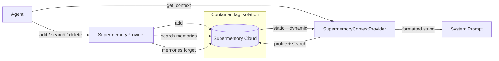

## Overview

`SupermemoryProvider` integrates [Supermemory](https://supermemory.ai) as an intelligent, cloud-native memory backend for BaselithCore agents. It implements the standard `MemoryProvider` protocol, making it a drop-in replacement for `VectorMemoryProvider` or `InMemoryProvider` anywhere a `provider=` argument is accepted.

**What makes it different from the built-in vector store?**

| Capability | VectorMemoryProvider | SupermemoryProvider |
|---|---|---|
| Semantic search | ✅ (Qdrant) | ✅ (hybrid: vector + profile) |
| Automatic fact extraction | ❌ | ✅ |
| Temporal reasoning | ❌ | ✅ (facts expire / update) |
| User profile API | ❌ | ✅ (~50 ms latency) |
| Conflict resolution | ❌ | ✅ (new facts supersede old) |
| Self-hosted option | ✅ | ✅ |
| Requires local infra | Qdrant + embedder | API key only |

---

## Installation

Add the dependency (already present in `requirements.txt` from `>=0.1.0`):

```bash
pip install supermemory
```

Obtain an API key from [console.supermemory.ai](https://console.supermemory.ai) and add it to your `.env`:

```env title=".env"
SUPERMEMORY_ENABLED=true
SUPERMEMORY_API_KEY=your_api_key_here
```

---

## Core Concepts

### Container Tags & Multi-Tenancy

Supermemory uses **container tags** to isolate data. BaselithCore maps each `(agent/tenant ID, MemoryType)` pair to a scoped sub-tag automatically:

```
container_tag="user_42"  +  MemoryType.ENTITY   →  "user_42_entity"
container_tag="user_42"  +  MemoryType.EPISODIC  →  "user_42_episodic"
container_tag="user_42"  +  MemoryType.LONG_TERM →  "user_42_long"
container_tag="user_42"  +  MemoryType.SHORT_TERM →  "user_42_short"
```

Searches without a `memory_type` filter span the top-level tag, covering all types for that agent.

### User Profiles

The profile API aggregates all memories for a container tag into a structured object:

- **static** — long-lived facts ("User is a senior developer", "Prefers TypeScript")
- **dynamic** — recent activity context ("Last week asked about async patterns")

Profiles are returned in ~50 ms and are ideal for system prompt injection.

### Automatic Forgetting

Temporary facts expire naturally. If a memory says "I have a meeting tomorrow", Supermemory removes it after the date passes. No manual cleanup required.

---

## Quick Start

```python
from core.memory import SupermemoryProvider, SupermemoryContextProvider, AgentMemory
from core.memory.types import MemoryItem, MemoryType

# 1. Create a provider scoped to an agent or user
provider = SupermemoryProvider(container_tag="user_42")

# 2. Store memories
await provider.add(MemoryItem(
    content="User prefers dark mode and functional programming patterns",
    memory_type=MemoryType.ENTITY,
))

await provider.add(MemoryItem(
    content="In the last session we discussed async Python best practices",
    memory_type=MemoryType.EPISODIC,
))

# 3. Hybrid search
results = await provider.search("Python preferences", limit=5)
for item in results:
    print(f"[{item.score:.2f}] {item.content}")

# 4. Use as the provider for AgentMemory (drop-in replacement)
memory = AgentMemory(provider=provider)
await memory.remember("User mentioned they are switching to Rust", memory_type=MemoryType.ENTITY)
```

---

## Prompt Injection with SupermemoryContextProvider

`SupermemoryContextProvider` implements the `ContextProvider` ABC and produces a ready-to-use context string for LLM system prompts by combining the user profile with targeted search results.

```python
from core.memory import SupermemoryContextProvider

ctx = SupermemoryContextProvider(
    container_tag="user_42",
    max_results=3,          # Max search snippets included
)

# Returns a formatted multi-section string
context_str = await ctx.get_context("current task: refactor auth middleware")

print(context_str)
# [Profile]
# User is a senior Python developer. Prefers functional patterns. Works at TechCorp.
#
# [Recent activity]
# Last week discussed async patterns and SOLID principles.
#
# [Relevant memories]
# - User mentioned frustration with current auth middleware in session 12
# - User prefers JWT over session cookies
```

Inject directly into a system prompt:

```python
system_prompt = f"""
You are a helpful assistant.

## Memory context
{context_str}

Answer the user's request based on this context.
"""
```

---

## Profile API

For direct access to the profile (e.g. for logging, analytics, or custom formatting):

```python
provider = SupermemoryProvider(container_tag="user_42")

profile = await provider.get_profile(query="programming preferences")

print(profile["static"])          # Long-lived facts
print(profile["dynamic"])         # Recent activity
print(profile["search_results"])  # List of MemoryItem dicts for the query
```

---

## Soft Delete

`delete()` uses Supermemory's **forget** mechanism — the memory is marked as forgotten but not permanently erased, preserving audit history:

```python
await provider.delete(item_id="some-uuid")
```

---

## Configuration Reference

All settings use the `SUPERMEMORY_` prefix.

```python
from core.config.memory import get_supermemory_config

config = get_supermemory_config()
```

| Field | Env var | Default | Description |
|---|---|---|---|
| `enabled` | `SUPERMEMORY_ENABLED` | `false` | Enable the integration |
| `api_key` | `SUPERMEMORY_API_KEY` | `None` | API key from console.supermemory.ai |
| `base_url` | `SUPERMEMORY_BASE_URL` | `None` | Override for self-hosted instances |
| `default_tag` | `SUPERMEMORY_DEFAULT_TAG` | `baselithcore_default` | Fallback container tag |
| `search_limit` | `SUPERMEMORY_SEARCH_LIMIT` | `5` | Default results per search |
| `min_score` | `SUPERMEMORY_MIN_SCORE` | `0.0` | Minimum relevance score threshold |

```env title=".env"
SUPERMEMORY_ENABLED=true
SUPERMEMORY_API_KEY=sm_live_...
SUPERMEMORY_DEFAULT_TAG=myapp_default
SUPERMEMORY_SEARCH_LIMIT=8
SUPERMEMORY_MIN_SCORE=0.3
```

### Self-Hosted

Point to your own Supermemory instance with `SUPERMEMORY_BASE_URL`:

```env
SUPERMEMORY_BASE_URL=https://memory.internal.example.com
```

---

## Module Structure

```text
core/memory/
└── supermemory_provider.py   # SupermemoryProvider + SupermemoryContextProvider

core/config/
└── memory.py                  # SupermemoryConfig + get_supermemory_config()
```

---

## Architecture



---

## Comparison: When to Use Which Provider

| Scenario | Recommended Provider |
|---|---|
| Local dev / testing | `InMemoryProvider` |
| Production semantic search (self-managed infra) | `VectorMemoryProvider` (Qdrant) |
| Persistent cross-session user profiles | `SupermemoryProvider` |
| Automatic fact extraction from conversations | `SupermemoryProvider` |
| Air-gapped / no external API | `VectorMemoryProvider` |
| Lowest latency prompt context injection | `SupermemoryContextProvider` |

---

## Best Practices

!!! tip "Container tag naming"
    Use a stable, unique identifier per agent or user (e.g., database user UUID). Avoid session IDs — sessions end, but memories should persist across them.

!!! tip "Memory type routing"
    Store user preferences and facts as `MemoryType.ENTITY`. Store conversation summaries as `MemoryType.EPISODIC`. This keeps scoped searches fast and relevant.

!!! tip "Profile injection"
    Call `SupermemoryContextProvider.get_context()` once per request at the system prompt level, not inside tool calls. The profile API is fast (~50 ms) but avoid redundant calls in tight loops.

!!! warning "API key security"
    Never hardcode the API key. Always use `SUPERMEMORY_API_KEY` in `.env` and ensure `.env` is in `.gitignore`.
