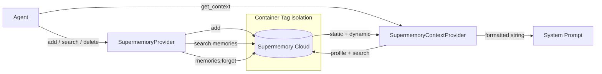

## Overview

`SupermemoryProvider` integrates [Supermemory](https://supermemory.ai) as an intelligent, cloud-native memory backend for BaselithCore agents. It implements the standard `MemoryProvider` protocol, making it a drop-in replacement for `VectorMemoryProvider` or `InMemoryProvider` anywhere a `provider=` argument is accepted.

**What makes it different from the built-in vector store?**

| Capability | VectorMemoryProvider | SupermemoryProvider |
|---|---|---|
| Semantic search | ✅ (Qdrant) | ✅ (hybrid: vector + profile) |
| Automatic fact extraction | ❌ | ✅ |
| Temporal reasoning | ❌ | ✅ (facts expire / update) |
| User profile API | ❌ | ✅ (~50 ms latency) |
| Conflict resolution | ❌ | ✅ (new facts supersede old) |
| Self-hosted option | ✅ | ✅ |
| Requires local infra | Qdrant + embedder | API key only |

---

## Installation

Add the dependency:

```bash
pip install supermemory
```

Obtain an API key from [console.supermemory.ai](https://console.supermemory.ai) and add it to your `.env`:

```env title=".env"
SUPERMEMORY_ENABLED=true
SUPERMEMORY_API_KEY=your_api_key_here
```

!!! warning "Opt-in by construction — `SUPERMEMORY_ENABLED` does not wire it"
    Setting `SUPERMEMORY_ENABLED=true` does **not** make the default app use
    Supermemory: `build_memory_provider()` (the construction site behind
    `get_memory()` and the lazy `memory` resource) only ever returns the
    vector-backed provider. The flag is read by `get_supermemory_config()`,
    which merely warns when it is on without an API key. To use Supermemory,
    construct `SupermemoryProvider` yourself and pass it as `provider=` (see
    [Quick Start](#quick-start)). This is deliberate: a provider instance is
    bound to one container tag, so a process-wide default would put every
    tenant's memories in the same container.

---

## Core Concepts

### Container Tags & Multi-Tenancy

Supermemory uses **container tags** to isolate data. Every memory a provider
writes goes under its one `container_tag` — the same tag that `get()`,
`delete()`, `search()` and the profile API read — and carries its `MemoryType`
and BaselithCore id in metadata:

```text
container_tag="user_42"  +  MemoryType.ENTITY   →  tag "user_42", metadata {"memory_type": "entity", "id": "<uuid>", ...}
```

- `search(query, memory_type=...)` adds a Supermemory metadata filter on
  `memory_type` (and re-checks it locally); without a type it spans every
  memory in the container.
- `get(id)` / `delete(id)` search with a metadata filter on `id`, so they find
  the exact memory instead of whatever embeds nearest to a UUID.
- `clear()` bulk-deletes the container; `clear(memory_type)` forgets the
  memories a `memory_type`-filtered search returns, in rounds, until none
  remain.
- Caller metadata cannot override the `id` / `memory_type` keys.

!!! note "Upgrading from per-type sub-tags"
    Earlier releases wrote each type under a `{tag}_{type}` sub-tag
    (`user_42_entity`, …) while every read queried the bare tag, so those
    memories were never found again. They are not read now either; `clear()`
    without a type also sweeps the legacy `_short`, `_long`, `_episodic`,
    `_entity` and `_general` sub-tags so they can be removed.

### User Profiles

The profile API aggregates all memories for a container tag into a structured object:

- **static** — long-lived facts ("User is a senior developer", "Prefers TypeScript")
- **dynamic** — recent activity context ("Last week asked about async patterns")

Profiles are returned in ~50 ms and are ideal for system prompt injection.

### Automatic Forgetting

Temporary facts expire naturally. If a memory says "I have a meeting tomorrow", Supermemory removes it after the date passes. No manual cleanup required.

---

## Quick Start

Supermemory is never selected automatically — build the provider and hand it to
whatever takes a `provider=` argument.

```python
from core.memory import SupermemoryProvider, SupermemoryContextProvider, AgentMemory
from core.memory.types import MemoryItem, MemoryType

# 1. Create a provider scoped to an agent or user (one container tag per
#    instance — build one per tenant/user, never share one across tenants)
provider = SupermemoryProvider(container_tag="user_42")

# 2. Store memories
await provider.add(MemoryItem(
    content="User prefers dark mode and functional programming patterns",
    memory_type=MemoryType.ENTITY,
))

await provider.add(MemoryItem(
    content="In the last session we discussed async Python best practices",
    memory_type=MemoryType.EPISODIC,
))

# 3. Hybrid search
results = await provider.search("Python preferences", limit=5)
for item in results:
    print(f"[{item.score:.2f}] {item.content}")

# 4. Look up / forget one memory by its BaselithCore id
item = MemoryItem(content="Prefers tabs over spaces", memory_type=MemoryType.ENTITY)
await provider.add(item)
assert (await provider.get(str(item.id))) is not None
await provider.delete(str(item.id))

# 5. Use as the provider for AgentMemory (pass it explicitly — the default
#    get_memory() singleton stays on the vector-backed provider)
memory = AgentMemory(provider=provider)
await memory.remember("User mentioned they are switching to Rust", memory_type=MemoryType.ENTITY)
```

---

## Prompt Injection with SupermemoryContextProvider

`SupermemoryContextProvider` implements the `ContextProvider` ABC and produces a ready-to-use context string for LLM system prompts by combining the user profile with targeted search results.

```python
from core.memory import SupermemoryContextProvider

ctx = SupermemoryContextProvider(
    container_tag="user_42",
    max_results=3,          # Max search snippets included
)

# Returns a formatted multi-section string
context_str = await ctx.get_context("current task: refactor auth middleware")

print(context_str)
# [Profile]
# User is a senior Python developer. Prefers functional patterns. Works at TechCorp.
#
# [Recent activity]
# Last week discussed async patterns and SOLID principles.
#
# [Relevant memories]
# - User mentioned frustration with current auth middleware in session 12
# - User prefers JWT over session cookies
```

Inject directly into a system prompt:

```python
system_prompt = f"""
You are a helpful assistant.

## Memory context
{context_str}

Answer the user's request based on this context.
"""
```

---

## Profile API

For direct access to the profile (e.g. for logging, analytics, or custom formatting):

```python
provider = SupermemoryProvider(container_tag="user_42")

profile = await provider.get_profile(query="programming preferences")

print(profile["static"])          # Long-lived facts
print(profile["dynamic"])         # Recent activity
print(profile["search_results"])  # List of MemoryItem dicts for the query
```

---

## Soft Delete

`delete()` uses Supermemory's **forget** mechanism — the memory is marked as forgotten but not permanently erased, preserving audit history:

```python
await provider.delete(item_id="some-uuid")
```

---

## Configuration Reference

All settings use the `SUPERMEMORY_` prefix.

```python
from core.config.memory import get_supermemory_config

config = get_supermemory_config()
```

| Field | Env var | Default | Description |
|---|---|---|---|
| `enabled` | `SUPERMEMORY_ENABLED` | `false` | Declares intent only: triggers the missing-API-key warning; does **not** select the provider (see above) |
| `api_key` | `SUPERMEMORY_API_KEY` | `None` | API key from console.supermemory.ai |
| `base_url` | `SUPERMEMORY_BASE_URL` | `None` | Override for self-hosted instances |
| `default_tag` | `SUPERMEMORY_DEFAULT_TAG` | `baselithcore_default` | Fallback container tag |
| `search_limit` | `SUPERMEMORY_SEARCH_LIMIT` | `5` | Default results per search |
| `min_score` | `SUPERMEMORY_MIN_SCORE` | `0.0` | Minimum relevance score threshold |
| `timeout_seconds` | `SUPERMEMORY_TIMEOUT_SECONDS` | `10.0` | Per-request timeout (seconds) for Supermemory API calls |
| `max_retries` | `SUPERMEMORY_MAX_RETRIES` | `2` | SDK-level retry attempts for transient errors |

```env title=".env"
SUPERMEMORY_ENABLED=true
SUPERMEMORY_API_KEY=sm_live_...
SUPERMEMORY_DEFAULT_TAG=myapp_default
SUPERMEMORY_SEARCH_LIMIT=8
SUPERMEMORY_MIN_SCORE=0.3
SUPERMEMORY_TIMEOUT_SECONDS=10.0
SUPERMEMORY_MAX_RETRIES=2
```

### Timeouts & Event Loop Safety

The Supermemory SDK is **synchronous**. The provider offloads every SDK call to
a worker thread via `asyncio.to_thread`, so a network round-trip never blocks
the event loop — memory operations stay `await`-able without stalling the rest
of the agent loop.

The client is constructed with the configured `timeout_seconds` /
`max_retries` budget, so an unresponsive endpoint fails fast instead of
hanging callers indefinitely.

!!! note "Older SDK versions"
    SDK releases that predate the `timeout` / `max_retries` constructor kwargs
    are detected at client construction: the provider retries without them,
    logs a warning, and runs with the SDK defaults instead of failing.

### Self-Hosted

Point to your own Supermemory instance with `SUPERMEMORY_BASE_URL`:

```env
SUPERMEMORY_BASE_URL=https://memory.internal.example.com
```

---

## Module Structure

```text
core/memory/
└── supermemory_provider.py   # SupermemoryProvider + SupermemoryContextProvider

core/config/
└── memory.py                  # SupermemoryConfig + get_supermemory_config()
```

---

## Architecture


```mermaid
graph LR
    Agent -->|add / search / delete| SP[SupermemoryProvider]
    Agent -->|get_context| CP[SupermemoryContextProvider]

    SP -->|add| SM[(Supermemory Cloud)]
    SP -->|search.memories| SM
    SP -->|memories.forget| SM

    CP -->|profile + search| SM

    SM -->|static + dynamic| CP
    CP -->|formatted string| SystemPrompt[System Prompt]

    subgraph "Container Tag isolation"
        SM
    end
```

---

## Comparison: When to Use Which Provider

| Scenario | Recommended Provider |
|---|---|
| Local dev / testing | `InMemoryProvider` |
| Production semantic search (self-managed infra) | `VectorMemoryProvider` (Qdrant) |
| Persistent cross-session user profiles | `SupermemoryProvider` |
| Automatic fact extraction from conversations | `SupermemoryProvider` |
| Air-gapped / no external API | `VectorMemoryProvider` |
| Lowest latency prompt context injection | `SupermemoryContextProvider` |

---

## Best Practices

!!! tip "Container tag naming"
    Use a stable, unique identifier per agent or user (e.g., database user UUID). Avoid session IDs — sessions end, but memories should persist across them.

!!! tip "Memory type routing"
    Store user preferences and facts as `MemoryType.ENTITY`. Store conversation summaries as `MemoryType.EPISODIC`. Type-scoped searches filter on that metadata, so they stay relevant.

!!! tip "Profile injection"
    Call `SupermemoryContextProvider.get_context()` once per request at the system prompt level, not inside tool calls. The profile API is fast (~50 ms) but avoid redundant calls in tight loops.

!!! warning "API key security"
    Never hardcode the API key. Always use `SUPERMEMORY_API_KEY` in `.env` and ensure `.env` is in `.gitignore`.
