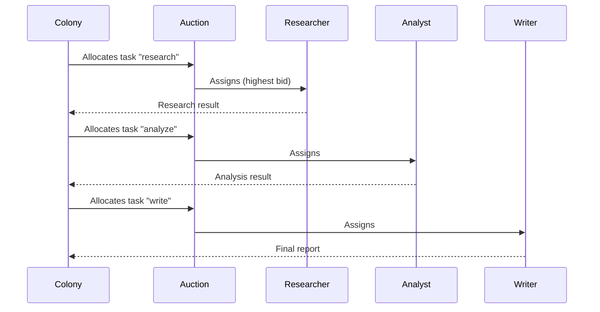

The `core/swarm` module implements **collective intelligence** patterns, where multiple agents collaborate to solve complex problems.

## Swarm Intelligence Explained

Inspired by nature (ants, bees), the swarm coordinates specialized agents that:

- **Collaborate**: Share information and results
- **Specialize**: Each has specific skills
- **Self-Organize**: No centralized controller
- **Emerge**: Complex behaviors from simple rules

### When to Use Swarm

**Use Swarm when**:

- Complex tasks decomposable into specialized subtasks
- Diverse expertise is needed (research + analysis + writing)
- Parallelization significantly increases speed
- An agent failure should not block everything

**Use Single Agent when**:

- Simple or sequential task
- Coordination overhead > benefits
- Limited budget (swarm costs N times single agent)

---

## Structure

```text
core/swarm/
├── __init__.py
├── colony.py           # Agent colony & Memory integration
├── auction.py          # Task allocation via auction
├── pheromones.py       # Indirect communication
├── team_formation.py   # Dynamic team formation
└── types.py            # Common types & Context requirements

core/orchestration/handlers/
├── swarm_handler.py        # Orchestration with Dynamic Personas
└── simulation_handler.py   # Multi-turn Scenario Simulation

core/memory/
└── graph_provider.py       # GraphRAG entity relationships
```

---

## Advanced Features

### memory-Aware Agents

Virtual agents are now integrated with the `AgentMemory` manager. Before execution, agents automatically:

1. Perform **Semantic Search** on the task description to find relevant background memories.
2. Perform **Graph Expansion** (GraphRAG) to identify relationships between entities mentioned in the task.

```python
# Context is automatically injected into the agent prompt
task = Task(
    description="Analyze the impact of CVE-2024-1234 on our database server",
    context_requirements={"depth": "semantic"}
)
```

### GraphRAG & Entity Relationships

The swarm leverages a `GraphMemoryProvider` to handle structural knowledge. This allows agents to reason about "hops" between entities (e.g., *Service A* depends on *Package B* which has *Vulnerability C*).

**Setup with Colony**:

```python
from core.swarm.colony import Colony
from core.memory.manager import AgentMemory
from core.memory.graph_provider import SimpleGraphMemoryProvider

# Create graph provider
graph = SimpleGraphMemoryProvider()

# Populate with domain knowledge
await graph.add_relation("ServiceA", "depends_on", "PackageB", weight=0.9)
await graph.add_relation("PackageB", "has_vulnerability", "CVE-2024-1234", weight=1.0)
await graph.add_relation("CVE-2024-1234", "severity", "Critical", weight=1.0)

# Integrate with memory and colony
memory = AgentMemory(graph_provider=graph, provider=memory_provider)
colony = Colony(memory_manager=memory)

# Agents automatically receive graph context during execution
# Example: Query "analyze CVE-2024-1234" will retrieve:
# - ServiceA depends_on PackageB
# - PackageB has_vulnerability CVE-2024-1234
# - CVE-2024-1234 severity Critical
```

### Dynamic Persona Generation

Instead of static roles, the `SwarmHandler` use the LLM to **generate specialized personas** on-the-fly based on the query. For a security task, it might spawn a "Penetration Tester" and a "Compliance Officer" dynamically.

### Scenario Simulation Mode

The `SimulationHandler` enables **multi-turn social or technical evolution**. Outcomes from Round N are saved to episodic memory and used to update the "World State" for Round N+1.

```python
handler = SimulationHandler()
# Simulate a 3-turn cyber-attack scenario
results = await handler.handle_simulation(
    query="Model a ransomware propagation in a distributed microservices environment",
    rounds=3
)
```

### End-to-End Usage via Orchestrator

The recommended way to use swarm features is through the Orchestrator with intent classification:

```python
from core.orchestration import Orchestrator
from core.memory.manager import AgentMemory
from core.memory.graph_provider import SimpleGraphMemoryProvider
from core.memory.providers import PostgresMemoryProvider

# Setup memory with graph support
graph_provider = SimpleGraphMemoryProvider()
memory_provider = PostgresMemoryProvider()
memory = AgentMemory(
    provider=memory_provider,
    graph_provider=graph_provider,
    embedder=embedder_service
)

# Initialize orchestrator (automatically loads SwarmHandler and SimulationHandler)
orchestrator = Orchestrator(
    llm_service=llm,
    memory_manager=memory
)

# Intent: "collaborative_task" → triggers SwarmHandler
result = await orchestrator.handle_request(
    query="Research AI safety papers, analyze key findings, and write a comprehensive summary",
    context={}
)

# Intent: "scenario_simulation" → triggers SimulationHandler
simulation = await orchestrator.handle_request(
    query="Simulate the social impact of universal basic income over 3 policy cycles",
    context={}
)
```

The orchestrator automatically:

1. **Classifies intent** ("collaborative_task" or "scenario_simulation")
2. **Routes to appropriate handler** (SwarmHandler or SimulationHandler)
3. **Injects memory context** (semantic + graph) into agent prompts
4. **Persists outcomes** back to episodic memory

---

## Colony

A colony coordinates specialized agents:

```python
from core.swarm import Colony, SwarmAgent

# Create colony
colony = Colony()

# Register agents
colony.register(SwarmAgent(
    id="researcher",
    skills=["search", "summarize"],
    capacity=5
))

colony.register(SwarmAgent(
    id="analyst", 
    skills=["analyze", "compare"],
    capacity=3
))

colony.register(SwarmAgent(
    id="writer",
    skills=["write", "edit"],
    capacity=2
))

# Execute task
result = await colony.execute(
    task="Write a report on AI trends",
    strategy="auction"
)
```

---

## Coordination Strategies

### Auction

Agents "bid" for tasks:

```python
from core.swarm import AuctionCoordinator

coordinator = AuctionCoordinator()

# Available tasks
tasks = [
    {"id": "t1", "type": "research", "priority": "high"},
    {"id": "t2", "type": "analysis", "priority": "medium"},
]

# Allocation via auction
allocation = await coordinator.allocate(tasks, agents)
# {"t1": "researcher", "t2": "analyst"}
```

### Pheromones

Indirect communication via trails:

```python
from core.swarm import PheromoneTrail

trail = PheromoneTrail()

# Agent deposits trail
await trail.deposit(
    location="topic:AI",
    strength=0.8,
    agent_id="researcher"
)

# Other agents follow strong trails
strong_topics = await trail.get_strongest(k=5)
```

### Team Formation

Dynamic team formation:

```python
from core.swarm import TeamFormation

formation = TeamFormation()

# Form optimal team for complex task
team = await formation.form_team(
    required_skills=["research", "analyze", "write"],
    available_agents=agents,
    max_size=3
)
```

---

## SwarmAgent

```python
@dataclass
class SwarmAgent:
    id: str
    skills: list[str]
    capacity: int = 5  # Max parallel tasks
    status: str = "idle"  # idle, busy, offline
    
    async def execute(self, task: dict) -> dict:
        """Executes an assigned task."""
        ...
    
    def can_handle(self, task_type: str) -> bool:
        """Checks if can handle the task."""
        return task_type in self.skills
```

---

## Complete Workflow



---

## Real-World Use Cases

Practical examples of swarm in action.

### Use Case 1: Research Report Generation

**Task**: Generate complete report on a topic

**Swarm Design**:

```python
colony = Colony()

# Agent 1: Researcher
colony.register(SwarmAgent(
    id="researcher",
    skills=["web_search", "summarize"],
    capacity=10
))

# Agent 2: Analyst
colony.register(SwarmAgent(
    id="analyst",
    skills=["analyze", "compare", "critique"],
    capacity=5
))

# Agent 3: Writer
colony.register(SwarmAgent(
    id="writer",
    skills=["write", "edit", "format"],
    capacity=3
))

# Execute with auction
result = await colony.execute(
    task="Research report: AI trends 2024",
    strategy="auction"
)
```

**Flow**:

1. Researcher searches info online (parallel queries)
2. Analyst evaluates and compares sources
3. Writer generates structured report

**Benefits**: 3-5x faster than single sequential agent.

### Use Case 2: Code Review Swarm

**Task**: Complete PR review

```python
# Specialized agents
colony.register(SwarmAgent(id="security", skills=["security_audit"]))
colony.register(SwarmAgent(id="performance", skills=["perf_analysis"]))
colony.register(SwarmAgent(id="style", skills=["code_style", "best_practices"]))
colony.register(SwarmAgent(id="tests", skills=["test_coverage", "test_quality"]))

# Parallel review
result = await colony.execute(
    task=f"Review PR #{pr_number}",
    strategy="parallel"  # All in parallel
)

# Consolidate feedback
feedback = consolidate_reviews(result)
```

**Benefits**: More complete review, every aspect covered by a specialist.

### Use Case 3: Customer Support Triage

**Pheromone-Based Routing**:

```python
trail = PheromoneTrail()

# Agents leave trails on topics they handle well
@agent.on_success
async def leave_pheromone(topic, quality_score):
    await trail.deposit(
        location=f"topic:{topic}",
        strength=quality_score,
        agent_id=agent.id
    )

# Router assigns ticket following strong trails
async def route_ticket(ticket):
    topic = classify_topic(ticket)
    
    # Find agent with strongest pheromone
    best_agents = await trail.get_strongest(
        location=f"topic:{topic}",
        k=3
    )
    
    # Assign to agent with least load
    selected = min(best_agents, key=lambda a: a.current_load)
    await selected.handle_ticket(ticket)
```

**Benefits**: Self-learning routing, agents specialize automatically.

!!! tip "Pattern Selection"
    - **Auction**: Independent tasks, agents compete
    - **Pheromones**: Recurring patterns, learning over time
    - **Team Formation**: Complex task, requires tight coordination
