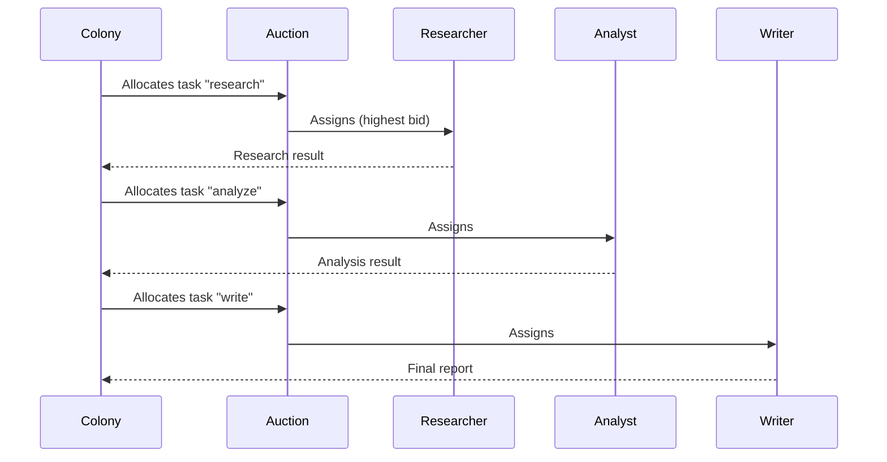

The `core/swarm` module implements **collective intelligence** patterns, where multiple agents collaborate to solve complex problems.

## Swarm Intelligence Explained

Inspired by nature (ants, bees), the swarm coordinates specialized agents that:

- **Collaborate**: Share information and results
- **Specialize**: Each has specific skills
- **Self-Organize**: No centralized controller
- **Emerge**: Complex behaviors from simple rules

### When to Use Swarm

**Use Swarm when**:

- Complex tasks decomposable into specialized subtasks
- Diverse expertise is needed (research + analysis + writing)
- Parallelization significantly increases speed
- An agent failure should not block everything

**Use Single Agent when**:

- Simple or sequential task
- Coordination overhead > benefits
- Limited budget (swarm costs N times single agent)

---

## Structure

```text
core/swarm/
├── __init__.py
├── colony.py           # Agent colony & Memory integration
├── auction.py          # Task allocation via auction
├── pheromones.py       # Indirect communication
├── team_formation.py   # Dynamic team formation
└── types.py            # Common types & Context requirements

core/orchestration/handlers/
├── swarm_handler.py        # Orchestration with Dynamic Personas
├── swarm_agents.py         # VirtualAgentSpec + default agent roster
└── simulation_handler.py   # Multi-turn Scenario Simulation

core/memory/
└── graph_provider.py       # GraphRAG entity relationships
```

---

## Advanced Features

### memory-Aware Agents

Virtual agents are now integrated with the `AgentMemory` manager. Before execution, agents automatically:

1. Perform **Semantic Search** on the task description to find relevant background memories.
2. Perform **Graph Expansion** (GraphRAG) to identify relationships between entities mentioned in the task.

```python
# Context is automatically injected into the agent prompt
task = Task(
    description="Analyze the impact of CVE-2024-1234 on our database server",
    context_requirements={"depth": "semantic"}
)
```

### GraphRAG & Entity Relationships

The swarm leverages a `GraphMemoryProvider` to handle structural knowledge. This allows agents to reason about "hops" between entities (e.g., *Service A* depends on *Package B* which has *Vulnerability C*).

**Setup with Colony**:

```python
from core.swarm.colony import Colony
from core.memory.manager import AgentMemory
from core.memory.graph_provider import SimpleGraphMemoryProvider

# Create graph provider
graph = SimpleGraphMemoryProvider()

# Populate with domain knowledge
await graph.add_relation("ServiceA", "depends_on", "PackageB", weight=0.9)
await graph.add_relation("PackageB", "has_vulnerability", "CVE-2024-1234", weight=1.0)
await graph.add_relation("CVE-2024-1234", "severity", "Critical", weight=1.0)

# Integrate with memory and colony
memory = AgentMemory(graph_provider=graph, provider=memory_provider)
colony = Colony(memory_manager=memory)

# Agents automatically receive graph context during execution
# Example: Query "analyze CVE-2024-1234" will retrieve:
# - ServiceA depends_on PackageB
# - PackageB has_vulnerability CVE-2024-1234
# - CVE-2024-1234 severity Critical
```

### Dynamic Persona Generation

Instead of static roles, the `SwarmHandler` use the LLM to **generate specialized personas** on-the-fly based on the query. For a security task, it might spawn a "Penetration Tester" and a "Compliance Officer" dynamically.

### Scenario Simulation Mode

The `SimulationHandler` enables **multi-turn social or technical evolution**. Outcomes from Round N are saved to episodic memory and used to update the "World State" for Round N+1.

```python
handler = SimulationHandler()
# Simulate a 3-turn cyber-attack scenario
results = await handler.handle_simulation(
    query="Model a ransomware propagation in a distributed microservices environment",
    rounds=3
)
```

### End-to-End Usage via Orchestrator

The recommended way to use swarm features is through the Orchestrator with intent classification:

```python
from core.orchestration import Orchestrator
from core.memory.manager import AgentMemory
from core.memory.graph_provider import SimpleGraphMemoryProvider
from core.memory.providers import PostgresMemoryProvider

# Setup memory with graph support
graph_provider = SimpleGraphMemoryProvider()
memory_provider = PostgresMemoryProvider()
memory = AgentMemory(
    provider=memory_provider,
    graph_provider=graph_provider,
    embedder=embedder_service
)

# Initialize orchestrator (automatically loads SwarmHandler and SimulationHandler)
orchestrator = Orchestrator(
    llm_service=llm,
    memory_manager=memory
)

# Intent: "collaborative_task" → triggers SwarmHandler
result = await orchestrator.process(
    query="Research AI safety papers, analyze key findings, and write a comprehensive summary",
    context={}
)

# Intent: "scenario_simulation" → triggers SimulationHandler
simulation = await orchestrator.process(
    query="Simulate the social impact of universal basic income over 3 policy cycles",
    context={}
)
```

The orchestrator automatically:

1. **Classifies intent** ("collaborative_task" or "scenario_simulation")
2. **Routes to appropriate handler** (SwarmHandler or SimulationHandler)
3. **Injects memory context** (semantic + graph) into agent prompts
4. **Persists outcomes** back to episodic memory

---

## Colony

A colony coordinates specialized agents. Agents are described by `AgentProfile`
objects; tasks by `Task` objects. Register agents with `register_agent()`, then submit
work with `submit_task()` (single task → winning agent ID) or `execute_batch()`
(parallel allocation + execution):

```python
from core.swarm import Colony, AgentProfile, Capability, Task

# Create colony
colony = Colony()

# Register agents (id + name + capabilities)
colony.register_agent(AgentProfile(
    id="researcher",
    name="Researcher",
    capabilities=[Capability("search"), Capability("summarize")],
))
colony.register_agent(AgentProfile(
    id="analyst",
    name="Analyst",
    capabilities=[Capability("analyze"), Capability("compare")],
))

# Submit a single task — runs an auction, returns the winning agent id (or None)
task = Task(description="Analyze AI trends", required_capabilities=["analyze"])
winner_id = await colony.submit_task(task)
```

### Batch execution

`execute_batch(tasks, execute_fn)` allocates every task via auction, then runs the
assigned `(task, agent)` pairs concurrently. It returns a `Colony.BatchResult`
(`completed`, `failed`, `unassigned`):

```python
async def run(task: Task, agent: AgentProfile):
    return f"{agent.name} handled {task.description}"

tasks = [
    Task(description="Research AI", required_capabilities=["search"]),
    Task(description="Analyze findings", required_capabilities=["analyze"]),
]
result = await colony.execute_batch(tasks, run)
print(result.completed)    # {task_id: output, ...}
print(result.failed)       # {task_id: error, ...}
print(result.unassigned)   # [task_id, ...]
```

`execute_batch` runs the sub-agents under an `asyncio.TaskGroup` (structured
concurrency): an ordinary per-task exception is recorded in `failed` and the
batch continues, but a **fatal** error — a `BudgetExceededError` from the shared
per-request `LoopBudget`, or cancellation — deterministically cancels the
siblings and re-raises, rather than leaving orphaned tasks running as a bare
`asyncio.gather` would. Sub-agents share the ambient `LoopBudget` (inherited via
the `budget_context` `ContextVar` when each task is created), so once the request
budget is exhausted no sibling can make progress and the whole batch aborts.

### Handoff — structured task transfer

`request_help()` finds a helper; `handoff()` goes further — it reassigns the task
**and** carries an explicit reason plus a context payload (accumulated state,
partial results) so the receiver continues the work instead of restarting it. The
transfer is emitted as a directed `HANDOFF` `SwarmMessage`.

```python
ho = await colony.handoff(
    from_agent="researcher",
    task_id=task.id,
    reason="needs vision capability",
    capabilities_needed=["vision"],     # auto-select recipient (or pass to_agent=...)
    context={"findings": partial_results},
)
# ho.to_agent now owns the task; subscribers of MessageType.HANDOFF are notified.
```

---

## Coordination Strategies

### Auction

`TaskAuction` allocates tasks competitively: announce a task, collect/submit bids, then
resolve to the highest combined score. (The `Colony` uses one internally; you can also
drive it directly.)

```python
from core.swarm import TaskAuction, AgentProfile, Capability, Task

auction = TaskAuction()
agent = AgentProfile(id="researcher", name="Researcher",
                     capabilities=[Capability("research")])
task = Task(description="Research AI", required_capabilities=["research"])

auction.announce_task(task)
bid = auction.calculate_bid(agent, task)   # builds a Bid from capability/load
auction.submit_bid(bid)                    # returns True if accepted
winner_id = auction.resolve(task.id)       # -> agent id, or None
```

### Pheromones

`PheromoneSystem` provides indirect communication via decaying signals. All methods are
**synchronous**:

```python
from core.swarm import PheromoneSystem

pheromones = PheromoneSystem(decay_rate=0.1)

# Deposit a typed pheromone at a location
pheromones.deposit(ptype="success", location="topic:AI", intensity=0.8,
                   agent_id="researcher")

# Sense all signals at a location, or find the strongest location for a type
signals = pheromones.sense("topic:AI")              # {ptype: intensity}
strongest = pheromones.get_strongest("success")     # -> location str | None
```

### Team Formation

`TeamFormationEngine` builds a team for a `Task` from its registered agents and returns
a `TeamFormation` dataclass (or `None`):

```python
from core.swarm import TeamFormationEngine, AgentProfile, Capability, Task

engine = TeamFormationEngine(agents=[
    AgentProfile(id="r", name="Researcher", capabilities=[Capability("research")]),
    AgentProfile(id="a", name="Analyst", capabilities=[Capability("analyze")]),
    AgentProfile(id="w", name="Writer", capabilities=[Capability("write")]),
])

task = Task(description="Build report",
            required_capabilities=["research", "analyze", "write"])
team = engine.form_team(task, goal="Comprehensive AI report")
if team:
    print(team.members, team.leader_id, team.size)
```

---

## AgentProfile

Agents in the swarm are described by the `AgentProfile` dataclass (`core/swarm/types.py`):

```python
@dataclass
class AgentProfile:
    id: str
    name: str
    capabilities: list[Capability] = field(default_factory=list)
    status: AgentStatus = AgentStatus.IDLE      # IDLE, BUSY, BIDDING, OFFLINE
    current_load: float = 0.0                   # 0.0 - 1.0
    success_rate: float = 1.0
    metadata: dict = field(default_factory=dict)

    @property
    def is_available(self) -> bool:
        """IDLE and load < 0.9."""

    def has_capability(self, name: str, min_proficiency: float = 0.0) -> bool: ...
    def get_capability_score(self, required: list[str]) -> float: ...
```

A `Capability` carries a `name` and a `proficiency` (0.0 - 1.0).

---

## Complete Workflow



---

## Real-World Use Cases

Practical examples of swarm in action.

### Use Case 1: Research Report Generation

**Task**: Generate complete report on a topic

**Swarm Design**:

```python
from core.swarm import Colony, AgentProfile, Capability, Task

colony = Colony()

colony.register_agent(AgentProfile(
    id="researcher", name="Researcher",
    capabilities=[Capability("web_search"), Capability("summarize")],
))
colony.register_agent(AgentProfile(
    id="analyst", name="Analyst",
    capabilities=[Capability("analyze"), Capability("compare"), Capability("critique")],
))
colony.register_agent(AgentProfile(
    id="writer", name="Writer",
    capabilities=[Capability("write"), Capability("edit"), Capability("format")],
))

# Allocate + execute the sub-tasks in parallel
async def run(task: Task, agent: AgentProfile):
    ...  # invoke the underlying agent

result = await colony.execute_batch([
    Task(description="Research AI trends 2024", required_capabilities=["web_search"]),
    Task(description="Compare sources", required_capabilities=["analyze"]),
    Task(description="Write report", required_capabilities=["write"]),
], run)
```

**Flow**:

1. Researcher searches info online (parallel queries)
2. Analyst evaluates and compares sources
3. Writer generates structured report

**Benefits**: 3-5x faster than single sequential agent.

### Use Case 2: Code Review Swarm

**Task**: Complete PR review

```python
colony.register_agent(AgentProfile(id="security", name="Security",
    capabilities=[Capability("security_audit")]))
colony.register_agent(AgentProfile(id="performance", name="Performance",
    capabilities=[Capability("perf_analysis")]))
colony.register_agent(AgentProfile(id="style", name="Style",
    capabilities=[Capability("code_style"), Capability("best_practices")]))
colony.register_agent(AgentProfile(id="tests", name="Tests",
    capabilities=[Capability("test_coverage"), Capability("test_quality")]))

# Each review dimension is its own task, executed concurrently
review_tasks = [
    Task(description=f"Security review PR #{pr_number}", required_capabilities=["security_audit"]),
    Task(description=f"Perf review PR #{pr_number}", required_capabilities=["perf_analysis"]),
    Task(description=f"Style review PR #{pr_number}", required_capabilities=["code_style"]),
    Task(description=f"Test review PR #{pr_number}", required_capabilities=["test_coverage"]),
]
result = await colony.execute_batch(review_tasks, run)
feedback = consolidate_reviews(result.completed)
```

**Benefits**: More complete review, every aspect covered by a specialist.

### Use Case 3: Customer Support Triage

**Pheromone-Based Routing** — agents leave success trails on the topics they handle
well, and the router follows the strongest trail:

```python
from core.swarm import PheromoneSystem

pheromones = PheromoneSystem()

# Agents leave trails on topics they handle well (sync)
def leave_pheromone(topic: str, quality_score: float, agent_id: str):
    pheromones.deposit(ptype="success", location=f"topic:{topic}",
                       intensity=quality_score, agent_id=agent_id)

# Router assigns ticket following the strongest trail
def route_ticket(ticket):
    topic = classify_topic(ticket)
    best_location = pheromones.get_strongest("success")  # location with top signal
    ...
```

**Benefits**: Self-learning routing, agents specialize automatically.

!!! tip "Pattern Selection"
    - **Auction**: Independent tasks, agents compete
    - **Pheromones**: Recurring patterns, learning over time
    - **Team Formation**: Complex task, requires tight coordination
