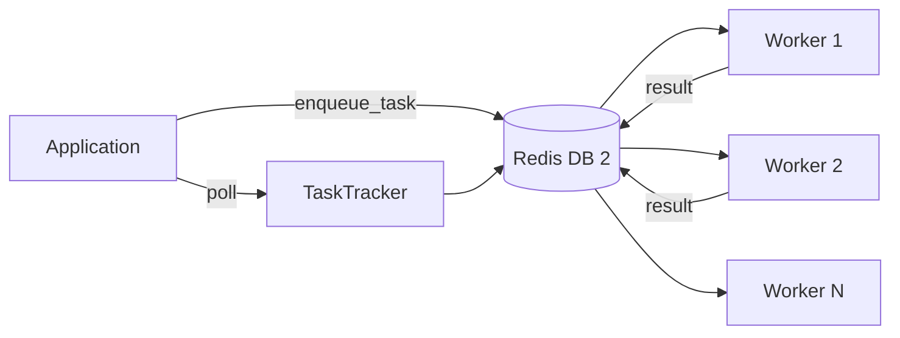

The `core/task_queue` module manages **asynchronous jobs** via Redis Queue (RQ), allowing heavy processing without blocking HTTP responses.

## Distributed Architecture Explained

The task queue separates processing into two components:

**API Server**: Receives requests, queues jobs, responds immediately

**Workers**: Process jobs in background, independently scalable

### Sync vs Async: When to Use the Queue

| Scenario                | Approach          | Rationale                   |
| ----------------------- | ----------------- | --------------------------- |
| Immediate HTTP Response | **Sync**          | Latency <100ms acceptable   |
| Heavy processing        | **Async (Queue)** | Avoid HTTP timeouts         |
| Batch processing        | **Async (Queue)** | Don't block resources       |
| Long-running tasks      | **Async (Queue)** | >30s of processing          |
| Fan-out pattern         | **Async (Queue)** | Process N items in parallel |

**Practical Example**:

```python
from core.task_queue import enqueue_task

# ❌ WRONG: Sync processing blocks HTTP
@app.post("/documents")
async def upload_document(file: UploadFile):
    content = await process_file(file)         # 2 minutes!
    embeddings = await generate_embeddings(content)  # 1 minute!
    await index_document(embeddings)
    return {"status": "done"}                  # Timeout after 3 min

# ✅ RIGHT: Queue and run in background
@app.post("/documents")
async def upload_document(file: UploadFile):
    job_id = enqueue_task(process_document, file_path=file.filename)
    return {"job_id": job_id, "status": "queued"}  # Immediate response!
```

---

## Structure

```text
core/task_queue/
├── __init__.py     # public API: get_queue_redis_connection, get_queue,
│                   #             enqueue_task, schedule_task
├── scheduler.py    # TaskScheduler, get_task_scheduler, enqueue_task, schedule_task
├── status.py       # TaskTracker, TaskStatus, TaskInfo, get_task_tracker, helpers
├── monitor.py      # WorkerMonitor, WorkerInfo, QueueInfo, get_worker_monitor
├── worker.py       # Worker process entry point
└── jobs/           # Job definitions
```

The package `__all__` is intentionally small:

```python
from core.task_queue import (
    get_queue_redis_connection,  # -> redis.Redis
    get_queue,                   # -> rq.Queue (name="default")
    enqueue_task,                # immediate enqueue (tenant-aware)
    schedule_task,               # delayed enqueue
)
```

!!! warning "API surface"
    There is **no** `enqueue`, `TaskPriority`, `Job`, `TaskTracker`,
    `TaskScheduler`, or `WorkerMonitor` exported at the package level. The
    classes live in their submodules (`core.task_queue.scheduler`,
    `core.task_queue.status`, `core.task_queue.monitor`). Jobs are plain
    callables enqueued by reference — there is no `Job` base class. All of
    the scheduler/tracker/monitor methods are **synchronous** (RQ is sync).

---

## Enqueue Tasks

The package-level helpers enqueue plain callables. `enqueue_task` also injects
the current tenant id into the job metadata.

```python
from core.task_queue import enqueue_task, schedule_task

# Immediate execution on the "default" queue
job_id = enqueue_task(document_ingestion, document_id="doc-123")

# Choose a queue (configured queues: default, documents, analysis)
job_id = enqueue_task(urgent_analysis, payload, queue="analysis")

# Run after a delay (seconds)
job_id = schedule_task(scheduled_cleanup, 3600)  # 1 hour from now
```

---

## Scheduler

For full control (timeouts, retries, scheduled times) use `TaskScheduler` via
`get_task_scheduler()`. Recurring schedules are *not* built in — drive them from
cron or APScheduler calling `enqueue_*`.

```python
from datetime import datetime, timezone
from core.task_queue.scheduler import get_task_scheduler

scheduler = get_task_scheduler()

# Immediate, with options
job_id = scheduler.enqueue(
    my_task_fn,
    arg1, arg2,
    queue_name="default",
    job_timeout=300,     # seconds
    result_ttl=86400,
    failure_ttl=604800,
    retry_count=3,       # wraps rq.Retry(max=3)
    meta={"source": "api"},
    kwarg1="value",
)

# Run at a specific time
job_id = scheduler.enqueue_at(generate_report, datetime(2026, 12, 31, 23, 59))

# Run after a delay (seconds)
job_id = scheduler.enqueue_in(cleanup_old_data, 3600)

# Inspect / cancel
info = scheduler.get_job(job_id)     # dict | None
scheduler.cancel_job(job_id)         # bool
```

### Retry Configuration

The scheduler uses RQ's native `Retry` object internally. Pass `retry_count=N`
when enqueuing — the scheduler builds `rq.Retry(max=N)` for you:

```python
job_id = scheduler.enqueue(
    my_task_fn,
    arg1, arg2,
    retry_count=3,    # rq.Retry(max=3)
    job_timeout=300,  # 5 minute timeout
)
```

!!! note "`retry_delay`"
    `enqueue` accepts a `retry_delay` parameter, but RQ's simple `Retry`
    does not support a per-attempt delay in this path — it is currently a
    no-op placeholder. Use a custom worker exception handler if you need
    backoff between attempts.

---

## Task Status Tracking

`TaskTracker` (in `core.task_queue.status`) persists status/progress in Redis.
Construct it directly with a connection, or use the lazy singleton
`get_task_tracker()`. All methods are synchronous.

```python
from core.task_queue.status import get_task_tracker, TaskStatus

tracker = get_task_tracker()  # uses the shared queue Redis connection

# get_status returns a plain dict (or None if unknown)
status = tracker.get_status(job_id)
if status:
    print(status["status"])    # "queued" | "running" | "completed" | "failed" | ...
    print(status["progress"])  # float 0-100
    print(status.get("result"))

# Lifecycle helpers (typically called from inside the worker)
tracker.mark_started(job_id)
tracker.update_progress(job_id, 50.0, "halfway")
tracker.mark_completed(job_id, result={"chunks": 42})
tracker.mark_failed(job_id, error="boom")
```

`TaskStatus` is a `str` enum: `PENDING`, `QUEUED`, `RUNNING`, `COMPLETED`,
`FAILED`, `CANCELLED`.

### Reporting progress from inside a job

```python
from core.task_queue.status import update_job_progress, get_job_status

def process_document(document_id: str) -> dict:
    update_job_progress(25, "Loading")
    # ... work ...
    update_job_progress(100, "Indexed")
    return {"status": "indexed", "chunks": 42}

# Combined RQ + tracker view (dict | None)
full = get_job_status(job_id)
```

---

## Worker Monitoring

`WorkerMonitor` (in `core.task_queue.monitor`) inspects RQ workers and queues.
It is synchronous; use it directly or via `get_worker_monitor()`.

```python
from core.task_queue.monitor import get_worker_monitor

monitor = get_worker_monitor()

# Active workers -> list[WorkerInfo]
for w in monitor.get_workers():
    print(f"{w.name}: {w.state}, current job: {w.current_job}")

print(monitor.get_worker_count())          # int

# Per-queue stats -> QueueInfo | None
info = monitor.get_queue_info("default")
if info:
    print(info.job_count, info.failed_job_count)

all_queues = monitor.get_all_queues()      # list[QueueInfo]

# Overall health -> dict
health = monitor.get_health_status()
print(health["status"])  # "healthy" | "degraded" | "unhealthy"

# Maintenance
monitor.clean_failed_jobs("default")       # int removed
monitor.retry_failed_job(job_id)           # bool
```

!!! warning "No `get_queue_stats`"
    `WorkerMonitor` has no `get_queue_stats()` method. Use `get_queue_info`
    / `get_all_queues` (returning `QueueInfo` dataclasses) or
    `get_health_status()` for an aggregated dict.

`WorkerInfo` fields: `name`, `state`, `queues`, `current_job`,
`successful_jobs`, `failed_jobs`, `birth_date`, `last_heartbeat`.
`QueueInfo` fields: `name`, `job_count`, `started_job_count`,
`deferred_job_count`, `finished_job_count`, `failed_job_count`.

### Prometheus example

```python
import prometheus_client as prom
from core.task_queue.monitor import get_worker_monitor

monitor = get_worker_monitor()
queue_depth = prom.Gauge("queue_depth", "Jobs in queue", ["queue"])
queue_failed = prom.Gauge("queue_failed", "Failed jobs", ["queue"])

def update_metrics() -> None:
    for q in monitor.get_all_queues():
        queue_depth.labels(queue=q.name).set(q.job_count)
        queue_failed.labels(queue=q.name).set(q.failed_job_count)
```

---

## Configuration

Queue settings come from `core.config.task_queue.TaskQueueConfig`. The Redis URL
defaults to DB 2; configured queue names default to `default`, `documents`,
`analysis`.

```env
QUEUE_REDIS_URL=redis://localhost:6379/2
```

| Setting (`TaskQueueConfig`) | Default | Purpose                          |
| --------------------------- | ------- | -------------------------------- |
| `redis_url` / `QUEUE_REDIS_URL` | `redis://localhost:6379/2` | Broker connection |
| `queues`                    | `["default", "documents", "analysis"]` | Known queues |
| `job_timeout`               | `3600`  | Max job runtime (s)              |
| `result_ttl`                | `86400` | Result retention (s)             |
| `failure_ttl`               | `604800`| Failed-job retention (s)         |
| `default_retry_count`       | `3`     | Retries when not overridden      |

---

## Architecture


