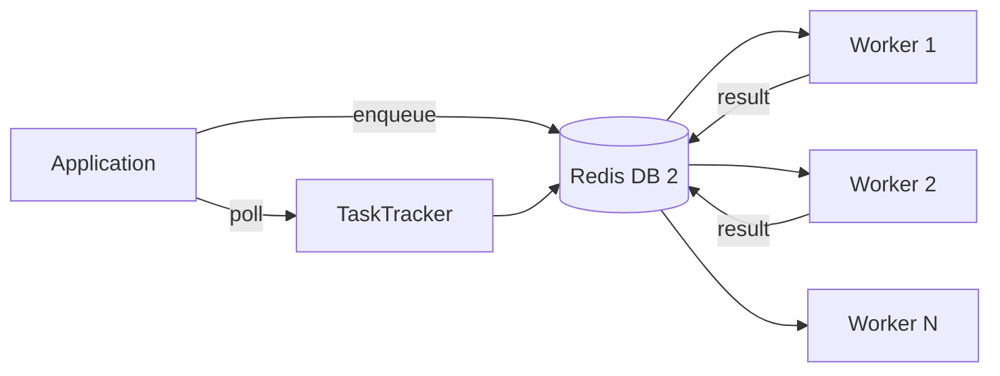

The `core/task_queue` module manages **asynchronous jobs** via Redis Queue (RQ), allowing heavy processing without blocking HTTP responses.

## Distributed Architecture Explained

The task queue separates processing into two components:

**API Server**: Receives requests, queues jobs, responds immediately

**Workers**: Process jobs in background, independently scalable

### Sync vs Async: When to Use the Queue

| Scenario                | Approach          | Rationale                   |
| ----------------------- | ----------------- | --------------------------- |
| Immediate HTTP Response | **Sync**          | Latency <100ms acceptable   |
| Heavy processing        | **Async (Queue)** | Avoid HTTP timeouts         |
| Batch processing        | **Async (Queue)** | Don't block resources       |
| Long-running tasks      | **Async (Queue)** | >30s of processing          |
| Fan-out pattern         | **Async (Queue)** | Process N items in parallel |

**Practical Example**:

```python
# ❌ WRONG: Sync processing blocks HTTP
@app.post("/documents")
async def upload_document(file: UploadFile):
    content = await process_file(file)  # 2 minutes!
    embeddings = await generate_embeddings(content)  # 1 minute!
    await index_document(embeddings)
    return {"status": "done"}  # Timeout after 3 min

# ✅ RIGHT: Queue and run in background
@app.post("/documents")
async def upload_document(file: UploadFile):
    job_id = await enqueue("process_document", file_path=file.filepath)
    return {"job_id": job_id, "status": "queued"}  # Immediate response!
```

---

## Structure

```text
core/task_queue/
├── __init__.py
├── scheduler.py      # Task scheduling
├── monitor.py        # Worker monitoring
├── status.py         # Task status tracking
├── worker.py         # Worker process
└── jobs/             # Job definitions
    ├── __init__.py
    └── ...
```

---

## Enqueue Tasks

```python
from core.task_queue import enqueue, TaskPriority

# Queue simple task
job_id = await enqueue(
    "document_ingestion",
    document_id="doc-123"
)

# With priority
job_id = await enqueue(
    "urgent_analysis",
    data=payload,
    priority=TaskPriority.HIGH
)

# With delay
job_id = await enqueue(
    "scheduled_cleanup",
    delay_seconds=3600  # 1 hour
)
```

---

## Task Tracker

Monitor job status:

```python
from core.task_queue import TaskTracker

tracker = TaskTracker()

# Single job status
status = await tracker.get_status(job_id)
print(status.state)     # "queued" | "running" | "completed" | "failed"
print(status.progress)  # 0-100
print(status.result)    # Result if completed

# Wait for completion
result = await tracker.wait_for(job_id, timeout=60)
```

---

## Scheduler

Advanced scheduling:

```python
from core.task_queue import TaskScheduler

scheduler = TaskScheduler()

# Recurring job
await scheduler.schedule_recurring(
    "daily_cleanup",
    cron="0 2 * * *",  # Every day at 2:00
    task_fn=cleanup_old_data
)

# One-time job
await scheduler.schedule_at(
    "report_generation",
    run_at=datetime(2024, 12, 31, 23, 59),
    task_fn=generate_yearly_report
)
```

---

## Retry Configuration

The scheduler uses RQ's native `Retry` object internally.
Pass `retry_count=N` when enqueuing — the scheduler handles the rest:

```python
from core.task_queue.scheduler import get_task_scheduler

scheduler = get_task_scheduler()

# Enqueue with automatic retry (uses rq.Retry under the hood)
job_id = scheduler.enqueue(
    my_task_fn,
    arg1, arg2,
    retry_count=3,      # rq.Retry(max=3)
    job_timeout=300,     # 5 minute timeout
)
```

---

## Retry Strategies

Jobs can fail (network errors, rate limits, etc.). Retry strategies manage failures.

### Exponential Backoff

Retry with increasing delay:

```python
from core.task_queue import Job
import asyncio

class DocumentProcessingJob(Job):
    max_retries = 5
    
    async def execute(self, document_id: str):
        try:
            result = await process_document(document_id)
            return result
        except TemporaryError as e:
            # Exponential backoff: 1s, 2s, 4s, 8s, 16s
            retry_delay = 2 ** self.attempts
            raise self.retry(delay_seconds=retry_delay)
        except PermanentError as e:
            # Do not retry permanent errors
            raise
```

### Conditional Retry

Retry only for specific errors:

```python
class APICallJob(Job):
    async def execute(self, url: str):
        try:
            response = await http_client.get(url)
            return response.json()
        except RateLimitError:
            # Wait and retry
            raise self.retry(delay_seconds=60)
        except NotFoundError:
            # 404 is not solved by retrying
            return {"error": "not_found"}
```

---

## Monitoring in Production

### Key Metrics

**Queue Depth**: Number of pending jobs. Alert if >1000.

**Processing Time**: P50, P95, P99 latency per job type.

**Error Rate**: % failed jobs. Alert if >5%.

**Worker Utilization**: % worker busy time. Scale if >80%.

### Dashboard Example

```python
from core.task_queue import WorkerMonitor
import prometheus_client as prom

monitor = WorkerMonitor()

# Prometheus Metrics
queue_depth = prom.Gauge('queue_depth', 'Jobs in queue')
job_duration = prom.Histogram('job_duration_seconds', 'Job processing time', ['job_type'])
job_errors = prom.Counter('job_errors_total', 'Job failures', ['job_type', 'error'])

# Periodic update
async def update_metrics():
    while True:
        stats = await monitor.get_queue_stats()
        queue_depth.set(stats.pending)
        
        for job_type, metrics in stats.by_type.items():
            job_duration.labels(job_type=job_type).observe(metrics.avg_duration)
            job_errors.labels(job_type=job_type, error="any").inc(metrics.failed)
        
        await asyncio.sleep(10)
```

### Alerting

```yaml
# alerts.yml
alerts:
  - name: HighQueueDepth
    condition: queue_depth > 1000
    for: 5m
    action: page_oncall
    
  - name: SlowJobProcessing
    condition: job_duration_p95{job_type="document_ingestion"} > 300s
    for: 10m
    action: notify_slack
    
  - name: HighErrorRate
    condition: rate(job_errors_total[5m]) / rate(jobs_total[5m]) > 0.05
    for: 5m
    action: page_oncall
```

### Dead Letter Queue

Jobs that fail too many times go to DLQ for analysis:

```python
class Job:
    max_retries = 3
    
    async def on_final_failure(self, error):
        # After max_retries, save to DLQ
        await db.dead_letter_queue.insert({
            "job_id": self.id,
            "job_type": self.__class__.__name__,
            "error": str(error),
            "payload": self.payload,
            "attempts": self.attempts,
            "timestamp": datetime.utcnow()
        })
        
        # Alert team
        await slack.notify(
            channel="#alerts",
            message=f"Job {self.id} moved to DLQ after {self.attempts} attempts"
        )
```

!!! tip "Production Best Practices"
    - Monitor queue depth and scale workers automatically
    - Use DLQ for unrecoverable jobs
    - Alert on error rate >5%
    - Track P95/P99 latency per job type
    - Configure appropriate timeouts (avoid stuck jobs)

---

## Worker Monitor

```python
from core.task_queue import WorkerMonitor

monitor = WorkerMonitor()

# Worker status
workers = await monitor.get_workers()
for w in workers:
    print(f"{w.name}: {w.status}, jobs: {w.current_job}")

# Queue statistics
stats = await monitor.get_queue_stats()
print(f"Pending: {stats.pending}")
print(f"Active: {stats.active}")
print(f"Failed: {stats.failed}")
```

---

## Defining Jobs

```python
from core.task_queue import Job

class DocumentIngestionJob(Job):
    """Job for document ingestion."""
    
    async def execute(self, document_id: str) -> dict:
        # Ingestion logic
        doc = await load_document(document_id)
        await index_document(doc)
        
        self.update_progress(50)
        
        await generate_embeddings(doc)
        
        self.update_progress(100)
        return {"status": "indexed", "chunks": 42}
```

---

## Configuration

```env
QUEUE_REDIS_URL=redis://localhost:6379/2
# Job settings are configured via TaskQueueConfig
```

---

## Architecture


