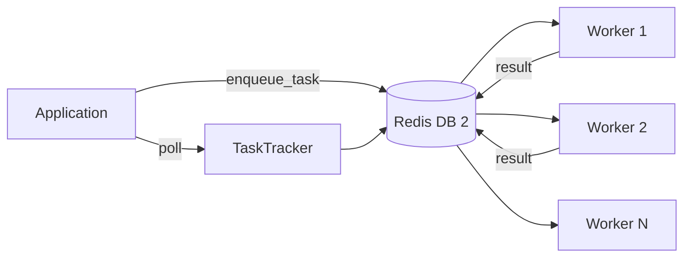

The `core/task_queue` module manages **asynchronous jobs** via Redis Queue (RQ), allowing heavy processing without blocking HTTP responses.

## Distributed Architecture Explained

The task queue separates processing into two components:

**API Server**: Receives requests, queues jobs, responds immediately

**Workers**: Process jobs in background, independently scalable

### Sync vs Async: When to Use the Queue

| Scenario                | Approach          | Rationale                   |
| ----------------------- | ----------------- | --------------------------- |
| Immediate HTTP Response | **Sync**          | Latency <100ms acceptable   |
| Heavy processing        | **Async (Queue)** | Avoid HTTP timeouts         |
| Batch processing        | **Async (Queue)** | Don't block resources       |
| Long-running tasks      | **Async (Queue)** | >30s of processing          |
| Fan-out pattern         | **Async (Queue)** | Process N items in parallel |

**Practical Example**:

```python
from core.task_queue import enqueue_task

# ❌ WRONG: Sync processing blocks HTTP
@app.post("/documents")
async def upload_document(file: UploadFile):
    content = await process_file(file)         # 2 minutes!
    embeddings = await generate_embeddings(content)  # 1 minute!
    await index_document(embeddings)
    return {"status": "done"}                  # Timeout after 3 min

# ✅ RIGHT: Queue and run in background
@app.post("/documents")
async def upload_document(file: UploadFile):
    job_id = enqueue_task(process_document, file_path=file.filename)
    return {"job_id": job_id, "status": "queued"}  # Immediate response!
```

---

## Structure

```text
core/task_queue/
├── __init__.py     # public API: get_queue_redis_connection, get_queue,
│                   #             enqueue_task, schedule_task, CronExpression
├── scheduler.py    # TaskScheduler, get_task_scheduler, enqueue_task, schedule_task
├── status.py       # TaskTracker, TaskStatus, TaskInfo, get_task_tracker, helpers
├── monitor.py      # WorkerMonitor, WorkerInfo, QueueInfo, get_worker_monitor
├── cron.py         # CronExpression — pure-stdlib 5-field cron parser
├── worker.py       # Worker process entry point
└── jobs/           # Job definitions (incl. agent_run.py — async agent runs)
```

The package `__all__` is intentionally small:

```python
from core.task_queue import (
    get_queue_redis_connection,  # -> redis.Redis
    get_queue,                   # -> rq.Queue (name="default")
    enqueue_task,                # immediate enqueue (tenant-aware)
    schedule_task,               # delayed enqueue
    CronExpression,              # 5-field cron parser (see below)
)
```

!!! warning "API surface"
    There is **no** `enqueue`, `TaskPriority`, `Job`, `TaskTracker`,
    `TaskScheduler`, or `WorkerMonitor` exported at the package level. The
    classes live in their submodules (`core.task_queue.scheduler`,
    `core.task_queue.status`, `core.task_queue.monitor`). Jobs are plain
    callables enqueued by reference — there is no `Job` base class. All of
    the scheduler/tracker/monitor methods are **synchronous** (RQ is sync).

---

## Enqueue Tasks

The package-level helpers enqueue plain callables. `enqueue_task` also injects
the current tenant id into the job metadata.

!!! note "Tenant & user context restoration"
    Jobs run under `TenantAwareWorker` (`core/task_queue/worker.py`), which
    rebinds `tenant_id` from the job metadata around each `perform_job`. If the
    job metadata carries a `user_id` (pass it via `meta={"user_id": …}`), the
    worker rebinds the user context too — so plugins declaring `tenancy: personal`
    resolve the right per-user tenant inside the job. See
    [Per-plugin tenancy](../advanced/multi-tenancy.md#per-plugin-tenancy-personal-vs-shared).

```python
from core.task_queue import enqueue_task, schedule_task

# Immediate execution on the "default" queue
job_id = enqueue_task(document_ingestion, document_id="doc-123")

# Choose a queue (configured queues: default, documents, analysis)
job_id = enqueue_task(urgent_analysis, payload, queue="analysis")

# Run after a delay (seconds)
job_id = schedule_task(scheduled_cleanup, 3600)  # 1 hour from now
```

---

## Scheduler

For full control (timeouts, retries, scheduled times) use `TaskScheduler` via
`get_task_scheduler()`. Recurring schedules are *not* built into the RQ
scheduler itself — drive them from cron or APScheduler calling `enqueue_*`, or
use [`CronExpression`](#cron-expressions-cronexpression) with the
[`WorkflowScheduler`](workflows.md#scheduled-workflows-workflowscheduler) for
in-process recurring workflows.

```python
from datetime import datetime, timezone
from core.task_queue.scheduler import get_task_scheduler

scheduler = get_task_scheduler()

# Immediate, with options
job_id = scheduler.enqueue(
    my_task_fn,
    arg1, arg2,
    queue_name="default",
    job_timeout=300,     # seconds
    result_ttl=86400,
    failure_ttl=604800,
    retry_count=3,       # wraps rq.Retry(max=3)
    meta={"source": "api"},
    kwarg1="value",
)

# Run at a specific time
job_id = scheduler.enqueue_at(generate_report, datetime(2026, 12, 31, 23, 59))

# Run after a delay (seconds)
job_id = scheduler.enqueue_in(cleanup_old_data, 3600)

# Inspect / cancel
info = scheduler.get_job(job_id)     # dict | None
scheduler.cancel_job(job_id)         # bool
```

### Retry Configuration

The scheduler uses RQ's native `Retry` object internally. Pass `retry_count=N`
when enqueuing — the scheduler builds `rq.Retry(max=N)` for you:

```python
job_id = scheduler.enqueue(
    my_task_fn,
    arg1, arg2,
    retry_count=3,    # rq.Retry(max=3)
    job_timeout=300,  # 5 minute timeout
)
```

!!! note "`retry_delay`"
    `enqueue` accepts a `retry_delay` parameter, but RQ's simple `Retry`
    does not support a per-attempt delay in this path — it is currently a
    no-op placeholder. Use a custom worker exception handler if you need
    backoff between attempts.

---

## Cron Expressions (`CronExpression`)

`core.task_queue.cron.CronExpression` (re-exported at the package level) is a
**pure-stdlib** parser for classic 5-field cron expressions
(`minute hour day-of-month month day-of-week`). Supported syntax per field:
`*`, single numbers, ranges (`1-5`), steps (`*/15`, `1-30/5`), and lists
(`1,15,30`). Day-of-week runs 0–6 with 0 = Sunday; `7` is accepted as an alias
for Sunday.

```python
from datetime import UTC, datetime
from core.task_queue import CronExpression

expr = CronExpression.parse("*/15 9-17 * * 1-5")   # ValueError when malformed
expr.next_after(datetime(2026, 1, 5, 10, 7, tzinfo=UTC))
# datetime.datetime(2026, 1, 5, 10, 15, tzinfo=datetime.timezone.utc)
```

- `parse(expr)` raises `ValueError` on wrong field count, non-numeric tokens,
  out-of-range values, inverted ranges, zero steps, or empty list items —
  malformed schedules fail at registration, not at fire time.
- `next_after(dt)` returns the next matching **UTC** instant strictly after
  `dt` (naive datetimes are treated as UTC; seconds truncated). It raises
  `ValueError` when no occurrence exists within roughly four years (e.g.
  `0 0 31 2 *`).
- Day matching follows standard (Vixie) cron semantics: when **both**
  day-of-month and day-of-week are restricted (neither raw field starts with
  `*`), a day matches if it satisfies *either* field; otherwise both apply.

Two consumers ship with the framework: the
[`WorkflowScheduler`](workflows.md#scheduled-workflows-workflowscheduler)
runs cron-scheduled workflow definitions, and the baselithbot plugin's
`CronScheduler.add_cron(name, expr, fn)` fires periodic bot jobs on cron
expressions (UTC) alongside its interval triggers.

---

## Task Status Tracking

`TaskTracker` (in `core.task_queue.status`) persists status/progress in Redis.
Construct it directly with a connection, or use the lazy singleton
`get_task_tracker()`. All methods are synchronous.

```python
from core.task_queue.status import get_task_tracker, TaskStatus

tracker = get_task_tracker()  # uses the shared queue Redis connection

# get_status returns a plain dict (or None if unknown)
status = tracker.get_status(job_id)
if status:
    print(status["status"])    # "queued" | "running" | "completed" | "failed" | ...
    print(status["progress"])  # float 0-100
    print(status.get("result"))

# Lifecycle helpers (typically called from inside the worker)
tracker.mark_started(job_id)
tracker.update_progress(job_id, 50.0, "halfway")
tracker.mark_completed(job_id, result={"chunks": 42})
tracker.mark_failed(job_id, error="boom")
```

`TaskStatus` is a `str` enum: `PENDING`, `QUEUED`, `RUNNING`, `COMPLETED`,
`FAILED`, `CANCELLED`.

### Reporting progress from inside a job

```python
from core.task_queue.status import update_job_progress, get_job_status

def process_document(document_id: str) -> dict:
    update_job_progress(25, "Loading")
    # ... work ...
    update_job_progress(100, "Indexed")
    return {"status": "indexed", "chunks": 42}

# Combined RQ + tracker view (dict | None)
full = get_job_status(job_id)
```

---

## Async Agent Runs (`/agent/async`)

The queue machinery (RQ workers, TaskTracker, dead-letter, webhooks) long
existed, but only documents/indexing were enqueueable — an *agent request*
could not run async. `core/task_queue/jobs/agent_run.py` closes that gap:
`run_agent_task(query, conversation_id=None)` executes one chat/agent request
on a worker, tracks its lifecycle in the TaskTracker, and emits a terminal
webhook so callers can subscribe instead of polling.

The `api-routers` plugin exposes it over HTTP (authenticated via
`require_user`):

| Method & path | Response |
| ------------- | -------- |
| `POST /agent/async` — body `{"query": "...", "conversation_id": null}` | `202` with `{"task_id": ..., "status_url": "/agent/status/{task_id}"}`; `503` when the queue is unavailable |
| `GET /agent/status/{task_id}` | The TaskTracker record (`status`, `progress`, `result`, ...); `404` for an unknown task id, `503` when the tracker is unreachable |

```bash
curl -X POST http://localhost:8000/agent/async \
  -H "Content-Type: application/json" \
  -d '{"query": "Summarize the Q3 incident reports"}'
# {"task_id": "…", "status_url": "/agent/status/…"}
```

Lifecycle on the worker:

1. `mark_started` in the TaskTracker (`Agent run: <query prefix>`).
2. The job runs the standard chat pipeline (`chat_service.handle_chat_async`)
   and stores `{"answer": str, "metadata": dict}` as the task result.
3. A terminal webhook fires **best-effort**: `agent.completed` with
   `{task_id, answer, metadata}` on success, `agent.failed` with
   `{task_id, error}` before the exception is re-raised on failure (RQ then
   records the failed job and the [dead-letter machinery](#dead-letter-queue-dlq)
   applies). A webhook outage never fails a finished run.

Query length is capped at 8000 characters at the API boundary. See
[Webhooks](webhooks.md) for subscribing to the terminal events.

---

## Worker Monitoring

`WorkerMonitor` (in `core.task_queue.monitor`) inspects RQ workers and queues.
It is synchronous; use it directly or via `get_worker_monitor()`.

```python
from core.task_queue.monitor import get_worker_monitor

monitor = get_worker_monitor()

# Active workers -> list[WorkerInfo]
for w in monitor.get_workers():
    print(f"{w.name}: {w.state}, current job: {w.current_job}")

print(monitor.get_worker_count())          # int

# Per-queue stats -> QueueInfo | None
info = monitor.get_queue_info("default")
if info:
    print(info.job_count, info.failed_job_count)

all_queues = monitor.get_all_queues()      # list[QueueInfo]

# Overall health -> dict
health = monitor.get_health_status()
print(health["status"])  # "healthy" | "degraded" | "unhealthy"

# Maintenance
monitor.clean_failed_jobs("default")       # int removed
monitor.retry_failed_job(job_id)           # bool
```

!!! warning "No `get_queue_stats`"
    `WorkerMonitor` has no `get_queue_stats()` method. Use `get_queue_info`
    / `get_all_queues` (returning `QueueInfo` dataclasses) or
    `get_health_status()` for an aggregated dict.

`WorkerInfo` fields: `name`, `state`, `queues`, `current_job`,
`successful_jobs`, `failed_jobs`, `birth_date`, `last_heartbeat`.
`QueueInfo` fields: `name`, `job_count`, `started_job_count`,
`deferred_job_count`, `finished_job_count`, `failed_job_count`.

### Prometheus example

```python
import prometheus_client as prom
from core.task_queue.monitor import get_worker_monitor

monitor = get_worker_monitor()
queue_depth = prom.Gauge("queue_depth", "Jobs in queue", ["queue"])
queue_failed = prom.Gauge("queue_failed", "Failed jobs", ["queue"])

def update_metrics() -> None:
    for q in monitor.get_all_queues():
        queue_depth.labels(queue=q.name).set(q.job_count)
        queue_failed.labels(queue=q.name).set(q.failed_job_count)
```

---

## Dead-Letter Queue (DLQ)

RQ keeps failed jobs in a per-queue `FailedJobRegistry` that expires after
`failure_ttl` (7 days). The DLQ adds a **durable** store for jobs that exhaust
their retries, with full failure context and first-class replay.

The worker wires it automatically: `start_worker()` registers
`dead_letter_handler` as an RQ exception handler, so any job that fails with no
retries left is recorded — RQ's normal handling still runs.

```python
from core.task_queue import get_dead_letter_queue

dlq = get_dead_letter_queue()

dlq.count()                       # number of dead-lettered jobs
records = dlq.list(limit=50)      # most-recently-failed first
rec = dlq.get(job_id)             # full DeadLetterRecord (error, traceback, ...)

new_id = dlq.replay(job_id)       # re-enqueue onto the original queue
dlq.purge(job_id)                 # drop one record
dlq.purge_all()                   # clear the DLQ
```

Each `DeadLetterRecord` stores `func_name`, `origin_queue`, `error`,
`traceback`, `failed_at`, `tenant_id`, arg reprs, and the serialized RQ payload
(`payload_b64`). Replay requeues the live RQ job when it still exists, otherwise
reconstructs it from the stored payload — so jobs can be replayed even after the
RQ `failure_ttl` window.

Admin HTTP endpoints (Basic Auth) expose the same operations:

| Method | Path | Action |
|---|---|---|
| `GET`    | `/admin/dlq`                | List (paginated) + total |
| `GET`    | `/admin/dlq/{job_id}`       | Full detail incl. traceback |
| `POST`   | `/admin/dlq/{job_id}/replay`| Re-enqueue |
| `DELETE` | `/admin/dlq/{job_id}`       | Purge one |
| `DELETE` | `/admin/dlq`                | Purge all |

---

## Configuration

Queue settings come from `core.config.task_queue.TaskQueueConfig`. The Redis URL
defaults to DB 2; configured queue names default to `default`, `documents`,
`analysis`.

Every setting is read from a `TASK_QUEUE_`-prefixed environment variable. The
broker URL is the one exception: it also accepts the unprefixed
`QUEUE_REDIS_URL`, the name used by `StorageConfig.queue_redis_url` and the
shipped `configs/.env.*` files. Set `QUEUE_REDIS_URL` unless you specifically
need to override it for workers alone.

```env
QUEUE_REDIS_URL=redis://localhost:6379/2
```

| Setting (`TaskQueueConfig`) | Environment variable | Default | Purpose |
| --------------------------- | -------------------- | ------- | ------- |
| `redis_url`                 | `TASK_QUEUE_REDIS_URL` | unset | Broker connection; wins over `QUEUE_REDIS_URL` |
| `queue_redis_url`           | `QUEUE_REDIS_URL`    | `redis://localhost:6379/2` (effective) | Broker connection |
| `queues`                    | `TASK_QUEUE_QUEUES`  | `["default", "documents", "analysis"]` | Known queues |
| `default_queue`             | `TASK_QUEUE_DEFAULT_QUEUE` | `default` | Queue used when none is named |
| `job_timeout`               | `TASK_QUEUE_JOB_TIMEOUT` | `3600` | Max job runtime (s) |
| `result_ttl`                | `TASK_QUEUE_RESULT_TTL` | `86400` | Result retention (s) |
| `failure_ttl`               | `TASK_QUEUE_FAILURE_TTL` | `604800` | Failed-job retention (s) |
| `default_retry_count`       | `TASK_QUEUE_DEFAULT_RETRY_COUNT` | `3` | Retries when not overridden |
| `default_retry_delay`       | `TASK_QUEUE_DEFAULT_RETRY_DELAY` | `60` | Delay between retries (s) |
| `max_connections`           | `TASK_QUEUE_MAX_CONNECTIONS` | `50` | Broker connection-pool ceiling |
| `health_check_interval`     | `TASK_QUEUE_HEALTH_CHECK_INTERVAL` | `30.0` | Idle-connection health check (s) |

!!! warning "Generic environment names are not read"
    `TaskQueueConfig` used to declare an empty `env_prefix`, which bound every
    field to a bare name — `REDIS_URL` fed `redis_url`, `MAX_CONNECTIONS` fed
    `max_connections`. A host that exported one of those for an unrelated
    service silently redirected the broker, so producers enqueued into a
    database no worker listened on. Those generic names are now ignored; use
    the prefixed names above (or `QUEUE_REDIS_URL`).

---

## Architecture


```mermaid
graph LR
    App[Application] --> |enqueue_task| Redis[(Redis DB 2)]
    Redis --> Worker1[Worker 1]
    Redis --> Worker2[Worker 2]
    Redis --> WorkerN[Worker N]

    Worker1 --> |result| Redis
    Worker2 --> |result| Redis

    App --> |poll| Tracker[TaskTracker]
    Tracker --> Redis
```
