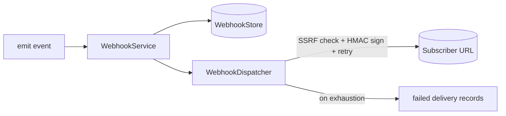

The `core/webhooks` subsystem delivers framework events to external consumers
over HTTP. It signs every payload (HMAC-SHA256), enforces an SSRF guard on
target URLs, retries with backoff, and dead-letters deliveries that exhaust
their attempts so they can be inspected and replayed.

The feature is **opt-in** (`WEBHOOKS_ENABLED`) and additive: emission is a no-op
until enabled, so call sites can fire events unconditionally.

## Architecture



- **`WebhookService`** — public facade: register endpoints, `emit()` events
  (fans out concurrently to subscribers), and `replay_delivery()`.
- **`WebhookDispatcher`** — signs, SSRF-checks, POSTs with bounded retries, and
  records the outcome.
- **`WebhookStore`** — pluggable persistence (`InMemoryWebhookStore` by default;
  swap in a durable backend behind the same Protocol).

## Enabling & registering

Set `WEBHOOKS_ENABLED=true`. Register endpoints over the API or in code.

### Programmatic

```python
from core.webhooks import get_webhook_service

service = get_webhook_service()
endpoint = await service.register_endpoint(
    url="https://example.com/hooks/baselith",
    secret="whsec_...",
    event_types={"chat.completed"},   # or {"*"} for all
    tenant_id="acme",
)

# Fire an event — delivered to every matching subscriber.
await service.emit("chat.completed", {"conversation_id": "c1"}, tenant_id="acme")
```

### Management API

When enabled, the `api-routers` plugin mounts a scoped management API at
`/webhooks` (gated by [capability scopes](auth.md#capability-scopes-fine-grained-authorization)):

| Method & path                              | Scope            |
| ------------------------------------------ | ---------------- |
| `POST /webhooks`                           | `webhooks:write` |
| `GET /webhooks`                            | `webhooks:read`  |
| `DELETE /webhooks/{id}`                    | `webhooks:write` |
| `GET /webhooks/deliveries`                 | `webhooks:read`  |
| `POST /webhooks/deliveries/{id}/replay`    | `webhooks:write` |

`POST /webhooks` returns the signing `secret` **once** at creation — store it;
it is never returned again (endpoint reads are redacted).

### Tenant isolation

Every endpoint and delivery is scoped to the caller's tenant. List operations
return only the current tenant's resources, and operations that target a
specific id — `DELETE /webhooks/{id}` and `POST /webhooks/deliveries/{id}/replay`
— verify ownership before acting: a resource belonging to another tenant is
treated as **not found** (`404`), so a tenant cannot enumerate, delete, or replay
another tenant's webhooks even with a valid id. Ownership is enforced in
`WebhookService` (not just the router), so every caller is protected.

## Signed payloads

Every delivery carries an `X-Baselith-Signature` header binding a timestamp to
the exact body:

```text
X-Baselith-Signature: t=1718000000,v1=<hex_hmac_sha256>
```

The signed message is `"{t}.{body}"`. Receivers recompute the HMAC with the
shared secret and compare in constant time, rejecting stale timestamps to defeat
replays. A verification helper ships with the SDK contract:

```python
from core.webhooks import verify_signature

ok = verify_signature(
    secret="whsec_...",
    body=raw_request_body,           # bytes, exactly as received
    header=request.headers["X-Baselith-Signature"],
    tolerance_seconds=300,
)
```

## Delivery, retries & dead-lettering

- Each delivery is attempted up to `WEBHOOK_MAX_ATTEMPTS` times with exponential
  backoff + jitter. Non-2xx responses and network errors are retried.
- A delivery that exhausts its attempts is stored in the `FAILED` state — the
  dead-letter equivalent — and can be replayed via the API or
  `service.replay_delivery(delivery_id)`.
- Deliveries run concurrently; one failing subscriber never blocks the others.

## SSRF protection

Webhook URLs are attacker-influenced, so before delivery the dispatcher rejects
non-`http(s)` schemes and any host resolving to a loopback, private, link-local,
reserved, or multicast address (cloud metadata endpoints, internal services).
Override only for trusted local development with `WEBHOOK_ALLOW_INTERNAL=true`.

## Configuration

| Variable                              | Default | Description                                    |
| ------------------------------------- | ------- | ---------------------------------------------- |
| `WEBHOOKS_ENABLED`                    | `false` | Master switch for the subsystem                |
| `WEBHOOK_TIMEOUT_SECONDS`             | `10`    | Per-delivery HTTP timeout                      |
| `WEBHOOK_MAX_ATTEMPTS`                | `4`     | Delivery attempts before dead-lettering        |
| `WEBHOOK_RETRY_BACKOFF_SECONDS`       | `1`     | Base backoff (exponential + jitter)            |
| `WEBHOOK_SIGNATURE_TOLERANCE_SECONDS` | `300`   | Max signature age accepted by `verify_signature` |
| `WEBHOOK_ALLOW_INTERNAL`              | `false` | Bypass the SSRF guard (local dev only)         |
| `WEBHOOK_MAX_ENDPOINTS_PER_TENANT`    | `50`    | Per-tenant registration cap                    |
