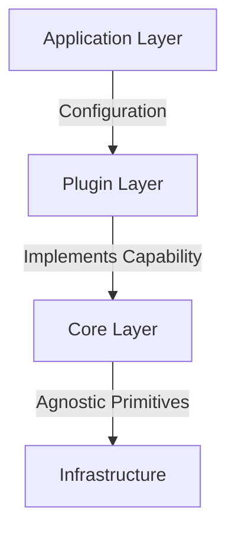
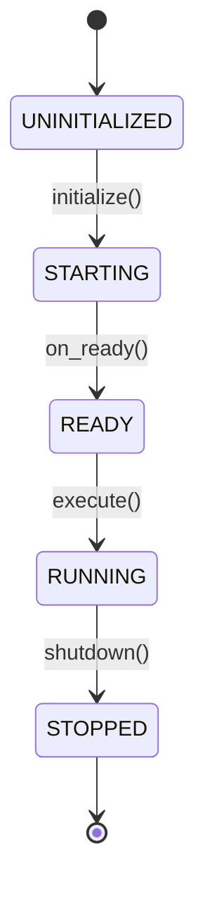

> **"The Core is Sacred."**

This document defines the identity, boundaries, and immutable principles of **BaselithCore**. It is the technical "Constitution" that guides every development decision.

---

## What It Is (Identity)

**BaselithCore** is an **Operating System for AI Agents**.

It provides the domain-agnostic infrastructure necessary to orchestrate, persist, and evolve intelligent entities, completely decoupling infrastructure complexity from domain logic.

- **Agnostic**: It knows nothing about "Finance", "HR", or "Tickets". It only knows about "Agents", "Tools", "Memories", and "Messages".
- **Modular**: Every extended feature is a Plugin. The Core is minimal.
- **Deterministic**: Supports reproducible execution modes for testing and enterprise validation.

---

## What It Is NOT (Anti-Patterns)

!!! warning "Clear Boundaries"
    - **NOT a Vertical Product**: It's not a customer service chatbot or a financial analyst. It's the factory to build them.
    - **NOT an LLM Wrapper**: LLM calls are an implementation detail. The value is in orchestration, memory, and reasoning.
    - **NOT LangChain**: It's not a collection of heterogeneous utilities. It's an opinionated architecture with strong contracts.
    - **NO Domain Logic in Core**: If you see an import like `from core.services import TrackerService`, you're violating the manifesto.

---

## Construction Methodology

Building products on top of the framework follows a rigorous pattern: **Core-Plugin-App**.

### Layering



1. **Core**: Provides primitives (e.g., `AgentLifecycle`, `VectorStoreProtocol`). Almost never touched.
2. **Plugin**: Implements capabilities (e.g., `SwarmPlugin`, `ResearchAgent`). Domain-specific intelligence resides here.
3. **Application**: Assembles plugins via configuration (`plugins.yaml`) to create the final product.

### Extension Mechanisms

- **Dependency Injection**: Inject behaviors, don't instantiate concrete classes.
- **Hooks**: Intercept lifecycle events (`before_execute`, `on_error`) without modifying agent code.
- **Event Bus**: React to events (`flow.completed`) for analytics or side-effects without direct coupling.

---

## Immutable Decisions (The Dogmas)

These principles are not subject to "refactoring" or discussion—they are structural foundations.

### I. Separation of Concerns

The Core handles the *How* (sending prompts, saving vectors). Plugins handle the *What* (analyzing balance sheets, writing code). Boundaries are impenetrable.

```python
# ✅ Correct: Agnostic core
class LLMService:
    async def generate(self, prompt: str) -> Response: ...

# ❌ Wrong: Domain logic in core
class FinancialAnalysisService:  # NO! Belongs in a plugin
    async def analyze_balance_sheet(self, ...): ...
```

---

### II. Dependency Injection First

No core component directly instantiates heavy dependencies (DB, LLM). Everything goes through the DI Container. This guarantees testability and flexibility.

```python
# ✅ Correct
class MyHandler:
    def __init__(self):
        self.llm = resolve(LLMServiceProtocol)

# ❌ Wrong
class MyHandler:
    def __init__(self):
        self.llm = OpenAIService()  # NO! Hard dependency
```

---

### III. Async Everything

I/O is inherently slow. The entire framework is `async/await`. No blocking calls exist in the critical execution path.

```python
# ✅ Always async for I/O
async def fetch_data():
    return await db.query(...)

# ❌ Never blocking
def fetch_data():
    return db.query(...)  # NO! Blocks event loop
```

---

### IV. Strong Contracts (Protocols)

Components communicate via interfaces (Protocols), never via concrete implementations. If the contract changes, it's a major breaking change.

```python
# ✅ Use Protocol
from core.interfaces import LLMServiceProtocol
llm: LLMServiceProtocol = resolve(LLMServiceProtocol)

# ❌ Direct dependency
from core.services.llm import OpenAIService
llm = OpenAIService()  # NO! Tight coupling
```

---

### V. Lifecycle Sovereignty

Every Agent MUST respect the lifecycle `UNINITIALIZED → STARTING → READY → RUNNING → STOPPED`. The framework manages transitions and states; the agent fills in the implementation.



---

### VI. Error Semantics

Errors are not strings; they are structured objects (`FrameworkErrorCode`). We always distinguish between `RecoverableError` (retry) and `FatalError` (shut down everything).

```python
# ✅ Structured errors
from core.errors import RecoverableError, ErrorCode

raise RecoverableError(
    code=ErrorCode.LLM_TIMEOUT,
    message="LLM request timed out",
    retry_after=5
)

# ❌ Generic strings
raise Exception("Something went wrong")  # NO! Not actionable
```

---

### VII. Multi-Tenancy by Default

The system is inherently multi-tenant. Every operation, from database queries to vector searches, must occur within an explicit tenant context. The "default tenant" is a safety fallback, not the norm.

```python
# ✅ Tenant Context
async with tenant_context("tenant-123"):
    data = await repository.get_all()  # Auto-filtered

# ❌ Global queries
data = await repository.get_all()  # NO! Which tenant?
```

---

### VIII. Storage Tiering (Redis/FalkorDB Separation)

State integrity is guaranteed by physical or logical separation of databases. **BaselithCore** uses a tiered storage approach:

- **DB 0** (Graph): Knowledge Graph (**FalkorDB**)
- **DB 1** (Cache): Application cache, PubSub, Rate Limiting (Redis)
- **DB 2** (Queue): RQ Task Queue, Job Tracking (Redis)

Never mix keyspaces of different natures.

---

## Common Violations

### Plugins Touching the Core

```python
# NO! Never modify core for a plugin
# core/services/jira_service.py  # WRONG!
```

Solution: The plugin must contain the Jira logic.

---

### Hardcoded Dependencies

```python
# NO! Hardcoded configuration
OPENAI_API_KEY = "sk-123..."  # WRONG!
```

Solution: Use `SecretStr` in config.

---

### Blocking I/O

```python
# NO! Synchronous I/O
import requests
response = requests.get(url)  # WRONG!
```

Solution: Use `httpx` with `async/await`.

---

### Domain Logic in Core

```python
# NO! Specific business logic
# core/services/customer_support.py  # WRONG!
```

Solution: Create a `customer-support` plugin.

---

## Design Philosophy

### Composition Over Inheritance

Prefer composing capabilities through plugins rather than creating deep inheritance hierarchies.

### Configuration Over Code

System behavior should be controlled through configuration (`plugins.yaml`, `.env`) rather than code changes.

### Protocol-Oriented Design

Define contracts first (Protocols), implement later. This ensures components remain loosely coupled.

---

## Mantra

> *We build tools that build tools.*

The framework doesn't directly solve business problems. It provides the primitives to build agents that solve them.

---

## Enforcement

These principles are enforced through:

1. **Code Reviews**: Framework maintainers reject PRs that violate these principles
2. **Automated Linting**: Custom linters check for anti-patterns
3. **Architecture Decision Records (ADRs)**: All major decisions are documented
4. **Plugin Certification**: Marketplace plugins must comply with these principles

---

## Further Reading

- [Architecture Overview](../architecture/overview.md) - Learn how these principles manifest in code
- [Plugin Development](../plugins/index.md) - Apply these principles when building plugins
- [Dependency Injection](../core-modules/di.md) - Master the DI system
