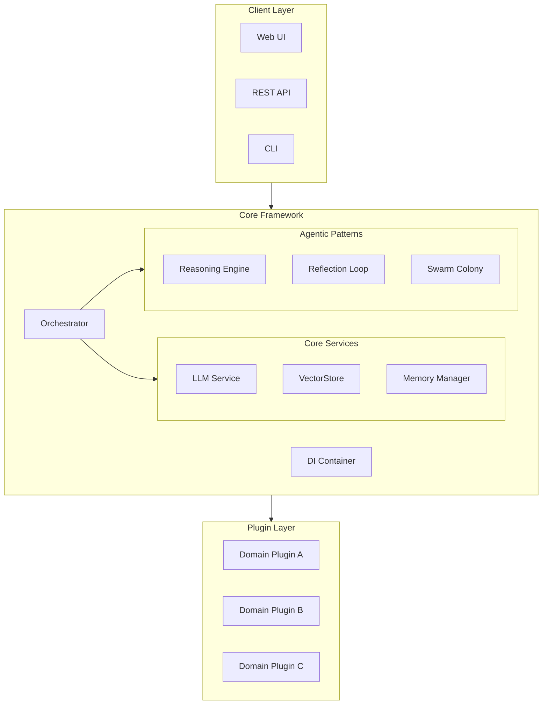

<!-- markdownlint-disable MD046 MD025 -->

<div class="hero" markdown>

<div class="hero-content" markdown>

<span class="hero-label">Open Source · Production Ready</span>

# <span class="brand-name">BaselithCore.</span>

**Build Autonomous AI Agent Systems at Scale.** BaselithCore is a **white-label framework** for building, orchestrating, and scaling multi-agent systems. Enterprise-grade resilience, full observability, and plugin-first architecture — all out of the box.

<div class="hero-highlights" markdown>
<span class="highlight-item">:octicons-check-circle-fill-16: 20+ Agentic Patterns</span>
<span class="highlight-item">:octicons-check-circle-fill-16: Multi-Tier Memory</span>
<span class="highlight-item">:octicons-check-circle-fill-16: Plugin Architecture</span>
</div>

[:octicons-rocket-24: Get Started](getting-started/index.md){ .md-button .md-button--primary }
[:octicons-book-24: Explore Architecture](architecture/index.md){ .md-button }
[:octicons-zap-24: Connect to MCP](core-modules/mcp.md){ .md-button .md-button--mcp }
[:octicons-mark-github-16: View on GitHub](https://github.com/baselithcore/baselithcore){ .md-button .md-button--outline }

</div>

<div class="hero-visual" markdown>

<div class="visual-card" markdown>

<div class="terminal-header">
<span class="terminal-dot red"></span>
<span class="terminal-dot yellow"></span>
<span class="terminal-dot green"></span>
<span class="terminal-title">baselith-core</span>
</div>

```python
from core.orchestration import Orchestrator

# Initialize the core orchestrator
orchestrator = Orchestrator()

# Orchestrate multi-agent collaboration with a single call
result = await orchestrator.process(
    "Analyze system architecture and propose optimizations",
    intent="collaborative_task"
)

print(result["response"])
```

</div>

</div>

</div>

---

## Overview

**BaselithCore** is a modular infrastructure for building, orchestrating, and scaling AI agent-based systems. Designed with a **plugin-first architecture**, it provides clean separation between core infrastructure and domain-specific logic.

<div class="feature-grid" markdown>

<div class="feature-card" markdown>

### :material-puzzle: Plugin Architecture

Extend the system without modifying the core. Every domain-specific feature is an isolated plugin with its own lifecycle management.

</div>

<div class="feature-card" markdown>

### :material-brain: 20+ Agentic Patterns

Complete implementation of agentic design patterns: Reflection, Reasoning (ToT), Swarm Intelligence, A2A Protocol, and more.

</div>

<div class="feature-card" markdown>

### :material-memory: Multi-Tier Memory

Three-tier memory system: Context (short-term), Graph (knowledge representation), Vector (semantic search).

</div>

<div class="feature-card" markdown>

### :material-shield-check: Resilience by Design

Built-in circuit breakers, rate limiting, bulkhead isolation, and retry policies integrated into the core framework.

</div>

<div class="feature-card" markdown>

### :material-eye: Observability

Complete observability stack: OpenTelemetry, Prometheus, Jaeger, structured logging ready for ELK/Splunk integration.

</div>

<div class="feature-card" markdown>

### :material-account-multiple: Multi-Tenancy

Native tenant data isolation with automatic context propagation across all system layers.

</div>

</div>

---

## Core Modules

The framework is organized into over 30 specialized modules across several core areas:

=== "Infrastructure"

    <div class="module-grid" markdown>
    <a href="core-modules/di/" class="module-card">
      <div class="module-header">
        <div class="module-icon">:material-needle:</div>
        <h4>Dependency Injection</h4>
      </div>
      <div class="module-path">core/di</div>
    </a>
    <a href="core-modules/config/" class="module-card">
      <div class="module-header">
        <div class="module-icon">:material-cog:</div>
        <h4>Configuration</h4>
      </div>
      <div class="module-path">core/config</div>
    </a>
    <a href="core-modules/resilience/" class="module-card">
      <div class="module-header">
        <div class="module-icon">:material-shield-half-full:</div>
        <h4>Resilience</h4>
      </div>
      <div class="module-path">core/resilience</div>
    </a>
    <a href="core-modules/events/" class="module-card">
      <div class="module-header">
        <div class="module-icon">:material-flash:</div>
        <h4>Event System</h4>
      </div>
      <div class="module-path">core/events</div>
    </a>
    <a href="core-modules/auth/" class="module-card">
      <div class="module-header">
        <div class="module-icon">:material-lock:</div>
        <h4>Authentication & Auth</h4>
      </div>
      <div class="module-path">core/auth</div>
    </a>
    <a href="core-modules/observability-module/" class="module-card">
      <div class="module-header">
        <div class="module-icon">:material-eye:</div>
        <h4>Observability</h4>
      </div>
      <div class="module-path">core/observability</div>
    </a>
    <a href="core-modules/nlp/" class="module-card">
      <div class="module-header">
        <div class="module-icon">:material-text-recognition:</div>
        <h4>NLP Utilities</h4>
      </div>
      <div class="module-path">core/nlp</div>
    </a>
    <a href="core-modules/cache/" class="module-card">
      <div class="module-header">
        <div class="module-icon">:material-cached:</div>
        <h4>Caching System</h4>
      </div>
      <div class="module-path">core/cache</div>
    </a>
    <a href="core-modules/lifecycle/" class="module-card">
      <div class="module-header">
        <div class="module-icon">:material-state-machine:</div>
        <h4>Lifecycle Management</h4>
      </div>
      <div class="module-path">core/lifecycle</div>
    </a>
    </div>

=== "Orchestration"

    <div class="module-grid" markdown>
    <a href="core-modules/orchestration/" class="module-card">
      <div class="module-header">
        <div class="module-icon">:material-transit-connection-variant:</div>
        <h4>Orchestration</h4>
      </div>
      <div class="module-path">core/orchestration</div>
    </a>
    <a href="core-modules/prioritization/" class="module-card">
      <div class="module-header">
        <div class="module-icon">:material-sort:</div>
        <h4>Prioritization</h4>
      </div>
      <div class="module-path">core/prioritization</div>
    </a>
    <a href="core-modules/workflows/" class="module-card">
      <div class="module-header">
        <div class="module-icon">:material-sitemap:</div>
        <h4>Workflows</h4>
      </div>
      <div class="module-path">core/workflows</div>
    </a>
    <a href="core-modules/planning/" class="module-card">
      <div class="module-header">
        <div class="module-icon">:material-view-list:</div>
        <h4>Planning</h4>
      </div>
      <div class="module-path">core/planning</div>
    </a>
    <a href="core-modules/plugins/" class="module-card">
      <div class="module-header">
        <div class="module-icon">:material-puzzle-outline:</div>
        <h4>Plugin System</h4>
      </div>
      <div class="module-path">core/plugins</div>
    </a>
    <a href="core-modules/task-queue/" class="module-card">
      <div class="module-header">
        <div class="module-icon">:material-format-list-checks:</div>
        <h4>Task Queue</h4>
      </div>
      <div class="module-path">core/task_queue</div>
    </a>
    <a href="core-modules/chat/" class="module-card">
      <div class="module-header">
        <div class="module-icon">:material-chat:</div>
        <h4>Chat & RAG Workflow</h4>
      </div>
      <div class="module-path">core/chat</div>
    </a>
    </div>

=== "Memory & Data"

    <div class="module-grid" markdown>
    <a href="core-modules/memory/" class="module-card">
      <div class="module-header">
        <div class="module-icon">:material-memory:</div>
        <h4>Memory System</h4>
      </div>
      <div class="module-path">core/memory</div>
    </a>
    <a href="core-modules/hierarchical-memory/" class="module-card">
      <div class="module-header">
        <div class="module-icon">:material-file-tree:</div>
        <h4>Hierarchical Memory</h4>
      </div>
      <div class="module-path">core/memory</div>
    </a>
    <a href="core-modules/services/" class="module-card">
      <div class="module-header">
        <div class="module-icon">:material-server-network:</div>
        <h4>Services</h4>
      </div>
      <div class="module-path">core/services</div>
    </a>
    <a href="core-modules/storage/" class="module-card">
      <div class="module-header">
        <div class="module-icon">:material-database:</div>
        <h4>Storage Layer</h4>
      </div>
      <div class="module-path">core/storage</div>
    </a>
    <a href="core-modules/db/" class="module-card">
      <div class="module-header">
        <div class="module-icon">:material-database-search:</div>
        <h4>Database Layer</h4>
      </div>
      <div class="module-path">core/db</div>
    </a>
    </div>

=== "Agentic AI"

    <div class="module-grid" markdown>
    <a href="core-modules/reasoning/" class="module-card">
      <div class="module-header">
        <div class="module-icon">:material-brain:</div>
        <h4>Reasoning</h4>
      </div>
      <div class="module-path">core/reasoning</div>
    </a>
    <a href="core-modules/reflection/" class="module-card">
      <div class="module-header">
        <div class="module-icon">:material-mirror:</div>
        <h4>Reflection</h4>
      </div>
      <div class="module-path">core/reflection</div>
    </a>
    <a href="core-modules/swarm/" class="module-card">
      <div class="module-header">
        <div class="module-icon">:material-bee:</div>
        <h4>Swarm Intelligence</h4>
      </div>
      <div class="module-path">core/swarm</div>
    </a>
    <a href="core-modules/guardrails/" class="module-card">
      <div class="module-header">
        <div class="module-icon">:material-shield-check:</div>
        <h4>Guardrails</h4>
      </div>
      <div class="module-path">core/guardrails</div>
    </a>
    <a href="core-modules/agents/" class="module-card">
      <div class="module-header">
        <div class="module-icon">:material-robot-outline:</div>
        <h4>Agentic Modules</h4>
      </div>
      <div class="module-path">core/agents</div>
    </a>
    </div>

=== "World & Meta"

    <div class="module-grid" markdown>
    <a href="core-modules/world-model/" class="module-card">
      <div class="module-header">
        <div class="module-icon">:material-earth:</div>
        <h4>World Model</h4>
      </div>
      <div class="module-path">core/world_model</div>
    </a>
    <a href="core-modules/exploration/" class="module-card">
      <div class="module-header">
        <div class="module-icon">:material-compass:</div>
        <h4>Exploration</h4>
      </div>
      <div class="module-path">core/exploration</div>
    </a>
    <a href="core-modules/adversarial/" class="module-card">
      <div class="module-header">
        <div class="module-icon">:material-sword:</div>
        <h4>Adversarial</h4>
      </div>
      <div class="module-path">core/adversarial</div>
    </a>
    <a href="core-modules/personas/" class="module-card">
      <div class="module-header">
        <div class="module-icon">:material-account-box:</div>
        <h4>Personas</h4>
      </div>
      <div class="module-path">core/personas</div>
    </a>
    <a href="core-modules/meta/" class="module-card">
      <div class="module-header">
        <div class="module-icon">:material-account-group:</div>
        <h4>Meta-Agent</h4>
      </div>
      <div class="module-path">core/meta</div>
    </a>
    </div>

=== "Learning & Eval"

    <div class="module-grid" markdown>
    <a href="core-modules/evaluation/" class="module-card">
      <div class="module-header">
        <div class="module-icon">:material-chart-bar:</div>
        <h4>Evaluation</h4>
      </div>
      <div class="module-path">core/evaluation</div>
    </a>
    <a href="core-modules/learning/" class="module-card">
      <div class="module-header">
        <div class="module-icon">:material-reload:</div>
        <h4>Learning Loop</h4>
      </div>
      <div class="module-path">core/learning</div>
    </a>
    <a href="core-modules/finetuning/" class="module-card">
      <div class="module-header">
        <div class="module-icon">:material-tune:</div>
        <h4>Auto Fine-Tuning</h4>
      </div>
      <div class="module-path">core/finetuning</div>
    </a>
    </div>

=== "Integration"

    <div class="module-grid" markdown>
    <a href="core-modules/a2a/" class="module-card">
      <div class="module-header">
        <div class="module-icon">:material-connection:</div>
        <h4>A2A Protocol</h4>
      </div>
      <div class="module-path">core/a2a</div>
    </a>
    <a href="core-modules/mcp/" class="module-card">
      <div class="module-header">
        <div class="module-icon">:material-tools:</div>
        <h4>MCP Integration</h4>
      </div>
      <div class="module-path">core/mcp</div>
    </a>
    <a href="core-modules/human/" class="module-card">
      <div class="module-header">
        <div class="module-icon">:material-account-hard-hat:</div>
        <h4>Human-in-the-Loop</h4>
      </div>
      <div class="module-path">core/human</div>
    </a>
    </div>

---

## Quick Start

=== "1. Installation"

    **Option 1: Install via pip (Recommended)**

    ```bash
    pip install baselith-core
    ```

    **Option 2: Clone for development**

    ```bash
    git clone https://github.com/baselithcore/baselithcore.git
    cd baselith-core
    pip install -e .
    ```

=== "2. Configuration"

    ```bash
    # Copy example configuration
    cp .env.example .env

    # Edit required variables in .env:
    # - OLLAMA_API_BASE=http://localhost:11434
    # - OPENAI_API_KEY=your_key_here
    # - REDIS_URL=redis://localhost:6379/0
    ```

=== "3. Verification"

    ```bash
    # Verify your installation
    baselith doctor
    ```

    **Expected Output:**
    ```text
    ╭──────────────────────────────────────────╮
    │ 🏥 Baselith-Core Diagnostics             │
    ╰──────────────────────────────────────────╯
    🔍 Checking system health...

    ✅ Python version OK (3.12+)
    ✅ Dependencies installed
    ✅ Redis connection OK
    ✅ LLM provider configured
    ```

=== "4. Launch"

    ```bash
    # Start the development server
    baselith run
    ```

    The server will be available at [http://localhost:8000](http://localhost:8000).
    Explore the API docs at [http://localhost:8000/docs](http://localhost:8000/docs).

---

## High-Level Architecture



---

## Design Principles

!!! tip "Sacred Core"
    The `core/` directory contains **only** domain-agnostic logic. Never insert domain-specific logic into the core.

!!! tip "Plugin-First"
    Any domain-specific functionality must be implemented as a plugin.

!!! tip "Async by Default"
    All I/O operations are asynchronous. Blocking I/O is prohibited.

!!! tip "Security by Design"
    Input validation, sanitization, and no hardcoded secrets are mandatory.

---

## Who Should Use This Framework

BaselithCore is designed for:

- **Enterprise Development Teams** building production-grade AI agent systems
- **AI Engineers** requiring advanced agentic patterns (reasoning, reflection, swarm intelligence)
- **Platform Architects** needing white-label solutions for multi-tenant environments
- **Researchers** exploring agent coordination and orchestration patterns

### Key Use Cases

- Custom AI assistants with specialized domain knowledge
- Multi-agent workflows requiring coordination and task decomposition
- Enterprise applications with compliance and security requirements
- Scalable agent systems requiring observability and resilience

---

## Next Steps

<div class="feature-grid" markdown>

<div class="feature-card" markdown>

### :material-rocket-launch: Getting Started

Begin with [installation](getting-started/installation.md) and the [quick start guide](getting-started/quickstart.md).

</div>

<div class="feature-card" markdown>

### :material-puzzle-plus: Create a Plugin

Follow the tutorial to [create your first plugin](getting-started/first-plugin.md).

</div>

<div class="feature-card" markdown>

### :material-book-open-variant: Deep Dive

Explore the [architecture](architecture/overview.md) and [core modules](core-modules/index.md).

</div>

</div>
