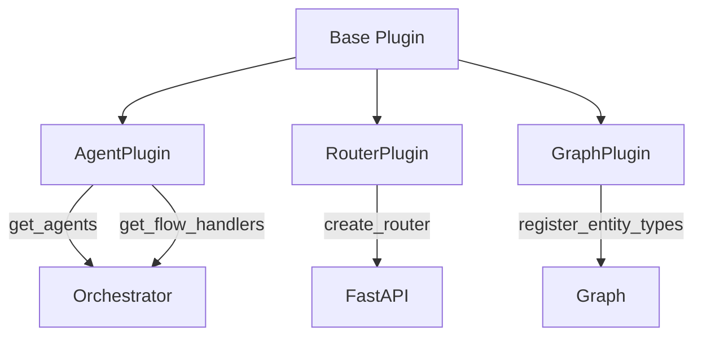
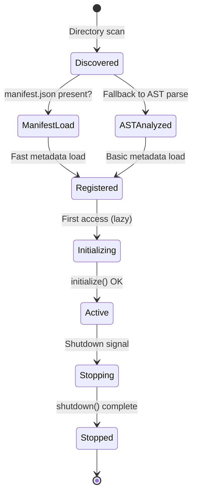

Plugins are modular units that extend the framework without modifying the core.

---

## Plugin Anatomy

### Directory Structure

```text
plugins/my-plugin/
├── plugin.py          # Entry point (Required)
├── __init__.py        # Optional (avoid if name has dashes)
├── agent.py           # Specialized agents
├── handlers.py        # Flow Handlers (sync/stream)
├── router.py          # FastAPI endpoints
├── services.py        # Internal services
├── models.py          # Pydantic models
├── static/            # Frontend assets (JS/CSS)
│   ├── components.js
│   └── styles.css
├── templates/         # HTML templates (Optional)
└── README.md          # Documentation
```

### Minimal Plugin

```python title="plugins/my-plugin/plugin.py"
from core.plugins import Plugin

PLUGIN_NAME = "my-plugin"
PLUGIN_VERSION = "1.0.0"


class MyPlugin(Plugin):
    @property
    def metadata(self) -> dict:
        return {
            "name": PLUGIN_NAME,
            "version": PLUGIN_VERSION,
            "description": "My plugin description",
            "author": "Your Name"
        }
    
    async def initialize(self, config: dict) -> None:
        """Initialization with configuration."""
        self.config = config
    
    async def shutdown(self) -> None:
        """Resource cleanup."""
        pass
```

---

## Capability Mixins

Plugins acquire specific capabilities through multiple inheritance:



### AgentPlugin

For plugins that expose agents and handlers:

```python
from core.plugins import Plugin, AgentPlugin

class MyPlugin(Plugin, AgentPlugin):
    def get_agents(self) -> dict:
        """Available agents."""
        return {"main": MyMainAgent}
    
    def get_flow_handlers(self) -> dict:
        """Intent handlers."""
        return {
            "my_intent": {
                "sync": MySyncHandler,
                "stream": MyStreamHandler
            }
        }
    
    def get_intent_patterns(self) -> list:
        """Intent matching patterns."""
        return [
            {
                "intent": "my_intent",
                "patterns": ["keywords"],
                "priority": 100
            }
        ]
```

### RouterPlugin

For plugins that expose APIs:

```python
from core.plugins import Plugin, RouterPlugin
from fastapi import APIRouter

class MyPlugin(Plugin, RouterPlugin):
    def create_router(self) -> APIRouter:
        router = APIRouter(tags=["My Plugin"])
        
        @router.get("/status")
        async def status():
            return {"status": "ok"}
        
        return router
    
    def get_router_prefix(self) -> str:
        return "/my-plugin"  # /api/my-plugin/status
```

### GraphPlugin

For plugins that extend the knowledge graph:

```python
from core.plugins import Plugin, GraphPlugin

class MyPlugin(Plugin, GraphPlugin):
    def register_entity_types(self) -> list:
        return ["CustomEntity", "CustomRelation"]
    
    def get_graph_service(self):
        from .services import MyGraphService
        return MyGraphService()
```

---

### Discovery & Optimization

The framework uses a **Hybrid Metadata** approach to balance performance and flexibility:

1. **Manifest First**: The CLI and Loader check for a `manifest.json` file. If present, static metadata (name, version, tags) is loaded instantly without executing any Python code.
2. **AST Fallback**: If no manifest is found, the system uses static analysis (`ast` module) to extract docstrings and basic structure for the `plugin status` command.
3. **Lazy Loading**: Complete module execution and dependency injection only happen when the plugin is actually initialized by the core.

### Lifecycle



### Hooks

```python
class MyPlugin(Plugin):
    async def initialize(self, config: dict) -> None:
        """Called on first access."""
        self.db = await create_connection()
    
    async def on_ready(self) -> None:
        """Called when system is ready."""
        await self.warm_cache()
    
    async def shutdown(self) -> None:
        """Called on stop."""
        await self.db.close()
```

---

## Accessing Core Services

Via Dependency Injection:

```python
from core.di import resolve
from core.interfaces import LLMServiceProtocol

class MyHandler:
    def __init__(self, plugin):
        self.llm = resolve(LLMServiceProtocol)
        self.config = plugin.config
```

---

## Configuration

In `configs/plugins.yaml`:

```yaml
plugins:
  my-plugin:
    enabled: true
    config:
      api_key: "${MY_PLUGIN_API_KEY}"
      timeout: 30
```

Access in plugin:

```python
async def initialize(self, config: dict):
    self.api_key = config.get("api_key")
    self.timeout = config.get("timeout", 60)
```
