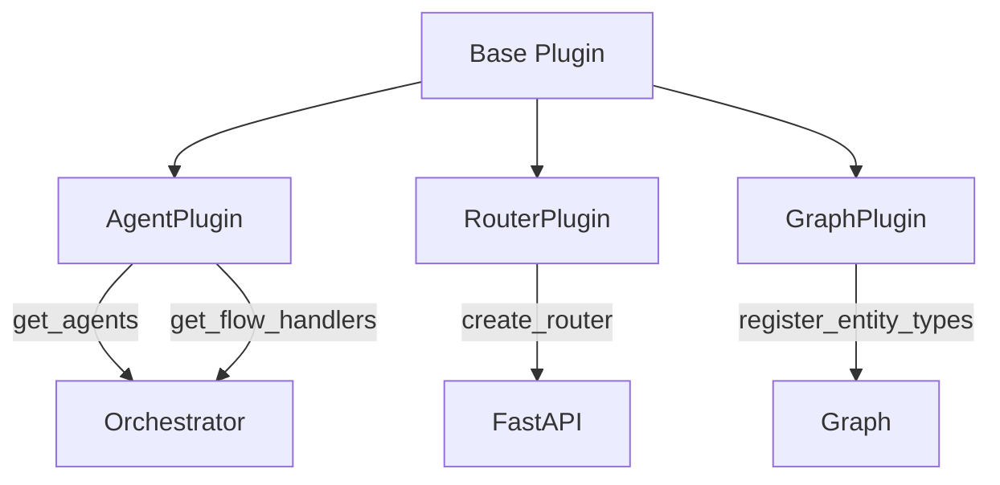
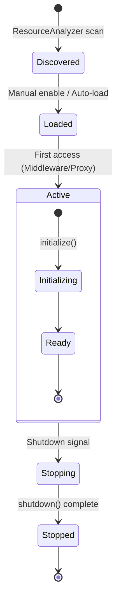

Plugins are modular units that extend the framework without modifying the core.

---

## Plugin Anatomy

### Directory Structure

```text
plugins/my-plugin/
├── manifest.yaml      # Identity and requirements (Required; .yml or .json also accepted)
├── plugin.py          # Entry point (Required)
├── __init__.py        # Package init (emitted by the scaffold)
├── agent.py           # Specialized agents
├── handlers.py        # Flow Handlers
├── router.py          # FastAPI endpoints
├── services.py        # Internal services
├── models.py          # Pydantic models
├── static/            # Frontend assets (JS/CSS)
│   ├── components.js
│   └── styles.css
├── templates/         # HTML templates (Optional)
└── README.md          # Documentation (Optional)
```

Discovery is manifest-driven. The `ResourceAnalyzer` looks for `manifest.yaml`,
`manifest.yml` or `manifest.json` in each plugin directory; a directory without one
is logged as `No manifest file found` and is never registered, whatever `plugin.py`
contains.

### Minimal Plugin

```yaml title="plugins/my-plugin/manifest.yaml"
name: my-plugin
version: 1.0.0
description: My plugin description
author: Your Name
```

```python title="plugins/my-plugin/plugin.py"
from typing import Any

from core.plugins import Plugin


class MyPlugin(Plugin):
    async def initialize(self, config: dict[str, Any]) -> None:
        """Initialization with configuration."""
        await super().initialize(config)

    async def shutdown(self) -> None:
        """Resource cleanup."""
        await super().shutdown()
```

`Plugin.metadata` is a `cached_property`: it locates the manifest next to the module
that defines your class and returns a `PluginMetadata` (`self.metadata.name`,
`self.metadata.version`, …). Do not override it with a `@property` returning a `dict`
— the framework reads `metadata.name` as an attribute, and a `dict` raises
`AttributeError`.

!!! warning "Always call `super()` in `initialize()` and `shutdown()`"
    The base `initialize()` is what stores the config (read back through
    `get_config()`) and flips `is_initialized()` to `True`; the base `shutdown()`
    flips it back. An override that skips `super()` leaves the plugin reporting
    *not initialized* and `get_config()` returning defaults only.

---

## Capability Mixins

Plugins acquire specific capabilities by subclassing one or more mixins. Every mixin
already extends `Plugin`, so subclass the mixin alone, or combine several mixins as
`plugins/example-plugin/` does:

```python
class ExamplePlugin(AgentPlugin, RouterPlugin, GraphPlugin): ...
```

Listing `Plugin` next to a mixin (`class MyPlugin(Plugin, AgentPlugin)`) raises
`TypeError: Cannot create a consistent method resolution order (MRO)`.


```mermaid
graph TD
    Plugin[Base Plugin] --> AgentPlugin
    Plugin --> RouterPlugin
    Plugin --> GraphPlugin

    AgentPlugin --> |get_agents| Orchestrator
    AgentPlugin --> |get_flow_handlers| Orchestrator
    RouterPlugin --> |create_router| FastAPI
    GraphPlugin --> |register_entity_types| Graph
```

### AgentPlugin

For plugins that expose agents and handlers. `create_agent(service, **kwargs)` is
abstract — a subclass that does not implement it cannot be instantiated:

```python
from typing import Any

from core.plugins import AgentPlugin

from .agent import MyMainAgent
from .handlers import MyIntentHandler


class MyPlugin(AgentPlugin):
    def create_agent(self, service: Any, **kwargs) -> MyMainAgent:
        """Factory called by the orchestrator; ``service`` is the chat service."""
        return MyMainAgent(service)

    def get_agents(self) -> list[Any]:
        """Agent objects to register eagerly (a list; default is empty)."""
        return []

    def get_flow_handlers(self) -> dict[str, Any]:
        """Intent name -> handler. The value is invoked directly."""
        return {"my_intent": MyIntentHandler()}

    def get_intent_patterns(self) -> list[dict[str, Any]]:
        """Intent matching patterns."""
        return [
            {
                "name": "my_intent",
                "patterns": ["keywords"],
                "priority": 10,
            }
        ]
```

A flow-handler value is either an object exposing
`async def handle(self, query: str, context: dict) -> dict`, or an async callable with
the same `(query, context)` signature. The registry wraps it in a
`_LazyFlowHandlerProxy` and calls it as-is, so nesting `{"sync": ..., "stream": ...}`
dictionaries under the intent fails at call time (a `dict` is not callable). Intent
patterns are keyed by `"name"` — an entry without it is silently dropped — and a
missing `"priority"` defaults to `0` (higher wins).

### RouterPlugin

For plugins that expose APIs. `create_router()` is abstract; `get_routers()` defaults
to `[self.create_router()]`:

```python
from fastapi import APIRouter

from core.plugins import RouterPlugin


class MyPlugin(RouterPlugin):
    def create_router(self) -> APIRouter:
        router = APIRouter(tags=["My Plugin"])

        @router.get("/status")
        async def status():
            return {"status": "ok"}

        return router
```

Routers are mounted with `app.include_router(router, prefix=self.get_router_prefix())`.
The default prefix is `/api/<manifest name>`, so the route above is served at
`/api/my-plugin/status`. Override `get_router_prefix()` only to move the whole plugin:
the value is used verbatim (returning `"/my-plugin"` mounts at `/my-plugin/status`,
not `/api/my-plugin/status`), and any `prefix=` set on the `APIRouter` itself is
appended *after* the plugin prefix.

### GraphPlugin

For plugins that extend the knowledge graph:

```python
from typing import Any

from core.plugins import GraphPlugin


class MyPlugin(GraphPlugin):
    def register_entity_types(self) -> list[dict[str, Any]]:
        return [
            {
                "type": "CustomEntity",
                "display_name": "Custom Entity",
                "schema": {"title": "str"},
            }
        ]

    def register_relationship_types(self) -> list[dict[str, Any]]:
        return [
            {
                "type": "RELATES_TO",
                "source_types": ["CustomEntity"],
                "target_types": ["CustomEntity"],
            }
        ]
```

---

### Discovery & Optimization

The framework uses an advanced **Lazy Discovery & Activation** mechanism to ensure high performance and minimal resource usage:

1. **Static Analysis (ResourceAnalyzer)**: At startup, the framework performs deep static analysis of all plugin directories using the `ResourceAnalyzer`.
    * **Metadata Extraction**: Extracts name, version, and description from the manifest without importing code.
    * **Resource Requirements**: Identifies which core services (e.g., `postgres`, `vectorstore`, `llm`) the plugin requires, allowing the core to initialize only the necessary infrastructure.
    * **Routing & Static Assets**: Discovers API routes and static asset paths to prepare the global routing table.
1. **Cold Start (DISCOVERED State)**: Plugins start in a "cold" state. They are registered in the `PluginRegistry` with their discovered metadata, but their Python modules are not yet imported.
1. **On-Demand Activation**: A plugin is automatically "activated" (imported and initialized) only when:
    * An HTTP request matches one of its discovered routes (handled by `PluginActivationMiddleware`).
    * One of its flow handlers is invoked by the orchestrator (via a `_LazyFlowHandlerProxy`).
    * The frontend requests its static assets.

### Lifecycle


```mermaid
stateDiagram-v2
    [*] --> Discovered: ResourceAnalyzer scan
    Discovered --> Loaded: Manual enable / Auto-load
    Loaded --> Active: First access (Middleware/Proxy)
    Active --> Stopping: Shutdown signal
    Stopping --> Stopped: shutdown() complete
    Stopped --> [*]

    state Active {
        [*] --> Initializing: initialize()
        Initializing --> Ready
        Ready --> [*]
    }
```

### Hooks

The `Plugin` interface exposes two async lifecycle hooks — `initialize(config)` and
`shutdown()` — plus one synchronous classmethod, `setup_app_middleware(app)`, that runs
while the FastAPI app is being built:

```python
from typing import Any

from core.plugins import Plugin


class MyPlugin(Plugin):
    @classmethod
    def setup_app_middleware(cls, app: Any) -> None:
        """Called at app construction time, before the lifespan starts.

        Starlette freezes the middleware stack before ``initialize()`` runs,
        so ``app.add_middleware(...)`` must happen here. Default: no-op.
        """
        app.add_middleware(MyMiddleware)

    async def initialize(self, config: dict[str, Any]) -> None:
        """Called on first access. Acquire resources / warm caches here."""
        await super().initialize(config)
        self.db = await create_connection()

    async def shutdown(self) -> None:
        """Called on stop. Release resources here."""
        await self.db.close()
        await super().shutdown()
```

---

## Accessing Core Services

Via Dependency Injection:

```python
from core.di import ServiceRegistry
from core.interfaces import LLMServiceProtocol
from core.plugins import Plugin


class MyHandler:
    def __init__(self, plugin: Plugin):
        self.llm = ServiceRegistry.get(LLMServiceProtocol)
        self.timeout = plugin.get_config("timeout", 60)
```

There is no public `plugin.config` attribute: configuration is read through
`plugin.get_config(key, default=None)`.

---

## Configuration

In `configs/plugins.yaml`:

```yaml title="configs/plugins.yaml"
my-plugin:
  enabled: true
  timeout: 30
```

The file is a **flat mapping keyed by plugin name** — the manifest `name`, with the
directory name and its `-`/`_` variant accepted as aliases. There is no `plugins:`
wrapper and no `config:` sub-key: a nested layout is not matched, so the plugin is
treated as if it had no entry at all. The whole entry, `enabled` included, is passed
to `initialize(config)`. Values are literal — there is no `${VAR}` interpolation;
secrets belong in the plugin-local `.env` described in
[Creating Plugins](creating-plugins.md#6-configure-plugin), whose keys are merged into
the same `config` dict.

Access in plugin:

```python
async def initialize(self, config: dict[str, Any]) -> None:
    await super().initialize(config)
    self.timeout = self.get_config("timeout", 60)
```
