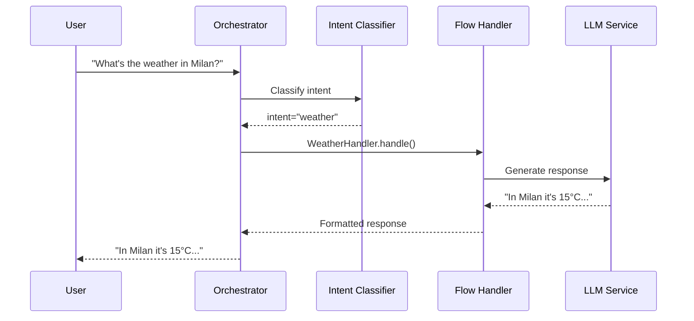

<!-- markdownlint-disable-file MD046 MD025 -->

<!-- markdownlint-disable MD046 -->

**Flow Handlers** are the heart of the system's response logic. When the orchestrator identifies an intent (e.g., "document search", "weather query", "assistance"), it invokes the corresponding Flow Handler to generate the response.

!!! info "Why Flow Handlers?"
    Flow Handlers enable plugins to:

    - Provide **customized** responses for specific intents
    - Choose between **sync** (complete) or **stream** (incremental) responses
    - Maintain separated and testable logic
    - Integrate easily with external services

---

## Architecture

The flow of a request through Flow Handlers:



---

## Sync vs Stream

The framework supports two response modes:

| Type | Method | Use Case | UX |
|------|--------|----------|-----|
| **Sync** | `handle()` | Short, fast responses | User waits, then sees everything |
| **Stream** | `handle_stream()` | Long responses, LLM generation | User sees progressive tokens |

### When to Use Sync

- Short responses (< 100 words)
- Database/external API queries
- Operations requiring processing before responding
- Commands with immediate actions (e.g., "save", "delete")

**Example use cases:**

- Quick facts retrieval
- Calculations
- Database lookups
- Status checks

### When to Use Stream

- Long responses generated by LLM
- Stories, explanations, detailed analyses
- Better UX: user sees first results immediately
- Reduces perceived latency for LLM calls

**Example use cases:**

- Essay generation
- Code explanations
- Technical documentation
- Storytelling

---

## Implementation

### Sync Handler

A synchronous handler returns the complete response:

```python
from core.orchestration.protocols import FlowHandler
from core.di import resolve
from core.services.llm import LLMServiceProtocol

class WeatherHandler(FlowHandler):
    """
    Handler for weather requests.
    
    Responds to intents like "what's the weather", "weather forecast", etc.
    """
    
    def __init__(self, plugin):
        """
        Initialize the handler.
        
        Args:
            plugin: Reference to parent plugin
        
        Notes:
            Resolve dependencies here, NOT in handle().
            This improves performance and avoids repeated resolution.
        """
        self.plugin = plugin
        self.llm = resolve(LLMServiceProtocol)
        self.weather_api = resolve(WeatherAPIService)
    
    async def handle(self, query: str, context: dict) -> str:
        """
        Process the request and return complete response.
        
        Args:
            query: User query text
            context: Dictionary with session_id, messages, tenant_id, metadata
        
        Returns:
            Complete response as string
        """
        # 1. Extract parameters from query
        city = await self._extract_city(query)
        
        # 2. Call external API
        weather_data = await self.weather_api.get_current(city)
        
        # 3. Format response with LLM (optional)
        prompt = f"""
        Weather data for {city}: {weather_data}
        Generate a natural and friendly response.
        """
        response = await self.llm.generate(prompt)
        
        return response
    
    async def _extract_city(self, query: str) -> str:
        """Extract city from query using NLP."""
        # City extraction implementation...
        return "Milan"  # Fallback
```

### Stream Handler

A streaming handler emits tokens incrementally:

```python
from typing import AsyncGenerator

class StoryHandler(FlowHandler):
    """
    Handler for story generation.
    
    Uses streaming to improve UX with long responses.
    """
    
    def __init__(self, plugin):
        self.llm = resolve(LLMServiceProtocol)
    
    async def handle_stream(
        self, 
        query: str, 
        context: dict
    ) -> AsyncGenerator[str, None]:
        """
        Generate response via streaming.
        
        Args:
            query: User request
            context: Session context
        
        Yields:
            Progressive text chunks
        """
        # Prepare prompt
        system_prompt = "You are a creative storyteller."
        
        # Stream directly from LLM
        async for chunk in self.llm.stream(
            prompt=query,
            system=system_prompt,
            temperature=0.8
        ):
            yield chunk
```

### Hybrid Handler

You can implement both to support sync and stream:

```python
class HybridHandler(FlowHandler):
    """Handler that supports both sync and stream."""
    
    async def handle(self, query: str, context: dict) -> str:
        """Sync version: collects entire stream."""
        chunks = []
        async for chunk in self.handle_stream(query, context):
            chunks.append(chunk)
        return "".join(chunks)
    
    async def handle_stream(
        self, query: str, context: dict
    ) -> AsyncGenerator[str, None]:
        """Streaming implementation."""
        async for chunk in self.llm.stream(query):
            yield chunk
```

!!! tip "Hybrid Approach"
    Implementing both methods gives clients flexibility to choose. The sync version can simply aggregate the stream for convenience.

---

## Registration

Flow Handlers must be registered in the plugin:

```python
class MyPlugin(Plugin, AgentPlugin):
    """Plugin with custom handlers."""
    
    def get_flow_handlers(self) -> dict:
        """
        Return mapping of intent -> handlers.
        
        Returns:
            Dict with sync and/or stream handlers for each intent
        """
        return {
            "weather_query": {
                "sync": WeatherHandler,   # Class, not instance
                "stream": None            # No streaming for this intent
            },
            "story_generation": {
                "sync": StoryHandler,     # Sync fallback
                "stream": StoryHandler    # Preferred when streaming available
            },
            "document_search": {
                "sync": SearchHandler,
                "stream": SearchStreamHandler
            }
        }
    
    def get_intent_patterns(self) -> list:
        """
        Define patterns for intent matching.
        
        Returns:
            List of dicts with intent, patterns, and priority
        """
        return [
            {
                "intent": "weather_query",
                "patterns": ["weather", "forecast", "temperature", "raining"],
                "priority": 100  # Higher = more priority
            },
            {
                "intent": "story_generation",
                "patterns": ["tell", "story", "tale", "narrative"],
                "priority": 80
            },
            {
                "intent": "document_search",
                "patterns": ["search", "find", "documents", "files"],
                "priority": 90
            }
        ]
```

### Priority System

| Priority Range | Use Case |
|----------------|----------|
| **200+** | Reserved for system-critical intents |
| **100-199** | High-priority domain-specific intents |
| **50-99** | Standard intents |
| **1-49** | Low-priority or fallback intents |
| **0** | Default/catch-all intent |

---

## Context

The `context` passed to handlers contains useful session information:

```python
async def handle(self, query: str, context: dict) -> str:
    # Session ID for conversational continuity
    session_id = context.get("session_id")
    
    # Message history (last N messages)
    messages = context.get("messages", [])
    # Format: [{"role": "user", "content": "..."}, {"role": "assistant", "content": "..."}]
    
    # Tenant for multi-tenancy
    tenant_id = context.get("tenant_id")
    
    # Custom metadata from client
    metadata = context.get("metadata", {})
    user_preferences = metadata.get("preferences", {})
    
    # Request ID for tracing
    request_id = context.get("request_id")
```

### Context Fields Reference

| Field | Type | Description |
|-------|------|-------------|
| `session_id` | `str` | Unique session identifier |
| `messages` | `list[dict]` | Conversation history |
| `tenant_id` | `str` | Tenant ID (multi-tenancy) |
| `metadata` | `dict` | Custom client metadata |
| `request_id` | `str` | Distributed tracing ID |
| `user_id` | `str` | Authenticated user ID (if auth enabled) |

---

## Error Handling

Handle errors gracefully to avoid crashes and provide useful feedback:

```python
from core.exceptions import HandlerError, ExternalServiceError

class RobustHandler(FlowHandler):
    async def handle(self, query: str, context: dict) -> str:
        try:
            result = await self._process(query, context)
            return result
            
        except ExternalServiceError as e:
            # External service unavailable
            logger.warning(
                "External service failed",
                service=e.service_name,
                error=str(e),
                request_id=context.get("request_id")
            )
            return "Sorry, the service is temporarily unavailable. Please try again later."
            
        except ValueError as e:
            # Invalid input
            logger.info(
                "Invalid input",
                error=str(e),
                query=query[:100]  # Truncate for logs
            )
            return "I didn't understand the request. Could you rephrase it?"
            
        except Exception as e:
            # Unexpected error
            logger.error(
                "Handler failed unexpectedly",
                error=str(e),
                exc_info=True,
                request_id=context.get("request_id")
            )
            # Don't expose internal details to user
            return "An internal error occurred. The team has been notified."
```

### Error Handling Best Practices

!!! warning "Never Expose Internal Errors"
    Always catch exceptions and return user-friendly messages. Never expose stack traces, database errors, or API keys in error messages.

!!! tip "Structured Logging"
    Use structured logging with context (request_id, tenant_id) for easier debugging in production.

!!! tip "Metric Tracking"
    Track error rates by type to identify systemic issues:
    ```python
    from core.observability import metrics

    metrics.increment("handler.error", tags=["type:external_api", "handler:weather"])
    ```

---

## Testing

Test your handlers in isolation:

```python
import pytest
from unittest.mock import AsyncMock, MagicMock

@pytest.mark.asyncio
async def test_weather_handler():
    # Setup mock dependencies
    mock_llm = AsyncMock()
    mock_llm.generate.return_value = "In Milan it's 15°C with clear skies."
    
    mock_weather_api = AsyncMock()
    mock_weather_api.get_current.return_value = {"temp": 15, "condition": "sunny"}
    
    # Create handler with mocks
    handler = WeatherHandler(plugin=MagicMock())
    handler.llm = mock_llm
    handler.weather_api = mock_weather_api
    
    # Test
    context = {"session_id": "test-123", "tenant_id": "tenant-abc"}
    result = await handler.handle("What's the weather in Milan?", context)
    
    # Assertions
    assert "Milan" in result or "15" in result
    mock_weather_api.get_current.assert_called_once()


@pytest.mark.asyncio
async def test_stream_handler():
    handler = StoryHandler(plugin=MagicMock())
    handler.llm = AsyncMock()
    handler.llm.stream = async_generator_mock(["Once ", "upon ", "a time..."])
    
    chunks = []
    async for chunk in handler.handle_stream("Tell me a story", {}):
        chunks.append(chunk)
    
    assert "".join(chunks) == "Once upon a time..."
```

### Test Coverage Guidelines

- **Unit tests**: Test handler logic in isolation with mocked dependencies
- **Integration tests**: Test handlers with real LLM/database (slower, run less frequently)
- **Error scenarios**: Test all exception paths
- **Context variations**: Test with different context configurations

---

## Debugging

### Detailed Logging

```python
from core.observability import get_logger

logger = get_logger("my-handler")

async def handle(self, query: str, context: dict) -> str:
    logger.debug(
        "Handler invoked",
        query=query[:100],
        session_id=context.get("session_id"),
        tenant_id=context.get("tenant_id")
    )
    
    start = time.time()
    result = await self._process(query, context)
    duration = time.time() - start
    
    logger.info(
        "Handler completed",
        duration_ms=duration * 1000,
        response_length=len(result)
    )
    
    return result
```

### Distributed Tracing

```python
from core.observability import get_tracer

tracer = get_tracer("my-handler")

async def handle(self, query: str, context: dict) -> str:
    with tracer.start_span("handler.process") as span:
        span.set_attribute("intent", "weather_query")
        span.set_attribute("query_length", len(query))
        
        result = await self._process(query, context)
        
        span.set_attribute("response_length", len(result))
        return result
```

---

## Best Practices

!!! tip "Initialization"
    Resolve dependencies (LLM, DB, API clients) in `__init__`, not in `handle()`. Avoid repeated resolution overhead.

!!! tip "Streaming for UX"
    Prefer streaming for responses > 50 words. Users perceive lower latency.

!!! tip "Error Handling"
    Catch exceptions and return user-friendly messages. Don't expose stack traces or internal details.

!!! warning "Timeouts"
    Set timeouts for external calls. A blocked handler blocks the request.
    ```python
    async with asyncio.timeout(30):
        result = await external_api.call()
    ```

!!! tip "Stateless Design"
    Keep handlers stateless. State must be in Redis/DB, not in instance variables.

!!! tip "Async All the Way"
    Use async/await for all I/O operations. Never use blocking calls in handlers.

---

## Advanced Patterns

### Caching Results

```python
from core.cache import cache_result

class CachedHandler(FlowHandler):
    @cache_result(ttl=300)  # Cache for 5 minutes
    async def handle(self, query: str, context: dict) -> str:
        # Expensive operation
        result = await self.expensive_api_call(query)
        return result
```

### Rate Limiting

```python
from core.resilience import rate_limit

class RateLimitedHandler(FlowHandler):
    @rate_limit(max_calls=10, period=60)  # 10 calls per minute
    async def handle(self, query: str, context: dict) -> str:
        return await self._process(query)
```

### Circuit Breaker

```python
from core.resilience import circuit_breaker

class ResilientHandler(FlowHandler):
    @circuit_breaker(failure_threshold=5, timeout=60)
    async def _call_external_api(self, query: str):
        # If this fails 5 times, circuit opens for 60 seconds
        return await self.external_api.query(query)
```

---

## Next Steps

- **Create Plugin**: See [Creating Plugins](creating-plugins.md)
- **Frontend Integration**: Learn about [Frontend Integration](frontend-integration.md)
- **Deployment**: Read the [Deployment Guide](../advanced/deployment.md)
