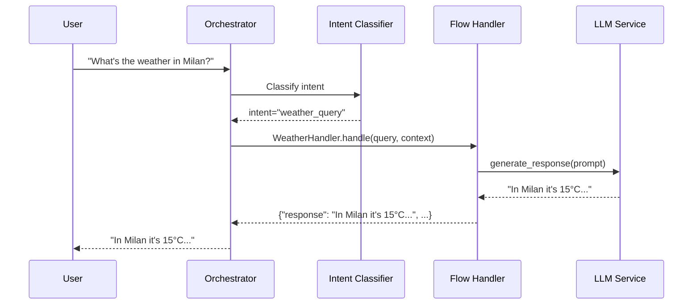

<!-- markdownlint-disable-file MD046 MD025 -->

<!-- markdownlint-disable MD046 -->

**Flow Handlers** are the heart of the system's response logic. When the orchestrator identifies an intent (e.g., "document search", "weather query", "assistance"), it invokes the corresponding Flow Handler to generate the response.

!!! info "Why Flow Handlers?"
    Flow Handlers enable plugins to:

    - Provide **customized** responses for specific intents
    - Maintain separated and testable logic
    - Integrate easily with external services
    - Inherit the orchestrator's memory, budget, checkpoint and guardrail pipeline without writing any of it

---

## Architecture

The flow of a request through Flow Handlers:


```mermaid
sequenceDiagram
    participant U as User
    participant O as Orchestrator
    participant C as Intent Classifier
    participant H as Flow Handler
    participant L as LLM Service

    U->>O: "What's the weather in Milan?"
    O->>C: Classify intent
    C-->>O: intent="weather_query"
    O->>H: WeatherHandler.handle(query, context)
    H->>L: generate_response(prompt)
    L-->>H: "In Milan it's 15°C..."
    H-->>O: {"response": "In Milan it's 15°C...", ...}
    O-->>U: "In Milan it's 15°C..."
```

---

## FlowHandler vs StreamHandler

Two protocols are defined in `core/orchestration/protocols.py`:

| Protocol | Method | Registered by | Use case |
|----------|--------|---------------|----------|
| `FlowHandler` | `async handle(query, context)` → `dict[str, Any]` | Plugins, via `get_flow_handlers()`; host code, via `Orchestrator.register_handler()` | Every intent: one structured result |
| `StreamHandler` | `handle(query, context)` → `AsyncGenerator[str, None]` | Host code only, via `Orchestrator.register_handler(intent, handler, stream_handler=...)` | Token-by-token output for an intent |

!!! warning "Plugins register `FlowHandler`s only"
    `PluginRegistry` registers every value returned by `get_flow_handlers()` as a
    **non-streaming** handler (`core/plugins/registration.py`). The orchestrator copies
    those into its flow-handler table and never populates its stream-handler table for
    plugin intents (`core/orchestration/mixins/handlers.py`). When a client calls
    `process_stream()` for a plugin intent, the orchestrator runs the full `process()`
    pipeline and yields the complete response as a **single chunk**
    (`core/orchestration/mixins/execution.py`).

    Stream handlers exist for the built-in `qa_docs` intent (`StandardRagStreamHandler`)
    and for anything host code wires explicitly with
    `orchestrator.register_handler(intent, handler, stream_handler=...)` — the seam
    `core/chat/rag_workflow.py` and `core/workflows/flow_handler.py` use. See
    [Orchestration › Streaming](../core-modules/orchestration.md).

### What a handler must return

After the call the orchestrator sets `result["intent"]` and `result["budget"]`, then reads
`result.get("response", "")`. A handler therefore **must** return a `dict` with at least a
`response` string; anything else raises inside the orchestrator and is turned into an error
response.

---

## Implementation

### Getting services

Handlers obtain the LLM the same way the built-in RAG handler does
(`core/orchestration/handlers/rag.py`): `core.services.llm.get_llm_service()` returns the
shared `LLMService` for the current context (it honours per-plugin LLM policies). The
service implements `LLMServiceProtocol` (`core/interfaces/services.py`), which exposes
exactly two calls:

```python
from core.services.llm import get_llm_service

llm = get_llm_service()

text = await llm.generate_response(prompt, model=None, json=False)

async for chunk in llm.generate_response_stream(prompt, model=None):
    ...
```

Anything the plugin owns — API clients, configuration — is passed into the handler's
constructor from `get_flow_handlers()`, the pattern `plugins/reasoning_agent/plugin.py`
follows. Resolve the LLM lazily: `get_flow_handlers()` runs while the plugin is being
registered, before the request that will need the model.

### Flow Handler

```python
from typing import Any

from core.orchestration.protocols import FlowHandler
from core.services.llm import get_llm_service


class WeatherHandler(FlowHandler):
    """
    Handler for weather requests.

    Responds to intents like "what's the weather", "weather forecast", etc.
    """

    def __init__(self, weather_api: Any) -> None:
        """
        Initialize the handler.

        Args:
            weather_api: Plugin-owned client, injected by ``get_flow_handlers()``.
        """
        self.weather_api = weather_api
        self._llm: Any = None

    @property
    def llm(self) -> Any:
        """Lazy-load the shared LLM service."""
        if self._llm is None:
            self._llm = get_llm_service()
        return self._llm

    async def handle(self, query: str, context: dict[str, Any]) -> dict[str, Any]:
        """
        Process the request and return a structured result.

        Args:
            query: User query text
            context: Dictionary with session_id, messages, tenant_id, metadata

        Returns:
            Structured result dict with at least ``response``
        """
        # 1. Extract parameters from query
        city = await self._extract_city(query)

        # 2. Call external API
        weather_data = await self.weather_api.get_current(city)

        # 3. Format response with LLM (optional)
        prompt = (
            f"Weather data for {city}: {weather_data}\n"
            "Generate a natural and friendly response."
        )
        response = await self.llm.generate_response(prompt)

        return {"response": response, "city": city, "data": weather_data}

    async def _extract_city(self, query: str) -> str:
        """Extract city from query using NLP."""
        # City extraction implementation...
        return "Milan"  # Fallback
```

`core.orchestration.handlers.BaseFlowHandler` is an alternative base: an ABC with
`agents`/`services` dictionaries and `get_agent()`/`get_service()` helpers, used by the
built-in handlers.

### Long generations

A plugin handler can still consume the LLM's streaming call internally — it just has to
return the aggregated text, because the orchestrator delivers plugin results whole:

```python
from typing import Any

from core.orchestration.protocols import FlowHandler
from core.services.llm import get_llm_service


class StoryHandler(FlowHandler):
    """Long-form generation: streams from the LLM, returns the full text."""

    async def handle(self, query: str, context: dict[str, Any]) -> dict[str, Any]:
        llm = get_llm_service()
        chunks: list[str] = []
        async for chunk in llm.generate_response_stream(
            f"You are a creative storyteller.\n\n{query}"
        ):
            chunks.append(chunk)
        return {"response": "".join(chunks)}
```

### Stream Handler (host-wired)

A `StreamHandler` is an async generator that yields `str` chunks. Only host code that owns
the `Orchestrator` instance can attach one to an intent:

```python
from collections.abc import AsyncGenerator
from typing import Any

from core.orchestration.protocols import StreamHandler
from core.services.llm import get_llm_service


class StoryStreamHandler(StreamHandler):
    """Streaming twin of StoryHandler."""

    async def handle(
        self, query: str, context: dict[str, Any]
    ) -> AsyncGenerator[str, None]:
        llm = get_llm_service()
        async for chunk in llm.generate_response_stream(
            f"You are a creative storyteller.\n\n{query}"
        ):
            yield chunk


# Host code, with an Orchestrator instance in hand:
orchestrator.register_handler(
    "story_generation", StoryHandler(), stream_handler=StoryStreamHandler()
)
```

With both registered, `process()` uses `StoryHandler` and `process_stream()` streams from
`StoryStreamHandler` through the streaming output guard.

---

## Registration

Flow Handlers are registered by the plugin. `get_flow_handlers()` returns a plain mapping
of **intent name → handler**; there is no per-intent sync/stream structure:

```python
from typing import Any

from core.plugins import AgentPlugin


class MyPlugin(AgentPlugin):
    """Plugin with custom handlers."""

    def create_agent(self, service: Any, **kwargs: Any) -> Any:
        """AgentPlugin's only abstract method; return an agent or ``None``."""
        return None

    def get_flow_handlers(self) -> dict[str, Any]:
        """
        Return mapping of intent -> handler.

        Returns:
            Dict whose values are handler instances (anything with an async
            ``handle(query, context)``) or bare coroutine functions taking
            ``(query, context)``.
        """
        weather_api = WeatherAPIClient(config_provider=self.get_config)
        return {
            "weather_query": WeatherHandler(weather_api),
            "story_generation": StoryHandler(),
        }

    def get_intent_patterns(self) -> list[dict[str, Any]]:
        """
        Define patterns for intent matching.

        Returns:
            List of dicts with name, patterns, description and priority
        """
        return [
            {
                "name": "weather_query",
                "patterns": ["weather", "forecast", "temperature", "raining"],
                "description": "Current weather and forecasts for a city.",
                "priority": 100,  # Higher = checked first
            },
            {
                "name": "story_generation",
                "patterns": ["tell", "story", "tale", "narrative"],
                "description": "Creative storytelling on request.",
                "priority": 80,
            },
        ]
```

How the registry treats each entry (`core/plugins/registration.py`):

- Every value is wrapped in a lazy proxy. On first use the proxy activates the owning
  plugin if needed, then calls `getattr(handler, "handle", handler)(query, context)` and
  awaits the result when it is awaitable — so a value may be an object with an async
  `handle()` **or** a coroutine function with the `(query, context)` signature.
- Registering an intent that already has a handler logs a warning and overwrites it.
- Handlers are matched to intents by **name**: the key in `get_flow_handlers()` must equal
  the `"name"` of an intent pattern (or an intent the classifier already knows).
- Pass configuration as a callable (`self.get_config`) rather than reading it while
  building handlers: `get_config()` returns values from the `initialize(config)` call.

Intent pattern keys (`core/orchestration/intent_classifier.py`):

| Key | Type | Meaning |
|-----|------|---------|
| `name` | `str` | Intent identifier — **required**; entries without it are ignored |
| `patterns` | `list[str]` | Keywords matched case-insensitively as substrings of the query |
| `priority` | `int` | Keyword-match precedence; intents are tried highest-first (default `0`) |
| `description` | `str` | Semantic description passed to the LLM when keyword matching does not decide |

### Priority System

| Priority Range | Use Case |
|----------------|----------|
| **200+** | Reserved for system-critical intents |
| **100-199** | High-priority domain-specific intents |
| **50-99** | Standard intents |
| **1-49** | Low-priority or fallback intents |
| **0** | Default/catch-all intent |

---

## Context

The `context` passed to handlers contains useful session information:

```python
async def handle(self, query: str, context: dict) -> dict:
    # Session ID for conversational continuity
    session_id = context.get("session_id")

    # Message history (last N messages)
    messages = context.get("messages", [])
    # Format: [{"role": "user", "content": "..."}, {"role": "assistant", "content": "..."}]

    # Tenant for multi-tenancy
    tenant_id = context.get("tenant_id")

    # Custom metadata from client
    metadata = context.get("metadata", {})
    user_preferences = metadata.get("preferences", {})

    # Request ID for tracing
    request_id = context.get("request_id")

    # The intent the orchestrator resolved for this call
    intent = context.get("intent")
```

### Context Fields Reference

| Field | Type | Description |
|-------|------|-------------|
| `session_id` | `str` | Unique session identifier |
| `messages` | `list[dict]` | Conversation history |
| `tenant_id` | `str` | Tenant ID (multi-tenancy) |
| `metadata` | `dict` | Custom client metadata |
| `request_id` | `str` | Distributed tracing ID |
| `user_id` | `str` | Authenticated user ID (if auth enabled) |
| `intent` | `str` | Resolved intent name, set by the orchestrator before dispatch |

---

## Error Handling

Handle errors gracefully to avoid crashes and provide useful feedback:

```python
from typing import Any

from core.observability import get_logger
from core.orchestration.protocols import FlowHandler
from core.resilience import CircuitBreakerError

logger = get_logger(__name__)


class RobustHandler(FlowHandler):
    async def handle(self, query: str, context: dict[str, Any]) -> dict[str, Any]:
        try:
            result = await self._process(query, context)
            return {"response": result}

        except CircuitBreakerError as e:
            # External dependency is down and its circuit breaker is open
            logger.warning(
                "External service unavailable",
                error=str(e),
                request_id=context.get("request_id"),
            )
            return {"response": "Sorry, the service is temporarily unavailable. Please try again later.", "error": True}

        except ValueError as e:
            # Invalid input
            logger.info(
                "Invalid input",
                error=str(e),
                query=query[:100],  # Truncate for logs
            )
            return {"response": "I didn't understand the request. Could you rephrase it?", "error": True}

        except Exception as e:
            # Unexpected error
            logger.error(
                "Handler failed unexpectedly",
                error=str(e),
                exc_info=True,
                request_id=context.get("request_id"),
            )
            # Don't expose internal details to user
            return {"response": "An internal error occurred. The team has been notified.", "error": True}
```

Framework exception types live in `core/exceptions.py` (`BaselithError`, `PluginError`,
`PluginConfigError`, ...). An unhandled exception escaping `handle()` is caught by the
orchestrator and returned as `{"response": "Error processing request: ...", "error": True}`.

### Error Handling Best Practices

!!! warning "Never Expose Internal Errors"
    Always catch exceptions and return user-friendly messages. Never expose stack traces, database errors, or API keys in error messages.

!!! tip "Structured Logging"
    Use structured logging with context (request_id, tenant_id) for easier debugging in production.

!!! tip "Metric Tracking"
    `core.observability.metrics` is a module of `prometheus_client` objects — there is no
    `increment()` helper. Record handler latency on the plugin histogram the framework
    already exports:

    ```python
    import time

    from core.observability.metrics import PLUGIN_CALL_LATENCY_SECONDS

    start = time.perf_counter()
    try:
        result = await self._process(query, context)
    finally:
        PLUGIN_CALL_LATENCY_SECONDS.labels(
            plugin_name="weather", operation="handle"
        ).observe(time.perf_counter() - start)
    ```

    A plugin may also declare its own `prometheus_client.Counter`; `/metrics` renders the
    default `prometheus_client.REGISTRY`, so it is exported without extra wiring.

---

## Testing

Test your handlers in isolation:

```python
from unittest.mock import AsyncMock

import pytest


@pytest.mark.asyncio
async def test_weather_handler():
    # Setup mock dependencies
    mock_weather_api = AsyncMock()
    mock_weather_api.get_current.return_value = {"temp": 15, "condition": "sunny"}

    handler = WeatherHandler(mock_weather_api)
    handler._llm = AsyncMock()
    handler._llm.generate_response.return_value = "In Milan it's 15°C with clear skies."

    # Test
    context = {"session_id": "test-123", "tenant_id": "tenant-abc"}
    result = await handler.handle("What's the weather in Milan?", context)

    # Assertions — handle() returns a dict
    assert "Milan" in result["response"] or "15" in result["response"]
    mock_weather_api.get_current.assert_awaited_once_with("Milan")


@pytest.mark.asyncio
async def test_story_handler_aggregates_stream(monkeypatch):
    async def fake_stream(prompt, model=None):
        for chunk in ["Once ", "upon ", "a time..."]:
            yield chunk

    llm = AsyncMock()
    llm.generate_response_stream = fake_stream
    # Patch the name where the handler module imported it
    monkeypatch.setattr("my_plugin.handlers.get_llm_service", lambda: llm)

    result = await StoryHandler().handle("Tell me a story", {})

    assert result["response"] == "Once upon a time..."
```

### Test Coverage Guidelines

- **Unit tests**: Test handler logic in isolation with mocked dependencies
- **Integration tests**: Test handlers with real LLM/database (slower, run less frequently)
- **Error scenarios**: Test all exception paths
- **Context variations**: Test with different context configurations

---

## Debugging

### Detailed Logging

```python
import time

from core.observability import get_logger

logger = get_logger("my-handler")

async def handle(self, query: str, context: dict) -> dict:
    logger.debug(
        "Handler invoked",
        query=query[:100],
        session_id=context.get("session_id"),
        tenant_id=context.get("tenant_id")
    )

    start = time.time()
    result = await self._process(query, context)
    duration = time.time() - start

    logger.info(
        "Handler completed",
        duration_ms=duration * 1000,
        response_length=len(result)
    )

    return {"response": result}
```

### Distributed Tracing

```python
from core.observability import get_tracer

tracer = get_tracer("my-handler")

async def handle(self, query: str, context: dict) -> dict:
    with tracer.start_span("handler.process") as span:
        span.set_attribute("intent", "weather_query")
        span.set_attribute("query_length", len(query))

        result = await self._process(query, context)

        span.set_attribute("response_length", len(result))
        return {"response": result}
```

---

## Best Practices

!!! tip "Initialization"
    Build plugin-owned clients once, in `get_flow_handlers()`, and inject them. Resolve framework services such as the LLM lazily on first use, not in `handle()` on every call.

!!! tip "Long generations"
    Plugin results are delivered whole even on `process_stream()`. Keep prompts and `max_tokens` bounded so the single chunk arrives in reasonable time; if an intent truly needs token streaming, wire a `StreamHandler` from host code.

!!! tip "Error Handling"
    Catch exceptions and return user-friendly messages. Don't expose stack traces or internal details.

!!! warning "Timeouts"
    Set timeouts for external calls. A blocked handler blocks the request.
    ```python
    async with asyncio.timeout(30):
        result = await external_api.call()
    ```

!!! tip "Stateless Design"
    Keep handlers stateless. State must be in Redis/DB, not in instance variables.

!!! tip "Async All the Way"
    Use async/await for all I/O operations. Never use blocking calls in handlers.

---

## Advanced Patterns

### Caching Results

`core.cache.TTLCache` is an in-memory LRU cache with per-entry TTL and an async API
(`RedisTTLCache` offers the same interface over Redis):

```python
from typing import Any

from core.cache import TTLCache
from core.orchestration.protocols import FlowHandler


class CachedHandler(FlowHandler):
    def __init__(self) -> None:
        self._cache: TTLCache[str, dict[str, Any]] = TTLCache(maxsize=256, ttl=300)

    async def handle(self, query: str, context: dict[str, Any]) -> dict[str, Any]:
        cached = await self._cache.get(query)
        if cached is not None:
            return dict(cached)  # copy: the orchestrator mutates the result

        result = {"response": await self.expensive_api_call(query)}
        await self._cache.set(query, result)
        return result
```

### Rate Limiting

`core.resilience.RateLimiter` is a sliding-window limiter keyed by any string
(in-memory by default, `RedisRateLimiter` backend for multi-worker deployments):

```python
from typing import Any

from core.orchestration.protocols import FlowHandler
from core.resilience import RateLimiter


class RateLimitedHandler(FlowHandler):
    def __init__(self) -> None:
        self._limiter = RateLimiter(limit=10, window=60)  # 10 calls per minute per key

    async def handle(self, query: str, context: dict[str, Any]) -> dict[str, Any]:
        key = context.get("user_id") or context.get("session_id") or "anonymous"
        verdict = self._limiter.check(key)
        if not verdict.allowed:
            wait = int(verdict.retry_after or 0)
            return {"response": f"Too many requests. Try again in {wait}s.", "error": True}
        return {"response": await self._process(query)}
```

### Circuit Breaker and Retries

```python
from typing import Any

from core.orchestration.protocols import FlowHandler
from core.resilience import CircuitBreakerConfig, get_circuit_breaker, retry

# Named breakers are shared process-wide; the same name returns the same instance.
weather_breaker = get_circuit_breaker(
    "weather-api", CircuitBreakerConfig(fail_max=5, reset_timeout=60)
)


class ResilientHandler(FlowHandler):
    def __init__(self, external_api: Any) -> None:
        self.external_api = external_api

    async def handle(self, query: str, context: dict[str, Any]) -> dict[str, Any]:
        return {"response": await self._call_external_api(query)}

    @weather_breaker  # If this fails 5 times, the circuit opens for 60 seconds
    @retry(max_attempts=3, base_delay=1.0)
    async def _call_external_api(self, query: str) -> Any:
        return await self.external_api.query(query)
```

While the circuit is open the call raises `CircuitBreakerError` — catch it in `handle()`
as shown under [Error Handling](#error-handling).

---

## Next Steps

- **Create Plugin**: See [Creating Plugins](creating-plugins.md)
- **Orchestrator internals**: [Orchestration](../core-modules/orchestration.md) and [Agentic Patterns](../architecture/agentic-patterns.md)
- **Frontend Integration**: Learn about [Frontend Integration](frontend-integration.md)
- **Deployment**: Read the [Deployment Guide](../advanced/deployment.md)
