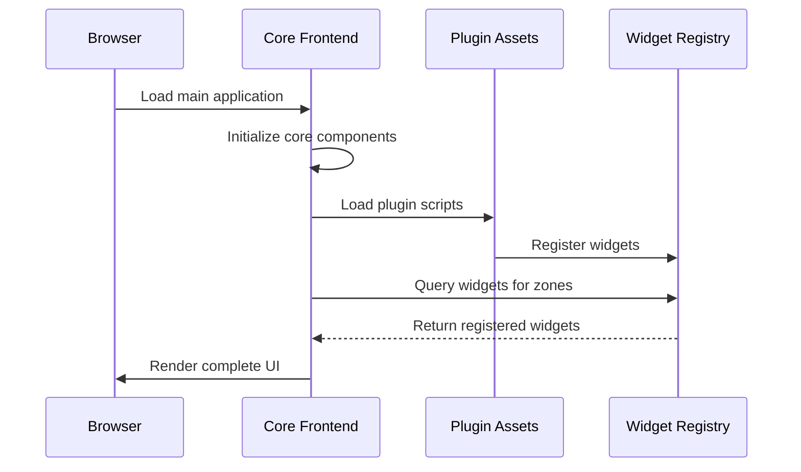
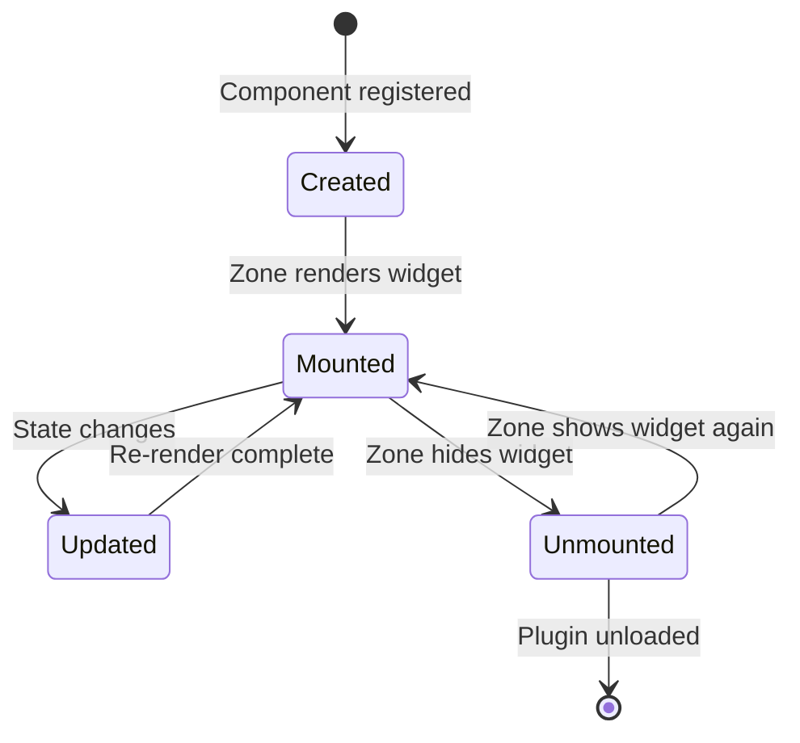

The **Frontend Integration** system allows plugins to extend the user interface **without recompiling** the main frontend. This enables installable plugins that bring their own UI components.

!!! info "Why Dynamic Integration?"
    - **Independent Plugins**: Plugins can include UI without modifying the core
    - **Hot-pluggable**: Add/remove plugins without rebuild
    - **Isolation**: Plugin CSS and JS are separated
    - **Customization**: Each deployment can have different UIs

---

## Architettura

Il sistema usa un **registry pattern** dove i plugin registrano i loro componenti al bootstrap:



**Key Components:**

| Component | Responsibility |
|-----------|----------------|
| **Widget Registry** | Global catalog of all registered widgets |
| **Zone System** | Predefined areas where widgets can be inserted |
| **Asset Loader** | Dynamically loads plugin JS/CSS |

---

## Static Assets

Each plugin can include static files (JavaScript, CSS, images) that are served automatically.

### Plugin Declaration

```python
from pathlib import Path

class MyPlugin(Plugin):
    """Plugin with custom UI."""
    
    def get_static_assets_path(self) -> Path:
        """
        Static assets directory.
        
        Returns:
            Path to plugin's static/ folder
        """
        return Path(__file__).parent / "static"
    
    def get_stylesheets(self) -> list:
        """
        List of CSS files to inject into page.
        
        Returns:
            List of CSS filenames (relative to static/)
        """
        return ["styles.css"]
    
    def get_scripts(self) -> list:
        """
        List of JavaScript files to inject.
        
        Returns:
            List of JS filenames (relative to static/)
        """
        return ["components.js"]
```

### Directory Structure

```text
plugins/my-plugin/
├── plugin.py              # Entry point Python
├── static/
│   ├── components.js      # Widget registration e logica
│   ├── styles.css         # Stili custom
│   └── assets/
│       ├── icon.svg       # Icone
│       └── logo.png       # Immagini
└── templates/             # Template HTML (opzionale)
    └── widget.html
```

### Asset URLs

Assets are automatically served at:

```text
/static/plugins/{plugin-name}/{filename}
```

Esempio: `/static/plugins/my-plugin/components.js`

---

## Widget Registration

Widgets are UI components that plugins register to appear in various interface zones.

### Basic Registration

```javascript title="plugins/my-plugin/static/components.js"
// Aspetta che il registry sia disponibile
document.addEventListener('DOMContentLoaded', function() {
    
    // Verifica che il registry esista
    if (!window.PluginWidgetRegistry) {
        console.error('PluginWidgetRegistry not available');
        return;
    }
    
    // Definisci il componente
    const MyAnalysisWidget = {
        // Template HTML del widget
        template: `
            <div class="my-plugin-analysis">
                <h3>Advanced Analysis</h3>
                <div class="content" id="analysis-content">
                    <p>Loading...</p>
                </div>
                <button class="refresh-btn" onclick="this.loadData()">
                    Refresh
                </button>
            </div>
        `,
        
        // Lifecycle: called when widget is mounted
        mounted() {
            console.log('MyAnalysisWidget mounted');
            this.loadData();
        },
        
        // Lifecycle: called when widget is unmounted
        unmounted() {
            console.log('MyAnalysisWidget unmounted');
            // Cleanup: clear timers, listeners, etc.
        },
        
        // Custom methods
        methods: {
            async loadData() {
                const contentEl = document.getElementById('analysis-content');
                
                try {
                    // Call plugin API
                    const response = await fetch('/api/my-plugin/analysis');
                    const data = await response.json();
                    
                    contentEl.innerHTML = this.renderData(data);
                } catch (error) {
                    contentEl.innerHTML = `
                        <p class="error">Error loading data</p>
                    `;
                }
            },
            
            renderData(data) {
                return `
                    <p>Results: ${data.count}</p>
                    <ul>
                        ${data.items.map(i => `<li>${i.name}</li>`).join('')}
                    </ul>
                `;
            }
        }
    };
    
    // Register in global registry
    window.PluginWidgetRegistry.register(
        'chat-tab',           // Zone where to insert widget
        'AnalysisTab',        // Unique widget name
        {
            label: 'Analysis',          // Displayed label (e.g., in tab)
            icon: 'chart-bar',          // Icon (FontAwesome or custom)
            component: MyAnalysisWidget,
            order: 10                   // Order in zone (lower = first)
        }
    );
});
```

### Widget with Reactive State

For more complex UIs, use state management:

```javascript
const StatefulWidget = {
    // Initial state
    data() {
        return {
            items: [],
            loading: false,
            error: null
        };
    },
    
    template: `
        <div class="stateful-widget">
            <div v-if="loading">Loading...</div>
            <div v-else-if="error">Error: {{ error }}</div>
            <ul v-else>
                <li v-for="item in items" :key="item.id">
                    {{ item.name }}
                </li>
            </ul>
        </div>
    `,
    
    mounted() {
        this.fetchItems();
    },
    
    methods: {
        async fetchItems() {
            this.loading = true;
            try {
                const res = await fetch('/api/my-plugin/items');
                this.items = await res.json();
            } catch (e) {
                this.error = e.message;
            } finally {
                this.loading = false;
            }
        }
    }
};
```

---

## Extension Zones

Zones are predefined interface areas where widgets can be inserted:

| Zone | Position | Typical Use |
|------|----------|-------------|
| `chat-tab` | Main chat tabs | Plugin panels accessible via tabs |
| `sidebar` | Side panel | Always-visible tools |
| `header` | Top bar | Notifications, status, quick actions |
| `footer` | Bottom bar | System info, links |
| `settings-panel` | Settings page | Plugin configuration |
| `modal` | Modal overlay | Dialogs, wizards, complex forms |

### Multi-Zone Example

```javascript
// Register same plugin in multiple zones
PluginWidgetRegistry.register('sidebar', 'QuickActions', {
    label: 'Quick Actions',
    icon: 'lightning-bolt',
    component: QuickActionsWidget
});

PluginWidgetRegistry.register('chat-tab', 'DetailedView', {
    label: 'Detailed View',
    icon: 'table',
    component: DetailedViewWidget
});
```

---

## Backend Communication

Widgets communicate with the backend via plugin REST APIs.

### Standard Pattern

```javascript
// Configurazione base
const API_BASE = '/api/my-plugin';

async function apiCall(endpoint, options = {}) {
    const response = await fetch(`${API_BASE}${endpoint}`, {
        ...options,
        headers: {
            'Content-Type': 'application/json',
            ...options.headers
        }
    });
    
    if (!response.ok) {
        throw new Error(`API Error: ${response.status}`);
    }
    
    return response.json();
}

// Uso nel widget
methods: {
    async fetchData() {
        this.data = await apiCall('/data');
    },
    
    async saveItem(item) {
        await apiCall('/items', {
            method: 'POST',
            body: JSON.stringify(item)
        });
    }
}
```

### WebSocket for Real-time

```javascript
// For real-time updates
const socket = new WebSocket('ws://localhost:8000/ws/my-plugin');

socket.onmessage = (event) => {
    const data = JSON.parse(event.data);
    this.handleUpdate(data);
};

socket.onclose = () => {
    // Automatic reconnection
    setTimeout(() => this.connectWebSocket(), 5000);
};
```

---

## CSS Styles

### Isolation with Prefixes

Always use prefixes to avoid conflicts with other plugins:

```css title="plugins/my-plugin/static/styles.css"
/* Plugin prefix to avoid conflicts */
.my-plugin-analysis {
    padding: 1rem;
    border-radius: 8px;
    background: var(--surface-color, #ffffff);
}

.my-plugin-analysis h3 {
    color: var(--primary-color, #2563eb);
    margin-bottom: 1rem;
    font-size: 1.25rem;
}

.my-plugin-analysis .content {
    min-height: 100px;
}

.my-plugin-analysis .refresh-btn {
    padding: 0.5rem 1rem;
    background: var(--primary-color, #2563eb);
    color: white;
    border: none;
    border-radius: 4px;
    cursor: pointer;
}

.my-plugin-analysis .refresh-btn:hover {
    opacity: 0.9;
}

.my-plugin-analysis .error {
    color: var(--error-color, #dc2626);
}
```

### Using CSS Variables

Leverage theme CSS variables for consistency:

```css
.my-plugin-card {
    /* Colors from theme */
    background: var(--card-background);
    color: var(--text-primary);
    border: 1px solid var(--border-color);
    
    /* Spacing from theme */
    padding: var(--spacing-md);
    margin: var(--spacing-sm);
    
    /* Border radius from theme */
    border-radius: var(--radius-md);
}
```

### Responsive Design

```css
/* Mobile first */
.my-plugin-grid {
    display: grid;
    grid-template-columns: 1fr;
    gap: 1rem;
}

/* Tablet */
@media (min-width: 768px) {
    .my-plugin-grid {
        grid-template-columns: repeat(2, 1fr);
    }
}

/* Desktop */
@media (min-width: 1024px) {
    .my-plugin-grid {
        grid-template-columns: repeat(3, 1fr);
    }
}
```

---

## Widget Lifecycle

Widgets have a lifecycle managed by the framework:



**Available Hooks:**

- `created()`: Widget instantiated
- `mounted()`: Widget inserted into DOM
- `updated()`: Widget re-rendered
- `unmounted()`: Widget removed from DOM

---

## Best Practices

!!! tip "CSS Isolation"
    Always use classes with plugin prefix (e.g., `.my-plugin-*`) to avoid conflicts.

!!! tip "Performance"
    Load data on-demand, not at initialization. Use lazy loading for heavy components.

!!! tip "Responsive"
    Test on different sizes. Use CSS Grid/Flexbox and media queries.

!!! warning "Cleanup"
    Always implement `unmounted()` to clear timers, listeners, and WebSockets.

!!! tip "Accessibility"
    Use ARIA attributes, WCAG color contrast, and support keyboard navigation.

```javascript
// Cleanup example
unmounted() {
    if (this.refreshTimer) {
        clearInterval(this.refreshTimer);
    }
    if (this.socket) {
        this.socket.close();
    }
}
```
