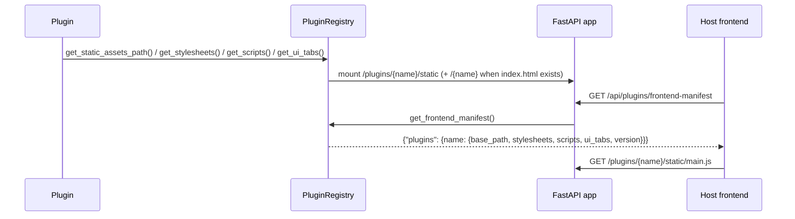

<!-- docs-consistency: skip routes -->

The **Frontend Integration** surface lets a plugin ship its own static assets — JavaScript, CSS, images, or a compiled single-page app — and describe them to whatever frontend the operator runs, **without touching `core/`**. The framework serves the files and publishes a machine-readable manifest; rendering is the host frontend's job.

!!! info "What the framework does — and does not — do"
    - **Serves** each plugin's static directory at `/plugins/{name}/static` and, when that directory contains an `index.html`, the whole directory as an SPA at `/{name}`.
    - **Aggregates** `get_stylesheets()`, `get_scripts()` and `get_ui_tabs()` into `GET /api/plugins/frontend-manifest`.
    - **Does not** inject scripts into a page, register widgets, or render tabs. No widget registry, zone system or asset loader ships with the framework; a host frontend that wants plugin UI reads the manifest and decides what to do with it.

---

## Architecture


```mermaid
sequenceDiagram
    participant P as Plugin
    participant R as PluginRegistry
    participant A as FastAPI app
    participant F as Host frontend

    P->>R: get_static_assets_path() / get_stylesheets() / get_scripts() / get_ui_tabs()
    R->>A: mount /plugins/{name}/static (+ /{name} when index.html exists)
    F->>A: GET /api/plugins/frontend-manifest
    A->>R: get_frontend_manifest()
    R-->>F: {"plugins": {name: {base_path, stylesheets, scripts, ui_tabs, version}}}
    F->>A: GET /plugins/{name}/static/main.js
```

**Key Components:**

| Component | Where | Responsibility |
|-----------|-------|----------------|
| **Static mount** | `core/api/_plugin_runtime.py` | Mounts the static directory at `/plugins/{name}/static`; adds an SPA mount at `/{name}` |
| **Frontend manifest** | `core/plugins/lookup.py`, served by `core/api/factory.py` | Lists every plugin's assets and UI tabs at `GET /api/plugins/frontend-manifest` |
| **Resource analyzer** | `core/plugins/resource_analyzer.py` | Reads the same hooks statically for plugins that are discovered but not yet activated |

---

## Static Assets

Each plugin can include static files (JavaScript, CSS, images) that are served automatically.

### Plugin Declaration

```python title="plugin.py"
from pathlib import Path

from core.plugins import Plugin


class MyPlugin(Plugin):
    """Plugin with custom UI."""

    def get_static_assets_path(self) -> Path | None:
        """
        Static assets directory.

        Returns:
            Path to plugin's static/ folder, served at /plugins/my-plugin/static
        """
        return Path(__file__).parent / "static"

    def get_stylesheets(self) -> list[str]:
        """
        CSS files the host frontend should load.

        Returns:
            List of CSS paths (relative to static/)
        """
        return ["styles.css"]

    def get_scripts(self) -> list[str]:
        """
        JavaScript files the host frontend should load.

        Returns:
            List of JS paths (relative to static/)
        """
        return ["main.js"]
```

!!! note "Keep the return values literal"
    Plugins are discovered before they are activated. For a plugin that is not active yet,
    the registry reads `get_stylesheets()`, `get_scripts()` and `get_ui_tabs()`
    **statically** from the source (`core/plugins/resource_analyzer.py`), so only literal
    list returns are picked up. The static directory of a discovered plugin is `static/`
    next to `plugin.py`; once the plugin is active, `get_static_assets_path()` is used.
    Return `Path(__file__).parent / "static"` so the two agree.

### Directory Structure

```text
my-plugin/
├── plugin.py              # Entry point
├── manifest.yaml          # Plugin metadata
└── static/
    ├── main.js            # Plugin script(s)
    ├── styles.css         # Custom styles
    ├── index.html         # Optional — turns /my-plugin into an SPA mount
    └── assets/
        ├── icon.svg       # Icons
        └── logo.png       # Images
```

### Asset URLs

Assets are served at:

```text
/plugins/{plugin_name}/static/{path}
```

Example: `/plugins/my-plugin/static/main.js`

Mounts are created at startup for every discovered plugin with a static directory and on
activation for plugins enabled later through hot reload. The manifest `name` is used
verbatim in the URL and must match `^[a-z0-9][a-z0-9._-]{0,63}$`; otherwise the mount is
refused and logged as an error.

### SPA mount

If the static directory contains an `index.html`, the same directory is also mounted at
`/{plugin_name}` through `SPAStaticFiles` (`core/api/spa.py`). A deep link whose last
segment has no file extension (`/my-plugin/settings`) is served `index.html` so a
client-side router can take over; a missing real asset (`/my-plugin/assets/app.js`) still
returns 404. `index.html` is served with `Cache-Control: no-cache` so a redeploy never
leaves browsers pointing at deleted hashed bundles.

!!! warning "Served assets are part of the integrity hash"
    `*.js`, `*.css`, `*.html`, `*.svg` and the other served asset types under `static/`
    and `ui/dist/` are hashed by `baselith plugin sign`. Re-sign after changing them —
    see [Packaging › Signing](packaging.md#integrity).

---

## UI Tabs

Plugins can declare navigation entries for a host dashboard by implementing
`get_ui_tabs()`:

```python title="plugin.py"
from core.plugins import Plugin


class MyPlugin(Plugin):
    """Plugin with a dashboard section."""

    def get_ui_tabs(self) -> list[dict[str, str]]:
        """
        Navigation entries.

        Returns:
            List of dicts with 'id' and 'label'
        """
        return [
            {
                "id": "my-plugin-analysis",
                "label": "Deep Analysis"
            }
        ]
```

Tabs are stored per plugin (`core/plugins/registration.py`) and surfaced in the frontend
manifest as `ui_tabs`. The framework does not render them: `id` is an opaque key the host
frontend maps to a route or panel, and `label` is the text it shows.

---

## The Frontend Manifest

`GET /api/plugins/frontend-manifest` returns every plugin that has an existing static
directory **or** at least one UI tab. The route is guarded by `require_user`, so send the
same credentials you use for any other user route. Plugins that are discovered but not
yet activated are listed too.

```json
{
  "plugins": {
    "my-plugin": {
      "base_path": "/plugins/my-plugin/static",
      "stylesheets": ["styles.css"],
      "scripts": ["main.js"],
      "ui_tabs": [{"id": "my-plugin-analysis", "label": "Deep Analysis"}],
      "version": "1.0.0"
    }
  }
}
```

`base_path` is `null` for a plugin that declares tabs but ships no static directory.

### Consuming it from a host frontend

Nothing under `core/static/` reads this manifest. The loader below is the kind of code a
host frontend has to provide:

```javascript title="host-frontend/plugin-loader.js"
async function loadPluginAssets() {
  // Send whatever credential your deployment uses (cookie, bearer token, ...)
  const res = await fetch('/api/plugins/frontend-manifest');
  if (!res.ok) {
    throw new Error(`frontend-manifest: HTTP ${res.status}`);
  }
  const { plugins } = await res.json();

  for (const [name, entry] of Object.entries(plugins)) {
    if (entry.base_path) {
      for (const css of entry.stylesheets) {
        const link = document.createElement('link');
        link.rel = 'stylesheet';
        link.href = `${entry.base_path}/${css}?v=${entry.version}`;
        document.head.appendChild(link);
      }
      for (const js of entry.scripts) {
        const script = document.createElement('script');
        script.src = `${entry.base_path}/${js}?v=${entry.version}`;
        script.defer = true;
        document.body.appendChild(script);
      }
    }
    // entry.ui_tabs -> add to your navigation, keyed by tab.id
    console.debug(`plugin ${name}: ${entry.ui_tabs.length} tab(s)`);
  }
}
```

---

## Shipping a Built Dashboard

`plugins/baselithbot` is the reference for a full React dashboard:

- Sources live under `plugins/baselithbot/ui/` (Vite + React). `npm run build` produces
  `ui/dist/`. Only `ui/dist/**` ships — `ui/src/` and `ui/node_modules/` are excluded
  from the wheel and from `baselith plugin marketplace publish` archives.
- The plugin serves the bundle from its **own router** (`plugins/baselithbot/api/router.py`):
  `GET /ui`, `/ui/` and `/ui/{path}` return files from `ui/dist`, falling back to
  `index.html` for client-side routes and adding the plugin's security headers.
- It overrides `get_router_prefix()` to `/baselithbot` (instead of the default
  `/api/baselithbot`), so the dashboard is reachable at `/baselithbot/ui/`.
- `ui/dist/**` is part of the integrity hash; re-sign after every build.

Both routes work: a `static/` directory with `index.html` uses the framework's SPA mount
with no code, while a plugin-owned router lets the plugin apply its own authentication
and headers to the bundle.

---

## Backend Communication

Plugin routers are mounted at `get_router_prefix()` — `/api/{plugin_name}` by default —
so plugin scripts call their own API under that prefix.

### Standard Pattern

```javascript title="static/main.js"
// Base configuration
const API_BASE = '/api/my-plugin';

async function apiCall(endpoint, options = {}) {
    const response = await fetch(`${API_BASE}${endpoint}`, {
        ...options,
        headers: {
            'Content-Type': 'application/json',
            ...options.headers
        }
    });

    if (!response.ok) {
        throw new Error(`API Error: ${response.status}`);
    }

    return response.json();
}

async function refreshPanel(root) {
    try {
        const data = await apiCall('/data');
        root.textContent = `Results: ${data.count}`;
    } catch (error) {
        root.textContent = 'Error loading data';
    }
}

async function saveItem(item) {
    await apiCall('/items', {
        method: 'POST',
        body: JSON.stringify(item)
    });
}
```

---

## CSS Styles

### Isolation with Prefixes

Every plugin's stylesheet lands in the same document. Always use a plugin prefix to avoid
conflicts:

```css title="static/styles.css"
/* Plugin prefix to avoid conflicts */
.my-plugin-analysis {
    padding: 1rem;
    border-radius: 8px;
    background: var(--surface-color, #ffffff);
}

.my-plugin-analysis h3 {
    color: var(--primary-color, #2563eb);
    margin-bottom: 1rem;
    font-size: 1.25rem;
}

.my-plugin-analysis .error {
    color: var(--error-color, #dc2626);
}
```

Reference host theme variables with a fallback value, as above — which variables exist
depends on the host frontend, not on the framework.

---

## Best Practices

!!! tip "CSS Isolation"
    Always use classes with plugin prefix (e.g., `.my-plugin-*`) to avoid conflicts.

!!! tip "Literal hooks"
    Return literal lists from `get_stylesheets()`, `get_scripts()` and `get_ui_tabs()` so the resource analyzer sees them before the plugin is activated.

!!! tip "Cache busting"
    The manifest carries the plugin `version`; append it as a query parameter to asset URLs so a plugin upgrade invalidates cached bundles.

!!! warning "Re-sign after asset changes"
    Served assets are hashed. A UI-only change still needs `baselith plugin sign <path>` — the pre-commit hook only re-signs on Python changes.

!!! tip "Don't assume a host"
    Not every deployment loads the manifest. Keep the plugin's HTTP API usable on its own and treat the assets as an optional layer on top.
