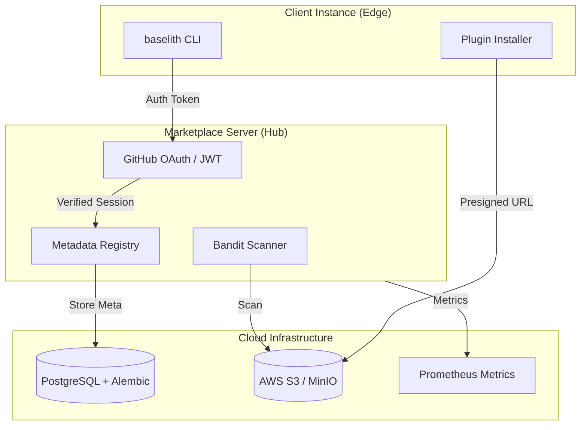

!!! warning "Coming Soon"
    The **Centralized Marketplace** and **Plugin Registry** are currently under heavy development and are not yet available for public use. The documentation below reflects the intended architecture and upcoming features.

The **Plugin Marketplace** is the ecosystem for distributing, discovering, and installing plugins. It enables developers to share extensions and allows users to enrich their system with verified additional capabilities.

!!! info "Marketplace Objectives"
    - **Developers**: Distribute plugins to a wide audience.
    - **Users**: Find and install verified plugins with a single click.
    - **Organizations**: Share internal plugins via a private registry.

!!! tip "Native in Core"
    Marketplace discovery and installation are now core framework features. You can browse and install plugins instantly on any Baselith installation.

!!! tip "CLI First"
    While a Python API is available, most users find the **CLI Marketplace Commands** provide the most efficient way to manage plugins. Use `baselith plugin marketplace search/install` for your daily operations.

---

## Architecture

The Marketplace system consists of three primary components, optimized for production with **S3 Artifact Storage** and **GitHub OAuth2 Authentication**.



| Component    | Technology           | Function                           |
| :----------- | :------------------- | :--------------------------------- |
| **Registry** | FastAPI + PostgreSQL | Metadata storage and discovery     |
| **Auth**     | GitHub OAuth2 + JWT  | Secure publisher identification    |
| **Storage**  | S3 (Presigned URLs)  | High-availability artifact hosting |
| **Security** | Bandit SAST          | Automated static code analysis     |
| **Metrics**  | Prometheus           | API usage and health monitoring    |

---

## Configuration

| Variable                  | Description                     | Default                                |
| :------------------------ | :------------------------------ | :------------------------------------- |
| `MARKETPLACE_MODE`        | `server` or `client`            | `client`                               |
| `MARKETPLACE_CENTRAL_URL` | URL of the central hub          | `https://marketplace.baselithcore.xyz` |
| `MARKETPLACE_SECRET_KEY`  | Secret for JWT Signing (Server) | **Required in Server mode**            |
| `GITHUB_CLIENT_ID`        | OAuth Client ID for Login       | Required for Publishing                |
| `S3_BUCKET`               | S3 Bucket for Plugin ZIPs       | Local disk fallback if empty           |
| `SENTRY_DSN`              | Error tracking URL              | `None`                                 |

---

---

## CLI Management

The most common way to interact with the Plugin Marketplace is through the Baselith CLI. It provides a set of high-level commands to manage the entire plugin lifecycle.

### Quick Start

```bash
# 1. Search for a plugin
baselith plugin marketplace search agent

# 2. Get details
baselith plugin marketplace info weather-agent

# 3. Install
baselith plugin marketplace install weather-agent

# 4. Check for updates
baselith plugin marketplace update weather-agent
```

---

## Registry

The Registry is the centralized catalog where plugins are published and indexed.

### Searching for Plugins

```python
from core.marketplace import PluginRegistry

registry = PluginRegistry()

# Search plugins by keyword
results = await registry.search(
    query="weather",           # Keywords
    category="utility",        # Category (optional)
    min_rating=4.0,            # Minimum rating (optional)
    verified_only=True         # Only verified plugins
)

for plugin in results:
    print(f"{plugin.name} v{plugin.version}")
    print(f"  Downloads: {plugin.downloads}")
    print(f"  Rating: {plugin.rating}/5")
    print(f"  Author: {plugin.author}")
```

### Plugin Details

```python
# Get complete information about a plugin (latest version)
plugin_info = await registry.get("weather-agent")

# Get a specific version
plugin_v1 = await registry.get("weather-agent", version="1.0.0")

print(f"Name: {plugin_info.name}")
print(f"Description: {plugin_info.description}")
print(f"Version: {plugin_info.version}")
print(f"Downloads: {plugin_info.downloads}")
print(f"Rating: {plugin_info.rating}")
print(f"Updated: {plugin_info.updated_at}")
print(f"Dependencies: {plugin_info.dependencies}")
print(f"Required Resources: {plugin_info.required_resources}")
```

### Available Categories

| Category        | Description             | Examples                       |
| :-------------- | :---------------------- | :----------------------------- |
| `utility`       | General tools           | Weather, Calculator, Converter |
| `integration`   | External integrations   | Slack, Jira, Salesforce        |
| `ai`            | AI/LLM extensions       | Custom agents, RAG systems     |
| `security`      | Security and auditing   | Threat detection               |
| `analytics`     | Analysis and reporting  | Dashboards, Metrics            |
| `communication` | Notifications/Messaging | Telegram, Email, SMS           |

---

## Installer

The Installer manages the download, verification, and installation of plugins.

### Basic Installation

```python
from core.marketplace import PluginInstaller

installer = PluginInstaller()

# Install the latest stable version
await installer.install("weather-agent")

# Install a specific version
await installer.install("weather-agent@1.2.0")

# Install with dependencies
await installer.install("weather-agent", with_dependencies=True)
```

### Updating Plugins

```python
# Update a single plugin
await installer.update("weather-agent")

# Update all installed plugins
updates = await installer.check_updates()
for plugin, new_version in updates:
    print(f"Updating {plugin.name} from {plugin.version} to {new_version}")
    await installer.update(plugin.name)
```

### Uninstallation

```python
# Remove a plugin
await installer.uninstall("weather-agent")

# Remove plugin and clean up data
await installer.uninstall("weather-agent", cleanup_data=True)
```

### Dependency Management

```python
# Resolve dependencies before installation
deps = await installer.resolve_dependencies("complex-plugin")

print("Will install:")
for dep in deps:
    print(f"  - {dep.name} v{dep.version}")

# Confirm and install
await installer.install("complex-plugin", with_dependencies=True)
```

---

## Validator

The Validator performs security checks and structural validation before publication to ensure ecosystem safety.

### Local Validation

Always validate your plugin locally before attempting to publish.

```python
from core.marketplace import PluginValidator

validator = PluginValidator()

# Validate structure and security
result = await validator.validate("plugins/my-plugin/")

if result.is_valid:
    print("✅ Plugin is valid, ready for publication")
else:
    print("❌ Plugin is invalid:")
    for error in result.errors:
        print(f"  - {error.severity}: {error.message}")
        print(f"    File: {error.file}:{error.line}")
```

### Automated Checks

The validator runs a series of automated checks:

| Check            | Type     | Description                                    |
| :--------------- | :------- | :--------------------------------------------- |
| **Structure**    | Required | Mandatory files and directories must exist     |
| **Metadata**     | Required | `manifest.yaml` (preferred) or `json`          |
| **Imports**      | Security | No imports of dangerous modules                |
| **System Calls** | Security | No `os.system()`, `subprocess`, etc.           |
| **Network**      | Security | Detection of calls to suspicious IPs/hosts     |
| **Dependencies** | Compat   | Dependencies must be compatible with framework |
| **Syntax**       | Quality  | Python code must be syntactically correct      |
| **Metadata Ext** | Quality  | Robust AST parsing for Python-embedded meta    |

### Detected Dangerous Patterns

```python
# ❌ These patterns will cause validation failure:

import subprocess  # Blocked: Shell access
import os
os.system("rm -rf /")  # Blocked: System command

import requests
requests.get("http://malicious.com/collect")  # Warning: Suspicious URL

eval(user_input)  # Blocked: Code execution
exec(code)  # Blocked: Code execution

__import__("dangerous")  # Blocked: Dynamic import
```

---

## Publishing

### 1. Authentication

Developers must authenticate using their GitHub account to publish plugins. This establishes ownership and trust.

```bash
baselith plugin marketplace login
```

This will open your browser to GitHub. After authorization, the CLI receives a **JWT Token** used for subsequent `publish` commands.

### 2. Preparation

...

### 4. Submission & Scanning

When you run `baselith plugin marketplace publish`, the Hub performs:

1. **Rate Limiting Check**: Prevents spamming the registry.
2. **Payload Validation**: Ensures the ZIP is under 20MB (streamed for efficiency).
3. **Advanced Extraction**: Metadata is extracted from `manifest.yaml` or via AST parsing of `plugin.py`.
4. **Bandit Security Scan**: Rejects any code with high/medium security risks (e.g., shell injection).
5. **Artifact Storage**: Saves the plugin to S3 and generates versioned metadata in PostgreSQL.

---

## Versioning

Use **Semantic Versioning** (SemVer):

| Type      | Format | When                                  |
| :-------- | :----- | :------------------------------------ |
| **MAJOR** | X.0.0  | Breaking changes, API incompatibility |
| **MINOR** | x.Y.0  | New backward-compatible features      |
| **PATCH** | x.y.Z  | Bug fixes, minor patches              |

**Examples:**

- `1.0.0` -> `1.0.1`: Bug fix
- `1.0.0` -> `1.1.0`: New feature
- `1.0.0` -> `2.0.0`: API change

### Pre-release

```json
{
  "version": "2.0.0-beta.1"
}
```

Pre-release versions are not installed by default.

---

## Deprecation Policy

When deprecating a plugin or version:

### 1. Mark as Deprecated

```bash
baselith plugin deprecate my-plugin@1.0.0 \
  --reason "Security vulnerability fixed in 1.0.1" \
  --alternative "my-plugin@1.0.1"
```

### 2. Recommended Timeline

| Phase            | Duration | Action                             |
| :--------------- | :------- | :--------------------------------- |
| **Announcement** | T+0      | Deprecation notice published       |
| **Warning**      | +30 days | Warning during installation        |
| **Soft Block**   | +60 days | Requires `--allow-deprecated` flag |
| **Removal**      | +90 days | Removal from registry              |

### 3. Communication

The system automatically notifies users who have installed deprecated versions.

---

## Private Registry

For organizations requiring an internal registry:

### Setup

```bash
# Docker compose for private registry
docker compose -f docker-compose.registry.yml up -d
```

### Client Configuration

```env
PLUGIN_REGISTRY_URL=https://internal-registry.company.com
PLUGIN_REGISTRY_API_KEY=internal-api-key
```

### Internal Publishing

```bash
baselith plugin publish my-internal-plugin \
  --registry https://internal-registry.company.com
```

---

## Best Practices

!!! tip "Comprehensive README"
    Always include: description, installation, configuration, examples, and troubleshooting.

!!! tip "Changelog"
    Maintain an up-to-date `CHANGELOG.md` for every release.

!!! warning "Security"
    Never include API keys, passwords, or secrets in the plugin code. Always use external configuration.

!!! tip "Testing"
    Include a test suite. Plugins with tests receive higher ratings and more downloads.

!!! tip "Versioning"
    Strictly follow SemVer. Breaking changes **require** a major version bump.
